[TOC]

# 数组

## [704. 二分查找](https://leetcode.cn/problems/binary-search/)

给定一个 `n` 个元素有序的（升序）整型数组 `nums` 和一个目标值 `target` ，写一个函数搜索 `nums` 中的 `target`，如果 `target` 存在返回下标，否则返回 `-1`。

你必须编写一个具有 `O(log n)` 时间复杂度的算法。
**示例 1:**

```
输入: nums = [-1,0,3,5,9,12], target = 9
输出: 4
解释: 9 出现在 nums 中并且下标为 4
```

**示例 2:**

```
输入: nums = [-1,0,3,5,9,12], target = 2
输出: -1
解释: 2 不存在 nums 中因此返回 -1
```

**提示：**

1. 你可以假设 `nums` 中的所有元素是不重复的。
2. `n` 将在 `[1, 10000]`之间。
3. `nums` 的每个元素都将在 `[-9999, 9999]`之间。

```c++
class Solution {
public:
    int search(vector<int>& nums, int target) {
        int l = 0,r = nums.size()-1;
        while(l<=r)
        {
            int mid = l + r >> 1;
            if(nums[mid] == target) return mid;
            else if(nums[mid]>target) r = mid - 1;
            else if(nums[mid]<target) l = mid + 1;
        }
        return -1;
    }
};
```

## [27. 移除元素](https://leetcode.cn/problems/remove-element/)

给你一个数组 `nums` 和一个值 `val`，你需要 **[原地](https://baike.baidu.com/item/原地算法)** 移除所有数值等于 `val` 的元素。元素的顺序可能发生改变。然后返回 `nums` 中与 `val` 不同的元素的数量。

假设 `nums` 中不等于 `val` 的元素数量为 `k`，要通过此题，您需要执行以下操作：

- 更改 `nums` 数组，使 `nums` 的前 `k` 个元素包含不等于 `val` 的元素。`nums` 的其余元素和 `nums` 的大小并不重要。
- 返回 `k`。

**方法一 双指针**

双指针法（快慢指针法）： **通过一个快指针和慢指针在一个for循环下完成两个for循环的工作。**

定义快慢指针

- 快指针：寻找新数组的元素 ，新数组就是不含有目标元素的数组
- 慢指针：指向更新 新数组下标的位置

很多同学这道题目做的很懵，就是不理解快慢指针究竟都是什么含义，所以一定要明确含义，后面的思路就更容易理解了。

- `slowIndex`（慢指针）：指向下一个有效元素应该存放的位置。
- `fastIndex`（快指针）：遍历整个数组，检查当前元素是否等于val。
  - 如果 `nums[fastIndex] != val`：
    - 把 `nums[fastIndex]` 复制到 `nums[slowIndex]`，然后 `slowIndex++`（表示这个位置已经被有效元素占用）。
  - 如果 `nums[fastIndex] == val`：
    - 跳过，不复制，`fastIndex` 继续前进。


*注意这些实现方法并没有改变元素的相对位置！*

```c++
class Solution {
public:
    int removeElement(vector<int>& nums, int val) {
        int slowIndex = 0;
        for(int fastIndex = 0;fastIndex<nums.size();++fastIndex)
        {
            if(val != nums[fastIndex])
            {
                nums[slowIndex++]=nums[fastIndex];
            }
        }
        return slowIndex;
    }
};
```

- 时间复杂度：O(n)
- 空间复杂度：O(1)

**方法二 双指针（头尾指针）法**

- **`i`（左指针）**：从数组头部开始，找到第一个等于 `val` 的元素。
- **`j`（右指针）**：从数组尾部开始，找到第一个不等于 `val` 的元素。
- **交换 `nums[i]` 和 `nums[j]`**，这样所有等于 `val` 的元素都会被移到数组末尾。
- **最终 `i` 的值就是有效元素的个数**（因为 `i` 最终指向第一个 `val` 的位置）。

*但是注意这个方法并不保持原来的顺序。*

```c++
class Solution {
public:
    int removeElement(vector<int>& nums, int val) {
        int i = 0,j = nums.size() - 1;
        while(i<=j)
        {
            while(i<=j && nums[i]!=val) ++i;    //从头开始定位到第一个val
            while(i<=j && nums[j]==val) --j;    //从尾开始定位到第一个不是val的
            if(i<j) swap(nums[i],nums[j]);      //注意要加判断条件i<j
        }
        return i;
    }
};  
```

- 时间复杂度：O(n)
- 空间复杂度：O(1)

## [977. 有序数组的平方](https://leetcode.cn/problems/squares-of-a-sorted-array/)

给你一个按 **非递减顺序** 排序的整数数组 `nums`，返回 **每个数字的平方** 组成的新数组，要求也按 **非递减顺序** 排序。

**示例 1：**

```
输入：nums = [-4,-1,0,3,10]
输出：[0,1,9,16,100]
解释：平方后，数组变为 [16,1,0,9,100]
排序后，数组变为 [0,1,9,16,100]
```

**示例 2：**

```
输入：nums = [-7,-3,2,3,11]
输出：[4,9,9,49,121]
```

**提示：**

- `1 <= nums.length <= 104`
- `-104 <= nums[i] <= 104`
- `nums` 已按 **非递减顺序** 排序

**进阶：**

- 请你设计时间复杂度为 `O(n)` 的算法解决本问题

**方法一**

由于原数组已经是**非递减排序**的，平方后的最大值**只可能出现在数组的两端**（因为负数平方后会变大）。**先找到绝对值最小的元素**，然后以该元素为中心，向左右两边扩展，逐步构建结果数组。

步骤如下：

1. **初始化**
   - `result`：存储最终结果的数组。
   - `minNum` 和 `minIdx`：记录数组中**绝对值最小的元素**及其索引。
2. **寻找绝对值最小的元素**
   - 遍历数组，找到 `abs(nums[i])` 最小的元素，记录其值和位置（`minNum` 和 `minIdx`）。
   - 这个元素平方后一定是结果数组的第一个元素（因为它的绝对值最小，平方后也最小）。
3. **双指针扩展**
   - 初始化两个指针：
     - `i = minIdx - 1`（向左移动）
     - `j = minIdx + 1`（向右移动）
   - 比较`nums[i]`和`nums[j]`的绝对值：
     - 如果 `abs(nums[i]) > abs(nums[j])`，则选择 `nums[j]` 的平方，并移动 `j++`。
     - 否则，选择 `nums[i]` 的平方，并移动 `i--`。
   - 将平方值依次存入 `result`。
4. **处理剩余元素**
   - 如果 `i` 或 `j` 指针还未遍历完数组，将剩余元素平方后加入 `result`。

```c++
class Solution {
public:
    vector<int> sortedSquares(vector<int>& nums) {
        //不能用排序算法，nlogn
        vector<int> result;
        int minNum = 1e4 + 10;
        int minIdx = -1;
        
        for(int i = 0;i<nums.size();++i)
        {
            if(nums[i]<abs(minNum)) 
            {
                minNum = abs(nums[i]);
                minIdx = i;
            }
        }

        result.emplace_back(minNum*minNum);
        int i = minIdx - 1;
        int j = minIdx + 1;

        while(i >= 0 && j <= nums.size() - 1)
        {
            if(abs(nums[i]) > abs(nums[j]))
                minNum = nums[j++];
            else
                minNum = nums[i--];
            
            result.emplace_back(minNum*minNum);
        }
        while(i>=0) 
        {
            minNum = nums[i--];
            result.emplace_back(minNum*minNum);
        }
        while(j<=nums.size()-1)
        {
            minNum = nums[j++];
            result.emplace_back(minNum*minNum);
        }
        return result;
    }
};
```

- 时间复杂度：O(n)
- 空间复杂度：O(n)

**方法二**

由于原数组已经是**非递减排序**的，平方后的最大值**只可能出现在数组的两端**（因为负数平方后会变大）。因此，可以采用 **双指针法**，从数组的两端向中间遍历，比较两端的绝对值大小，选择较大的平方值放入结果数组的末尾。

```c++
class Solution {
public:
    vector<int> sortedSquares(vector<int>& nums) {
        vector<int> result(nums.size(),0);
        int curIdx = nums.size() - 1;
        int i = 0, j = nums.size() - 1;
        while(i<=j)
        {
            if(abs(nums[i]) > abs(nums[j]))
            {
                result[curIdx--] = abs(nums[i]) * abs(nums[i]);
                ++i;
            }
            else
            {
                result[curIdx--] = abs(nums[j]) * abs(nums[j]);
                --j;
            }
        }
        return result;
    }
};
```

- 时间复杂度：O(n)
- 空间复杂度：O(n)

## [209. 长度最小的子数组](https://leetcode.cn/problems/minimum-size-subarray-sum/)

给定一个含有 `n` 个正整数的数组和一个正整数 `target` **。**

找出该数组中满足其总和大于等于 `target` 的长度最小的 **子数组** `[numsl, numsl+1, ..., numsr-1, numsr]` ，并返回其长度**。**如果不存在符合条件的子数组，返回 `0` 。

**示例 1：**

```
输入：target = 7, nums = [2,3,1,2,4,3]
输出：2
解释：子数组 [4,3] 是该条件下的长度最小的子数组。
```

**示例 2：**

```
输入：target = 4, nums = [1,4,4]
输出：1
```

**示例 3：**

```
输入：target = 11, nums = [1,1,1,1,1,1,1,1]
输出：0
```

**提示：**

- `1 <= target <= 109`
- `1 <= nums.length <= 105`
- `1 <= nums[i] <= 104`

这题要求的是找长度最短的连续子数组，没有注意到连续，调试了半天，以为案例错了。。。。

错误代码如下：

```c++
public:
    int minSubArrayLen(int target, vector<int>& nums) {
        sort(nums.begin(),nums.end(),std::greater<int>());

        int curSum = 0;
        int curNum = 0;

        for(int i = 0;i<nums.size();++i)
        {
            if(nums[i]>target) continue;

            curSum += nums[i];
            curNum ++;
            if(curSum>=target) break;
        }

        if(curSum >= target) return curNum;

        return 0;
    }
};
```

**正确应该用滑动窗口**

所谓滑动窗口，**就是不断的调节子序列的起始位置和终止位置，从而得出我们想要的结果**。

在暴力解法中，是一个for循环滑动窗口的起始位置，一个for循环为滑动窗口的终止位置，用两个for循环 完成了一个不断搜索区间的过程。

那么滑动窗口如何用一个for循环来完成这个操作呢。

首先要思考 如果用一个for循环，那么应该表示 滑动窗口的起始位置，还是终止位置。

如果只用一个for循环来表示 滑动窗口的起始位置，那么如何遍历剩下的终止位置？

此时难免再次陷入 暴力解法的怪圈。

所以 只用一个for循环，那么这个循环的索引，一定是表示 滑动窗口的终止位置。

那么问题来了， 滑动窗口的起始位置如何移动呢？

以题目中的示例来举例，s=7， 数组是 2，3，1，2，4，3，来看一下查找的过程：


最后找到 4，3 是最短距离。

其实从动画中可以发现滑动窗口也可以理解为双指针法的一种！只不过这种解法更像是一个窗口的移动，所以叫做滑动窗口更适合一些。

在本题中实现滑动窗口，主要确定如下三点：

- 窗口内是什么？
- 如何移动窗口的起始位置？
- 如何移动窗口的结束位置？

窗口就是 满足其和 ≥ s 的长度最小的 连续 子数组。

窗口的起始位置如何移动：如果当前窗口的值大于等于s了，窗口就要向前移动了（也就是该缩小了）。

窗口的结束位置如何移动：窗口的结束位置就是遍历数组的指针，也就是for循环里的索引。

可以发现**滑动窗口的精妙之处在于根据当前子序列和大小的情况，不断调节子序列的起始位置。从而将$O(n^2)$暴力解法降为$O(n)$。**

```c++
class Solution
{
public:
    int minSubArrayLen(int target, vector<int> &nums)
    {
        int left = 0;
        int sum = 0;
        int minLen = nums.size() + 1;// 初始化最小长度为数组长度 + 1（表示尚未找到）

        for (int right = 0; right < nums.size(); ++right)
        {
            sum += nums[right];

            // 当sum >= target时，尝试缩小窗口以找到更小的长度
            while (sum >= target)
            {
                minLen = min(minLen, right - left + 1);// 更新最小长度
                sum -= nums[left++];// 移动左边界，减去左边界元素
            }
        }
        // 如果minLen未被更新过，返回0；否则返回minLen
        return minLen == nums.size() + 1 ? 0 : minLen;
    }
};
```

- 时间复杂度：O(n)
- 空间复杂度：O(1)

不要以为for里放一个while就以为是$O(n^2)$啊， 主要是看每一个元素被操作的次数，每个元素在滑动窗后进来操作一次，出去操作一次，每个元素都是被操作两次，所以时间复杂度是 $2 × n$ 也就是$O(n)$。

## [58. 区间和](https://kamacoder.com/problempage.php?pid=1070)

给定一个整数数组 Array，请计算该数组在每个指定区间内元素的总和。第一行输入为整数数组 Array 的长度 n，接下来 n 行，每行一个整数，表示数组的元素。随后的输入为需要计算总和的区间下标：a，b （b > = a），直至文件结束。

**一步一步得到前缀和**

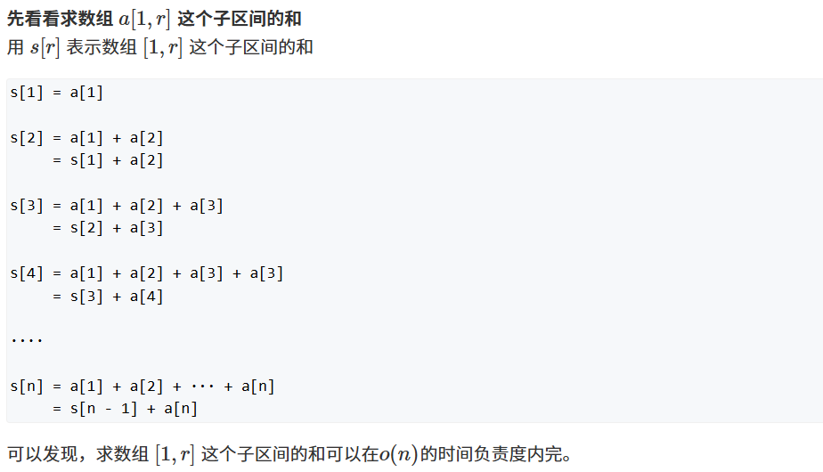

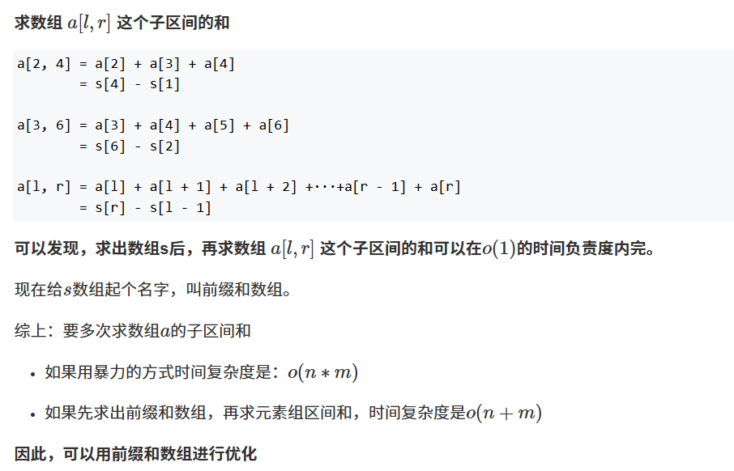

```c++
#include<iostream>
#include<vector>
#include<cstdio>
using namespace std;

int main()
{
    int n;
    scanf("%d", &n);  // 输入n

    vector<int> a(n + 1, 0);  // a从1到n，所以长度应该是n+1
    vector<int> s(n + 1, 0);  // s也同样是从1到n

    // 输入数组并计算前缀和
    for (int i = 1; i <= n; i++) {
        scanf("%d", &a[i]);
        s[i] = s[i - 1] + a[i];  // s[i]是前i个数的和
    }

    int l, r;
    // 持续读取区间，并计算区间和
    while (scanf("%d %d", &l, &r) != EOF) {
        printf("%d\n", s[r] - s[l - 1]);
    }

    return 0;
}
```

# 二分查找

模板一：如果更新方式是`l=mid+1,r=mid`，即答案尽量往左边找，那么`mid`的更新方式是`mid=（l+r）/2`，向下取整，模板如下：

```c++
int binary_find(int l, int r)
{
    while (l < r)
    {
        int mid = (l + r) >> 1; // 向下取整
        if (check(mid))         // check函数根据题目来写
        {
            l = mid + 1;
        }
        else
        {
            r = mid;
        }
    }
    return l;
}
```

模板二：如果更新方式是`l=mid,r=mid-1`，即答案尽量往右边找，那么`mid`的更新方式是`mid=（l+r+1）/2`，向上取整，模板如下：

```c++
int binary_find(int l, int r)
{
    while (l < r)
    {
        int mid = (l + r + 1) >> 1; // 向上取整
        if (check(mid))         	// check函数根据题目来写
        {
            l = mid;
        }
        else
        {
            r = mid - 1;
        }
    }
    return l;
}
```

但不管是哪种更新方式，循环条件都是`while(l<r)`，这样能保证退出循环的时候一定有`l=r`

**为什么更新方式是 l=mid，r=mid-1 时，mid 的更新方式是 mid=(l+r+1)/2 呢？**

举个简单的例子：当你在 `[0，1]`这个区间查找元素 `1`，最开始 `l=0`，`r=1`。如果你用 `mid=(l+r)/2`，那么：`mid`永远是 `0`，`l`永远是 `0`，`r`永远是 `1`，这样就查找不到 `1`，陷入了死循环。**这样处理（mid=(l+r+1)/2）就是为了避免死循环。**

## [704. 二分查找](https://leetcode.cn/problems/binary-search/)

给定一个 `n` 个元素有序的（升序）整型数组 `nums` 和一个目标值 `target` ，写一个函数搜索 `nums` 中的 `target`，如果 `target` 存在返回下标，否则返回 `-1`。

你必须编写一个具有 `O(log n)` 时间复杂度的算法。

**示例 1:**

```
输入: nums = [-1,0,3,5,9,12], target = 9
输出: 4
解释: 9 出现在 nums 中并且下标为 4
```

**示例 2:**

```
输入: nums = [-1,0,3,5,9,12], target = 2
输出: -1
解释: 2 不存在 nums 中因此返回 -1
```

**提示：**

1. 你可以假设 `nums` 中的所有元素是不重复的。
2. `n` 将在 `[1, 10000]`之间。
3. `nums` 的每个元素都将在 `[-9999, 9999]`之间。

```c++
class Solution {
public:
    int search(vector<int>& nums, int target) {
        int l = 0,r = nums.size()-1;
        while(l<=r)
        {
            int mid = l + r >> 1;
            if(nums[mid] == target) return mid;
            else if(nums[mid]>target) r = mid - 1;
            else if(nums[mid]<target) l = mid + 1;
        }
        return -1;
    }
};
```

## [74. 搜索二维矩阵](https://leetcode.cn/problems/search-a-2d-matrix/)

给你一个满足下述两条属性的 `m x n` 整数矩阵：

- 每行中的整数从左到右按非严格递增顺序排列。
- 每行的第一个整数大于前一行的最后一个整数。

给你一个整数 `target` ，如果 `target` 在矩阵中，返回 `true` ；否则，返回 `false` 。

**示例 1：**


```
输入：matrix = [[1,3,5,7],[10,11,16,20],[23,30,34,60]], target = 3
输出：true
```

**示例 2：**


```
输入：matrix = [[1,3,5,7],[10,11,16,20],[23,30,34,60]], target = 13
输出：false
```

**提示：**

- `m == matrix.length`
- `n == matrix[i].length`
- `1 <= m, n <= 100`
- `-104 <= matrix[i][j], target <= 104`

1. 如果 `matrix[mid][0] == target`：直接找到目标
2. 如果 `matrix[mid][0] < target`：目标可能在当前行或后面的行
3. 如果 `matrix[mid][0] > target`：目标只可能在前面的行

```c++
class Solution
{
public:
    bool searchMatrix(vector<vector<int>> &matrix, int target)
    {
        int n = matrix.size();
        int m = matrix[0].size();

        // 先确定行(第一列开始找)
        int row = 0;
        int l = 0, r = n - 1;
        while (l <= r)
        {
            int mid = l + r >> 1;

            if (matrix[mid][0] == target)
            {
                return true;
            }
            else if (matrix[mid][0] > target)
            {
                r = mid - 1;
            }
            else if (matrix[mid][0] < target)
            {
                // 记录当前行是可能的候选行
                // 因为 matrix[mid][0] < target，所以目标值可能位于这一行（如果目标大于这行的第一个元素但小于下一行的第一个元素）
                // 或者是后面更大的行
                row = mid;
                // 继续搜索后面的行，看看是否有更合适的行
                // 如果后面没有更合适的行，row会保持为最后一个满足 matrix[row][0] <= target的行
                l = mid + 1;
            }
        }

        // 再确定列(第l行)
        l = 0, r = m - 1;
        while (l <= r)
        {
            int mid = l + r >> 1;
            if (matrix[row][mid] == target)
            {
                return true;
            }
            else if (matrix[row][mid] > target)
            {
                r = mid - 1;
            }
            else if (matrix[row][mid] < target)
            {
                l = mid + 1;
            }
        }
        return false;
    }
};
```

## [34. 在排序数组中查找元素的第一个和最后一个位置](https://leetcode.cn/problems/find-first-and-last-position-of-element-in-sorted-array/)

给你一个按照非递减顺序排列的整数数组 `nums`，和一个目标值 `target`。请你找出给定目标值在数组中的开始位置和结束位置。

如果数组中不存在目标值 `target`，返回 `[-1, -1]`。

你必须设计并实现时间复杂度为 `O(log n)` 的算法解决此问题。

**示例 1：**

```
输入：nums = [5,7,7,8,8,10], target = 8
输出：[3,4]
```

**示例 2：**

```
输入：nums = [5,7,7,8,8,10], target = 6
输出：[-1,-1]
```

**示例 3：**

```
输入：nums = [], target = 0
输出：[-1,-1]
```

**提示：**

- `0 <= nums.length <= 105`
- `-109 <= nums[i] <= 109`
- `nums` 是一个非递减数组
- `-109 <= target <= 109`

```c++
class Solution
{
public:
    vector<int> searchRange(vector<int> &nums, int target)
    {
        if (nums.empty())
            return {-1, -1};

        int n = nums.size();

        int l = 0, r = n - 1;

        int left = -1, right = -1;

        // 找左边界
        while (l < r)
        {
            int mid = l + r >> 1;
            if (nums[mid] < target)
            {
                l = mid + 1;
            }
            else
            {
                r = mid;
            }
        }

        if (nums[l] == target)
        {
            left = l;
        }

        // 找有边界
        l = 0, r = n - 1;
        while (l < r)
        {
            int mid = l + r + 1 >> 1;
            if (nums[mid] <= target)
            {
                l = mid;
            }
            else
            {
                r = mid - 1;
            }
        }

        if (nums[r] == target)
        {
            right = r;
        }

        return vector<int>{left, right};
    }
};
```

## [33. 搜索旋转排序数组](https://leetcode.cn/problems/search-in-rotated-sorted-array/)

整数数组 `nums` 按升序排列，数组中的值 **互不相同** 。

在传递给函数之前，`nums` 在预先未知的某个下标 `k`（`0 <= k < nums.length`）上进行了 **旋转**，使数组变为 `[nums[k], nums[k+1], ..., nums[n-1], nums[0], nums[1], ..., nums[k-1]]`（下标 **从 0 开始** 计数）。例如， `[0,1,2,4,5,6,7]` 向左旋转 `3` 次后可能变为 `[4,5,6,7,0,1,2]` 。

给你 **旋转后** 的数组 `nums` 和一个整数 `target` ，如果 `nums` 中存在这个目标值 `target` ，则返回它的下标，否则返回 `-1` 。

你必须设计一个时间复杂度为 `O(log n)` 的算法解决此问题。

**示例 1：**

```
输入：nums = [4,5,6,7,0,1,2], target = 0
输出：4
```

**示例 2：**

```
输入：nums = [4,5,6,7,0,1,2], target = 3
输出：-1
```

**示例 3：**

```
输入：nums = [1], target = 0
输出：-1
```

**提示：**

- `1 <= nums.length <= 5000`
- `-104 <= nums[i] <= 104`
- `nums` 中的每个值都 **独一无二**
- 题目数据保证 `nums` 在预先未知的某个下标上进行了旋转
- `-104 <= target <= 104`

这道题目要求在旋转后的有序数组中查找目标值，且时间复杂度必须为 O(log n)。由于数组是部分有序的，我们可以利用二分查找的思想，但需要针对旋转数组的特性进行特殊处理。具体步骤如下：

1. **初始化指针**：设置两个指针 `left`和 `right`，分别指向数组的起始和末尾位置。
2. **循环条件**：当 `left`小于 `right`时，继续循环。
3. **计算中间位置**：每次循环中，计算中间位置 `mid`，即 `mid = left + (right - left) / 2`（防止溢出）。
4. **判断中间值**：如果 `nums[mid]`等于目标值 `target`，直接返回 `mid`。
5. **确定有序部分**：
   - 如果 `nums[left] <= nums[mid]`，说明左半部分是有序的。
     - 如果 `target`在 `nums[left]`和 `nums[mid]`之间，则目标值在左半部分，调整 `right = mid`。
     - 否则，目标值在右半部分，调整 `left = mid + 1`。
   - 如果 `nums[left] > nums[mid]`，说明右半部分是有序的。
     - 如果 `target`在 `nums[mid]`和 `nums[right]`之间，则目标值在右半部分，调整 `left = mid + 1`。
     - 否则，目标值在左半部分，调整 `right = mid`。
6. **循环结束后的检查**：当循环结束时，检查 `nums[left]`是否等于 `target`，如果是则返回 `left`，否则返回 `-1`。

```c++
class Solution
{
public:
    int search(vector<int> &nums, int target)
    {
        int n = nums.size();

        int l = 0, r = n - 1;

        while (l < r)
        {
            int mid = l + r >> 1;

            // 判断左半部分是否为升序
            if (nums[l] <= nums[mid])
            {
                // 如果目标值在左半部分的升序范围内
                if (nums[l] <= target && target <= nums[mid])
                {
                    r = mid;
                }
                else // 否则目标值在右半部分，移动左边界到 mid + 1
                {
                    l = mid + 1;
                }
            }
            else // 左半部分不是升序，则右半部分一定是升序
            {
                // 如果目标值在右半部分的升序范围内
                if (nums[mid] < target && target <= nums[r])
                {
                    l = mid + 1;
                }
                else // 否则目标值在左半部分，缩小右边界到 mid
                {
                    r = mid;
                }
            }
        }
        return nums[l] == target ? l : -1;
    }
};
```

# 链表

## 固定操作代码（熟记）

1：找中间节点代码

注意此时slow指向中点（奇数长度）或后半段起点（偶数长度）

+ 如果链表节点为奇数，slow指向中点，那么fast指向链表末尾，fast->next = nullptr
+ 如果链表节点为偶数，slow指向后半段起点，那么fast指向空，fast = nullptr

```c++
ListNode* slow = head;
ListNode* fast = head;

while(fast && fast->next)
{
      slow = slow->next;
      fast = fast->next->next;
}
```

2：反转链表代码

注意如果head前面还有节点，那么head并未和前面的节点断开，而是从head->next开始断开的。

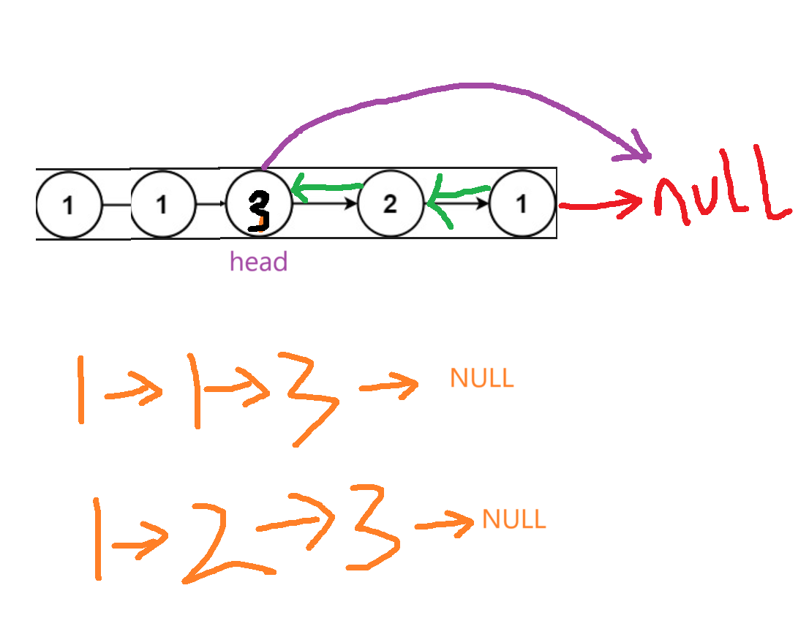

```c++
ListNode *reverse(ListNode *head)
{
    ListNode *prevNode = nullptr;
    ListNode *curNode = head;
    ListNode *nextTemp = nullptr;
    while (curNode)
    {
        nextTemp = curNode->next; // 保存下一个节点
        curNode->next = prevNode; // 反转指针方向
        prevNode = curNode;
        curNode = nextTemp;
    }
    return prevNode; // 返回新的头节点
}
```

3：因此如果想要反转链表后半段的话，需要先找中间节点，再做反转操作，那么反转后这两个链表长度？

+ 如果是偶数个节点，第一个链表长度 = 第二个链表长度 + 1
+ 如果是奇数个节点，第一个链表长度 = 第二个链表长度

## [160. 相交链表](https://leetcode.cn/problems/intersection-of-two-linked-lists/)

给你两个单链表的头节点 `headA` 和 `headB` ，请你找出并返回两个单链表相交的起始节点。如果两个链表不存在相交节点，返回 `null` 。

图示两个链表在节点 `c1` 开始相交**：**

[](https://assets.leetcode-cn.com/aliyun-lc-upload/uploads/2018/12/14/160_statement.png)

题目数据 **保证** 整个链式结构中不存在环。

**注意**，函数返回结果后，链表必须 **保持其原始结构** 。

**方法一 栈**

和[19. 删除链表的倒数第 N 个结点](https://leetcode.cn/problems/remove-nth-node-from-end-of-list/)相似，都是找倒数第几个节点，只不过上题是找倒数第几个，而这个是找倒着来不同的节点。

如果两个链表相交，那么从相交点开始到尾部的所有节点都是相同的。栈的"后进先出"特性正好可以让我们从链表的尾部开始比较节点。当两个链表长度不一致时，直接从头部开始遍历很难对齐比较。使用栈可以自然地解决这个问题，因为我们只需要比较栈顶元素即可。

```c++
class Solution
{
public:
    ListNode *getIntersectionNode(ListNode *headA, ListNode *headB)
    {
        stack<ListNode *> s1;
        stack<ListNode *> s2;

        for (auto curNode = headA; curNode != nullptr; curNode = curNode->next)
            s1.push(curNode);

        for (auto curNode = headB; curNode != nullptr; curNode = curNode->next)
            s2.push(curNode);

        ListNode *result = nullptr;
        while (!s1.empty() && !s2.empty())
        {
            auto node1 = s1.top();
            auto node2 = s2.top();
            if (node1 != node2)
                break;

            result = node1; 

            s1.pop();
            s2.pop();
        }
        return result;
    }
};
```

- 时间复杂度：O(m+n)
- 空间复杂度：O(m+n)

**方法二 双指针**

1. 两个指针分别从headA和headB开始遍历，当到达链表末尾时，切换到另一个链表的头部继续遍历。
2. 如果两个链表相交，那么这两个指针最终会在相交节点相遇；如果不相交，两个指针最终都会到达null。

**如果不相交**：

+ 两个链表长度不相等，一个为A 一个为B ，指针第一次走完A会去走B,另一个走完B再去走A，两个指针走的路程都是A+B。会同时为NULL 跳出循环

+ 两个链表长度相等，那么一个指针走A,一个指针走B，它俩同时走到NULL，相等，跳出循环

**如果相交：**

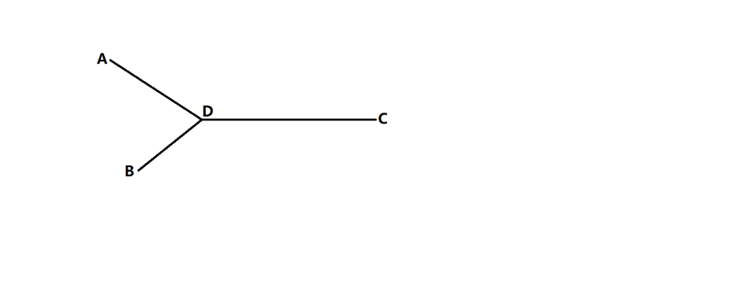

链表A和链表B相交于D，说明D结点即在A上又在B上，而D之后的元素自然也就均在A和B上了，因为他们是通过next指针相连的。

如果有相交的结点D的话，每条链的头结点先走完自己的链表长度，然后回头走另外的一条链表，那么两结点一定为相交于D点，因为这时每个头结点走的距离是一样的，都是 AD + BD + DC，而他们每次又都是前进1，所以距离相同，速度又相同，固然一定会在相同的时间走到相同的结点上，即D点。

```c++
class Solution
{
public:
    ListNode *getIntersectionNode(ListNode *headA, ListNode *headB)
    {
        if (!headA || !headB)
            return nullptr;

        auto PA = headA;
        auto PB = headB;
        while (PA != PB)
        {
            //PA = PA ? PA->next : headB;
            //PB = PB ? PB->next : headA;
            if(PA)  PA = PA ->next;
            else    PA = headB;

            if(PB)  PB = PB->next;
            else    PB = headA;
        }
        return PA;
    }
};
```

- 时间复杂度：O(n + m)
- 空间复杂度：O(1)

**方法三 哈希集合**

判断两个链表是否相交，可以使用哈希集合存储链表节点。

首先遍历链表 headA，并将链表 headA 中的每个节点加入哈希集合中。然后遍历链表 headB，对于遍历到的每个节点，判断该节点是否在哈希集合中：

如果当前节点不在哈希集合中，则继续遍历下一个节点；

如果当前节点在哈希集合中，则后面的节点都在哈希集合中，即从当前节点开始的所有节点都在两个链表的相交部分，因此在链表 headB 中遍历到的第一个在哈希集合中的节点就是两个链表相交的节点，返回该节点。

如果链表 headB 中的所有节点都不在哈希集合中，则两个链表不相交，返回 null。

```c++
class Solution
{
public:
    ListNode *getIntersectionNode(ListNode *headA, ListNode *headB)
    {
        unordered_set<ListNode *> setA;

        for (auto curNode = headA; curNode != nullptr; curNode = curNode->next)
            setA.insert(curNode);

        for (auto curNode = headB; curNode != nullptr; curNode = curNode->next)
            if (setA.find(curNode) != setA.end())
                return curNode;

        return nullptr;
    }
};
```

- 时间复杂度：O(n + m)
- 空间复杂度：O(n)

## [206. 反转链表](https://leetcode.cn/problems/reverse-linked-list/)

给你单链表的头节点 `head` ，请你反转链表，并返回反转后的链表。

**示例 1：**


```
输入：head = [1,2,3,4,5]
输出：[5,4,3,2,1]
```

**示例 2：**


```
输入：head = [1,2]
输出：[2,1]
```

**示例 3：**

```
输入：head = []
输出：[]
```

**提示：**

- 链表中节点的数目范围是 `[0, 5000]`
- `-5000 <= Node.val <= 5000`

**进阶：**链表可以选用迭代或递归方式完成反转。你能否用两种方法解决这道题？

**工作原理**

1. 首先检查链表是否为空（head是否为NULL），如果是空链表直接返回NULL。
2. 初始化两个指针：
   - curNode：当前节点指针，初始指向链表头节点
   - preNode：前驱节点指针，初始为NULL
3. 核心反转逻辑（while循环）：
   - 每次循环处理一个节点
   - 先用tmpNode临时保存当前节点的下一个节点（因为后面要修改当前节点的next指针）
   - 将当前节点的next指针指向前一个节点（实现反转）
   - 将preNode移动到当前节点（成为新的前驱节点）
   - 将curNode移动到之前保存的下一个节点（继续处理链表剩余部分）
4. 当循环结束时（curNode为NULL），preNode就指向了反转后的新链表头节点，返回它即可。

在反转链表的过程中：

1. **`curNode` 相当于原链表的当前节点**，`preNode` 相当于**新链表的头节点**。
2. 每次操作：
   - 把 `curNode` 从原链表"拆下"（通过 `curNode->next = preNode`）。
   - 然后让 `preNode` 指向它（相当于把它插入到新链表的头部）。
   - 最后 `curNode` 移动到下一个待处理的节点（`curNode = tmpNode`）。

这个过程类似于头插法：

- **`preNode` 就是新链表的头节点**，每次把 `curNode` 插入到它的前面。
- 只不过这里没有创建新节点，而是**直接修改原链表的指针方向**，所以是**原地反转**。

```c++
class Solution {
public:
    ListNode* reverseList(ListNode* head) {
        if(!head) return NULL;

        ListNode* curNode = head;
        ListNode* preNode = NULL;
        //大致思路就是访问一个链表的元素，然后将该元素用头插法的方式插入另一个空链表中，注意其中的一些小问题即可。
        while(curNode)
        {
            ListNode* tmpNode = curNode->next;//记录当前节点的下一个节点，因为接下来要改变当前节点的指向，不记录的话就丢失了
            curNode->next = preNode;
            preNode = curNode;
            curNode = tmpNode;
        }

        return preNode;
    }
};
```

- 时间复杂度: O(n)
- 空间复杂度: O(1)

**方法二 栈**

**为什么会想到栈呢？**

**栈可以反向遍历链表**。链表的遍历是单向的（只能从头到尾），但我们需要找到倒数第N个节点，也就是从后往前数的第N个节点。如果我们把所有节点按顺序压入栈，那么栈顶就是链表的最后一个节点，栈顶的第N个元素就是倒数第N个节点。

**栈能直接定位前驱节点**。删除链表节点需要知道它的前驱节点（即前一个节点），而栈的特性可以轻松实现这一点：当我们弹出`n`个节点后，栈顶剩下的节点就是倒数第`n`个节点的前驱节点。

```c++
class Solution
{
public:
    ListNode *reverseList(ListNode *head)
    {
        if (!head) return NULL;

        stack<ListNode *> s;
        auto dummpyNode = new ListNode(0, head);

        for (auto tmp = dummpyNode->next; tmp != nullptr; tmp = tmp->next)
            s.push(tmp);

        ListNode *curNode = s.top();
        s.pop();
        dummpyNode->next = curNode;
        
        while(!s.empty())
        {
            curNode->next = s.top();
            s.pop();
            curNode = curNode->next;
        }

        curNode->next = nullptr;

        return dummpyNode->next;
    }
};
```

- 时间复杂度: O(n)
- 空间复杂度: O(n)

## [92. 反转链表 II](https://leetcode.cn/problems/reverse-linked-list-ii/)

给你单链表的头指针 `head` 和两个整数 `left` 和 `right` ，其中 `left <= right` 。请你反转从位置 `left` 到位置 `right` 的链表节点，返回 **反转后的链表** 。

**示例 1：**


```
输入：head = [1,2,3,4,5], left = 2, right = 4
输出：[1,4,3,2,5]
```

**示例 2：**

```
输入：head = [5], left = 1, right = 1
输出：[5]
```

**提示：**

- 链表中节点数目为 `n`
- `1 <= n <= 500`
- `-500 <= Node.val <= 500`
- `1 <= left <= right <= n`

```c++
class Solution
{
public:
    ListNode *reverse(ListNode *head)
    {
        ListNode *prevNode = nullptr;
        ListNode *curNode = head;
        ListNode *nextTemp = nullptr;
        while (curNode)
        {
            nextTemp = curNode->next; // 保存下一个节点
            curNode->next = prevNode; // 反转指针方向
            prevNode = curNode;
            curNode = nextTemp;
        }
        return prevNode; // 返回新的头节点
    }

    ListNode *reverseBetween(ListNode *head, int left, int right)
    {
        if (!head || !head->next)
            return head;

        // 创建虚拟头节点，简化边界处理
        ListNode *dummy = new ListNode(0);
        dummy->next = head;

        ListNode *curNode = head;
        ListNode *leftpreNode = dummy;
        ListNode *leftNode = head;
        ListNode *rightNode = head;
        ListNode *rightnextNode = head->next;

        // 记录left前面的一个节点
        for (int i = 1; i < left; i++)
        {
            leftpreNode = leftpreNode->next;
        }

        // left节点
        leftNode = leftpreNode->next;

        for (int i = 1; i < right; i++)
        {
            rightNode = rightNode->next;
        }

        // 记录right后面的一个节点
        rightnextNode = rightNode->next;

        // 断开链表，准备反转[left, right]区间
        leftpreNode->next = nullptr;
        rightNode->next = nullptr;

        // 反转后，newHead是区间新头，leftNode变成区间尾
        ListNode *newHead = reverse(leftNode);

        // 继续接上头和尾
        leftpreNode->next = newHead;    // 连接反转区间的新头
        leftNode->next = rightnextNode; // 连接反转区间的尾到原right的下一个节点

        ListNode *result = dummy->next;
        delete dummy;
        return result;
    }
};
```

## [234. 回文链表](https://leetcode.cn/problems/palindrome-linked-list/)

给你一个单链表的头节点 `head` ，请你判断该链表是否为回文链表。如果是，返回 `true` ；否则，返回 `false` 。

**示例 1：**


```
输入：head = [1,2,2,1]
输出：true
```

**示例 2：**


```
输入：head = [1,2]
输出：false
```

**提示：**

- 链表中节点数目在范围`[1, 105]` 内
- `0 <= Node.val <= 9`

**进阶：**你能否用 `O(n)` 时间复杂度和 `O(1)` 空间复杂度解决此题？

**方法一：找中间节点+反转链表**，详细内容见该章节开始处。

```c++
class Solution
{
public:
    bool isPalindrome(ListNode *head)
    {
        if (!head || !head->next)
        {
            return true;
        }

        ListNode *slow = head;
        ListNode *fast = head;
        while (fast && fast->next)
        {
            slow = slow->next;
            fast = fast->next->next;
        }

        // 此时slow指向中点（奇数长度）或后半段起点（偶数长度）
        ListNode *prevNode = nullptr;
        ListNode *curNode = slow;
        ListNode *nextTemp = nullptr;
        while (curNode)
        {
            nextTemp = curNode->next; // 保存下一个节点
            curNode->next = prevNode; // 反转指针方向
            prevNode = curNode;
            curNode = nextTemp;
        }

        // 反转完成后，prevNdoe指向反转后的链表头
        ListNode *p1 = head;
        ListNode *p2 = prevNode;
        while (p2)
        {
            if (p1->val != p2->val)
            {
                return false;
            }
            p1 = p1->next;
            p2 = p2->next;
        }

        return true;
    }
};
```

**方法二：找中间节点+栈**

要注意中间节点`slow->val`并未入栈

```c++
class Solution
{
public:
    bool isPalindrome(ListNode *head)
    {
        if (!head || !head->next)
        {
            return true;
        }

        ListNode *slow = head;
        ListNode *fast = head;
        stack<int> s;

        while (fast && fast->next)
        {
            s.push(slow->val);
            slow = slow->next;
            fast = fast->next->next;
        }

        // 如果是奇数个节点，由于目前的slow->val并未入栈，且slow位于中间节点
        if (fast)
        {
            slow = slow->next;
        }

        ListNode *curNode = slow;
        while (curNode)
        {
            int val = curNode->val;
            if (val != s.top())
            {
                return false;
            }
            s.pop();
            curNode = curNode->next;
        }

        return true;
    }
};
```

## [141. 环形链表](https://leetcode.cn/problems/linked-list-cycle/)

给你一个链表的头节点 `head` ，判断链表中是否有环。

如果链表中有某个节点，可以通过连续跟踪 `next` 指针再次到达，则链表中存在环。 为了表示给定链表中的环，评测系统内部使用整数 `pos` 来表示链表尾连接到链表中的位置（索引从 0 开始）。**注意：`pos` 不作为参数进行传递** 。仅仅是为了标识链表的实际情况。

*如果链表中存在环* ，则返回 `true` 。 否则，返回 `false` 。

**示例 1：**


```
输入：head = [3,2,0,-4], pos = 1
输出：true
解释：链表中有一个环，其尾部连接到第二个节点。
```

**示例 2：**


```
输入：head = [1,2], pos = 0
输出：true
解释：链表中有一个环，其尾部连接到第一个节点。
```

**示例 3：**


```
输入：head = [1], pos = -1
输出：false
解释：链表中没有环。
```

**提示：**

- 链表中节点的数目范围是 `[0, 104]`
- `-105 <= Node.val <= 105`
- `pos` 为 `-1` 或者链表中的一个 **有效索引** 。

**进阶：**你能用 `O(1)`（即，常量）内存解决此问题吗？

**方法一：快慢指针**

```c++
class Solution {
public:
    bool hasCycle(ListNode *head) {
        //兔子和乌龟同时从起点出发
       ListNode* slow=head;
       ListNode* fast=head;
       while(fast&&fast->next)
       {
           slow=slow->next;
           fast=fast->next->next;
           if(fast==slow)
           {
               return true;
           }
       }
       //退出循环说明访问到了链表末尾，没有环
       return false;
    }
};
```

**方法二：哈希**

遍历链表中的每个节点，并将它记录下来；一旦遇到了此前遍历过的节点，就可以判定链表中存在环。借助哈希表可以很方便地实现。

```c++
class Solution
{
public:
    bool hasCycle(ListNode *head)
    {
        if (!head)
        {
            return false;
        }

        unordered_set<ListNode *> hash;
        ListNode *curNode = head;
        while (curNode)
        {
            if (hash.count(curNode) != 0)
            {
                return true;
            }
            hash.insert(curNode);
            curNode = curNode->next;
        }
        return false;
    }
};
```

## [142. 环形链表 II](https://leetcode.cn/problems/linked-list-cycle-ii/)

给定一个链表的头节点  `head` ，返回链表开始入环的第一个节点。 *如果链表无环，则返回 `null`。*

如果链表中有某个节点，可以通过连续跟踪 `next` 指针再次到达，则链表中存在环。 为了表示给定链表中的环，评测系统内部使用整数 `pos` 来表示链表尾连接到链表中的位置（**索引从 0 开始**）。如果 `pos` 是 `-1`，则在该链表中没有环。**注意：`pos` 不作为参数进行传递**，仅仅是为了标识链表的实际情况。

**不允许修改** 链表。

**示例 1：**


```
输入：head = [3,2,0,-4], pos = 1
输出：返回索引为 1 的链表节点
解释：链表中有一个环，其尾部连接到第二个节点。
```

**示例 2：**


```
输入：head = [1,2], pos = 0
输出：返回索引为 0 的链表节点
解释：链表中有一个环，其尾部连接到第一个节点。
```

**示例 3：**


```
输入：head = [1], pos = -1
输出：返回 null
解释：链表中没有环。
```

**提示：**

- 链表中节点的数目范围在范围 `[0, 104]` 内
- `-105 <= Node.val <= 105`
- `pos` 的值为 `-1` 或者链表中的一个有效索引

**进阶：**你是否可以使用 `O(1)` 空间解决此题？

**哈希表**

遍历链表中的每个节点，并将它记录下来；一旦遇到了此前遍历过的节点，就可以判定链表中存在环。借助哈希表可以很方便地实现。

```c++
class Solution
{
public:
    ListNode *detectCycle(ListNode *head)
    {
        if (!head)
            return nullptr;

        unordered_set<ListNode *> set;
        for (auto curNode = head; curNode != nullptr; curNode = curNode->next)
        {
            if (set.find(curNode) != set.end())
            {
                return curNode;
            }
            set.insert(curNode);
        }
        return nullptr;
    }
};
```

- 时间复杂度：O(n)
- 空间复杂度：O(n)

## [21. 合并两个有序链表](https://leetcode.cn/problems/merge-two-sorted-lists/)

将两个升序链表合并为一个新的 **升序** 链表并返回。新链表是通过拼接给定的两个链表的所有节点组成的。 

**示例 1：**


```
输入：l1 = [1,2,4], l2 = [1,3,4]
输出：[1,1,2,3,4,4]
```

**示例 2：**

```
输入：l1 = [], l2 = []
输出：[]
```

**示例 3：**

```
输入：l1 = [], l2 = [0]
输出：[0]
```

**提示：**

- 两个链表的节点数目范围是 `[0, 50]`
- `-100 <= Node.val <= 100`
- `l1` 和 `l2` 均按 **非递减顺序** 排列

```c++
class Solution
{
public:
    ListNode *mergeTwoLists(ListNode *list1, ListNode *list2)
    {
        ListNode *head = new ListNode(-1);
        ListNode *curNode = head;
        ListNode *p1 = list1;
        ListNode *p2 = list2;

        // 直到有一个链表遍历完之后
        while (p1 && p2)
        {
            if (p1->val <= p2->val)
            {
                curNode->next = p1;
                p1 = p1->next;
                curNode = curNode->next;
            }
            else
            {
                curNode->next = p2;
                p2 = p2->next;
                curNode = curNode->next;
            }
        }

        // 剩下的一个链表还未合并完，直接将链表末尾指向未合并完的链表即可
        while (p1)
        {
            curNode->next = p1;
            p1 = p1->next;
            curNode = curNode->next;
        }

        while (p2)
        {
            curNode->next = p2;
            p2 = p2->next;
            curNode = curNode->next;
        }

        return head->next;
    }
};
```

## [2. 两数相加](https://leetcode.cn/problems/add-two-numbers/)

给你两个 **非空** 的链表，表示两个非负的整数。它们每位数字都是按照 **逆序** 的方式存储的，并且每个节点只能存储 **一位** 数字。

请你将两个数相加，并以相同形式返回一个表示和的链表。

你可以假设除了数字 0 之外，这两个数都不会以 0 开头。

**示例 1：**


```
输入：l1 = [2,4,3], l2 = [5,6,4]
输出：[7,0,8]
解释：342 + 465 = 807.
```

**示例 2：**

```
输入：l1 = [0], l2 = [0]
输出：[0]
```

**示例 3：**

```
输入：l1 = [9,9,9,9,9,9,9], l2 = [9,9,9,9]
输出：[8,9,9,9,0,0,0,1]
```

**提示：**

- 每个链表中的节点数在范围 `[1, 100]` 内
- `0 <= Node.val <= 9`
- 题目数据保证列表表示的数字不含前导零

采用虚拟头节点简化链表操作，通过遍历两个输入链表，逐位相加对应节点的值并加上进位值，计算当前位结果和新的进位，创建新节点存储当前位结果并链接到结果链表，循环直至两个链表都遍历完毕且无进位剩余，最终返回虚拟头节点的下一个节点作为结果链表的头节点。

```c++
class Solution
{
public:
    ListNode *addTwoNumbers(ListNode *l1, ListNode *l2)
    {

        ListNode *dummpyHead = new ListNode(-1);
        ListNode *curNode = dummpyHead;
        int c = 0;

        // l1或 l2不为空，或者还有进位c需要处理
        while (l1 || l2 || c)
        {
            int val1 = l1 ? l1->val : 0;
            int val2 = l2 ? l2->val : 0;

            int total = val1 + val2 + c;
            c = total / 10;
            int val = total % 10;

            curNode->next = new ListNode(val);
            curNode = curNode->next;

            if (l1) l1 = l1->next;
            if (l2) l2 = l2->next;
        }

        return dummpyHead->next;
    }
};
```

## [19. 删除链表的倒数第 N 个结点](https://leetcode.cn/problems/remove-nth-node-from-end-of-list/)

给你一个链表，删除链表的倒数第 `n` 个结点，并且返回链表的头结点。

**示例 1：**


```
输入：head = [1,2,3,4,5], n = 2
输出：[1,2,3,5]
```

**示例 2：**

```
输入：head = [1], n = 1
输出：[]
```

**示例 3：**

```
输入：head = [1,2], n = 1
输出：[1]
```

**提示：**

- 链表中结点的数目为 `sz`
- `1 <= sz <= 30`
- `0 <= Node.val <= 100`
- `1 <= n <= sz`

**进阶：**你能尝试使用一趟扫描实现吗？

**方法一 双指针**

双指针的经典应用，如果要删除倒数第n个节点，让fast移动n步，然后让fast和slow同时移动，直到fast指向链表末尾。删掉slow所指向的节点就可以了。

思路是这样的，但要注意一些细节。

分为如下几步：

- 首先这里我推荐大家使用虚拟头结点，这样方便处理删除实际头结点的逻辑
- 定义fast指针和slow指针，初始值为虚拟头结点，如图：

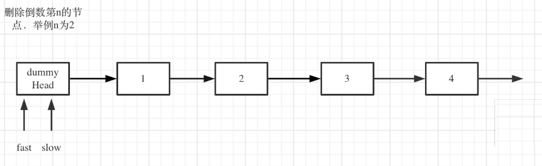

+ fast首先走n + 1步 ，为什么是n+1呢，因为只有这样同时移动的时候slow才能指向删除节点的前一个节点（方便做删除操作），如图：

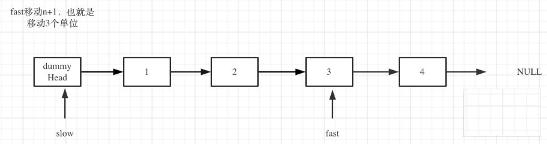

+ fast和slow同时移动，直到fast指向末尾，如图：

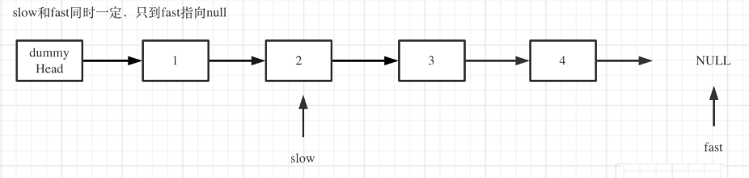

+ 删除slow指向的下一个节点，如图：

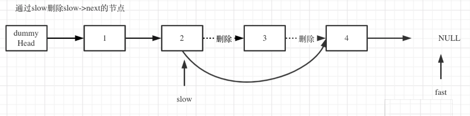

```c++
class Solution {
public:
    ListNode* removeNthFromEnd(ListNode* head, int n) 
    {
        ListNode* dummyHead = new ListNode(0);
        dummyHead->next = head;
        ListNode* slow = dummyHead;
        ListNode* fast = dummyHead;
        while(n-- && fast != NULL) 
        {
            fast = fast->next;
        }
        fast = fast->next; // fast再提前走一步，因为需要让slow指向删除节点的上一个节点
        while (fast != NULL) 
        {
            fast = fast->next;
            slow = slow->next;
        }
        slow->next = slow->next->next; 
        
        // ListNode *tmp = slow->next;  C++释放内存的逻辑
        // slow->next = tmp->next;
        // delete tmp;
        
        return dummyHead->next;
    }
};
```

- 时间复杂度: O(n)
- 空间复杂度: O(1)

**方法二 栈**

或者利用栈（stack）来找到链表中倒数第n个节点的前驱节点，然后删除倒数第n个节点。

**为什么会想到栈呢？**

**栈可以反向遍历链表**。链表的遍历是单向的（只能从头到尾），但我们需要找到倒数第N个节点，也就是从后往前数的第N个节点。如果我们把所有节点按顺序压入栈，那么栈顶就是链表的最后一个节点，栈顶的第N个元素就是倒数第N个节点。

**栈能直接定位前驱节点**。删除链表节点需要知道它的前驱节点（即前一个节点），而栈的特性可以轻松实现这一点：当我们弹出`n`个节点后，栈顶剩下的节点就是倒数第`n`个节点的前驱节点。

```c++
class Solution
{
public:
    ListNode *removeNthFromEnd(ListNode *head, int n)
    {
        auto dummpyNode = new ListNode(0, head);

        stack<ListNode *> s;
        for (auto tmp = dummpyNode; tmp != nullptr; tmp = tmp->next)
            s.push(tmp);

        // 利用栈找到倒数第n个节点的前驱节点
        for (int i = 0; i < n; ++i)
            s.pop();

        auto preNode = s.top(); // 前驱节点
        preNode->next = preNode->next->next;
        return dummpyNode->next;
    }
};
```

- 时间复杂度: O(n)
- 空间复杂度: O(n)

## [24. 两两交换链表中的节点](https://leetcode.cn/problems/swap-nodes-in-pairs/)

给你一个链表，两两交换其中相邻的节点，并返回交换后链表的头节点。你必须在不修改节点内部的值的情况下完成本题（即，只能进行节点交换）。

**示例 1：**


```
输入：head = [1,2,3,4]
输出：[2,1,4,3]
```

**示例 2：**

```
输入：head = []
输出：[]
```

**示例 3：**

```
输入：head = [1]
输出：[1]
```

**提示：**

- 链表中节点的数目在范围 `[0, 100]` 内
- `0 <= Node.val <= 100`

这道题目正常模拟就可以了。

建议使用虚拟头结点，这样会方便很多，要不然每次针对头结点（没有前一个指针指向头结点），还要单独处理。

接下来就是交换相邻两个元素了，**此时一定要画图，不画图，操作多个指针很容易乱，而且要操作的先后顺序**

初始时，cur指向虚拟头结点，然后进行如下三步：

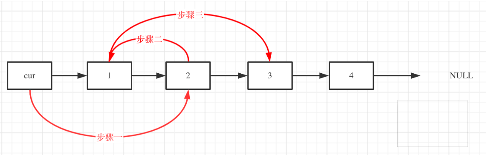

操作之后，链表如下：

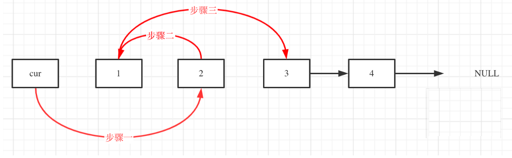

看这个可能就更直观一些了：

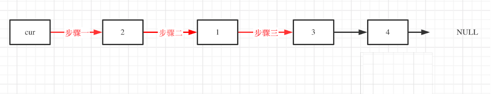

```c++
class Solution
{
public:
    ListNode *swapPairs(ListNode *head)
    {
        if (!head) return NULL;
        if (!head->next) return head;

        ListNode *dummpyHead = new ListNode(0, head);

        auto curNode = dummpyHead;
        while (curNode->next && curNode->next->next)
        {
            // 实际上就是将要交换的两个节点中前一个节点的前驱节点和后一个节点的后驱节点都表示出来
            // curNode:前一个节点的前驱节点
            // tmp1:要交换的第一个节点
            // tmp2:要交换的第二个节点
            // tmp3:后一个节点的后驱节点
            auto tmp1 = curNode->next;
            auto tmp2 = curNode->next->next;
            auto tmp3 = curNode->next->next->next;

            // 既然要交换，那么就要变成 curNode -> tmp2 ->tmp1 ->tmp3
            curNode->next = tmp2;
            curNode->next->next = tmp1;
            curNode->next->next->next = tmp3;

            // cur右移两位，准备下一轮交换
            curNode = curNode->next->next;
        }
        head = dummpyHead->next;
        delete dummpyHead;
        return head;
    }
};
```

## [25. K 个一组翻转链表](https://leetcode.cn/problems/reverse-nodes-in-k-group/)

给你链表的头节点 `head` ，每 `k` 个节点一组进行翻转，请你返回修改后的链表。

`k` 是一个正整数，它的值小于或等于链表的长度。如果节点总数不是 `k` 的整数倍，那么请将最后剩余的节点保持原有顺序。

你不能只是单纯的改变节点内部的值，而是需要实际进行节点交换。

**示例 1：**


```
输入：head = [1,2,3,4,5], k = 2
输出：[2,1,4,3,5]
```

**示例 2：**


```
输入：head = [1,2,3,4,5], k = 3
输出：[3,2,1,4,5]
```

**提示：**

- 链表中的节点数目为 `n`
- `1 <= k <= n <= 5000`
- `0 <= Node.val <= 1000`

**进阶：**你可以设计一个只用 `O(1)` 额外内存空间的算法解决此问题吗？

```c++
class Solution
{
public:
    ListNode *reverseKGroup(ListNode *head, int k)
    {
        // 创建一个虚拟头节点，简化边界条件处理
        ListNode *dummy = new ListNode(0, head);

        // preNode指向当前组的前一个节点，endNode用于遍历找到当前组的最后一个节点
        ListNode *preNode = dummy;
        ListNode *endNode = dummy;

        // 遍历整个链表
        while (endNode)
        {
            // 移动endNode，找到当前组的最后一个节点
            for (int i = 0; i < k && endNode; i++)
            {
                endNode = endNode->next;
            }

            // 如果剩余节点不足k个，直接结束
            if (endNode == nullptr)
            {
                break;
            }

            // 记录当前组的第一个节点和下一组的第一个节点
            ListNode *start = preNode->next;
            ListNode *nextNode = endNode->next;

            // 断开当前组与后续节点的连接
            endNode->next = nullptr;

            // 翻转当前组，并将翻转后的链表连接到前一组后面
            preNode->next = reverse(start);

            // 当前组翻转后，原来的第一个节点变成最后一个节点
            // 将其连接到下一组的第一个节点
            start->next = nextNode;

            // 更新preNode和endNode，准备处理下一组
            preNode = start;
            endNode = preNode;
        }

        // 返回处理后的链表头节点（跳过虚拟头节点）
        return dummy->next;
    }

private:
    ListNode *reverse(ListNode *head)
    {
        ListNode *prevNode = nullptr; // 前驱节点
        ListNode *curNode = head;     // 当前节点
        ListNode *nextTemp = nullptr; // 临时保存下一个节点

        while (curNode)
        {
            nextTemp = curNode->next; // 保存下一个节点
            curNode->next = prevNode; // 反转指针方向
            prevNode = curNode;       // 前驱节点后移
            curNode = nextTemp;       // 当前节点后移
        }

        // 返回翻转后的头节点（原链表的最后一个节点）
        return prevNode;
    }
};
```

## [138. 随机链表的复制](https://leetcode.cn/problems/copy-list-with-random-pointer/)

给你一个长度为 `n` 的链表，每个节点包含一个额外增加的随机指针 `random` ，该指针可以指向链表中的任何节点或空节点。

构造这个链表的 **[深拷贝](https://baike.baidu.com/item/深拷贝/22785317?fr=aladdin)**。 深拷贝应该正好由 `n` 个 **全新** 节点组成，其中每个新节点的值都设为其对应的原节点的值。新节点的 `next` 指针和 `random` 指针也都应指向复制链表中的新节点，并使原链表和复制链表中的这些指针能够表示相同的链表状态。**复制链表中的指针都不应指向原链表中的节点** 。

例如，如果原链表中有 `X` 和 `Y` 两个节点，其中 `X.random --> Y` 。那么在复制链表中对应的两个节点 `x` 和 `y` ，同样有 `x.random --> y` 。

返回复制链表的头节点。

用一个由 `n` 个节点组成的链表来表示输入/输出中的链表。每个节点用一个 `[val, random_index]` 表示：

- `val`：一个表示 `Node.val` 的整数。
- `random_index`：随机指针指向的节点索引（范围从 `0` 到 `n-1`）；如果不指向任何节点，则为 `null` 

你的代码 **只** 接受原链表的头节点 `head` 作为传入参数。

**示例 1：**


```
输入：head = [[7,null],[13,0],[11,4],[10,2],[1,0]]
输出：[[7,null],[13,0],[11,4],[10,2],[1,0]]
```

**示例 2：**


```
输入：head = [[1,1],[2,1]]
输出：[[1,1],[2,1]]
```

**示例 3：**

****

```
输入：head = [[3,null],[3,0],[3,null]]
输出：[[3,null],[3,0],[3,null]]
```

**提示：**

- `0 <= n <= 1000`
- `-104 <= Node.val <= 104`
- `Node.random` 为 `null` 或指向链表中的节点。

**方法一：哈希表**

使用 `unordered_map<Node*, Node*>` 存储原节点到复制节点的映射，实现 O (1) 时间复杂度的查找。

第一次遍历：创建所有复制节点，并将原节点与复制节点的对应关系存入哈希表。

第二次遍历：根据哈希表中的映射关系，为每个复制节点设置 `next` 和 `random` 指针。

```c++
class Solution
{
public:
    Node *copyRandomList(Node *head)
    {
        if (!head)
        {
            return nullptr;
        }

        unordered_map<Node *, Node *> hash;

        Node *curNode = head;
        while (curNode)
        {
            Node *newNode = new Node(curNode->val);
            hash[curNode] = newNode;
            curNode = curNode->next;
        }

        curNode = head;
        while (curNode)
        {
            Node *newNode = hash[curNode];

            newNode->next = hash[curNode->next];
            newNode->random = hash[curNode->random];

            curNode = curNode->next;
        }
        return hash[head];
    }
};
```

**方法二 模拟** 

1. **遍历原链表并复制每个节点**：首先，我们遍历原链表，为每个原节点创建一个新节点，并将新节点插入到原节点之后。这样，原链表的结构将变成：原节点1 -> 新节点1 -> 原节点2 -> 新节点2 -> ...。这一步确保我们可以轻松地设置新节点的 `random`指针。
2. **设置新节点的 `random`指针**：再次遍历链表，这次我们设置每个新节点的 `random`指针。新节点的 `random`指针应指向原节点 `random`指针的下一个节点（即对应的新节点）。
3. **分离原链表和新链表**：最后，我们需要将混合链表拆分成原链表和新链表。遍历链表，将原节点的 `next`指针恢复为原来的下一个节点，而新节点的 `next`指针指向下一个新节点。

```c++
class Solution
{
public:
    Node *copyRandomList(Node *head)
    {
        if (!head)
        {
            return nullptr;
        }

        // 第一步：复制每个节点，并将复制的节点插入到原节点的后面
        // 原链表 A->B->C 变成 A->A'->B->B'->C->C'
        Node *curNode = head;
        while (curNode)
        {
            Node *newNode = new Node(curNode->val); // 创建当前节点的复制节点
            Node *nextNode = curNode->next;         // 保存原节点的下一个节点
            curNode->next = newNode;                // 原节点指向复制节点
            newNode->next = nextNode;               // 复制节点指向原节点的下一个节点
            curNode = nextNode;                     // 移动到原链表的下一个节点
        }

        // 第二步：设置复制节点的random指针
        // 原节点A的random指针指向节点B，则复制节点A'的random指针应指向B'
        curNode = head;
        while (curNode)
        {
            // 如果原节点有random指针，则复制节点的random指针指向原random节点的复制节点
            if (curNode->random)
            {
                curNode->next->random = curNode->random->next;
            }
            // 跳过复制节点，移动到原链表的下一个节点
            curNode = curNode->next->next;
        }

        // 第三步：拆分原链表和复制链表，恢复原链表的结构
        Node *newHead = head->next; // 复制链表的头节点是原头节点的复制节点
        curNode = head;             // 从原链表头节点开始遍历
        while (curNode && curNode->next)
        {
            Node *tempNode = curNode->next; // 保存当前原节点对应的复制节点
            curNode->next = tempNode->next; // 恢复原节点的next指针，指向原链表的下一个节点

            // 设置复制节点的next指针，指向复制链表的下一个节点
            // 只有当复制节点后面有原节点时才需要设置（避免空指针访问）
            if (tempNode->next)
            {
                tempNode->next = tempNode->next->next;
            }
            curNode = curNode->next; // 移动到原链表的下一个节点
        }

        return newHead;
    }
};
```

## [148. 排序链表](https://leetcode.cn/problems/sort-list/)

给你链表的头结点 `head` ，请将其按 **升序** 排列并返回 **排序后的链表** 。

**示例 1：**


```
输入：head = [4,2,1,3]
输出：[1,2,3,4]
```

**示例 2：**


```
输入：head = [-1,5,3,4,0]
输出：[-1,0,3,4,5]
```

**示例 3：**

```
输入：head = []
输出：[]
```

**提示：**

- 链表中节点的数目在范围 `[0, 5 * 104]` 内
- `-105 <= Node.val <= 105`

**进阶：**你可以在 `O(n log n)` 时间复杂度和常数级空间复杂度下，对链表进行排序吗？

1. **收集节点指针**：遍历链表，将所有节点的指针存储到向量中，不改变节点本身的任何属性
2. **排序节点指针**：使用 `sort` 函数和自定义比较器，根据节点的 `val` 属性对指针进行排序，比较器通过 `a->val < b->val` 实现升序排列
3. **重新连接链表**：
   - 遍历排序后的节点指针向量
   - 将每个节点的 `next` 指针指向向量中的下一个节点
   - 最后一个节点的 `next` 指针设置为 `nullptr`
   - 返回向量中的第一个节点作为新的头节点

```c++
class Solution
{
private:
    static bool cmp(ListNode *a, ListNode *b)
    {
        return a->val < b->val;
    }

public:
    ListNode *sortList(ListNode *head)
    {
        if (!head || !head->next)
        {
            return head;
        }

        vector<ListNode *> nodes;
        ListNode *curNode = head;
        while (curNode)
        {
            nodes.emplace_back(curNode);
            curNode = curNode->next;
        }

        // 防止nodes[0]越界
        if (nodes.empty())
        {
            return nullptr;
        }

        sort(nodes.begin(), nodes.end(), cmp);

        int n = nodes.size();
        for (int i = 0; i < n - 1; i++)
        {
            nodes[i]->next = nodes[i + 1];
        }
        nodes[n - 1]->next = nullptr;

        return nodes[0];
    }
};
```

## [23. 合并 K 个升序链表](https://leetcode.cn/problems/merge-k-sorted-lists/)

给你一个链表数组，每个链表都已经按升序排列。请你将所有链表合并到一个升序链表中，返回合并后的链表。

**示例 1：**

```
输入：lists = [[1,4,5],[1,3,4],[2,6]]
输出：[1,1,2,3,4,4,5,6]
解释：链表数组如下：
[
  1->4->5,
  1->3->4,
  2->6
]
将它们合并到一个有序链表中得到。
1->1->2->3->4->4->5->6
```

**示例 2：**

```
输入：lists = []
输出：[]
```

**示例 3：**

```
输入：lists = [[]]
输出：[]
```

**提示：**

- `k == lists.length`
- `0 <= k <= 10^4`
- `0 <= lists[i].length <= 500`
- `-10^4 <= lists[i][j] <= 10^4`
- `lists[i]` 按 **升序** 排列
- `lists[i].length` 的总和不超过 `10^4`

**方法一：优先队列**

```c++
class Solution
{
public:
    // 定义优先队列的比较器（最小堆）
    struct CompareNode
    {
        bool operator()(ListNode *a, ListNode *b)
        {
            return a->val > b->val;
        }
    };

    ListNode *mergeKLists(std::vector<ListNode *> &lists)
    {
        // 创建优先队列（最小堆），用于存放所有节点
        std::priority_queue<ListNode *, std::vector<ListNode *>, CompareNode> pq;

        // 将所有链表的全部节点加入优先队列
        for (ListNode *list : lists)
        {
            ListNode *cur = list;
            while (cur != nullptr)
            {
                pq.push(cur);
                cur = cur->next;
            }
        }

        ListNode *head = nullptr;
        if (!pq.empty())
        {
            head = pq.top();
        }

        // 从优先队列中依次取出节点构建结果链表
        ListNode *minNode = nullptr;
        ListNode *nextNode = nullptr;
        while (!pq.empty())
        {
            // 获取当前最小节点
            ListNode *minNode = pq.top();
            pq.pop();

            if (!pq.empty())
            {
                ListNode *nextNode = pq.top();
                minNode->next = nextNode;
            }
            else
            {
                minNode->next = nullptr;
            }
        }
        return head;
    }
};
```

**方法二：排序**

```c++
class Solution
{
public:
    static bool cmp(ListNode *a, ListNode *b)
    {
        return a->val < b->val;
    }

    ListNode *mergeKLists(vector<ListNode *> &lists)
    {
        vector<ListNode *> nodes;

        for (int i = 0; i < lists.size(); i++)
        {
            ListNode *curNode = lists[i];
            while (curNode)
            {
                nodes.emplace_back(curNode);
                curNode = curNode->next;
            }
        }

        // 处理空向量的情况
        if (nodes.empty())
        {
            return nullptr;
        }

        sort(nodes.begin(), nodes.end(), cmp);

        int n = nodes.size();
        for (int i = 0; i < n - 1; i++)
        {
            nodes[i]->next = nodes[i + 1];
        }
        nodes[n - 1]->next = nullptr;

        return nodes[0];
    }
};
```

## [146. LRU 缓存](https://leetcode.cn/problems/lru-cache/)

请你设计并实现一个满足 [LRU (最近最少使用) 缓存](https://baike.baidu.com/item/LRU) 约束的数据结构。

实现 `LRUCache` 类：

- `LRUCache(int capacity)` 以 **正整数** 作为容量 `capacity` 初始化 LRU 缓存
- `int get(int key)` 如果关键字 `key` 存在于缓存中，则返回关键字的值，否则返回 `-1` 。
- `void put(int key, int value)` 如果关键字 `key` 已经存在，则变更其数据值 `value` ；如果不存在，则向缓存中插入该组 `key-value` 。如果插入操作导致关键字数量超过 `capacity` ，则应该 **逐出** 最久未使用的关键字。

函数 `get` 和 `put` 必须以 `O(1)` 的平均时间复杂度运行。

**示例：**

```
输入
["LRUCache", "put", "put", "get", "put", "get", "put", "get", "get", "get"]
[[2], [1, 1], [2, 2], [1], [3, 3], [2], [4, 4], [1], [3], [4]]
输出
[null, null, null, 1, null, -1, null, -1, 3, 4]

解释
LRUCache lRUCache = new LRUCache(2);
lRUCache.put(1, 1); // 缓存是 {1=1}
lRUCache.put(2, 2); // 缓存是 {1=1, 2=2}
lRUCache.get(1);    // 返回 1
lRUCache.put(3, 3); // 该操作会使得关键字 2 作废，缓存是 {1=1, 3=3}
lRUCache.get(2);    // 返回 -1 (未找到)
lRUCache.put(4, 4); // 该操作会使得关键字 1 作废，缓存是 {4=4, 3=3}
lRUCache.get(1);    // 返回 -1 (未找到)
lRUCache.get(3);    // 返回 3
lRUCache.get(4);    // 返回 4
```

**提示：**

- `1 <= capacity <= 3000`
- `0 <= key <= 10000`
- `0 <= value <= 105`
- 最多调用 `2 * 105` 次 `get` 和 `put`

```c++
class LRUCache {
private:
    std::unordered_map<int, DLinkedNode*> cache;  // 哈希表：key -> 节点指针
    DLinkedNode* head;  // 虚拟头节点
    DLinkedNode* tail;  // 虚拟尾节点
    int size;           // 当前缓存大小
    int capacity;       // 缓存容量

    // 将节点移动到链表头部（表示最近使用）
    void moveToHead(DLinkedNode* node) {
        removeNode(node);
        addToHead(node);
    }

    // 从链表中移除节点
    void removeNode(DLinkedNode* node) {
        node->prev->next = node->next;
        node->next->prev = node->prev;
    }

    // 在链表头部添加节点
    void addToHead(DLinkedNode* node) {
        node->prev = head;
        node->next = head->next;
        head->next->prev = node;
        head->next = node;
    }

    // 移除链表尾部节点（最久未使用）并返回该节点
    DLinkedNode* removeTail() {
        DLinkedNode* node = tail->prev;
        removeNode(node);
        return node;
    }

public:
    // 构造函数：初始化缓存
    LRUCache(int _capacity) : capacity(_capacity), size(0) {
        // 创建虚拟头节点和尾节点，简化边界处理
        head = new DLinkedNode();
        tail = new DLinkedNode();
        head->next = tail;
        tail->prev = head;
    }
    
    // 获取缓存中的值
    int get(int key) {
        // 如果key不存在，返回-1
        if (!cache.count(key)) {
            return -1;
        }
        
        // 如果key存在，将节点移动到头部（表示最近使用）并返回值
        DLinkedNode* node = cache[key];
        moveToHead(node);
        return node->value;
    }
    
    // 向缓存中插入或更新值
    void put(int key, int value) {
        // 如果key不存在
        if (!cache.count(key)) {
            // 创建新节点
            DLinkedNode* node = new DLinkedNode(key, value);
            // 添加到哈希表
            cache[key] = node;
            // 添加到链表头部
            addToHead(node);
            // 增加缓存大小
            size++;
            
            // 如果缓存已满，移除最久未使用的节点（尾部节点）
            if (size > capacity) {
                DLinkedNode* removedNode = removeTail();
                // 同时从哈希表中移除
                cache.erase(removedNode->key);
                // 释放内存
                delete removedNode;
                // 减少缓存大小
                size--;
            }
        } else {
            // 如果key存在，更新值并移动到头部
            DLinkedNode* node = cache[key];
            node->value = value;
            moveToHead(node);
        }
    }
};
```


## [203. 移除链表元素](https://leetcode.cn/problems/remove-linked-list-elements/)

给你一个链表的头节点 `head` 和一个整数 `val` ，请你删除链表中所有满足 `Node.val == val` 的节点，并返回 **新的头节点** 。

给你一个链表的头节点 `head` 和一个整数 `val` ，请你删除链表中所有满足 `Node.val == val` 的节点，并返回 **新的头节点** 。

**示例 1：**


```
输入：head = [1,2,6,3,4,5,6], val = 6
输出：[1,2,3,4,5]
```

**示例 2：**

```
输入：head = [], val = 1
输出：[]
```

**示例 3：**

```
输入：head = [7,7,7,7], val = 7
输出：[]
```

**提示：**

- 列表中的节点数目在范围 `[0, 104]` 内
- `1 <= Node.val <= 50`
- `0 <= val <= 50`

**设置一个虚拟头结点在进行删除操作。**这样原链表的所有节点就都可以按照统一的方式进行移除了。

```c++
class Solution {
public:
    ListNode* removeElements(ListNode* head, int val) {
        ListNode* dummyHead = new ListNode(0);

        dummyHead->next = head;

        ListNode* curNode = dummyHead;
        while(curNode->next!=NULL)
        {
            if(curNode->next->val == val)
            {
                ListNode* tmp = curNode->next;
                curNode->next = curNode->next->next;
                delete tmp;
            }
            else
            {
                curNode = curNode ->next;
            }
        }
        head = dummyHead->next;
        delete dummyHead;
        return head;
    }
};
```

- 时间复杂度: O(n)
- 空间复杂度: O(1)

## [707. 设计链表](https://leetcode.cn/problems/design-linked-list/)

你可以选择使用单链表或者双链表，设计并实现自己的链表。

单链表中的节点应该具备两个属性：`val` 和 `next` 。`val` 是当前节点的值，`next` 是指向下一个节点的指针/引用。

如果是双向链表，则还需要属性 `prev` 以指示链表中的上一个节点。假设链表中的所有节点下标从 **0** 开始。

实现 `MyLinkedList` 类：

- `MyLinkedList()` 初始化 `MyLinkedList` 对象。
- `int get(int index)` 获取链表中下标为 `index` 的节点的值。如果下标无效，则返回 `-1` 。
- `void addAtHead(int val)` 将一个值为 `val` 的节点插入到链表中第一个元素之前。在插入完成后，新节点会成为链表的第一个节点。
- `void addAtTail(int val)` 将一个值为 `val` 的节点追加到链表中作为链表的最后一个元素。
- `void addAtIndex(int index, int val)` 将一个值为 `val` 的节点插入到链表中下标为 `index` 的节点之前。如果 `index` 等于链表的长度，那么该节点会被追加到链表的末尾。如果 `index` 比长度更大，该节点将 **不会插入** 到链表中。
- `void deleteAtIndex(int index)` 如果下标有效，则删除链表中下标为 `index` 的节点。

**示例：**

```
输入
["MyLinkedList", "addAtHead", "addAtTail", "addAtIndex", "get", "deleteAtIndex", "get"]
[[], [1], [3], [1, 2], [1], [1], [1]]
输出
[null, null, null, null, 2, null, 3]

解释
MyLinkedList myLinkedList = new MyLinkedList();
myLinkedList.addAtHead(1);
myLinkedList.addAtTail(3);
myLinkedList.addAtIndex(1, 2);    // 链表变为 1->2->3
myLinkedList.get(1);              // 返回 2
myLinkedList.deleteAtIndex(1);    // 现在，链表变为 1->3
myLinkedList.get(1);              // 返回 3
```

**提示：**

- `0 <= index, val <= 1000`
- 请不要使用内置的 LinkedList 库。
- 调用 `get`、`addAtHead`、`addAtTail`、`addAtIndex` 和 `deleteAtIndex` 的次数不超过 `2000` 。

这道题目设计链表的五个接口：

- 获取链表第index个节点的数值
- 在链表的最前面插入一个节点
- 在链表的最后面插入一个节点
- 在链表第index个节点前面插入一个节点
- 删除链表的第index个节点

可以说这五个接口，已经覆盖了链表的常见操作，是练习链表操作非常好的一道题目

**链表操作的两种方式：**

1. 直接使用原来的链表来进行操作。
2. 设置一个虚拟头结点在进行操作。

下面采用的设置一个虚拟头结点（这样更方便一些，看代码就会感受出来）。

```c++
class MyLinkedList
{
public:
    struct ListNode
    {
        int val;
        ListNode *next;
        ListNode(int val) : val(val), next(nullptr) {}
    };

    MyLinkedList()
    {
        dummyHead = new ListNode(0);
        size = 0;
    }

    ~MyLinkedList()
    {
        ListNode* curNode = dummyHead;
        while (curNode)
        {
            ListNode* tmp = curNode;
            curNode = curNode->next;
            delete tmp;
        }
        
    }

    int get(int index)
    {
        if (index < 0 || index > size - 1)
            return -1;
        ListNode *curNode = dummyHead;
        int idx = -1;
        while (idx < index)
        {
            curNode = curNode->next;
            idx++;
        }
        return curNode->val;
    }

    void addAtHead(int val)
    {
        ListNode *newNode = new ListNode(val);
        newNode->next = dummyHead->next;
        dummyHead->next = newNode;
        this->size++;
    }

    void addAtTail(int val)
    {
        ListNode *newNode = new ListNode(val);
        ListNode *curNode = dummyHead;
        while (curNode->next)
        {
            curNode = curNode->next;
        }
        curNode->next = newNode;
        this->size++;
    }

    void addAtIndex(int index, int val)
    {
        if (index < 0 || index > size)
            return;

        if (index == size)
        {
            addAtTail(val);
            return;
        }

        ListNode *newNode = new ListNode(val);
        ListNode *curNode = dummyHead;
        int idx = -1;
        while (idx < index - 1)
        {
            curNode = curNode->next;
            idx++;
        }
        newNode->next = curNode->next;
        curNode->next = newNode;
        this->size++;
    }

    void deleteAtIndex(int index)
    {
        if (index < 0 || index > size - 1)
            return;
        ListNode *curNode = dummyHead;
        int idx = -1;
        while (idx < index - 1)
        {
            curNode = curNode->next;
            idx++;
        }
        ListNode *tmp = curNode->next;
        curNode->next = curNode->next->next;
        delete tmp;
        this->size--;
    }

private:
    ListNode *dummyHead = {};
    int size = 0;
};
```

- 时间复杂度: 涉及 `index` 的相关操作为 O(index), 其余为 O(1)
- 空间复杂度: O(n)

# 哈希

## 哈希表理论基础

首先什么是哈希表，哈希表（英文名字为Hash table，国内也有一些算法书籍翻译为散列表，大家看到这两个名称知道都是指hash table就可以了）。

> 哈希表是根据关键码的值而直接进行访问的数据结构。

这么官方的解释可能有点懵，其实直白来讲其实数组就是一张哈希表。

哈希表中关键码就是数组的索引下标，然后通过下标直接访问数组中的元素，如下图所示：

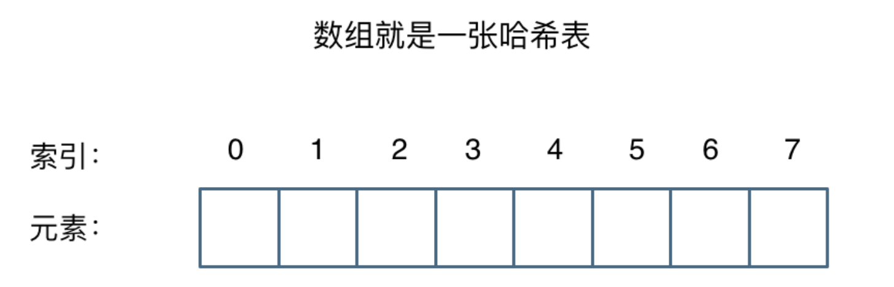

那么哈希表能解决什么问题呢，**一般哈希表都是用来快速判断一个元素是否出现集合里。**

例如要查询一个名字是否在这所学校里。

要枚举的话时间复杂度是O(n)，但如果使用哈希表的话， 只需要O(1)就可以做到。

我们只需要初始化把这所学校里学生的名字都存在哈希表里，在查询的时候通过索引直接就可以知道这位同学在不在这所学校里了。

将学生姓名映射到哈希表上就涉及到了**hash function ，也就是哈希函数**。

### 哈希函数

哈希函数，把学生的姓名直接映射为哈希表上的索引，然后就可以通过查询索引下标快速知道这位同学是否在这所学校里了。

哈希函数如下图所示，通过hashCode把名字转化为数值，一般hashcode是通过特定编码方式，可以将其他数据格式转化为不同的数值，这样就把学生名字映射为哈希表上的索引数字了。

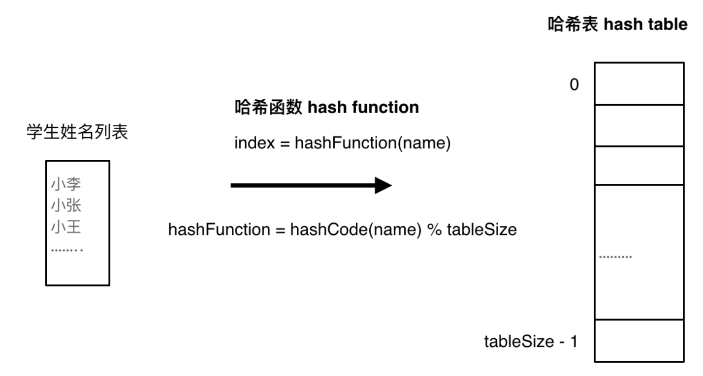

如果hashCode得到的数值大于 哈希表的大小了，也就是大于tableSize了，怎么办呢？

此时为了保证映射出来的索引数值都落在哈希表上，我们会在再次对数值做一个取模的操作，这样我们就保证了学生姓名一定可以映射到哈希表上了。

此时问题又来了，哈希表我们刚刚说过，就是一个数组。

如果学生的数量大于哈希表的大小怎么办，此时就算哈希函数计算的再均匀，也避免不了会有几位学生的名字同时映射到哈希表 同一个索引下标的位置。

接下来**哈希碰撞**登场

### 哈希碰撞

如图所示，小李和小王都映射到了索引下标 1 的位置，**这一现象叫做哈希碰撞**。

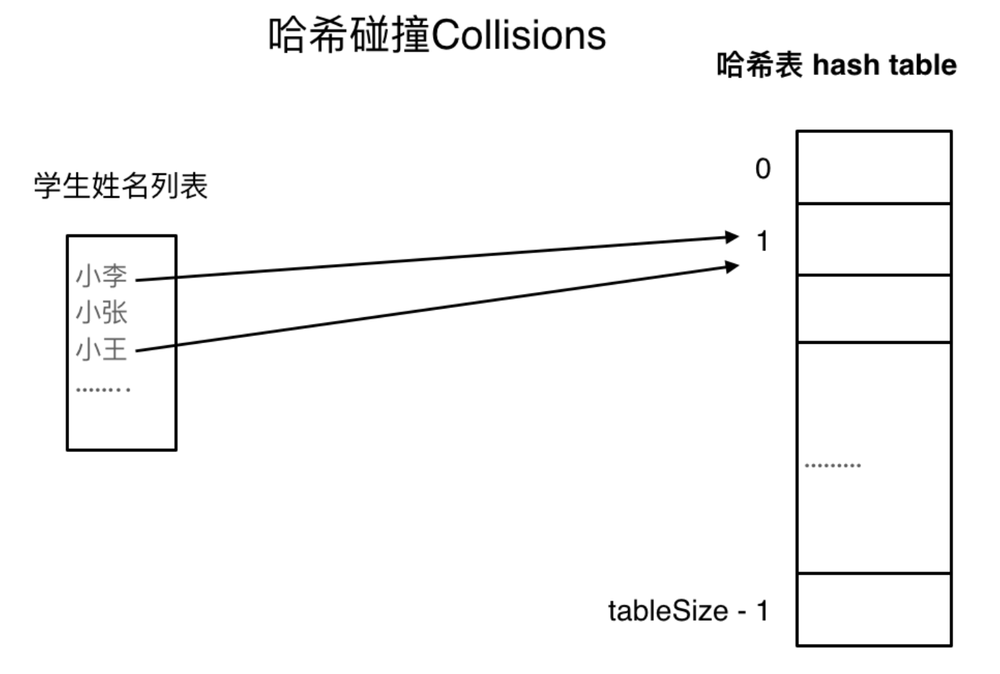

一般哈希碰撞有两种解决方法， 拉链法和线性探测法。

**拉链法**

刚刚小李和小王在索引1的位置发生了冲突，发生冲突的元素都被存储在链表中。 这样我们就可以通过索引找到小李和小王了

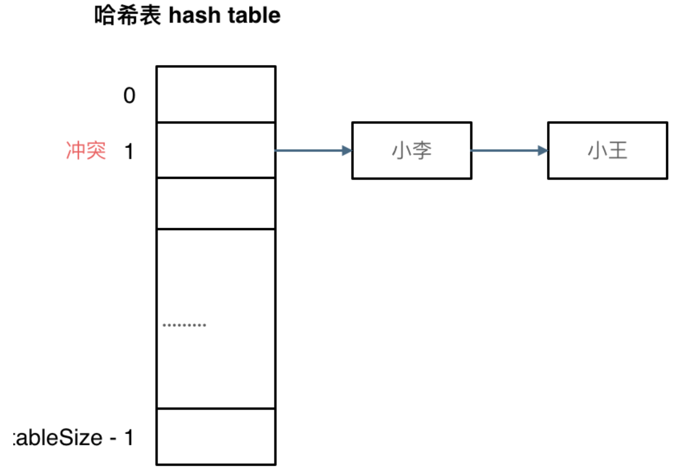

（数据规模是dataSize， 哈希表的大小为tableSize）

其实拉链法就是要选择适当的哈希表的大小，这样既不会因为数组空值而浪费大量内存，也不会因为链表太长而在查找上浪费太多时间。

**线性探测法**

使用线性探测法，一定要保证tableSize大于dataSize。 我们需要依靠哈希表中的空位来解决碰撞问题。

例如冲突的位置，放了小李，那么就向下找一个空位放置小王的信息。所以要求tableSize一定要大于dataSize ，要不然哈希表上就没有空置的位置来存放 冲突的数据了。如图所示：

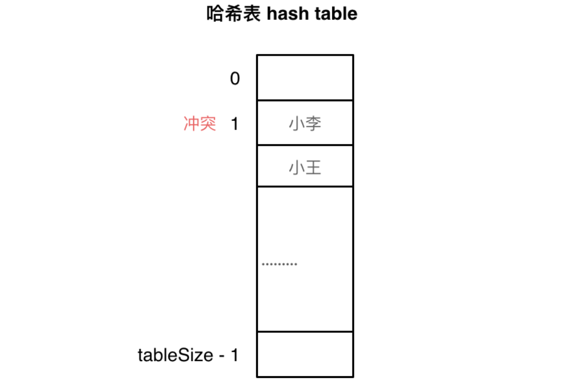

其实关于哈希碰撞还有非常多的细节，感兴趣的同学可以再好好研究一下，这里我就不再赘述了。

### 常见的三种哈希结构

当我们想使用哈希法来解决问题的时候，我们一般会选择如下三种数据结构。

- 数组
- set （集合）
- map(映射)

这里数组就没啥可说的了，我们来看一下set。

在C++中，set 和 map 分别提供以下三种数据结构，其底层实现以及优劣如下表所示：

| 集合               | 底层实现 | 是否有序 | 数值是否可以重复 | 能否更改数值 | 查询效率 | 增删效率 |
| ------------------ | -------- | -------- | ---------------- | ------------ | -------- | -------- |
| std::set           | 红黑树   | 有序     | 否               | 否           | O(log n) | O(log n) |
| std::multiset      | 红黑树   | 有序     | 是               | 否           | O(logn)  | O(logn)  |
| std::unordered_set | 哈希表   | 无序     | 否               | 否           | O(1)     | O(1)     |

std::unordered_set底层实现为哈希表，std::set 和std::multiset 的底层实现是红黑树，红黑树是一种平衡二叉搜索树，所以key值是有序的，但key不可以修改，改动key值会导致整棵树的错乱，所以只能删除和增加。

| 映射               | 底层实现 | 是否有序 | 数值是否可以重复 | 能否更改数值 | 查询效率 | 增删效率 |
| ------------------ | -------- | -------- | ---------------- | ------------ | -------- | -------- |
| std::map           | 红黑树   | key有序  | key不可重复      | key不可修改  | O(logn)  | O(logn)  |
| std::multimap      | 红黑树   | key有序  | key可重复        | key不可修改  | O(log n) | O(log n) |
| std::unordered_map | 哈希表   | key无序  | key不可重复      | key不可修改  | O(1)     | O(1)     |

std::unordered_map 底层实现为哈希表，std::map 和std::multimap 的底层实现是红黑树。同理，std::map 和std::multimap 的key也是有序的（这个问题也经常作为面试题，考察对语言容器底层的理解）。

当我们要使用集合来解决哈希问题的时候，优先使用unordered_set，因为它的查询和增删效率是最优的，如果需要集合是有序的，那么就用set，如果要求不仅有序还要有重复数据的话，那么就用multiset。

那么再来看一下map ，在map 是一个key value 的数据结构，map中，对key是有限制，对value没有限制的，因为key的存储方式使用红黑树实现的。

虽然std::set和std::multiset 的底层实现基于红黑树而非哈希表，它们通过红黑树来索引和存储数据。不过给我们的使用方式，还是哈希法的使用方式，即依靠键（key）来访问值（value）。所以使用这些数据结构来解决映射问题的方法，我们依然称之为哈希法。std::map也是一样的道理。

这里在说一下，一些C++的经典书籍上 例如STL源码剖析，说到了hash_set hash_map，这个与unordered_set，unordered_map又有什么关系呢？

实际上功能都是一样一样的， 但是unordered_set在C++11的时候被引入标准库了，而hash_set并没有，所以建议还是使用unordered_set比较好，这就好比一个是官方认证的，hash_set，hash_map 是C++11标准之前民间高手自发造的轮子。

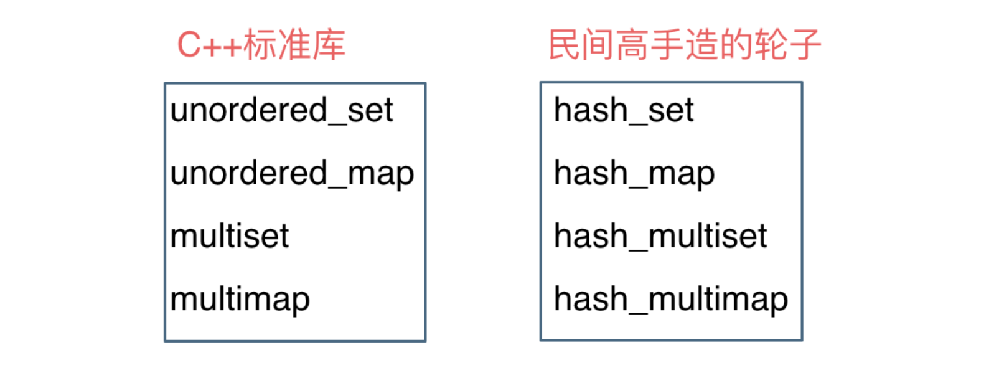

### 详细介绍set和map

在 C++ 中，`set`、`unordered_set`、`map` 和 `unordered_map` 是四种常用的关联容器，它们的核心区别在于 **底层实现** 和 **特性**。

**`set` 和 `unordered_set`**

```c++
#include <iostream>
#include <set>
#include <unordered_set>

int main() {
    std::set<int> s = {3, 1, 4, 2};
    std::unordered_set<int> us = {3, 1, 4, 2};

    std::cout << "set: ";
    for (int x : s) std::cout << x << " "; // 输出 1 2 3 4（有序）
    std::cout << "\nunordered_set: ";
    for (int x : us) std::cout << x << " "; // 输出顺序不确定（如 3 1 4 2）
}
```

共同点

- 都是集合（存储唯一元素）。
- 不支持重复元素（`multiset` 和 `unordered_multiset` 支持重复）。

区别

|          特性           |        `std::set`        |    `std::unordered_set`    |
| :---------------------: | :----------------------: | :------------------------: |
|      **底层实现**       | 红黑树（平衡二叉搜索树） |           哈希表           |
|    **元素是否有序**     |   **有序**（默认升序）   | **无序**（取决于哈希函数） |
|   **查找时间复杂度**    |        `O(log n)`        |  平均 `O(1)`，最坏 `O(n)`  |
| **插入/删除时间复杂度** |        `O(log n)`        |  平均 `O(1)`，最坏 `O(n)`  |
|      **适用场景**       |  需要元素有序或范围查询  |  需要快速查找，不关心顺序  |

**`map` 和 `unordered_map`**

```C++
#include <iostream>
#include <map>
#include <unordered_map>

int main() {
    std::map<std::string, int> m = {{"Alice", 25}, {"Bob", 30}};
    std::unordered_map<std::string, int> um = {{"Alice", 25}, {"Bob", 30}};

    std::cout << "map: ";
    for (auto& p : m) std::cout << p.first << ":" << p.second << " "; // Alice:25 Bob:30（有序）
    std::cout << "\nunordered_map: ";
    for (auto& p : um) std::cout << p.first << ":" << p.second << " "; // 顺序不确定
}
```

共同点

- 都是键值对容器（`key-value`）。
- 键（`key`）唯一（`multimap` 和 `unordered_multimap` 支持重复键）。

区别

|          特性           |          `std::map`           |    `std::unordered_map`    |
| :---------------------: | :---------------------------: | :------------------------: |
|      **底层实现**       |   红黑树（平衡二叉搜索树）    |           哈希表           |
|     **键是否有序**      | **有序**（默认按 `key` 升序） | **无序**（取决于哈希函数） |
|   **查找时间复杂度**    |          `O(log n)`           |  平均 `O(1)`，最坏 `O(n)`  |
| **插入/删除时间复杂度** |          `O(log n)`           |  平均 `O(1)`，最坏 `O(n)`  |
|      **适用场景**       |     需要键有序或范围查询      |  需要快速查找，不关心顺序  |

如何选择？

**选择 `set` 或 `map` 的情况**

- 需要元素/键 **有序**（如按字母顺序遍历）。
- 需要 **范围查询**（如查找 `[a, b]` 之间的所有元素）。
- 内存占用较少（哈希表可能有额外开销）。

**选择 `unordered_set` 或 `unordered_map` 的情况**

- 需要 **快速查找、插入、删除**（平均 `O(1)`）。
- 不关心元素/键的顺序。
- 可以接受最坏情况 `O(n)` 的时间复杂度（哈希冲突时）。

 **FAQ**

**Q1：什么时候用 `set`，什么时候用 `unordered_set`？**

- 如果需要按顺序遍历或范围查询，用 `set`。
- 如果只需要快速查找且不关心顺序，用 `unordered_set`。

**Q2：`map` 和 `unordered_map` 的键有什么要求？**

- `map` 的键必须支持 `<` 比较（或自定义比较器）。
- `unordered_map` 的键必须支持哈希函数（或自定义哈希函数）。

**Q3：为什么 `unordered_set` 的遍历顺序不确定？**

因为哈希表的存储顺序取决于哈希函数和冲突解决策略，无法保证顺序。

### 总结

总结一下，**当我们遇到了要快速判断一个元素是否出现集合里的时候，就要考虑哈希法**。

但是哈希法也是**牺牲了空间换取了时间**，因为我们要使用额外的数组，set或者是map来存放数据，才能实现快速的查找。

如果在做面试题目的时候遇到需要判断一个元素是否出现过的场景也应该第一时间想到哈希法！

## [1. 两数之和](https://leetcode.cn/problems/two-sum/)

给定一个整数数组 `nums` 和一个整数目标值 `target`，请你在该数组中找出 **和为目标值** *`target`* 的那 **两个** 整数，并返回它们的数组下标。

你可以假设每种输入只会对应一个答案，并且你不能使用两次相同的元素。

你可以按任意顺序返回答案。

**示例 1：**

```
输入：nums = [2,7,11,15], target = 9
输出：[0,1]
解释：因为 nums[0] + nums[1] == 9 ，返回 [0, 1] 。
```

**示例 2：**

```
输入：nums = [3,2,4], target = 6
输出：[1,2]
```

**示例 3：**

```
输入：nums = [3,3], target = 6
输出：[0,1]
```

**提示：**

- `2 <= nums.length <= 104`
- `-109 <= nums[i] <= 109`
- `-109 <= target <= 109`
- **只会存在一个有效答案**

**进阶：**你可以想出一个时间复杂度小于 `O(n2)` 的算法吗？

**什么时候使用哈希法**，当我们需要查询一个元素是否出现过，或者一个元素是否在集合里的时候，就要第一时间想到哈希法。

本题呢，我就需要一个集合来存放我们遍历过的元素，然后在遍历数组的时候去询问这个集合，某元素是否遍历过，也就是 是否出现在这个集合。

那么我们就应该想到使用哈希法了。

因为本题，我们不仅要知道元素有没有遍历过，还要知道这个元素对应的下标，**需要使用 key value结构来存放，key来存元素，value来存下标，那么使用map正合适**。

再来看一下使用数组和set来做哈希法的局限。

- 数组的大小是受限制的，而且如果元素很少，而哈希值太大会造成内存空间的浪费。
- set是一个集合，里面放的元素只能是一个key，而两数之和这道题目，不仅要判断y是否存在而且还要记录y的下标位置，因为要返回x 和 y的下标。所以set 也不能用。

此时就要选择另一种数据结构：map ，map是一种key value的存储结构，可以用key保存数值，用value再保存数值所在的下标。

接下来需要明确两点：

- **map用来做什么**
- **map中key和value分别表示什么**

map目的用来存放我们访问过的元素，因为遍历数组的时候，需要记录我们之前遍历过哪些元素和对应的下标，这样才能找到与当前元素相匹配的（也就是相加等于target）

接下来是map中key和value分别表示什么。

这道题 我们需要 给出一个元素，判断这个元素是否出现过，如果出现过，返回这个元素的下标。

那么判断元素是否出现，这个元素就要作为key，所以数组中的元素作为key，有key对应的就是value，value用来存下标。

所以 map中的存储结构为 {key：数据元素，value：数组元素对应的下标}。

```c++
class Solution {
public:
    vector<int> twoSum(vector<int>& nums, int target) {
        unordered_map<int,int> num_map;
        for(int i=0;i<nums.size();i++)
        {
            num_map[nums[i]] = i;
        }

        for(int i =0;i<nums.size();i++)
        {
            int need = target - nums[i];
            if(num_map.find(need)!=num_map.end() && num_map[need]!=i )
            {
              return {i,num_map[need]};
            }
        }
        return {};
    }
};
```

## [242. 有效的字母异位词](https://leetcode.cn/problems/valid-anagram/)

给定两个字符串 `s` 和 `t` ，编写一个函数来判断 `t` 是否是 `s` 的 字母异位词。

**示例 1:**

```
输入: s = "anagram", t = "nagaram"
输出: true
```

**示例 2:**

```
输入: s = "rat", t = "car"
输出: false
```

**提示:**

- `1 <= s.length, t.length <= 5 * 104`
- `s` 和 `t` 仅包含小写字母

**进阶:** 如果输入字符串包含 unicode 字符怎么办？你能否调整你的解法来应对这种情况？

先看暴力的解法，两层for循环，同时还要记录字符是否重复出现，很明显时间复杂度是 O(n^2)。

暴力的方法这里就不做介绍了，直接看一下有没有更优的方式。

**数组其实就是一个简单哈希表**，而且这道题目中字符串只有小写字符，那么就可以定义一个数组，来记录字符串s里字符出现的次数。

需要定义一个多大的数组呢，定一个数组叫做record，大小为26 就可以了，初始化为0，因为字符a到字符z的ASCII也是26个连续的数值。大一点也没关系，防止越界，一般都大一点。

```c++
class Solution {
public:
    bool isAnagram(string s, string t) {
        int hash1[30] = {0};
        int hash2[30] = {0};

        for(auto& c:s) hash1[c-'a']++;
    
        for(auto&c :t) hash2[c-'a']++;

        for(int i = 0 ;i<30;i++)
        {
            if(hash1[i]!=hash2[i])
                return false;
        }
        return true;
    }
};
```

- 时间复杂度：O(n)，其中n是字符串长度
- 空间复杂度：O(1)，使用固定大小的数组(26个元素)

或者使用C++的multiset

```c++
class Solution {
public:
    bool isAnagram(string s, string t) {
        if(s.size()!=t.size()) return false;

        multiset<char> set1(s.begin(),s.end());
        multiset<char> set2(t.begin(),t.end());

        return set1 == set2;
    }
};
```

- **时间复杂度**：O(n log n)

  - 构建 `multiset` 的时间复杂度是 O(n log n)

    - `multiset` 通常实现为红黑树（一种自平衡二叉搜索树）
    - 在红黑树中插入一个元素的时间复杂度是 O(log k)，其中 k 是当前树中的节点数
    - 对于 n 次插入操作，总时间复杂度是：
      - log 1 + log 2 + log 3 + ... + log n ≈ n log n（通过积分近似）

    + 因此，构建整个 `multiset` 的时间复杂度是 O(n log n)。

  - 比较两个 `multiset` 的时间复杂度是 O(n)

    - `multiset` 是有序容器（元素已排序）
    - 比较两个有序序列是否相等可以使用线性时间算法：
      1. 首先比较大小（O(1)）
      2. 如果大小相同，逐个比较元素（最多 n 次比较）

- **空间复杂度**：O(n)

  - 需要额外的空间存储两个 `multiset`

或者使用排序来实现，将两个字符串排序后比较是否相同。时间复杂度O(nlogn)，空间复杂度取决于排序实现。

```c++
class Solution {
public:
    bool isAnagram(string s, string t) {
        if(s.size()!=t.size()) return false;

        sort(s.begin(),s.end());
        sort(t.begin(),t.end());

        return s == t;
    }
};
```

- 时间复杂度：O(nlogn)，排序的时间复杂度
- 空间复杂度：取决于排序实现

## [383. 赎金信](https://leetcode.cn/problems/ransom-note/)

给你两个字符串：`ransomNote` 和 `magazine` ，判断 `ransomNote` 能不能由 `magazine` 里面的字符构成。

如果可以，返回 `true` ；否则返回 `false` 。

`magazine` 中的每个字符只能在 `ransomNote` 中使用一次。

**示例 1：**

```
输入：ransomNote = "a", magazine = "b"
输出：false
```

**示例 2：**

```
输入：ransomNote = "aa", magazine = "ab"
输出：false
```

**示例 3：**

```
输入：ransomNote = "aa", magazine = "aab"
输出：true
```

**提示：**

- `1 <= ransomNote.length, magazine.length <= 105`
- `ransomNote` 和 `magazine` 由小写英文字母组成

这道题目和[242.有效的字母异位词](https://programmercarl.com/0242.有效的字母异位词.html)很像，[242.有效的字母异位词](https://programmercarl.com/0242.有效的字母异位词.html)相当于求 字符串a 和 字符串b 是否可以相互组成 ，而这道题目是求 字符串a能否组成字符串b，而不用管字符串b 能不能组成字符串a。

因为题目说只有小写字母，那可以采用空间换取时间的哈希策略，用两个长度为26的数组来记录ransomNote和magazine里字母出现的次数。

然后看magazine哈希表里面的每个对应字符数量是不是都大于ransomNote。

依然是数组在哈希法中的应用。

一些同学可能想，用数组干啥，都用map完事了，**其实在本题的情况下，使用map的空间消耗要比数组大一些的，因为map要维护红黑树或者哈希表，而且还要做哈希函数，是费时的！数据量大的话就能体现出来差别了。 所以数组更加简单直接有效！**

```c++
class Solution {
public:
    bool canConstruct(string ransomNote, string magazine) {
        int hash1[30] = {0};
        int hash2[30] = {0};
        //ransomNote小
        //magazine  大
        for(auto& c:ransomNote) ++hash1[c-'a'];
        for(auto& c:magazine) ++hash2[c-'a'];

        for(int i = 0;i<30;++i)
        {
            if(hash1[i]>hash2[i]) return false;
        }
        return true;
    }
};
```

- 时间复杂度: O(m+n)，其中m表示ransomNote的长度，n表示magazine的长度
- 空间复杂度: O(1)

**用C++里面的unordered_map**

```c++
class Solution {
public:
    bool canConstruct(string ransomNote, string magazine) {
        unordered_map<char, int> countRansom;
        unordered_map<char, int> countMagazine;

        for (char c : ransomNote) countRansom[c]++;
        for (char c : magazine) countMagazine[c]++;

        for (auto& pair : countRansom) {
            char c = pair.first;
            int count = pair.second;
            if (countMagazine[c] < count) {
                return false;
            }
        }

        return true;
    }
};
```

## [349. 两个数组的交集](https://leetcode.cn/problems/intersection-of-two-arrays/)

给定两个数组 `nums1` 和 `nums2` ，返回 *它们的 交集* 。输出结果中的每个元素一定是 **唯一** 的。我们可以 **不考虑输出结果的顺序** 。

**示例 1：**

```
输入：nums1 = [1,2,2,1], nums2 = [2,2]
输出：[2]
```

**示例 2：**

```
输入：nums1 = [4,9,5], nums2 = [9,4,9,8,4]
输出：[9,4]
解释：[4,9] 也是可通过的
```

**提示：**

- `1 <= nums1.length, nums2.length <= 1000`
- `0 <= nums1[i], nums2[i] <= 1000`

这道题用暴力的解法时间复杂度是O($n^2$)，那来看看使用哈希法进一步优化。

可以选择使用数组做哈希表，或者直接使用C++的set。

要注意，**使用数组来做哈希的题目，是因为题目都限制了数值的大小。而且如果哈希值比较少、特别分散、跨度非常大，使用数组就造成空间的极大浪费。**

此时就要使用另一种结构体了，set ，关于set，C++ 给提供了如下三种可用的数据结构：

- std::set
- std::multiset
- std::unordered_set

std::set和std::multiset底层实现都是红黑树，std::unordered_set的底层实现是哈希表， 使用unordered_set 读写效率是最高的，并不需要对数据进行排序，而且还不要让数据重复，所以选择unordered_set。

```c++
class Solution {
public:
    vector<int> intersection(vector<int>& nums1, vector<int>& nums2) {
        unordered_set<int> set1(nums1.begin(),nums1.end());
        unordered_set<int> set2(nums2.begin(),nums2.end());

        vector<int> result;
        for(auto& num:set1)
        {
            if(set2.find(num)!=set2.end())
            {
                result.emplace_back(num);
            }
        }
        return result;
    }
};
```

那有同学可能问了，遇到哈希问题我直接都用set不就得了，用什么数组啊。

直接使用set 不仅占用空间比数组大，而且速度要比数组慢，set把数值映射到key上都要做hash计算的。

不要小瞧这个耗时，在数据量大的情况，差距是很明显的。

```c++
class Solution {
public:
    vector<int> intersection(vector<int>& nums1, vector<int>& nums2) {
        unordered_set<int> result;  //存放结果，用set是因为要去重
        int hash[1005] = {0};   //默认数值为0
        for(auto num:nums1)
        {
            hash[num] = 1;
        }

        for(auto num:nums2)
        {
            if(hash[num]==1)
            {
                result.insert(num);
            }
        }
        return vector<int>(result.begin(),result.end());
    }
};
```

## [49. 字母异位词分组](https://leetcode.cn/problems/group-anagrams/)

给你一个字符串数组，请你将 字母异位词 组合在一起。可以按任意顺序返回结果列表。

**示例 1:**

**输入:** strs = ["eat", "tea", "tan", "ate", "nat", "bat"]

**输出:** [["bat"],["nat","tan"],["ate","eat","tea"]]

**解释：**

- 在 strs 中没有字符串可以通过重新排列来形成 `"bat"`。
- 字符串 `"nat"` 和 `"tan"` 是字母异位词，因为它们可以重新排列以形成彼此。
- 字符串 `"ate"` ，`"eat"` 和 `"tea"` 是字母异位词，因为它们可以重新排列以形成彼此。

**示例 2:**

**输入:** strs = [""]

**输出:** [[""]]

**示例 3:**

**输入:** strs = ["a"]

**输出:** [["a"]]

**提示：**

- `1 <= strs.length <= 104`
- `0 <= strs[i].length <= 100`
- `strs[i]` 仅包含小写字母

方法一 排序 + 哈希表

字母异位词排序后会得到相同的字符串，我们可以利用这一点作为哈希表的键。

```c++
class Solution {
public:
    vector<vector<string>> groupAnagrams(vector<string>& strs) {
        unordered_map<string,vector<string>> map;
        for(auto str:strs)
        {
            string key = str;
            sort(key.begin(),key.end());
            map[key].push_back(str);
        }

        vector<vector<string>> result;
        for(auto& pair:map)
        {
            result.push_back(pair.second);
        }
        return result;
    }
};
```

方法二 计数 + 哈希表

不使用排序，而是统计每个字符串中字母的出现次数作为键。

```c++
class Solution {
public:
    vector<vector<string>> groupAnagrams(vector<string>& strs) {
        unordered_map<string, vector<string>> map;
        for (auto str : strs) {
            int count[26] = {0};
            for (auto& c : str) {
                count[c - 'a']++;
            }
            // 构造key
            string key;
            for (int i = 0; i < 26; i++) {
                key += string(1, 'a' + i) + to_string(count[i]);
            }
            map[key].push_back(str);
        }
        vector<vector<string>> result;
        for (auto& pair : map) {
            result.push_back(pair.second);
        }
        return result;
    }
};
```

## [128. 最长连续序列](https://leetcode.cn/problems/longest-consecutive-sequence/)

给定一个未排序的整数数组 `nums` ，找出数字连续的最长序列（不要求序列元素在原数组中连续）的长度。

请你设计并实现时间复杂度为 `O(n)` 的算法解决此问题。

**示例 1：**

```
输入：nums = [100,4,200,1,3,2]
输出：4
解释：最长数字连续序列是 [1, 2, 3, 4]。它的长度为 4。
```

**示例 2：**

```
输入：nums = [0,3,7,2,5,8,4,6,0,1]
输出：9
```

**示例 3：**

```
输入：nums = [1,0,1,2]
输出：3
```

**提示：**

- `0 <= nums.length <= 105`
- `-109 <= nums[i] <= 109`

方法一 排序

```c++
class Solution {
public:
    int longestConsecutive(vector<int>& nums) {
        if(nums.empty()) return 0;

        sort(nums.begin(),nums.end());

        int maxCnt = 1;
        int curCnt = 1;
        for(int i=0;i<nums.size()-1;i++)
        {
            //相差为1
            if(nums[i+1]-nums[i] == 1)
            {
                curCnt += 1;
                maxCnt = max(maxCnt,curCnt);
            }
            //相差不为1且不相等，重置连续序列长度
            else if(nums[i+1] != nums[i])
            {
                curCnt = 1;
            }
        }
        return maxCnt;
    }
};
```

方法二 哈希

```c++
class Solution {
public:
    int longestConsecutive(vector<int>& nums) {
        unordered_set<int> set(nums.begin(),nums.end());
        int maxCnt = 0;

        for(auto& num:set)
        {
            //找到序列的起点才会开始延申，不然就不是最大的
            if(set.find(num-1) != set.end()) continue;

            int curCnt = 1;
            //往后找
            int curNum = num;
            while(set.find(curNum+1) != set.end())
            {
                curCnt += 1;
                curNum += 1;
            }
            maxCnt = max(maxCnt,curCnt);
        }
        return maxCnt;
    }
};
```

## [202. 快乐数](https://leetcode.cn/problems/happy-number/)

编写一个算法来判断一个数 `n` 是不是快乐数。

**「快乐数」** 定义为：

- 对于一个正整数，每一次将该数替换为它每个位置上的数字的平方和。
- 然后重复这个过程直到这个数变为 1，也可能是 **无限循环** 但始终变不到 1。
- 如果这个过程 **结果为** 1，那么这个数就是快乐数。

如果 `n` 是 *快乐数* 就返回 `true` ；不是，则返回 `false` 。

**示例 1：**

```
输入：n = 19
输出：true
解释：
12 + 92 = 82
82 + 22 = 68
62 + 82 = 100
12 + 02 + 02 = 1
```

**示例 2：**

```
输入：n = 2
输出：false
```

**提示：**

- `1 <= n <= 231 - 1`

**方法一**

这道题目看上去貌似一道数学问题，其实并不是！

题目中说了会 **无限循环**，那么也就是说**求和的过程中，*sum会重复出现*，这对解题很重要！**

**当我们遇到了要快速判断一个元素是否出现集合里的时候，就要考虑哈希法了。**

所以这道题目使用哈希法，来判断这个sum是否重复出现，如果重复了就是return false， 否则一直找到sum为1为止。

判断sum是否重复出现就可以使用unordered_set。

```c++
class Solution {
public:
    int getSum(int n) {
        int sum = 0;
        while (n != 0) 
        {
            sum += (n % 10) * (n % 10);
            n /= 10;
        }
        return sum;
    }

    bool isHappy(int n) {
        unordered_set<int> set;
        int sum = getSum(n);
        while (true) 
        {
            if (sum == 1) 
            {
                return true;
            } 
            else 
            {
                // 如果这个sum曾经出现过，说明已经陷入了无限循环了，立刻return false
                if (set.find(sum)!=set.end()) 
                {
                    return false;
                } 
                else 
                {
                    set.insert(sum);
                    sum = getSum(sum);
                }
            }
        }
    }
};
```

- 时间复杂度: O(logn)
- 空间复杂度: O(logn)

**方法二**

使用 “快慢指针” 思想，找出循环：“快指针” 每次走两步，“慢指针” 每次走一步，当二者相等时，即为一个循环周期。此时，判断是不是因为 1 引起的循环，是的话就是快乐数，否则不是快乐数。
next 为各位数字的平方和。

|            数字范围             | next 范围 |
| :-----------------------------: | :-------: |
|              [1,9]              |  [1,81]   |
|             [10,99]             |  [1,162]  |
|            [100,999]            |  [1,243]  |
|           [1000,9999]           |  [1,324]  |
|               ...               |    ...    |
| [109,231−1] 即 [109,2147483647] |  [1,730]  |

根据以上表格，我们可以发现，即使数字很大，next 范围也会跌下来，很快陷入 [1,243] 这个范围内。接下来面临循环或者达到 1 退出。这是典型的[环形链表](https://leetcode.cn/problems/linked-list-cycle/)问题，我们可以通过快慢指针来解决。

```c++
class Solution {
public:
    int getSum(int n) {
        int sum = 0;
        while (n != 0) {
            int digit = n % 10;
            sum += digit * digit;
            n /= 10;
        }
        return sum;
    }

    bool isHappy(int n) {
        int slow = n;
        int fast = getSum(n);   // 快指针先走一步

        while((slow != fast) && (fast != 1))
        {
            slow = getSum(slow);       // 慢指针走一步
            fast = getSum(getSum(fast)); // 快指针走两步
        }

        return fast == 1;

    }
};
```

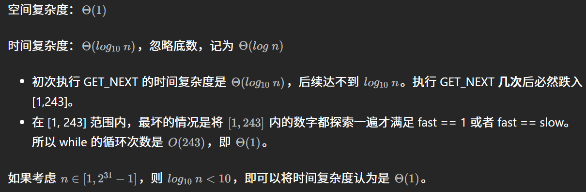

## [454. 四数相加 II](https://leetcode.cn/problems/4sum-ii/)

给你四个整数数组 `nums1`、`nums2`、`nums3` 和 `nums4` ，数组长度都是 `n` ，请你计算有多少个元组 `(i, j, k, l)` 能满足：

- `0 <= i, j, k, l < n`
- `nums1[i] + nums2[j] + nums3[k] + nums4[l] == 0`

**示例 1：**

```
输入：nums1 = [1,2], nums2 = [-2,-1], nums3 = [-1,2], nums4 = [0,2]
输出：2
解释：
两个元组如下：
1. (0, 0, 0, 1) -> nums1[0] + nums2[0] + nums3[0] + nums4[1] = 1 + (-2) + (-1) + 2 = 0
2. (1, 1, 0, 0) -> nums1[1] + nums2[1] + nums3[0] + nums4[0] = 2 + (-1) + (-1) + 0 = 0
```

**示例 2：**

```
输入：nums1 = [0], nums2 = [0], nums3 = [0], nums4 = [0]
输出：1
```

 **提示：**

- `n == nums1.length`
- `n == nums2.length`
- `n == nums3.length`
- `n == nums4.length`
- `1 <= n <= 200`
- `-228 <= nums1[i], nums2[i], nums3[i], nums4[i] <= 228`

**方法一 暴力**

```c++
class Solution {
public:
    int fourSumCount(vector<int>& nums1, vector<int>& nums2, vector<int>& nums3, vector<int>& nums4) {
        int cnt = 0;
        for(auto num1:nums1)
        {
            for(auto num2:nums2)
            {
                for(auto num3:nums3)
                {
                    int target = -(num1+num2+num3);
                    //std::cout<<target<<"here"<<std::endl;
                    multiset<int> set(nums4.begin(),nums4.end());
                    cnt += set.count(target);
                }
            }
        }
        return cnt;
    }
};
```

**方法二 分组 + 哈希表**

我们可以将四个数组分成两部分，$A$ 和 $B$ 为一组，$C$ 和 $D$ 为另外一组。

对于 $A$ 和 $B$，我们使用二重循环对它们进行遍历，得到所有 $A[i]+B[j]$ 的值并存入哈希映射中。对于哈希映射中的每个键值对，每个键表示一种 $A[i]+B[j]$，对应的值为 $A[i]+B[j]$ 出现的次数。

对于 $C$ 和 $D$，我们同样使用二重循环对它们进行遍历。当遍历到 $C[k]+D[l]$ 时，如果 $−(C[k]+D[l])$ 出现在哈希映射中，那么将 $−(C[k]+D[l]) $对应的值累加进答案中。

最终即可得到满足 $A[i]+B[j]+C[k]+D[l]=0$ 的四元组数目。

为什么使用 `unordered_map` 而不是 `multiset`？

- **查找效率**：`unordered_map` 的平均查找时间为 O(1)，而 `multiset` 的查找时间为 O(log n)。
- **计数方便**：`unordered_map` 可以直接存储和的出现次数，而 `multiset` 需要额外的 `count()` 操作，效率较低。
- 使用`multiset`会导致重复计算，因为`multiset`允许重复元素，而你需要的是统计每个和的出现次数。

```c++
class Solution {
public:
    int fourSumCount(vector<int>& nums1, vector<int>& nums2, vector<int>& nums3, vector<int>& nums4) {
        int cnt = 0;
        unordered_map<int,int> map;
        for(auto& num1:nums1)
        {
            for(auto& num2:nums2)
            {
                map[num1+num2]++;
            }
        }

        for(auto& num3:nums3)
        {
            for(auto& num4:nums4)
            {
                int target = -(num3+num4);
                //if(map[target] != 0)
                if(map.find(target) != map.end())
                {
                    cnt += map[target];
                }
            }
        }
        return cnt;
    }
};
```

时间复杂度：$O(n^2)$。我们使用了两次二重循环，时间复杂度均为 $O(n^2)$。在循环中对哈希映射进行的修改以及查询操作的期望时间复杂度均为$O(1)$，因此总时间复杂度为 $O(n^2)$。

空间复杂度：$O(n^2)$，即为哈希映射需要使用的空间。在最坏的情况下，$A[i]+B[j]$ 的值均不相同，因此值的个数为 $n^2$，也就需要 $O(n^2)$的空间。

## [15. 三数之和](https://leetcode.cn/problems/3sum/)

给你一个整数数组 `nums` ，判断是否存在三元组 `[nums[i], nums[j], nums[k]]` 满足 `i != j`、`i != k` 且 `j != k` ，同时还满足 `nums[i] + nums[j] + nums[k] == 0` 。请你返回所有和为 `0` 且不重复的三元组。

**注意：**答案中不可以包含重复的三元组。

**示例 1：**

```
输入：nums = [-1,0,1,2,-1,-4]
输出：[[-1,-1,2],[-1,0,1]]
解释：
nums[0] + nums[1] + nums[2] = (-1) + 0 + 1 = 0 。
nums[1] + nums[2] + nums[4] = 0 + 1 + (-1) = 0 。
nums[0] + nums[3] + nums[4] = (-1) + 2 + (-1) = 0 。
不同的三元组是 [-1,0,1] 和 [-1,-1,2] 。
注意，输出的顺序和三元组的顺序并不重要。
```

**示例 2：**

```
输入：nums = [0,1,1]
输出：[]
解释：唯一可能的三元组和不为 0 。
```

**示例 3：**

```
输入：nums = [0,0,0]
输出：[[0,0,0]]
解释：唯一可能的三元组和为 0 。
```

**提示：**

- `3 <= nums.length <= 3000`
- `-105 <= nums[i] <= 105`

**方法一 哈希**

参考两数之和的思路，枚举 + Hash，这不过这次要枚举两个数了

> 目标：找出所有满足 nums[i] + nums[j] + nums[k] = 0 的三元组，且 i, j, k 三个下标互不相同。

> 核心点：

> 我们只关心数字的值和组合，不关心下标具体顺序；

> 不能使用同一个元素两次（下标不同）；

> 要去重，避免输出重复三元组。

> 具体做法：

> 用一个哈希表 map 来存储数字和它出现的下标（这里选择第一次出现的下标，因为就算出现多次，也不能有重复的三元组）；

> 双层循环枚举两个数 nums[i] 和 nums[j]；

> 计算第三个数 c = -(nums[i] + nums[j])；

> 检查哈希表中是否存在 c，且对应的下标 k 与 i、j 不同（避免重复使用同一个元素）；

> 找到三元组后，将其排序，放入 Set 里去重。

并且可以进行一些剪枝操作，降低时间复杂度。

```c++
class Solution {
public:
    vector<vector<int>> threeSum(vector<int>& nums) {
        set<vector<int>> result;
        unordered_map<int,int> map;
        sort(nums.begin(),nums.end());

        //map-key:值
        //map-val:索引
        for(int i = 0;i<nums.size();i++)
        {
            map[nums[i]] = i;
        }

        for(int i = 0;i<nums.size();i++)
        {
            if(nums[0]>0) break;
            if(i>=1 && nums[i] == nums[i-1]) continue;

            for(int j = i+1;j<nums.size();j++)
            {
                if(j > i + 1 && nums[j] == nums[j-1]) continue;
                int target = -(nums[i]+nums[j]);
                auto it = map.find(target); //找的是键
                if(it != map.end())
                {
                    int k = it->second;
                    if(i!=k && j!=k)
                    {
                        vector<int> res = {nums[i],nums[j],nums[k]};
                        sort(res.begin(),res.end());// 对三元组排序
                        result.insert(res);// 加到set去重
                    }
                }
            }
        }
        return vector<vector<int>>(result.begin(),result.end());
    }
};// @lc code=end
```

+ 时间复杂度：$O(n²  log3) ≈ O(n²)$，双层循环是$ O(n²)$，sort 对 3 个元素排序是常数时间，哈希查找是 $O(1) $平均复杂度
+ 空间复杂度：$O(n)$，哈希表存储数字和对应下标，结果集合存储去重后的三元组

**方法二 排序 + 双指针**

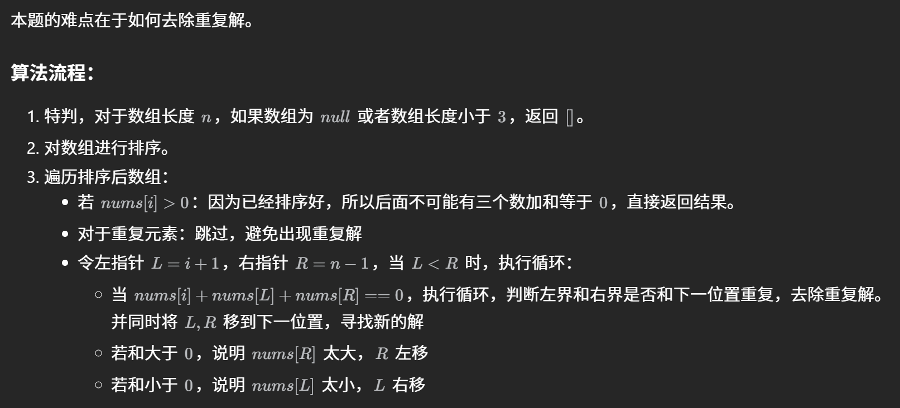

```c++
class Solution {
public:
    vector<vector<int>> threeSum(vector<int>& nums) {
        vector<vector<int>> res;
        sort(nums.begin(),nums.end());

        int n = nums.size();

        for(int i = 0;i<n-2;i++)
        {
            if (i > 0 && nums[i] == nums[i-1]) continue; // 跳过重复元素
            int left = i + 1;
            int right = n -1;
            int target = -nums[i];

            while(left<right)
            {
                int sum = nums[left] + nums[right];
                if(sum == target)
                {
                    res.push_back({nums[i],nums[left],nums[right]});
                    // 跳过重复元素
                    while(left<right && nums[left]==nums[left+1]) left++;
                    while(left<right && nums[right]==nums[right-1]) right--;
                    left++;
                    right--;
                }
                else if(sum<target)
                {
                    left++;
                }
                else if(sum>target)
                {
                    right--;
                }

            }
        }
        return res;
    }
};// @lc code=end
```

+ 时间复杂度：$O(n^2)$，数组排序 $O(NlogN)$，遍历数组 $O(n)$，双指针遍历 $O(n)$，总体 $O(NlogN)+O(n)∗O(n)$，$O(n^2)$
+ 空间复杂度：$O(1)$

## 总结篇

### 哈希表理论基础

**一般来说哈希表都是用来快速判断一个元素是否出现集合里**。

对于哈希表，要知道**哈希函数**和**哈希碰撞**在哈希表中的作用。

哈希函数是把传入的key映射到符号表的索引上。

哈希碰撞处理有多个key映射到相同索引上时的情景，处理碰撞的普遍方式是拉链法和线性探测法。

接下来是常见的三种哈希结构：

- 数组
- set（集合）
- map（映射）

在C++语言中，set 和 map 都分别提供了三种数据结构，每种数据结构的底层实现和用途都有所不同。

例如什么时候用std::set，什么时候用std::multiset，什么时候用std::unordered_set，都是很有考究的。

**只有对这些数据结构的底层实现很熟悉，才能灵活使用，否则很容易写出效率低下的程序**。

###  哈希表经典题目

#### 数组作为哈希表

一些应用场景就是为数组量身定做的。

在[242.有效的字母异位词](https://programmercarl.com/0242.有效的字母异位词.html)中，我们提到了数组就是简单的哈希表，但是数组的大小是受限的！

这道题目包含小写字母，那么使用数组来做哈希最合适不过。

在[383.赎金信](https://programmercarl.com/0383.赎金信.html)中同样要求只有小写字母，那么就给我们浓浓的暗示，用数组！

本题和[242.有效的字母异位词](https://programmercarl.com/0242.有效的字母异位词.html)很像，[242.有效的字母异位词)](https://programmercarl.com/0242.有效的字母异位词.html)是求 字符串a 和 字符串b 是否可以相互组成，在[383.赎金信](https://programmercarl.com/0383.赎金信.html)中是求字符串a能否组成字符串b，而不用管字符串b 能不能组成字符串a。

一些同学可能想，用数组干啥，都用map不就完事了。

**上面两道题目用map确实可以，但使用map的空间消耗要比数组大一些，因为map要维护红黑树或者符号表，而且还要做哈希函数的运算。所以数组更加简单直接有效！**

#### set作为哈希表

在[349. 两个数组的交集中我们给出了什么时候用数组就不行了，需要用set。

这道题目没有限制数值的大小，就无法使用数组来做哈希表了。

**主要因为如下两点：**

- 数组的大小是有限的，受到系统栈空间（不是数据结构的栈）的限制。
- 如果数组空间够大，但哈希值比较少、特别分散、跨度非常大，使用数组就造成空间的极大浪费。

所以此时一样的做映射的话，就可以使用set了。

关于set，C++ 给提供了如下三种可用的数据结构：

- std::set
- std::multiset
- std::unordered_set

std::set和std::multiset底层实现都是红黑树，std::unordered_set的底层实现是哈希， 使用unordered_set 读写效率是最高的，本题并不需要对数据进行排序，而且还不要让数据重复，所以选择unordered_set。

在[202.快乐数](https://programmercarl.com/0202.快乐数.html)中，我们再次使用了unordered_set来判断一个数是否重复出现过。

#### map作为哈希表

在[1.两数之和](https://programmercarl.com/0001.两数之和.html)中map正式登场。

来说一说：使用数组和set来做哈希法的局限。

- 数组的大小是受限制的，而且如果元素很少，而哈希值太大会造成内存空间的浪费。
- set是一个集合，里面放的元素只能是一个key，而两数之和这道题目，不仅要判断y是否存在而且还要记录y的下标位置，因为要返回x 和 y的下标。所以set 也不能用。

map是一种`<key, value>`的结构，本题可以用key保存数值，用value在保存数值所在的下标。所以使用map最为合适。

C++提供如下三种map：

- std::map
- std::multimap
- std::unordered_map

std::unordered_map 底层实现为哈希，std::map 和std::multimap 的底层实现是红黑树。

同理，std::map 和std::multimap 的key也是有序的（这个问题也经常作为面试题，考察对语言容器底层的理解），[1.两数之和](https://programmercarl.com/0001.两数之和.html)中并不需要key有序，选择std::unordered_map 效率更高！

在[454.四数相加](https://programmercarl.com/0454.四数相加II.html)中我们提到了其实需要哈希的地方都能找到map的身影。

本题咋眼一看好像和[18. 四数之和](https://programmercarl.com/0018.四数之和.html)，[15.三数之和](https://programmercarl.com/0015.三数之和.html)差不多，其实差很多！

**关键差别是本题为四个独立的数组，只要找到A[i] + B[j] + C[k] + D[l] = 0就可以，不用考虑重复问题，而[18. 四数之和](https://programmercarl.com/0018.四数之和.html)，[15.三数之和](https://programmercarl.com/0015.三数之和.html)是一个数组（集合）里找到和为0的组合，可就难很多了！**

用哈希法解决了两数之和，很多同学会感觉用哈希法也可以解决三数之和，四数之和。

其实是可以解决，但是非常麻烦，需要去重导致代码效率很低。

在[15.三数之和](https://programmercarl.com/0015.三数之和.html)中我给出了哈希法和双指针两个解法，大家就可以体会到，使用哈希法还是比较麻烦的。

所以18. 四数之和，15.三数之和都推荐使用双指针法！

### 总结

对于哈希表的知识相信很多同学都知道，但是没有成体系。

本篇我们从哈希表的理论基础到数组、set和map的经典应用，把哈希表的整个全貌完整的呈现给大家。

**同时也强调虽然map是万能的，详细介绍了什么时候用数组，什么时候用set**。

相信通过这个总结篇，大家可以对哈希表有一个全面的了解。

# 字符串

## [344. 反转字符串](https://leetcode.cn/problems/reverse-string/)

编写一个函数，其作用是将输入的字符串反转过来。输入字符串以字符数组 `s` 的形式给出。

不要给另外的数组分配额外的空间，你必须**[原地](https://baike.baidu.com/item/原地算法)修改输入数组**、使用 O(1) 的额外空间解决这一问题。

**示例 1：**

```
输入：s = ["h","e","l","l","o"]
输出：["o","l","l","e","h"]
```

**示例 2：**

```
输入：s = ["H","a","n","n","a","h"]
输出：["h","a","n","n","a","H"]
```

**提示：**

- `1 <= s.length <= 105`
- `s[i]` 都是 [ASCII](https://baike.baidu.com/item/ASCII) 码表中的可打印字符

```c++
class Solution
{
public:
    void reverseString(vector<char> &s)
    {
        int i = 0, j = s.size() - 1;
        while (i < j)
        {
            swap(s[i++], s[j--]);
        }
    }
};
```

- 时间复杂度: O(n)
- 空间复杂度: O(1)

在 C++ 中，`std::reverse`是一个用于反转序列的算法，定义在 `<algorithm>`头文件中。它的作用是 **反转指定范围内的元素顺序**。

```c++
template <class BidirIt>
void reverse(BidirIt first, BidirIt last);
```

- **`first`**：指向要反转序列的起始位置的迭代器（包含）。
- **`last`**：指向要反转序列的结束位置的迭代器（**不包含**）。

## [541. 反转字符串 II](https://leetcode.cn/problems/reverse-string-ii/)

给定一个字符串 `s` 和一个整数 `k`，从字符串开头算起，每计数至 `2k` 个字符，就反转这 `2k` 字符中的前 `k` 个字符。

- 如果剩余字符少于 `k` 个，则将剩余字符全部反转。
- 如果剩余字符小于 `2k` 但大于或等于 `k` 个，则反转前 `k` 个字符，其余字符保持原样。

**示例 1：**

```
输入：s = "abcdefg", k = 2
输出："bacdfeg"
```

**示例 2：**

```
输入：s = "abcd", k = 2
输出："bacd"
```

**提示：**

- `1 <= s.length <= 104`
- `s` 仅由小写英文组成
- `1 <= k <= 104`

这题其实就两种情况：

+ 如果剩余字符少于 `k` 个，则将剩余字符全部反转。
+ 如果剩余字符小于 `2k` 但大于或等于 `k` 个，则反转前 `k` 个字符，其余字符保持原样。

这道题目其实也是模拟，实现题目中规定的反转规则就可以了。

其实在遍历字符串的过程中，只要让 i += (2 * k)，i 每次移动 2 * k 就可以了，然后判断是否需要有反转的区间。

因为要找的也就是每2 * k 区间的起点，这样写，程序会高效很多。

**所以当需要固定规律一段一段去处理字符串的时候，要想想在for循环的表达式上做做文章**

```c++
class Solution
{
public:
    string reverseStr(string s, int k)
    {
        for (int i = 0; i < s.size(); i += 2 * k)
        {
            // 1. 每隔 2k 个字符的前 k 个字符进行反转
            // 2. 剩余字符小于 2k 但大于或等于 k 个，则反转前 k 个字符
            if (i + k <= s.size())
            {
                reverse(s.begin() + i, s.begin() + i + k);
            }
            // 3. 剩余字符少于 k 个，则将剩余字符全部反转。
            else
            {
                reverse(s.begin() + i, s.end());
            }
        }
        return s;
    }
};
```

- 时间复杂度: O(n)
- 空间复杂度: O(1)

**另一种思路的解法**

```c++
class Solution
{
public:
    string reverseStr(string s, int k)
    {
        int n = s.size();
        int pos = 0;
        while (pos < n)
        {
            if (pos + k < n)
            {
                reverse(s.begin() + pos, s.begin() + pos + k);
                pos += 2 * k;
            }
            else
            {
                reverse(s.begin() + pos, s.end());
                break;
            }
        }
        return s;
    }
};
```

- 时间复杂度: O(n)
- 空间复杂度: O(1)

## [54. 替换数字](https://kamacoder.com/problempage.php?pid=1064)

给定一个字符串 s，它包含小写字母和数字字符，请编写一个函数，将字符串中的字母字符保持不变，而将每个数字字符替换为number。 例如，对于输入字符串 "a1b2c3"，函数应该将其转换为 "anumberbnumbercnumber"。

**引入额外空间**

```c++
#include <string>
#include <iostream>
using namespace std;

bool check(char c)
{
    if (c >= 'a' && c <= 'z')
        return true;
    return false;
}

int main()
{
    string str;
    cin >> str;

    string result;

    for (auto &c : str)
    {
        if (check(c))
            result += c;
        else
            result += "number";
    }
    cout << result;

    return 0;
}
```

- 时间复杂度：O(n)
- 空间复杂度：O(n)

**用库函数**

```c++
#include<iostream>
using namespace std;
#include<string>

int main() {
    string str;
    cin >> str;
    for (int i = 0; i < str.size(); i++) {
        if (str[i] < 'a') {
            str.replace(i, 1, "number");
            i += 5;
        }
    }
    cout << str;
    return 0;
}
```

- 时间复杂度：O(n)
- 空间复杂度：O(n)

如果想把这道题目做到极致，就不要只用额外的辅助空间了！

首先扩充数组到每个数字字符替换成 "number" 之后的大小。

例如 字符串 "a5b" 的长度为3，那么 将 数字字符变成字符串 "number" 之后的字符串为 "anumberb" 长度为 8。

然后从后向前替换数字字符，也就是双指针法，过程如下：i指向新长度的末尾，j指向旧长度的末尾。

有同学问了，为什么要从后向前填充，从前向后填充不行么？

从前向后填充就是O(n^2)的算法了，因为每次添加元素都要将添加元素之后的所有元素整体向后移动。

**其实很多数组填充类的问题，其做法都是先预先给数组扩容带填充后的大小，然后在从后向前进行操作。**

这么做有两个好处：

1. 不用申请新数组。
2. 从后向前填充元素，避免了从前向后填充元素时，每次添加元素都要将添加元素之后的所有元素向后移动的问题。

```c++
#include <string>
#include <iostream>
using namespace std;

bool check(char c)
{
    if (c >= '1' && c <= '9')
        return true;
    return false;
}

int count(string str)
{
    int cnt = 0;
    for (auto &c : str)
    {
        if (c >= '1' && c <= '9')
            cnt++;
    }
    return cnt;
}

int main()
{
    string str;
    cin >> str;

    int cnt = count(str);
    int sOldIdx = str.size() - 1;
	
    // 扩充字符串s的大小，也就是将每个数字替换成"number"之后的大小
    str.resize(str.size() + cnt * 5);

    int sNewIdx = str.size() - 1;

    // 从后往前将数字替换为"number"
    while (sOldIdx >= 0)
    {
        if (check(str[sOldIdx]))
        {
            str[sNewIdx--] = 'r';
            str[sNewIdx--] = 'e';
            str[sNewIdx--] = 'b';
            str[sNewIdx--] = 'm';
            str[sNewIdx--] = 'u';
            str[sNewIdx--] = 'n';
        }
        else
        {
            str[sNewIdx--] = str[sOldIdx];
        }
        sOldIdx--;
    }

    cout << str << endl;

    return 0;
}
```

- 时间复杂度：O(n)
- 空间复杂度：O(1)

## [55. 右旋字符串](https://kamacoder.com/problempage.php?pid=1065)

字符串的右旋转操作是把字符串尾部的若干个字符转移到字符串的前面。给定一个字符串 s 和一个正整数 k，请编写一个函数，将字符串中的后面 k 个字符移到字符串的前面，实现字符串的右旋转操作。输入共包含两行，第一行为一个正整数 k，代表右旋转的位数。第二行为字符串 s，代表需要旋转的字符串。 

例如，对于输入字符串 "abcdefg" 和整数 2，函数应该将其转换为 "fgabcde"。

为了让本题更有意义，提升一下本题难度：**不能申请额外空间，只能在本串上操作**。

不能使用额外空间的话，模拟在本串操作要实现右旋转字符串的功能还是有点困难的。

思路就是 通过 整体倒叙，把两段子串顺序颠倒，两个段子串里的的字符在倒叙一把，**负负得正**，这样就不影响子串里面字符的顺序了。

```c++
#include <string>
#include <iostream>
using namespace std;
int main()
{
    string str;
    int n;
    cin >> n >> str;

    // 整体翻转
    reverse(str.begin(), str.end());
    // 翻转左边的部分，原字符串中的后面k个
    reverse(str.begin(), str.begin() + n);
    // 翻转右边的部分，原字符串中的后面n-k个
    reverse(str.begin() + n, str.end());
    
    cout << str << endl;
    return 0;
}
```

## [28. 找出字符串中第一个匹配项的下标](https://leetcode.cn/problems/find-the-index-of-the-first-occurrence-in-a-string/)

给你两个字符串 `haystack` 和 `needle` ，请你在 `haystack` 字符串中找出 `needle` 字符串的第一个匹配项的下标（下标从 0 开始）。如果 `needle` 不是 `haystack` 的一部分，则返回 `-1` 。

**示例 1：**

```
输入：haystack = "sadbutsad", needle = "sad"
输出：0
解释："sad" 在下标 0 和 6 处匹配。
第一个匹配项的下标是 0 ，所以返回 0 。
```

**示例 2：**

```
输入：haystack = "leetcode", needle = "leeto"
输出：-1
解释："leeto" 没有在 "leetcode" 中出现，所以返回 -1 。
```

**提示：**

- `1 <= haystack.length, needle.length <= 104`
- `haystack` 和 `needle` 仅由小写英文字符组成

**该题是经典的KMP算法**

在C++中，可以使用标准库中的 `std::string::find`函数来直接解决这个问题。`find`函数会返回子字符串第一次出现的位置，如果没有找到则返回 `std::string::npos`

```c++
class Solution
{
public:
    int strStr(string haystack, string needle)
    {
        if (haystack.size() < needle.size())
            return -1;

        int pos = haystack.find(needle);
        if (pos != std::string::npos)
            return pos;
        else
            return -1;
    }
};
```

## [459. 重复的子字符串](https://leetcode.cn/problems/repeated-substring-pattern/)

给定一个非空的字符串 `s` ，检查是否可以通过由它的一个子串重复多次构成。

**示例 1:**

```
输入: s = "abab"
输出: true
解释: 可由子串 "ab" 重复两次构成。
```

**示例 2:**

```
输入: s = "aba"
输出: false
```

**示例 3:**

```
输入: s = "abcabcabcabc"
输出: true
解释: 可由子串 "abc" 重复四次构成。 (或子串 "abcabc" 重复两次构成。)
```

**提示：**

- `1 <= s.length <= 104`
- `s` 由小写英文字母组成

当一个字符串s：abcabc，内部由重复的子串组成，那么这个字符串的结构一定是这样的：

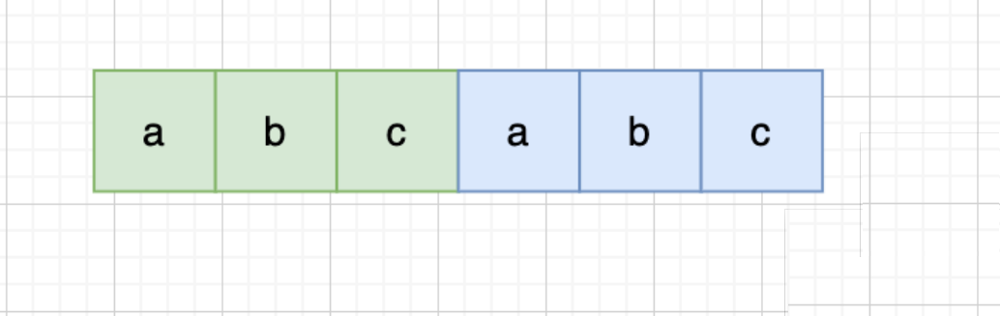

也就是由前后相同的子串组成。

那么既然前面有相同的子串，后面有相同的子串，用 s + s，这样组成的字符串中，后面的子串做前串，前面的子串做后串，就一定还能组成一个s，如图：

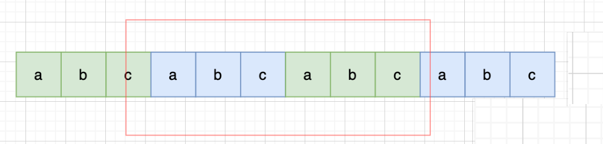

当然，我们在判断 s + s 拼接的字符串里是否出现一个s的的时候，**要刨除 s + s 的首字符和尾字符**，这样避免在s+s中搜索出原来的s，我们要搜索的是中间拼接出来的s。

```c++
class Solution
{
public:
    bool repeatedSubstringPattern(string s)
    {
        string t = s + s;
        t.erase(t.begin());
        t.erase(t.end() - 1);
        if (t.find(s) != std::string::npos)
            return true;
        return false;
    }
};
```

- 时间复杂度: O(n)
- 空间复杂度: O(1)

## [205. 同构字符串](https://leetcode.cn/problems/isomorphic-strings/)

给定两个字符串 `s` 和 `t` ，判断它们是否是同构的。

如果 `s` 中的字符可以按某种映射关系替换得到 `t` ，那么这两个字符串是同构的。

每个出现的字符都应当映射到另一个字符，同时不改变字符的顺序。不同字符不能映射到同一个字符上，相同字符只能映射到同一个字符上，字符可以映射到自己本身。

**示例 1:**

```
输入：s = "egg", t = "add"
输出：true
```

**示例 2：**

```
输入：s = "foo", t = "bar"
输出：false
```

**示例 3：**

```
输入：s = "paper", t = "title"
输出：true
```

**提示：**

- `1 <= s.length <= 5 * 104`
- `t.length == s.length`
- `s` 和 `t` 由任意有效的 ASCII 字符组成

用 **两个哈希表** 分别记录：

1. **s → t 的映射**（确保 `s`的每个字符**唯一对应** `t`的一个字符）
2. **t → s 的映射**（确保 `t`的每个字符**唯一对应** `s`的一个字符）

> 必须同时维护这两个映射，才能保证 **双向唯一性**，避免“一对多”或“多对一”的情况。

1. **只检查单向映射**：`s = "badc"`, `t = "baba"`，如果只检查 `s → t`，会认为 `b→b, a→a, d→b, c→a`是合法的，但实际上 `t`的 `a`被多个字符映射，不同构。
2. **忽略长度不等的情况**：如果 `s`和 `t`长度不同，直接返回 `false`。

```c++
class Solution
{
public:
    bool isIsomorphic(string s, string t)
    {
        if (s.size() != t.size())
        {
            return false;
        }

        unordered_map<char, char> hash1, hash2;
        for (int i = 0; i < s.size(); i++)
        {
            char a = s[i], b = t[i];
            if (hash1.count(a) && hash1[a] != b)
            {
                return false;
            }
            if (hash2.count(b) && hash2[b] != a)
            {
                return false;
            }
            hash1[a] = b;
            hash2[b] = a;
        }
        return true;
    }
};
```

# 双指针

## [27. 移除元素](https://leetcode.cn/problems/remove-element/)

给你一个数组 `nums` 和一个值 `val`，你需要 **[原地](https://baike.baidu.com/item/原地算法)** 移除所有数值等于 `val` 的元素。元素的顺序可能发生改变。然后返回 `nums` 中与 `val` 不同的元素的数量。

假设 `nums` 中不等于 `val` 的元素数量为 `k`，要通过此题，您需要执行以下操作：

- 更改 `nums` 数组，使 `nums` 的前 `k` 个元素包含不等于 `val` 的元素。`nums` 的其余元素和 `nums` 的大小并不重要。
- 返回 `k`。

**方法一 覆盖法**

```c++
class Solution
{
public:
    int removeElement(vector<int> &nums, int val)
    {
        int slow = 0;
        for (int fast = 0; fast < nums.size(); ++fast)
        {
            if (nums[fast] != val)
            {
                swap(nums[slow++], nums[fast]);
            }
        }
        return slow;
    }
};
```

- `fast`遍历所有元素
- 如果 `nums[fast] != val`，则将其复制到 `nums[slow]`，并移动 `slow`
- 最终 `slow`就是新数组的长度

**方法 2：交换法（不要求顺序）**

```c++
class Solution
{
public:
    int removeElement(vector<int> &nums, int val)
    {
        int left = 0, right = nums.size();
        while(left<right)
        {
            if(nums[left] == val)
            {
                swap(nums[left],nums[right-1]);
                right--;
            }
            else
            {
                left++;
            }

        }
        return left;
    }
};
```

- **覆盖法**（`nums[slow] = nums[fast]`）保证顺序，但可能需要更多赋值操作。
- **交换法**（`swap(nums[left], nums[right - 1])`）不保证顺序，但赋值次数更少（适合 `val`较少的情况）。

## [19. 删除链表的倒数第 N 个结点](https://leetcode.cn/problems/remove-nth-node-from-end-of-list/)

给你一个链表，删除链表的倒数第 `n` 个结点，并且返回链表的头结点。

**示例 1：**


```
输入：head = [1,2,3,4,5], n = 2
输出：[1,2,3,5]
```

**示例 2：**

```
输入：head = [1], n = 1
输出：[]
```

**示例 3：**

```
输入：head = [1,2], n = 1
输出：[1]
```

**提示：**

- 链表中结点的数目为 `sz`
- `1 <= sz <= 30`
- `0 <= Node.val <= 100`
- `1 <= n <= sz`

**进阶：**你能尝试使用一趟扫描实现吗？

```c++
class Solution
{
public:
    ListNode *removeNthFromEnd(ListNode *head, int n)
    {
        auto dummpyNode = new ListNode(0, head);

        auto slow = dummpyNode;
        auto fast = dummpyNode;
        
        while(n-- && fast)
        {
            fast = fast->next;
        }

        while(fast->next)
        {
            fast = fast->next;
            slow = slow->next;
        }

        slow->next = slow->next->next;
        return dummpyNode->next;
    }
};
```

# 栈与队列

队列是先进先出，栈是先进后出。

## [232. 用栈实现队列](https://leetcode.cn/problems/implement-queue-using-stacks/)

请你仅使用两个栈实现先入先出队列。队列应当支持一般队列支持的所有操作（`push`、`pop`、`peek`、`empty`）：

实现 `MyQueue` 类：

- `void push(int x)` 将元素 x 推到队列的末尾
- `int pop()` 从队列的开头移除并返回元素
- `int peek()` 返回队列开头的元素
- `boolean empty()` 如果队列为空，返回 `true` ；否则，返回 `false`

**说明：**

- 你 **只能** 使用标准的栈操作 —— 也就是只有 `push to top`, `peek/pop from top`, `size`, 和 `is empty` 操作是合法的。
- 你所使用的语言也许不支持栈。你可以使用 list 或者 deque（双端队列）来模拟一个栈，只要是标准的栈操作即可。

使用栈来模拟队列的行为，如果仅仅用一个栈，是一定不行的，所以需要两个栈**一个输入栈，一个输出栈**，这里要注意输入栈和输出栈的关系。

- **栈A（输入栈）**：专门处理入队操作，直接压入元素。
- **栈B（输出栈）**：专门处理出队操作。当栈B为空时，将栈A的所有元素依次弹出并压入栈B，此时栈B的栈顶即为队列的队首。

```c++
class MyQueue
{
private:
    stack<int> inStack;
    stack<int> outStack;

public:
    MyQueue()
    {
    }

    void push(int x)
    {
        inStack.push(x);
    }

    void transfer()
    {
        while (!inStack.empty())
        {
            int val = inStack.top();
            outStack.push(val);
            inStack.pop();
        }
    }

    int pop()
    {
        if (outStack.empty())
        {
            transfer();
        }
        int val = outStack.top();
        outStack.pop();
        return val;
    }

    int peek()
    {
        if (outStack.empty())
        {
            transfer();
        }
        return outStack.top();
    }

    bool empty()
    {
        if (inStack.empty() && outStack.empty())
            return true;
        return false;
    }
};
```

- 时间复杂度: 都为O(1)。pop和peek看起来像O(n)，实际上一个循环n会被使用n次，最后还是O(1)。
- 空间复杂度: O(n)

## [225. 用队列实现栈](https://leetcode.cn/problems/implement-stack-using-queues/)

请你仅使用两个队列实现一个后入先出（LIFO）的栈，并支持普通栈的全部四种操作（`push`、`top`、`pop` 和 `empty`）。

实现 `MyStack` 类：

- `void push(int x)` 将元素 x 压入栈顶。
- `int pop()` 移除并返回栈顶元素。
- `int top()` 返回栈顶元素。
- `boolean empty()` 如果栈是空的，返回 `true` ；否则，返回 `false` 。

**注意：**

- 你只能使用队列的标准操作 —— 也就是 `push to back`、`peek/pop from front`、`size` 和 `is empty` 这些操作。
- 你所使用的语言也许不支持队列。 你可以使用 list （列表）或者 deque（双端队列）来模拟一个队列 , 只要是标准的队列操作即可。

使用两个队列，`q1`作为主工作队列，`q2`作为辅助队列。

**push操作设计**：

- 新元素总是先放入辅助队列`q2`
- 将`q1`的所有元素转移到`q2`后面（保持原有顺序）
- 交换两个队列的角色，使得：
  - `q1`的队首始终是最后插入的元素（模拟栈顶）
  - `q2`变为空队列，准备下次操作

**pop/top操作优化**：

- 由于push操作已经维护了正确的元素顺序
- 直接操作`q1`的队首即可实现O(1)时间的栈操作

```c++
class MyStack
{
private:
    queue<int> q1;// 主队列，用于存储栈元素
    queue<int> q2;// 辅助队列，用于临时操作

public:
    MyStack()
    {
    }

    void push(int x)
    {
        // 先将新元素放入空队列q2
        q2.push(x);

        // 将q1中的所有元素依次转移到q2
        // 这样新元素x就会位于队列前端
        while (!q1.empty())
        {
            q2.push(q1.front());
            q1.pop();
        }

        // 交换q1和q2，使得q1始终是主队列
        // 此时q1的队首就是栈顶元素
        swap(q1, q2);
    }

    int pop()
    {
        int val = q1.front();
        q1.pop();
        return val;
    }

    int top()
    {
        return q1.front();
    }

    bool empty()
    {
        return q1.empty() && q2.empty();
    }
};
```

**单队列 + 循环移动**

**push操作设计**

1. 先将新元素 `x`入队。
2. 然后将队列中 **`x`之前的所有元素** 依次出队并重新入队（循环移动 `size-1`次）。
   - **效果**：新元素 `x`被移动到队首（相当于栈顶）。
   - **时间复杂度**：`push`为 O(n)，`pop/top`为 O(1)。

```c++
class MyStack
{
private:
    queue<int> q;

public:
    MyStack()
    {
    }

    void push(int x)
    {
        q.push(x);
        // 将新元素 x 之前的所有元素移到它后面
        for (int i = 0; i < q.size() - 1; i++)
        {
            q.push(q.front());
            q.pop();
        }
    }

    int pop()
    {
        int val = q.front();
        q.pop();
        return val;
    }

    int top()
    {
        return q.front();
    }

    bool empty()
    {
        return q.empty();
    }
};
```

## [20. 有效的括号](https://leetcode.cn/problems/valid-parentheses/)

给定一个只包括 `'('`，`')'`，`'{'`，`'}'`，`'['`，`']'` 的字符串 `s` ，判断字符串是否有效。

有效字符串需满足：

1. 左括号必须用相同类型的右括号闭合。
2. 左括号必须以正确的顺序闭合。
3. 每个右括号都有一个对应的相同类型的左括号。

**括号匹配是使用栈解决的经典问题。**

题意其实就像我们在写代码的过程中，要求括号的顺序是一样的，有左括号，相应的位置必须要有右括号。

由于栈结构的特殊性，非常适合做对称匹配类的题目。

首先要弄清楚，字符串里的括号不匹配有几种情况。

建议在写代码之前要分析好有哪几种不匹配的情况，如果不在动手之前分析好，写出的代码也会有很多问题。

先来分析一下 这里有三种不匹配的情况，

第一种情况：已经遍历完了字符串，但是栈不为空，说明有相应的左括号没有右括号来匹配，所以return false

第二种情况：遍历字符串匹配的过程中，发现栈里没有要匹配的字符。所以return false

第三种情况：遍历字符串匹配的过程中，栈已经为空了，没有匹配的字符了，说明右括号没有找到对应的左括号return false

那么什么时候说明左括号和右括号全都匹配了呢，就是字符串遍历完之后，栈是空的，就说明全都匹配了。

```c++
class Solution
{
public:
    bool isValid(string s)
    {
        stack<char> stack;

        for (auto &c : s)
        {
            if (c == '(' || c == '{' || c == '[')
            {
                stack.push(c);
            }
            else
            {
                if (stack.empty()) return false; // 栈为空但遇到右括号
                auto top = stack.top();
                if ((top == '(' && c == ')') || (top == '{' && c == '}') || (top == '[' && c == ']'))
                {
                    stack.pop();
                }
                else
                {
                    return false;
                }
            }
        }
        return stack.empty();
    }
};
```

- 时间复杂度: O(n)
- 空间复杂度: O(n)

## [1047. 删除字符串中的所有相邻重复项](https://leetcode.cn/problems/remove-all-adjacent-duplicates-in-string/)

给出由小写字母组成的字符串 `s`，**重复项删除操作**会选择两个相邻且相同的字母，并删除它们。

在 `s` 上反复执行重复项删除操作，直到无法继续删除。

在完成所有重复项删除操作后返回最终的字符串。答案保证唯一。

**示例：**

```
输入："abbaca"
输出："ca"
解释：
例如，在 "abbaca" 中，我们可以删除 "bb" 由于两字母相邻且相同，这是此时唯一可以执行删除操作的重复项。之后我们得到字符串 "aaca"，其中又只有 "aa" 可以执行重复项删除操作，所以最后的字符串为 "ca"。
```

**提示：**

1. `1 <= s.length <= 105`
2. `s` 仅由小写英文字母组成。

本题也是用栈来解决的经典题目。

那么栈里应该放的是什么元素呢？

我们在删除相邻重复项的时候，其实就是要知道当前遍历的这个元素，我们在前一位是不是遍历过一样数值的元素，那么如何记录前面遍历过的元素呢？

所以就是用栈来存放，那么栈的目的，就是存放遍历过的元素，当遍历当前的这个元素的时候，去栈里看一下我们是不是遍历过相同数值的相邻元素。

然后再去做对应的消除操作。 如动画所示：


从栈中弹出剩余元素，此时是字符串ac，因为从栈里弹出的元素是倒序的，所以再对字符串进行反转一下，就得到了最终的结果。

```c++
class Solution
{
public:
    string removeDuplicates(string s)
    {
        bool flag = true;
        stack<char> stack;
        for (auto &c : s)
        {
            // 先让第一个单词入栈
            if (flag)
            {
                stack.push(c);
                flag = false;
                continue;
            }
            // 一定要先判断栈是否为空之后再访问top,不然会报错段错误
            if (!stack.empty() && stack.top() == c)
            {
                stack.pop();
                continue;
            }
            else
            {
                stack.push(c);
            }
        }
        string str;
        while (!stack.empty())
        {
            str += stack.top();
            stack.pop();
        }
        reverse(str.begin(), str.end());
        return str;
    }
};
```

- 时间复杂度: O(n)
- 空间复杂度: O(n)

## [150. 逆波兰表达式求值](https://leetcode.cn/problems/evaluate-reverse-polish-notation/)

给你一个字符串数组 `tokens` ，表示一个根据 [逆波兰表示法](https://baike.baidu.com/item/逆波兰式/128437) 表示的算术表达式。

请你计算该表达式。返回一个表示表达式值的整数。

**注意：**

- 有效的算符为 `'+'`、`'-'`、`'*'` 和 `'/'` 。
- 每个操作数（运算对象）都可以是一个整数或者另一个表达式。
- 两个整数之间的除法总是 **向零截断** 。
- 表达式中不含除零运算。
- 输入是一个根据逆波兰表示法表示的算术表达式。
- 答案及所有中间计算结果可以用 **32 位** 整数表示。

**示例 1：**

```
输入：tokens = ["2","1","+","3","*"]
输出：9
解释：该算式转化为常见的中缀算术表达式为：((2 + 1) * 3) = 9
```

**示例 2：**

```
输入：tokens = ["4","13","5","/","+"]
输出：6
解释：该算式转化为常见的中缀算术表达式为：(4 + (13 / 5)) = 6
```

**示例 3：**

```
输入：tokens = ["10","6","9","3","+","-11","*","/","*","17","+","5","+"]
输出：22
解释：该算式转化为常见的中缀算术表达式为：
  ((10 * (6 / ((9 + 3) * -11))) + 17) + 5
= ((10 * (6 / (12 * -11))) + 17) + 5
= ((10 * (6 / -132)) + 17) + 5
= ((10 * 0) + 17) + 5
= (0 + 17) + 5
= 17 + 5
= 22
```

**提示：**

- `1 <= tokens.length <= 104`
- `tokens[i]` 是一个算符（`"+"`、`"-"`、`"*"` 或 `"/"`），或是在范围 `[-200, 200]` 内的一个整数

**逆波兰表达式：**

逆波兰表达式是一种后缀表达式，所谓后缀就是指算符写在后面。

- 平常使用的算式则是一种中缀表达式，如 `( 1 + 2 ) * ( 3 + 4 )` 。
- 该算式的逆波兰表达式写法为 `( ( 1 2 + ) ( 3 4 + ) * )` 。

逆波兰表达式主要有以下两个优点：

- 去掉括号后表达式无歧义，上式即便写成 `1 2 + 3 4 + * `也可以依据次序计算出正确结果。
- 适合用栈操作运算：遇到数字则入栈；遇到算符则取出栈顶两个数字进行计算，并将结果压入栈中

**逆波兰表达式相当于是二叉树中的后序遍历**。 大家可以把运算符作为中间节点，按照后序遍历的规则画出一个二叉树。

但我们没有必要从二叉树的角度去解决这个问题，只要知道逆波兰表达式是用后序遍历的方式把二叉树序列化了，就可以了。

在进一步看，本题中每一个子表达式要得出一个结果，然后拿这个结果再进行运算，那么**这岂不就是一个相邻字符串消除的过程，和[1047.删除字符串中的所有相邻重复项](https://programmercarl.com/1047.删除字符串中的所有相邻重复项.html)中的对对碰游戏是不是就非常像了。**


相信看完动画大家应该知道，这和[1047. 删除字符串中的所有相邻重复项](https://programmercarl.com/1047.删除字符串中的所有相邻重复项.html)是差不多的，只不过本题不要相邻元素做消除了，而是做运算！

```c++
class Solution
{
public:
    int evalRPN(vector<string> &tokens)
    {
        stack<int> nstack;

        for (auto &c : tokens)
        {
            if (c == "+" || c == "-" || c == "*" || c == "/")
            {
                auto num1 = nstack.top();   //后操作数
                nstack.pop();
                auto num2 = nstack.top();   //前一个数
                nstack.pop();
                if (c == "+")
                {
                    nstack.push(num2 + num1);
                }
                else if (c == "-")
                {
                    nstack.push(num2 - num1);
                }
                else if (c == "*")
                {
                    nstack.push(num2 * num1);
                }
                else if (c == "/")
                {
                    nstack.push(num2 / num1);
                }
            }
            else
            {
                nstack.push(std::stoi(c));
            }
        }
        return nstack.top();
    }
};
```

- 时间复杂度: O(n)
- 空间复杂度: O(n)

我们习惯看到的表达式都是中缀表达式，因为符合我们的习惯，但是中缀表达式对于计算机来说就不是很友好了。

例如：4 + 13 / 5，这就是中缀表达式，计算机从左到右去扫描的话，扫到13，还要判断13后面是什么运算符，还要比较一下优先级，然后13还和后面的5做运算，做完运算之后，还要向前回退到 4 的位置，继续做加法，你说麻不麻烦！

那么将中缀表达式，转化为后缀表达式之后：["4", "13", "5", "/", "+"] ，就不一样了，计算机可以利用栈来顺序处理，不需要考虑优先级了。也不用回退了， **所以后缀表达式对计算机来说是非常友好的。**

可以说本题不仅仅是一道好题，也展现出计算机的思考方式。

在1970年代和1980年代，惠普在其所有台式和手持式计算器中都使用了RPN（后缀表达式），直到2020年代仍在某些模型中使用了RPN。

## [239. 滑动窗口最大值](https://leetcode.cn/problems/sliding-window-maximum/)

给你一个整数数组 `nums`，有一个大小为 `k` 的滑动窗口从数组的最左侧移动到数组的最右侧。你只可以看到在滑动窗口内的 `k` 个数字。滑动窗口每次只向右移动一位。

返回 *滑动窗口中的最大值* 。

**示例 1：**

```
输入：nums = [1,3,-1,-3,5,3,6,7], k = 3
输出：[3,3,5,5,6,7]
解释：
滑动窗口的位置                最大值
---------------               -----
[1  3  -1] -3  5  3  6  7       3
 1 [3  -1  -3] 5  3  6  7       3
 1  3 [-1  -3  5] 3  6  7       5
 1  3  -1 [-3  5  3] 6  7       5
 1  3  -1  -3 [5  3  6] 7       6
 1  3  -1  -3  5 [3  6  7]      7
```

**示例 2：**

```
输入：nums = [1], k = 1
输出：[1]
```

**提示：**

- `1 <= nums.length <= 105`
- `-104 <= nums[i] <= 104`
- `1 <= k <= nums.length`

暴力，遍历一遍的过程中每次从窗口中再找到最大的数值，这样很明显是O(n × k)的算法。会超时。

```c++
class Solution
{
public:
    vector<int> maxSlidingWindow(vector<int> &nums, int k)
    {
        vector<int> result;

        for (int i = 0; i <= nums.size() - k; i++)
        {
            int m = INT_MIN;
            for (int j = i; j < i + k; j++)
            {
                m = max(nums[j], m);
            }
            result.emplace_back(m);
        }

        return result;
    }
};
```

我们需要一种更高效的方法来找到每个窗口的最大值。观察到在滑动窗口中，如果新加入的元素比窗口中的某些元素大，那么这些较小的元素在后续的窗口中就不可能成为最大值了。因此，我们可以维护一个数据结构，帮助我们快速获取当前窗口的最大值，并且在窗口滑动时高效地更新这个结构。

这里使用双端队列（deque）来优化。双端队列可以在两端进行插入和删除操作，非常适合维护当前窗口中的候选最大值。

具体思想如下：

1. **存储索引**：双端队列中存储的是数组元素的索引，而不是元素本身。这样可以方便地判断元素是否还在当前窗口中。
2. **维护队列性质**：
   - **移除不在窗口中的元素**：每次移动窗口时，检查队列前端的元素是否已经不在当前窗口中（即索引小于 `i - k`），如果是，则将其从队列前端移除。
   - **移除小于当前元素的元素**：从队列后端开始，移除所有小于当前元素的索引。因为这些较小的元素在当前元素加入后，不可能再成为窗口的最大值。
   - **添加当前元素**：将当前元素的索引添加到队列后端。
3. **记录最大值**：当窗口大小达到 `k`时，队列前端的元素就是当前窗口的最大值的索引，将其对应的值加入结果中。

```c++
class Solution
{
public:
    vector<int> maxSlidingWindow(vector<int> &nums, int k)
    {
        deque<int> dq; // 存储的是索引
        vector<int> result;

        for (int i = 0; i < nums.size(); i++)
        {
            // 移除超出窗口范围的元素
            if (!dq.empty() && dq.front() == i - k)
            {
                dq.pop_front();
            }

            // 移除所有小于当前元素的元素
            while (!dq.empty() && nums[dq.back()] < nums[i])
            {
                dq.pop_back();
            }

            // 添加当前元素的下标
            dq.push_back(i);

            // 窗口形成时记录最大值
            if (i >= k - 1)
            {
                result.push_back(nums[dq.front()]);
            }
        }
        return result;
    }
};
```

以 `nums = [1,3,-1,-3,5,3,6,7]`, `k = 3`为例：

```c
i=0: [1]        -> dq=[0]         (窗口未形成)
i=1: [1,3]      -> dq=[1]         (移除0因为nums[0]<nums[1])
i=2: [1,3,-1]   -> dq=[1,2]       -> 取nums[1]=3
i=3: [3,-1,-3]  -> dq=[1,2,3]     -> 取nums[1]=3
i=4: [-1,-3,5]  -> dq=[4]         (移除1,2,3因为都<5) -> 取nums[4]=5
i=5: [-3,5,3]   -> dq=[4,5]       -> 取nums[4]=5
i=6: [5,3,6]    -> dq=[6]         (移除4,5因为<6) -> 取nums[6]=6
i=7: [3,6,7]    -> dq=[7]         (移除6因为<7) -> 取nums[7]=7
```

最终结果: `[3,3,5,5,6,7]`

+ 时间复杂度是O(n)

+ 空间复杂度是O(k)

## [347. 前 K 个高频元素](https://leetcode.cn/problems/top-k-frequent-elements/)

给你一个整数数组 `nums` 和一个整数 `k` ，请你返回其中出现频率前 `k` 高的元素。你可以按 **任意顺序** 返回答案。

**示例 1:**

```
输入: nums = [1,1,1,2,2,3], k = 2
输出: [1,2]
```

**示例 2:**

```
输入: nums = [1], k = 1
输出: [1]
```

**提示：**

- `1 <= nums.length <= 105`
- `k` 的取值范围是 `[1, 数组中不相同的元素的个数]`
- 题目数据保证答案唯一，换句话说，数组中前 `k` 个高频元素的集合是唯一的

**进阶：**你所设计算法的时间复杂度 **必须** 优于 `O(n log n)` ，其中 `n` 是数组大小。

首先统计元素出现的频率，这一类的问题可以使用map来进行统计。

然后是对频率进行排序，这里我们可以使用一种 容器适配器就是**优先级队列**。

什么是优先级队列呢？

其实**就是一个披着队列外衣的堆**，因为优先级队列对外接口只是从队头取元素，从队尾添加元素，再无其他取元素的方式，看起来就是一个队列。

而且优先级队列内部元素是自动依照元素的权值排列。那么它是如何有序排列的呢？

缺省情况下priority_queue利用max-heap（大顶堆）完成对元素的排序，这个大顶堆是以vector为表现形式的complete binary tree（完全二叉树）。

什么是堆呢？

**堆是一棵完全二叉树，树中每个结点的值都不小于（或不大于）其左右孩子的值。** 如果父亲结点是大于等于左右孩子就是大顶堆，小于等于左右孩子就是小顶堆。

所以大家经常说的大顶堆（堆头是最大元素），小顶堆（堆头是最小元素），如果懒得自己实现的话，就直接用priority_queue（优先级队列）就可以了，底层实现都是一样的，从小到大排就是小顶堆，从大到小排就是大顶堆。

本题我们就要使用优先级队列来对部分频率进行排序。

为什么不用快排呢， 使用快排要将map转换为vector的结构，然后对整个数组进行排序， 而这种场景下，我们其实只需要维护k个有序的序列就可以了，所以使用优先级队列是最优的。

那么问题来了，定义一个大小为k的大顶堆，在每次移动更新大顶堆的时候，每次弹出都把最大的元素弹出去了，那么怎么保留下来前K个高频元素呢。

而且使用大顶堆就要把所有元素都进行排序，那能不能只排序k个元素呢？

**所以我们要用小顶堆，因为要统计最大前k个元素，只有小顶堆每次将最小的元素弹出，最后小顶堆里积累的才是前k个最大元素。**

```c++
class Solution
{
public:
    class mycomparison
    {
    public:
        bool operator()(const pair<int, int> &l, const pair<int, int> &r)
        {
            return l.second > r.second;
        }
    };

    vector<int> topKFrequent(vector<int> &nums, int k)
    {
        unordered_map<int, int> map;
        for (auto &c : nums)
        {
            map[c]++;
        }

        // 对出现的频率进行排序
        priority_queue<pair<int, int>, vector<pair<int, int>>, mycomparison> min_heap;

        for (auto &ob : map)
        {
            int num = ob.first;
            int cnt = ob.second;
            min_heap.push({num, cnt});
            if (min_heap.size() > k)
            {
                min_heap.pop();
            }
        }

        // 提取结果
        vector<int> result;
        while (!min_heap.empty())
        {
            result.emplace_back(min_heap.top().first);
            min_heap.pop();
        }
        return result;
    }
};
```

- 时间复杂度: O(nlogk)
- 空间复杂度: O(n)

大家对这个比较运算在建堆时是如何应用的，为什么左大于右就会建立小顶堆，反而建立大顶堆比较困惑。

确实 例如我们在写快排的cmp函数的时候，`return left>right` 就是从大到小，`return left<right` 就是从小到大。

优先级队列的定义正好反过来了，可能和优先级队列的源码实现有关（我没有仔细研究），我估计是底层实现上优先队列队首指向后面，队尾指向最前面的缘故！

**方法二 桶排序**

>**Step1**

答案与元素的出现次数有关，我们首先用一个哈希表map**统计每个元素的出现次数**。哈希表的 key 是元素值，value 是 key 在数组中的出现次数。

此时问题变成：返回一个列表，包含前k大的出现次数对应的元素值。

> **Step2**

设出现次数最大值为maxcnt，由于maxcnt<=n，我们可以用**桶排序**，把出现次数相同的元素，放到同一个桶中。

创建一个大小为maxcnt+1的列表buckets，其中buckets[c]存储出现次数为c的元素（每个buckets[c]也是一个列表）。`vector<vector<int>> buckets(maxcnt + 1);`

遍历map，把出现次数为c的元素x加入到buckets[c]中。

> **Step3**

倒序遍历buckets，把buckets[c]中的元素加入到答案中，一旦答案的长度等于k，立刻返回答案。

>  注 1：题目保证答案唯一，所以一定会出现答案长度恰好等于 k 的情况。
>  注 2：可以按任意顺序返回答案。比如示例 1 返回 [1,2] 还是 [2,1] 都是正确的。

```c++
class Solution
{
public:
    vector<int> topKFrequent(vector<int> &nums, int k)
    {
        unordered_map<int, int> map;
        int maxcnt = 0;
        for (auto &c : nums)
        {
            map[c]++;
            maxcnt = max(map[c], maxcnt);
        }

        // 出现最多次数的是maxcnt,记得一定要初始化buckets的大小，不然下面访问会越界
        vector<vector<int>> buckets(maxcnt + 1);
        for (auto &ob : map)
        {
            buckets[ob.second].push_back(ob.first);
        }

        vector<int> result;
        // 目前用个二维数组，一维维度为出现的频率，二维维度为频率相同的数
        for (int i = maxcnt; i >= 0; i--)
        {
            if (result.size() < k)
            {
                result.insert(result.end(), buckets[i].begin(), buckets[i].end());
            }
            else
            {
                break;
            }
        }
        return result;
    }
};
```

# 堆

## 知识点

`priority_queue`的模板声明为：

```
template<
    class T,
    class Container = vector<T>,
    class Compare = less<typename Container::value_type>
> class priority_queue;
```

当只提供第一个参数时，后两个参数会自动使用默认值。

`priority_queue`（优先队列）是 C++ STL 中的容器适配器，默认实现为大顶堆（最大元素在堆顶）。以下是其完整的创建方式和自定义配置方法：

```c++
#include <queue>
using namespace std;

/////////////////////// 1. 基本创建方式（默认大顶堆）///////////////////////
priority_queue<int> max_heap; // 默认大顶堆

////////////////////// 	2. 使用 vector 作为底层容器///////////////////////
priority_queue<int, vector<int>> max_heap; 
// 等同于 priority_queue<int>

/////////////////////// 3. 创建小顶堆///////////////////////
priority_queue<int, vector<int>, greater<int>> min_heap;

/////////////////////// 4. 自定义比较函数（两种方式）///////////////////////
// 方式一：使用函数对象（推荐）
struct Compare {
    bool operator()(int a, int b) {
        return a > b; // 小顶堆
    }
};
priority_queue<int, vector<int>, Compare> custom_heap;
// 方式二：使用 lambda 表达式（C++11）
auto cmp = [](int a, int b) { return a > b; };
priority_queue<int, vector<int>, decltype(cmp)> heap(cmp);

/////////////////////// 5. 使用自定义类/结构体///////////////////////
struct Node {
    int val;
    Node(int v) : val(v) {}
};
struct NodeCompare {
    bool operator()(const Node& a, const Node& b) {
        return a.val > b.val; // 按val小顶堆
    }
};
priority_queue<Node, vector<Node>, NodeCompare> node_heap;

/////////////////////// 6. 初始化时填充数据///////////////////////
vector<int> nums = {1,3,2,5,4};
// 方式一：逐个push
priority_queue<int> heap1;
for (int num : nums) heap1.push(num);
// 方式二：通过迭代器初始化
priority_queue<int> heap2(nums.begin(), nums.end());
// 方式三：初始化自定义堆
auto cmp = [](int a, int b) { return a > b; };
priority_queue<int, vector<int>, decltype(cmp)> heap3(nums.begin(), nums.end(), cmp);

/////////////////////// 7. 复杂数据类型的堆///////////////////////
// 存储pair类型（频率统计场景）
// 首先比较 first（int 值），如果 first相等，则比较 second（string 值）
priority_queue<pair<int, string>, vector<pair<int, string>>, greater<pair<int, string>>> string_heap;

```

## [215. 数组中的第K个最大元素](https://leetcode.cn/problems/kth-largest-element-in-an-array/)

给定整数数组 `nums` 和整数 `k`，请返回数组中第 `**k**` 个最大的元素。

请注意，你需要找的是数组排序后的第 `k` 个最大的元素，而不是第 `k` 个不同的元素。

你必须设计并实现时间复杂度为 `O(n)` 的算法解决此问题。

**示例 1:**

```
输入: [3,2,1,5,6,4], k = 2
输出: 5
```

**示例 2:**

```
输入: [3,2,3,1,2,4,5,5,6], k = 4
输出: 4
```

**提示：**

- `1 <= k <= nums.length <= 105`
- `-104 <= nums[i] <= 104`

要找到数组中第 k 个最大的元素，可以使用最小堆（Min Heap）来维护当前最大的 k 个元素。具体步骤如下：

1. **初始化最小堆**：创建一个大小为 k 的最小堆。
2. **遍历数组**：
   - 将元素依次加入堆中。
   - 如果堆的大小超过 k，则弹出堆顶元素（最小的元素），保持堆的大小始终为 k。
3. **返回结果**：遍历结束后，堆顶元素即为第 k 个最大的元素。

这种方法的时间复杂度为 O(n log k)，因为每次插入和弹出堆的操作都是 O(log k)，共进行 n 次。虽然题目要求 O(n) 的时间复杂度，但在实际应用中，当 k 远小于 n 时，这种方法效率较高且实现简单。

```c++
class Solution
{
public:
    int findKthLargest(vector<int> &nums, int k)
    {
        priority_queue<int, vector<int>, greater<int>> heap;

        for (int i = 0; i < nums.size(); i++)
        {
            heap.push(nums[i]);
            if (heap.size() > k)
            {
                heap.pop();
            }
        }
        return heap.top();
    }
};
```

要找到数组中第 k 个最大的元素，也可以使用大顶堆（Max Heap）来实现。具体步骤如下：

1. **构建大顶堆**：将整个数组构建成一个大顶堆。
2. **弹出前 k-1 个元素**：依次弹出堆顶元素（当前最大值），共弹出 k-1 次。
3. **返回第 k 个最大元素**：此时堆顶元素即为第 k 个最大的元素。

这种方法的时间复杂度为 O(n + k log n)，其中构建堆的时间为 O(n)，每次弹出堆顶元素的时间为 O(log n)，共进行 k 次。当 k 较小时，这种方法效率较高；但当 k 接近 n 时，时间复杂度会接近 O(n log n)。

```c++
class Solution
{
public:
    int findKthLargest(vector<int> &nums, int k)
    {
        priority_queue<int,vector<int>> heap(nums.begin(),nums.end());

        for(int i = 0;i<k-1;i++)
        {
            heap.pop();
        }

        return heap.top();
    }
};
```

## [347. 前 K 个高频元素](https://leetcode.cn/problems/top-k-frequent-elements/)

给你一个整数数组 `nums` 和一个整数 `k` ，请你返回其中出现频率前 `k` 高的元素。你可以按 **任意顺序** 返回答案。

**示例 1:**

```
输入: nums = [1,1,1,2,2,3], k = 2
输出: [1,2]
```

**示例 2:**

```
输入: nums = [1], k = 1
输出: [1]
```

**提示：**

- `1 <= nums.length <= 105`
- `k` 的取值范围是 `[1, 数组中不相同的元素的个数]`
- 题目数据保证答案唯一，换句话说，数组中前 `k` 个高频元素的集合是唯一的

**进阶：**你所设计算法的时间复杂度 **必须** 优于 `O(n log n)` ，其中 `n` 是数组大小。

```c++
class cmp
{
public:
    bool operator()(const pair<int, int> &a, const pair<int, int> &b)
    {
        return a.second > b.second; // 最小堆
    }
};

class Solution
{
public:
    vector<int> topKFrequent(vector<int> &nums, int k)
    {
        unordered_map<int, int> hash;
        for (int i = 0; i < nums.size(); i++)
        {
            hash[nums[i]]++;
        }

        priority_queue<pair<int, int>, vector<pair<int, int>>, cmp> heap;


        // 下面两种迭代方式哪个都可以
        // for (auto ob : hash)
        // {
        //     heap.push(ob);
        //     if (heap.size() > k)
        //     {
        //         heap.pop();
        //     }
        // }

        for (unordered_map<int, int>::iterator it = hash.begin(); it != hash.end(); ++it)
        {
            heap.push(*it);
            if (heap.size() > k)
            {
                heap.pop();
            }
        }

        vector<int> result;
        while (!heap.empty())
        {
            result.push_back(heap.top().first);
            heap.pop();
        }

        return result;
    }
};
```

## [295. 数据流的中位数](https://leetcode.cn/problems/find-median-from-data-stream/)

**中位数**是有序整数列表中的中间值。如果列表的大小是偶数，则没有中间值，中位数是两个中间值的平均值。

- 例如 `arr = [2,3,4]` 的中位数是 `3` 。
- 例如 `arr = [2,3]` 的中位数是 `(2 + 3) / 2 = 2.5` 。

实现 MedianFinder 类:

- `MedianFinder() `初始化 `MedianFinder` 对象。
- `void addNum(int num)` 将数据流中的整数 `num` 添加到数据结构中。
- `double findMedian()` 返回到目前为止所有元素的中位数。与实际答案相差 `10-5` 以内的答案将被接受。

**示例 1：**

```
输入
["MedianFinder", "addNum", "addNum", "findMedian", "addNum", "findMedian"]
[[], [1], [2], [], [3], []]
输出
[null, null, null, 1.5, null, 2.0]

解释
MedianFinder medianFinder = new MedianFinder();
medianFinder.addNum(1);    // arr = [1]
medianFinder.addNum(2);    // arr = [1, 2]
medianFinder.findMedian(); // 返回 1.5 ((1 + 2) / 2)
medianFinder.addNum(3);    // arr[1, 2, 3]
medianFinder.findMedian(); // return 2.0
```

**提示:**

- `-105 <= num <= 105`
- 在调用 `findMedian` 之前，数据结构中至少有一个元素
- 最多 `5 * 104` 次调用 `addNum` 和 `findMedian`

左边大顶堆，右边小顶堆，小的加左边，大的加右边，平衡俩堆数，新加就弹出，堆顶给对家，奇数取多的，偶数取除2。

为了高效地维护数据流的中位数，我们可以使用两个堆来分别存储较大的一半数和较小的一半数。具体来说：

1. **最大堆（Max Heap）**：存储较小的一半数，堆顶是这部分的最大值。
2. **最小堆（Min Heap）**：存储较大的一半数，堆顶是这部分的最小值。

通过这种方式，我们可以保证：

- 如果元素总数为奇数，中位数就是最大堆的堆顶。
- 如果元素总数为偶数，中位数是最大堆和最小堆堆顶的平均值。

```c++
class MedianFinder
{
private:
    priority_queue<int> max_heap;                            // 大根堆：存储较小的一半数，堆顶是最大值
    priority_queue<int, vector<int>, greater<int>> min_heap; // 小根堆：存储较大的一半数，堆顶是最小值

public:
    MedianFinder() {}

    void addNum(int num)
    {
        // 优先放入大根堆
        if (max_heap.empty() || num <= max_heap.top())
        {
            max_heap.push(num);
        }
        else
        {
            min_heap.push(num);
        }

        // 平衡两个堆的大小，保证max_heap的大小 >= min_heap的大小，且最多大1
        // 小顶堆的元素数量等于大顶堆元素数量或者比其多一个
        if (max_heap.size() > min_heap.size() + 1)
        {
            min_heap.push(max_heap.top());
            max_heap.pop();
        }
        else if (min_heap.size() > max_heap.size())
        {
            max_heap.push(min_heap.top());
            min_heap.pop();
        }
    }

    double findMedian()
    {
        if (max_heap.size() > min_heap.size())
        {
            return max_heap.top();
        }
        else
        {
            return (max_heap.top() + min_heap.top()) / 2.0;
        }
    }
};
```

另一种方法

```c++
void addNum(int num) {
    auto it = lower_bound(nums.begin(), nums.end(), num);
    nums.insert(it, num);
}

double findMedian() {
    int left = (nums.size() - 1) / 2;
    int right = nums.size() / 2;
    return (nums[left] + nums[right]) * 0.5;
}
```

# 二叉树

## [1.二叉树递归遍历](https://www.programmercarl.com/%E4%BA%8C%E5%8F%89%E6%A0%91%E7%90%86%E8%AE%BA%E5%9F%BA%E7%A1%80.html)

### [144.二叉树的前序遍历](https://leetcode.cn/problems/binary-tree-preorder-traversal/)

### [94.二叉树的中序遍历](https://leetcode.cn/problems/binary-tree-inorder-traversal/)

### [145.二叉树的后序遍历](https://leetcode.cn/problems/binary-tree-postorder-traversal/)

```c++
struct TreeNode
{
    int val;
    TreeNode *left;
    TreeNode *right;
    TreeNode() : val(0), left(nullptr), right(nullptr) {}
    TreeNode(int x) : val(x), left(nullptr), right(nullptr) {}
    TreeNode(int x, TreeNode *left, TreeNode *right) : val(x), left(left), right(right) {}
};

class Solution {
public:
    vector<int> postorderTraversal(TreeNode* root) {
        vector<int> result;
        travel(root,result);
        return result;
    }

    void travel(TreeNode* curNode,vector<int>& nums)
    {
        if(!curNode) return;、
            
        //前序
        nums.emplace_back(curNode->val);
        travel(curNode->left, nums);
        travel(curNode->right, nums);
        
        //中序
        travel(curNode->left,nums);
        nums.emplace_back(curNode->val);
        travel(curNode->right,nums);
     
        //后序
        travel(curNode->left,nums);
        travel(curNode->right,nums);
        nums.emplace_back(curNode->val);
    }
};
```

## 2.二叉树的迭代遍历

**统一写法**

非递归前序遍历

```c++
void preOrderNonRecursive()
{
    if (!root)
        return;

    stack<TreeNode *> s;
    TreeNode *curNode = root;
    vector<char> result;

    while (!s.empty() || curNode != nullptr)
    {
        // 沿着左子树一直走，边走边访问
        while (curNode != nullptr)
        {
            result.push_back(curNode->data);
            s.push(curNode);
            curNode = curNode->left;
        }

        // 弹出栈顶元素，转向右子树
        if (!s.empty())
        {
            curNode = s.top();
            s.pop();
            curNode = curNode->right;
        }
    }
    for (auto c : result)
    {
        cout << c;
    }
}
```

非递归中序遍历

```c++
void inOrderNonRecursive()
{
    if (root == nullptr)
        return;

    stack<TreeNode *> s;
    TreeNode *curNode = root;
    vector<char> result;

    while (!s.empty() || curNode != nullptr)
    {
        // 沿着左子树一直走，将节点压入栈中
        while (curNode != nullptr)
        {
            s.push(curNode);
            curNode = curNode->left;
        }

        // 弹出栈顶元素并访问，然后转向右子树
        if (!s.empty())
        {
            curNode = s.top();
            s.pop();
            result.push_back(curNode->data);
            curNode = curNode->right;
        }
    }
    for (auto c : result)
    {
        cout << c;
    }
}
```

非递归后序遍历

```c++
void postOrderNonRecursive()
{
    // 前序：中左右
    // 后序：左右中
    // 前序->调整顺序(中右左)->翻转(左右中)
    if (root == nullptr)
        return;

    stack<TreeNode *> s;
    TreeNode *curNode = root;
    vector<char> result;

    // 沿着右子树一直走，将节点压入栈中
    while (!s.empty() || curNode)
    {
        while (curNode)
        {
            s.push(curNode);
            result.push_back(curNode->data);
            curNode = curNode->right;
        }

        // 弹出栈顶元素并访问，然后转向左子树
        if (!s.empty())
        {
            curNode = s.top();
            s.pop();
            curNode = curNode->left;
        }
    }
    reverse(result.begin(), result.end());
    for (auto c : result)
    {
        cout << c;
    }
}
```

### [144.二叉树的前序遍历](https://leetcode.cn/problems/binary-tree-preorder-traversal/)

前序遍历是中左右，每次先处理的是中间节点，那么先将根节点放入栈中，然后将右孩子加入栈，再加入左孩子。

为什么要先加入 右孩子，再加入左孩子呢？ 因为这样出栈的时候才是中左右的顺序。


```c++
class Solution
{
public:
    vector<int> preorderTraversal(TreeNode *root)
    {
        vector<int> result;
        stack<TreeNode*> stack;

        if(!root) return result;

        stack.push(root);

        while(!stack.empty())
        {
            auto curNode = stack.top();
            stack.pop();
            result.emplace_back(curNode->val);

            if(curNode->right) stack.push(curNode->right);
            if(curNode->left) stack.push(curNode->left);
        }
        return result;
    }
};
```

此时会发现貌似使用迭代法写出前序遍历并不难，确实不难。

**此时是不是想改一点前序遍历代码顺序就把中序遍历搞出来了？**

其实还真不行！

但接下来，**再用迭代法写中序遍历的时候，会发现套路又不一样了，目前的前序遍历的逻辑无法直接应用到中序遍历上。**

### [94.二叉树的中序遍历](https://leetcode.cn/problems/binary-tree-inorder-traversal/)

**错误代码**

- 当 `curNode->left` 存在时，你**直接压入左孩子**，然后下一次循环又检查这个左孩子有没有左孩子，**但没有标记当前节点是否已经处理过**。
- 这会导致**根节点或其他中间节点被跳过**，或者**重复访问某些左子树节点**。

```c++
class Solution {
public:
    vector<int> inorderTraversal(TreeNode* root) {
        vector<int> result;
        stack<TreeNode*> stack;

        if(!root) return result;

        stack.push(root);
        while(!stack.empty())
        {
            auto curNode = stack.top();
            if(curNode->left) 
            {
                stack.push(curNode->left);
            }
            else
            {
                curNode = stack.top();
                stack.pop();
                result.emplace_back(curNode->val);
                if(curNode->right) stack.push(curNode->right);
            }
        }
        return result;
    }
};
```

需要**模拟递归的调用栈**，**先一直走到最左下节点**，然后**回溯处理根节点**，再转向右子树。

分析一下为什么刚刚写的前序遍历的代码，不能和中序遍历通用呢，因为前序遍历的顺序是中左右，先访问的元素是中间节点，要处理的元素也是中间节点，所以刚刚才能写出相对简洁的代码，**因为要访问的元素和要处理的元素顺序是一致的，都是中间节点。**

那么再看看中序遍历，中序遍历是左中右，先访问的是二叉树顶部的节点，然后一层一层向下访问，直到到达树左面的最底部，再开始处理节点（也就是在把节点的数值放进result数组中），这就造成了**处理顺序和访问顺序是不一致的。**

那么**在使用迭代法写中序遍历，就需要借用指针的遍历来帮助访问节点，栈则用来处理节点上的元素。**


```c++
class Solution
{
public:
    vector<int> inorderTraversal(TreeNode *root)
    {
        vector<int> result;
        stack<TreeNode *> stack;
        TreeNode *current = root; // 新增指针跟踪当前节点

        while (current != nullptr || !stack.empty())
        {
            // 1. 遍历到最左子节点，路径节点全部压栈
            while (current != nullptr)
            {
                stack.push(current);
                current = current->left;
            }

            // 2. 弹出栈顶节点（左子树已处理完）
            current = stack.top();
            stack.pop();
            result.push_back(current->val); // 记录节点值

            // 3. 转向右子树
            current = current->right;
        }
        return result;
    }
};
```

### [145.二叉树的后序遍历](https://leetcode.cn/problems/binary-tree-postorder-traversal/)

先序遍历是中左右，后序遍历是左右中，那么我们只需要调整一下先序遍历的代码顺序，就变成中右左的遍历顺序，然后在反转result数组，输出的结果顺序就是左右中了

```c++
class Solution {
public:
    vector<int> postorderTraversal(TreeNode* root) {
        vector<int> result;
        stack<TreeNode*> stack;
        //前序：中左右  
        //后序：左右中
        //前序->调整顺序(中右左)->翻转(左右中)
        if(!root) return result;

        stack.push(root);
        while(!stack.empty())
        {   
            auto curNode = stack.top();
            result.emplace_back(curNode->val);
            stack.pop();

            if(curNode->left) stack.push(curNode->left);
            if(curNode->right) stack.push(curNode->right);
        }

        std::reverse(result.begin(),result.end());
        return result;
    }
};
```

此时我们用迭代法写出了二叉树的前后中序遍历，大家可以看出前序和中序是完全两种代码风格，并不像递归写法那样代码稍做调整，就可以实现前后中序。

**这是因为前序遍历中访问节点（遍历节点）和处理节点（将元素放进result数组中）可以同步处理，但是中序就无法做到同步！**

上面这句话，可能一些同学不太理解，建议自己亲手用迭代法，先写出来前序，再试试能不能写出中序，就能理解了。

## 3.二叉树的层次遍历

层序遍历一个二叉树。就是从左到右一层一层的去遍历二叉树。这种遍历的方式和我们之前讲过的都不太一样。需要借用一个辅助数据结构即队列来实现，**队列先进先出，符合一层一层遍历的逻辑，而用栈先进后出适合模拟深度优先遍历也就是递归的逻辑。而这种层序遍历方式就是图论中的广度优先遍历，只不过我们应用在二叉树上。**

### [102.二叉树的层序遍历](https://leetcode.cn/problems/binary-tree-level-order-traversal/)

**这份代码也可以作为二叉树层序遍历的模板，打十个就靠它了**。

```c++
class Solution {
public:
    vector<vector<int>> levelOrder(TreeNode* root) {
        vector<vector<int>> result;
        if(!root) return result;

        queue<TreeNode*> queue;
        queue.push(root);
        while(!queue.empty())
        {   
            vector<int> curLevel;
            auto size = queue.size(); // 当前层的节点数
            // 这里一定要使用固定大小size，不要使用queue.size()，因为que.size是不断变化的
            // 遍历当前层的所有节点
            for(int i = 0;i<size;++i)
            {
                auto curNode = queue.front();
                curLevel.emplace_back(curNode->val);
                queue.pop();
                // 将左右子节点加入队列（如果存在）
                if(curNode->left) queue.push(curNode->left);
                if(curNode->right) queue.push(curNode->right);
            }
            result.emplace_back(curLevel);
        }
        return result;
    }
};
```

- **时间复杂度**：O(n)，每个节点被访问一次。
- **空间复杂度**：O(n)，队列最多存储一层的节点数（最坏情况下为 O(n)）。

### [107.二叉树的层次遍历II](https://leetcode.cn/problems/binary-tree-level-order-traversal-ii/)

相对于102.二叉树的层序遍历，就是最后把result数组反转一下就可以了。

```c++
class Solution
{
public:
    vector<vector<int>> levelOrderBottom(TreeNode *root)
    {
        vector<vector<int>> result;
        if (!root) return result;

        queue<TreeNode *> queue;
        queue.push(root);

        while (!queue.empty())
        {
            vector<int> curLevel;
            int size = queue.size();
            for (int i = 0; i < size; ++i)
            {
                auto curNode = queue.front();
                queue.pop();
                curLevel.emplace_back(curNode->val);
                if(curNode->left) queue.push(curNode->left);
                if(curNode->right) queue.push(curNode->right);
            }
            result.emplace_back(curLevel);
        }
        std::reverse(result.begin(),result.end());
        return result;
    }
};
```

### [199.二叉树的右视图](https://leetcode.cn/problems/binary-tree-right-side-view/)

给你二叉树的根节点 `root` ，返回其节点值 **自底向上的层序遍历** 。 （即按从叶子节点所在层到根节点所在的层，逐层从左向右遍历）

**示例 1：**


```
输入：root = [3,9,20,null,null,15,7]
输出：[[15,7],[9,20],[3]]
```

**示例 2：**

```
输入：root = [1]
输出：[[1]]
```

**示例 3：**

```
输入：root = []
输出：[]
```

**提示：**

- 树中节点数目在范围 `[0, 2000]` 内
- `-1000 <= Node.val <= 1000`

层序遍历的时候，判断是否遍历到单层的最后面的元素，如果是，就放进result数组中，随后返回result就可以了。

```c++
class Solution {
public:
    vector<int> rightSideView(TreeNode* root) {
        vector<int> result;
        if(!root) return result;
        
        queue<TreeNode*> queue;
        queue.push(root);
        while(!queue.empty())
        {
            auto size = queue.size();
            for(int i = 0;i<size;++i)
            {
                auto curNdoe = queue.front();
                queue.pop();
                // 将每一层的最后元素放入result数组中
                if(i == size-1) result.emplace_back(curNdoe->val);
                if(curNdoe->left) queue.push(curNdoe->left);
                if(curNdoe->right) queue.push(curNdoe->right);
            }
        }
        return result;
    }
};
```

### [637.二叉树的层平均值](https://leetcode.cn/problems/average-of-levels-in-binary-tree/)

本题就是层序遍历的时候把一层求个总和再取一个均值。

```c++
class Solution {
public:
    vector<double> averageOfLevels(TreeNode* root) {
        vector<double> result;
        if(!root) return result;
        
        queue<TreeNode*> queue;
        queue.push(root);
        while(!queue.empty())
        {
            auto size = queue.size();
            double total = 0;
            for(int i = 0;i<size;++i)
            {
                auto curNdoe = queue.front();
                queue.pop();
                
                total+=curNdoe->val;
                if(i == size - 1)
                {
                     total/=size;
                     result.emplace_back(total);
                }
                if(curNdoe->left) queue.push(curNdoe->left);
                if(curNdoe->right) queue.push(curNdoe->right);
            }
        }
        return result;
    }
};
```

### [429.N叉树的层序遍历](https://leetcode.cn/problems/n-ary-tree-level-order-traversal/)

这道题依旧是模板题，只不过一个节点有多个孩子了

```c++
class Node
{
public:
    int val;
    vector<Node *> children;

    Node() {}

    Node(int _val)
    {
        val = _val;
    }

    Node(int _val, vector<Node *> _children)
    {
        val = _val;
        children = _children;
    }
};

class Solution
{
public:
    vector<vector<int>> levelOrder(Node *root)
    {
        vector<vector<int>> result;
        if (!root)
            return result;

        queue<Node *> queue;
        queue.push(root);

        while (!queue.empty())
        {
            int size = queue.size();
            vector<int> curLevel;
            for (int i = 0; i < size; ++i)
            {
                auto curNode = queue.front();
                curLevel.emplace_back(curNode->val);
                queue.pop();
                // 把curNode的孩子入队列
                auto childList = curNode->children;
                for (auto &node : childList)
                {
                    queue.push(node);
                }
            }
            result.emplace_back(curLevel);
        }
        return result;
    }
};
```

### [515.在每个树行中找最大值](https://leetcode.cn/problems/find-largest-value-in-each-tree-row/)

依旧模板，层序遍历，取每一层的最大值

```c++
class Solution
{
public:
    vector<int> largestValues(TreeNode *root)
    {
        vector<int> result;
        if (!root) return result;

        queue<TreeNode *> queue;
        queue.push(root);
        while (!queue.empty())
        {
            auto maxVal = INT_MIN;
            auto size = queue.size();
            for (int i = 0; i < size; ++i)
            {
                auto curNdoe = queue.front();
                queue.pop();

                maxVal = maxVal > curNdoe->val ? maxVal : curNdoe->val;

                if (curNdoe->left) queue.push(curNdoe->left);
                if (curNdoe->right) queue.push(curNdoe->right);
            }
            result.emplace_back(maxVal);
        }
        return result;
    }
};
```

### [116.填充每个节点的下一个右侧节点指针](https://leetcode.cn/problems/populating-next-right-pointers-in-each-node/)

给定一个 **完美二叉树** ，其所有叶子节点都在同一层，每个父节点都有两个子节点。二叉树定义如下：

```
struct Node {
  int val;
  Node *left;
  Node *right;
  Node *next;
}
```

填充它的每个 next 指针，让这个指针指向其下一个右侧节点。如果找不到下一个右侧节点，则将 next 指针设置为 `NULL`。

初始状态下，所有 next 指针都被设置为 `NULL`。

**示例 1：**


```
输入：root = [1,2,3,4,5,6,7]
输出：[1,#,2,3,#,4,5,6,7,#]
解释：给定二叉树如图 A 所示，你的函数应该填充它的每个 next 指针，以指向其下一个右侧节点，如图 B 所示。序列化的输出按层序遍历排列，同一层节点由 next 指针连接，'#' 标志着每一层的结束。
```

**示例 2:**

```
输入：root = []
输出：[]
```

**提示：**

- 树中节点的数量在 `[0, 212 - 1]` 范围内
- `-1000 <= node.val <= 1000`

**进阶：**

- 你只能使用常量级额外空间。
- 使用递归解题也符合要求，本题中递归程序占用的栈空间不算做额外的空间复杂度。

本题依然是层序遍历，每一层的时候取出当前节点，指向队列头部的节点，如果队列为空则指向空。

```c++
class Solution
{
public:
    Node *connect(Node *root)
    {
        if (!root) return nullptr;

        queue<Node *> queue;
        queue.push(root);
        while (!queue.empty())
        {
            auto size = queue.size();
            for (int i = 0; i < size; ++i)
            {
                auto curNdoe = queue.front();
                queue.pop();

                //注意条件不能是!queue.empty()，因为队列的元素会发生变化，要用size来判断
                if(i == size - 1) curNdoe->next = nullptr;
                else curNdoe->next = queue.front();

                if (curNdoe->left) queue.push(curNdoe->left);
                if (curNdoe->right) queue.push(curNdoe->right);
            }
        }
        return root;
    }
```

### [117.填充每个节点的下一个右侧节点指针II](https://leetcode.cn/problems/populating-next-right-pointers-in-each-node-ii/)

这道题目说是二叉树，但116题目说是完整二叉树，其实没有任何差别，一样的代码一样的逻辑一样的味道。

```c++
class Solution
{
public:
    Node *connect(Node *root)
    {
        if (!root) return nullptr;

        queue<Node *> queue;
        queue.push(root);
        while (!queue.empty())
        {
            auto size = queue.size();
            for (int i = 0; i < size; ++i)
            {
                auto curNdoe = queue.front();
                queue.pop();

                //注意条件不能是!queue.empty()，因为队列的元素会发生变化，要用size来判断
                if(i == size - 1) curNdoe->next = nullptr;
                else curNdoe->next = queue.front();

                if (curNdoe->left) queue.push(curNdoe->left);
                if (curNdoe->right) queue.push(curNdoe->right);
            }
        }
        return root;
    }
};
```

### [104.二叉树的最大深度](https://leetcode.cn/problems/maximum-depth-of-binary-tree/)

使用迭代法的话，使用层序遍历是最为合适的，因为最大的深度就是二叉树的层数，和层序遍历的方式极其吻合。在二叉树中，一层一层的来遍历二叉树，记录一下遍历的层数就是二叉树的深度。

所以这道题的迭代法就是一道模板题，可以使用二叉树层序遍历的模板来解决的。

```c++
class Solution {
public:
    int maxDepth(TreeNode* root)
        {
        int result = 0;
        if (!root) return result;

        queue<TreeNode *> queue;
        queue.push(root);
        while (!queue.empty())
        {
            auto size = queue.size();
            for (int i = 0; i < size; ++i)
            {
                auto curNdoe = queue.front();
                queue.pop();
                if (curNdoe->left) queue.push(curNdoe->left);
                if (curNdoe->right) queue.push(curNdoe->right);
            }
            result++;
        }
        return result;
    }
};
```

### [559. N 叉树的最大深度](https://leetcode.cn/problems/maximum-depth-of-n-ary-tree/)

```c++
class Node
{
public:
    int val;
    vector<Node *> children;

    Node() {}

    Node(int _val)
    {
        val = _val;
    }

    Node(int _val, vector<Node *> _children)
    {
        val = _val;
        children = _children;
    }
};

class Solution
{
public:
    int maxDepth(Node *root)
    {
        int result = 0;
        if (!root) return result;

        queue<Node *> q;
        q.push(root);
        while (!q.empty())
        {
            auto size = q.size();
            result++;
            for (int i = 0; i < size; ++i)
            {
                auto curNode = q.front();
                q.pop();
                auto nodeList = curNode->children;
                for (auto &node : nodeList)
                {
                    q.push(node);
                }
            }
        }
        return result;
    }
};
```

### [111.二叉树的最小深度](https://leetcode.cn/problems/minimum-depth-of-binary-tree/)

相对于 104.二叉树的最大深度 ，本题还也可以使用层序遍历的方式来解决，思路是一样的。

**需要注意的是，只有当左右孩子都为空的时候，才说明遍历的最低点了。如果其中一个孩子为空则不是最低点。**

```c++
class Solution {
public:
    int minDepth(TreeNode* root)
    {
        int result = 0;
        if (!root) return result;

        queue<TreeNode *> queue;
        queue.push(root);
        while (!queue.empty())
        {
            auto size = queue.size();
            bool flag = false;
            for (int i = 0; i < size; ++i)
            {
                auto curNdoe = queue.front();
                queue.pop();
                //要返回result+1,因为该层还没统计
                if(!curNdoe->left && !curNdoe->right) return result+1;
                if (curNdoe->left) queue.push(curNdoe->left);
                if (curNdoe->right) queue.push(curNdoe->right);
            }
            result++;
        }
        return result;
    }
};
```

二叉树的层序遍历，**就是图论中的广度优先搜索在二叉树中的应用**，需要借助队列来实现（此时又发现队列的一个应用了）。

## [226. 翻转二叉树](https://leetcode.cn/problems/invert-binary-tree/)

给你一棵二叉树的根节点 `root` ，翻转这棵二叉树，并返回其根节点。

**示例 1：**


```
输入：root = [4,2,7,1,3,6,9]
输出：[4,7,2,9,6,3,1]
```

**示例 2：**


```
输入：root = [2,1,3]
输出：[2,3,1]
```

**示例 3：**

```
输入：root = []
输出：[]
```

如果要从整个树来看，翻转还真的挺复杂，整个树以中间分割线进行翻转，如图：

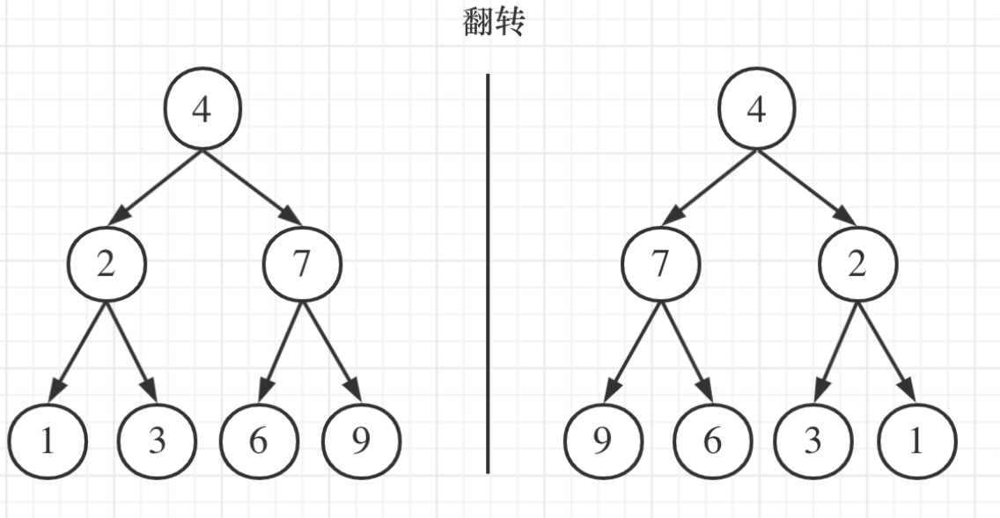

可以发现想要翻转它，其实就把每一个节点的左右孩子交换一下就可以了。

关键在于遍历顺序，前中后序应该选哪一种遍历顺序？ 遍历的过程中去翻转每一个节点的左右孩子就可以达到整体翻转的效果。**注意只要把每一个节点的左右孩子翻转一下，就可以达到整体翻转的效果**。**这道题目使用前序遍历和后序遍历都可以，唯独中序遍历不方便，因为中序遍历会把某些节点的左右孩子翻转了两次！**

1）前序遍历（根 → 左 → 右）

1. **交换当前节点的左右子树**（根操作）。
2. **递归翻转左子树**。
3. **递归翻转右子树**。

2）后序遍历（左 → 右 → 根）

1. **递归翻转左子树**。
2. **递归翻转右子树**。
3. **交换当前节点的左右子树**（根操作）。

3）中序遍历（左 → 根 → 右）

1. **递归翻转左子树**。
2. **交换当前节点的左右子树**。
3. **递归翻转右子树**（但此时右子树已经是原来的左子树）。

那么层序遍历可以不可以呢？**依然可以的！只要把每一个节点的左右孩子翻转一下的遍历方式都是可以的！**

**层序遍历**

```c++
class Solution {
public:
    TreeNode* invertTree(TreeNode* root)
    {
        if (!root) return root;

        queue<TreeNode *> queue;
        queue.push(root);
        while (!queue.empty())
        {
            auto size = queue.size();
            for (int i = 0; i < size; ++i)
            {
                auto curNdoe = queue.front();
                swap(curNdoe->left,curNdoe->right);
                queue.pop();
                if (curNdoe->left) queue.push(curNdoe->left);
                if (curNdoe->right) queue.push(curNdoe->right);
            }
        }
        return root;
    }
};
```

**前序遍历递归法**

```c++
class Solution {
public:
    TreeNode* invertTree(TreeNode* root)
    {
        if(!root) return root;
        swap(root->left,root->right);
        invertTree(root->left);
        invertTree(root->right);
        return root;
    }
};
```

针对二叉树的问题，解题之前一定要想清楚究竟是前中后序遍历，还是层序遍历。

**二叉树解题的大忌就是自己稀里糊涂的过了（因为这道题相对简单），但是也不知道自己是怎么遍历的。**

这也是造成了二叉树的题目“一看就会，一写就废”的原因。

## [101. 对称二叉树](https://leetcode.cn/problems/symmetric-tree/)

给你一个二叉树的根节点 `root` ， 检查它是否轴对称。

**示例 1：**


```
输入：root = [1,2,2,3,4,4,3]
输出：true
```

**示例 2：**


```
输入：root = [1,2,2,null,3,null,3]
输出：false
```

**首先想清楚，判断对称二叉树要比较的是哪两个节点，要比较的可不是左右节点！**

对于二叉树是否对称，要比较的是根节点的左子树与右子树是不是相互翻转的，理解这一点就知道了**其实我们要比较的是两个树（这两个树是根节点的左右子树）**，所以在递归遍历的过程中，也是要同时遍历两棵树。

那么如何比较呢？

比较的是两个子树的里侧和外侧的元素是否相等。如图所示：

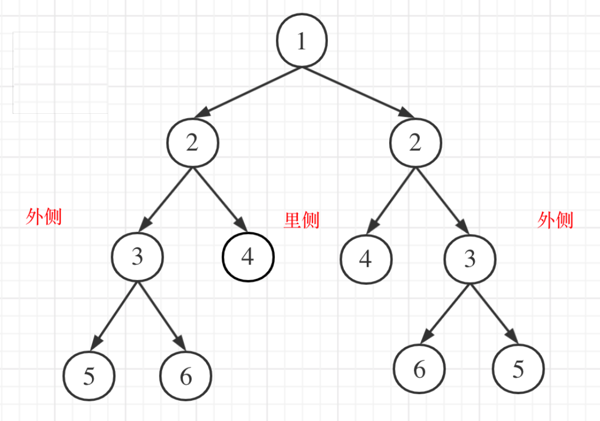

那么遍历的顺序应该是什么样的呢？

本题遍历只能是“后序遍历”，因为我们要通过递归函数的返回值来判断两个子树的内侧节点和外侧节点是否相等。

**正是因为要遍历两棵树而且要比较内侧和外侧节点，所以准确的来说是一个树的遍历顺序是左右中，一个树的遍历顺序是右左中。**

但都可以理解算是后序遍历，尽管已经不是严格上在一个树上进行遍历的后序遍历了。

其实后序也可以理解为是一种回溯，当然这是题外话，讲回溯的时候会重点讲的。

说到这大家可能感觉我有点啰嗦，哪有这么多道理，上来就干就完事了。别急，我说的这些在下面的代码讲解中都有身影。

那么我们先来看看递归法的代码应该怎么写。

1. 确定递归函数的参数和返回值

因为我们要比较的是根节点的两个子树是否是相互翻转的，进而判断这个树是不是对称树，所以要比较的是两个树，参数自然也是左子树节点和右子树节点。

返回值自然是bool类型。

```c++
bool compare(TreeNode* left, TreeNode* right)
```

1. 确定终止条件

要比较两个节点数值相不相同，首先要把两个节点为空的情况弄清楚！否则后面比较数值的时候就会操作空指针了。

节点为空的情况有：（**注意我们比较的其实不是左孩子和右孩子，所以如下我称之为左节点右节点**）

- 左节点为空，右节点不为空，不对称，return false
- 左不为空，右为空，不对称 return false
- 左右都为空，对称，返回true

此时已经排除掉了节点为空的情况，那么剩下的就是左右节点不为空：

- 左右都不为空，比较节点数值，不相同就return false

此时左右节点不为空，且数值也不相同的情况我们也处理了。

```c++
if (left == NULL && right != NULL) return false;
else if (left != NULL && right == NULL) return false;
else if (left == NULL && right == NULL) return true;
else if (left->val != right->val) return false; // 注意这里我没有使用else
```

注意上面最后一种情况，我没有使用else，而是else if， 因为我们把以上情况都排除之后，剩下的就是 左右节点都不为空，且数值相同的情况。

1. 确定单层递归的逻辑

此时才进入单层递归的逻辑，单层递归的逻辑就是处理 左右节点都不为空，且数值相同的情况。

- 比较二叉树外侧是否对称：传入的是左节点的左孩子，右节点的右孩子。
- 比较内侧是否对称，传入左节点的右孩子，右节点的左孩子。
- 如果左右都对称就返回true ，有一侧不对称就返回false 。

```c++
bool outside = compare(left->left, right->right);   // 左子树：左、 右子树：右
bool inside = compare(left->right, right->left);    // 左子树：右、 右子树：左
bool isSame = outside && inside;                    // 左子树：中、 右子树：中（逻辑处理）
return isSame;
```

如上代码中，我们可以看出使用的遍历方式，左子树左右中，右子树右左中，所以我把这个遍历顺序也称之为“后序遍历”（尽管不是严格的后序遍历）。

最后递归的C++整体代码如下：

```c++
class Solution {
public:
    bool compare(TreeNode* left,TreeNode* right)
    {
        // 1. 处理空节点情况
        if(!left && right) return false;
        if(left && !right) return false;
        if(!left && !right) return true;
        // 2. 节点值不相等直接返回false
        if(left->val != right->val) return false;

        // 3. 递归比较子树
		bool outside = compare(left->left, right->right);   // 左子树：左、 右子树：右
		bool inside = compare(left->right, right->left);    // 左子树：右、 右子树：左
		bool isSame = outside && inside;                  // 左子树：中、 右子树：中（逻辑处理）
        return isSame;
    }

    bool isSymmetric(TreeNode* root) {
        if(!root) return true;
        return compare(root->left,root->right);
    }
};
```

**队列实现（BFS 层序遍历）**

```c++
class Solution {
public:
    bool isSymmetric(TreeNode* root) 
    {
        if(!root) return true;
        queue<TreeNode*> queue;

        queue.push(root->left);
        queue.push(root->right);

        while(!queue.empty())
        {
            auto left = queue.front();
            queue.pop();
            auto right = queue.front();
            queue.pop();

            if(!left && right) return false;
            if(left && !right) return false;
            if(!left && !right) continue;
            if(left->val != right->val) return false;

            queue.push(left->left);
            queue.push(right->right);
            queue.push(left->right);
            queue.push(right->left);
        }
        return true;
    }
};
```

细心的话，其实可以发现，这个迭代法，其实是把左右两个子树要比较的元素顺序放进一个容器，然后成对成对的取出来进行比较，那么其实使用栈也是可以的。

只要把队列原封不动的改成栈就可以了。

```c++
class Solution {
public:
    bool isSymmetric(TreeNode* root) 
    {
        if(!root) return true;
        stack<TreeNode*> queue;

        queue.push(root->left);
        queue.push(root->right);

        while(!queue.empty())
        {
            auto left = queue.top();
            queue.pop();
            auto right = queue.top();
            queue.pop();

            if(!left && right) return false;
            if(left && !right) return false;
            if(!left && !right) continue;
            if(left->val != right->val) return false;

            queue.push(left->left);
            queue.push(right->right);
            queue.push(left->right);
            queue.push(right->left);
        }
        return true;
    }
};
```

这两道题目基本和本题是一样的，只要稍加修改就可以AC。

- [100.相同的树](https://leetcode.cn/problems/same-tree/)
- [572.另一个树的子树](https://leetcode.cn/problems/subtree-of-another-tree/)

## [100. 相同的树](https://leetcode.cn/problems/same-tree/)

给你两棵二叉树的根节点 `p` 和 `q` ，编写一个函数来检验这两棵树是否相同。如果两个树在结构上相同，并且节点具有相同的值，则认为它们是相同的。

**示例 1：**


```
输入：p = [1,2,3], q = [1,2,3]
输出：true
```

**示例 2：**


```
输入：p = [1,2], q = [1,null,2]
输出：false
```

**方法一：递归DFS**

```c++
class Solution
{
public:
    bool isSameTree(TreeNode *p, TreeNode *q)
    {
        if(!p && !q) return true;
        if(!p && q) return false;
        if(p && !q) return false;
        if(p->val != q->val) return false;

        return isSameTree(p->left,q->left) && isSameTree(p->right,q->right);
    }
};
```

**方法二：迭代BFS**

```c++
class Solution {
public:
    bool isSameTree(TreeNode* p, TreeNode* q) {
        queue<TreeNode*> queue;
        queue.push(p);
        queue.push(q);

        while(!queue.empty())
        {
            auto p = queue.front();
            queue.pop();
            auto q = queue.front();
            queue.pop();

            if(!q && p) return false;
            if(q && !p) return false;
            if(!q && !p) continue;
            if(q->val != p->val) return false;

            queue.push(p->left);
            queue.push(q->left);
            queue.push(p->right);
            queue.push(q->right);
        }
        return true;
    }
};
```

## [572. 另一棵树的子树](https://leetcode.cn/problems/subtree-of-another-tree/)

给你两棵二叉树 `root` 和 `subRoot` 。检验 `root` 中是否包含和 `subRoot` 具有相同结构和节点值的子树。如果存在，返回 `true` ；否则，返回 `false` 。

二叉树 `tree` 的一棵子树包括 `tree` 的某个节点和这个节点的所有后代节点。`tree` 也可以看做它自身的一棵子树。

**示例 1：**


```
输入：root = [3,4,5,1,2], subRoot = [4,1,2]
输出：true
```

**示例 2：**


```c++
输入：root = [3,4,5,1,2,null,null,null,null,0], subRoot = [4,1,2]
输出：false
```

**方法一：递归DFS**

```c++
class Solution 
{
public:
    bool isSubtree(TreeNode* root, TreeNode* subRoot) 
    {
        if (!subRoot) return true;
        if (!root) return false;
        if (isSameTree(root, subRoot)) return true;
        return isSubtree(root->left, subRoot) || isSubtree(root->right, subRoot);
    }
    
    bool isSameTree(TreeNode* p, TreeNode* q) 
    {
        if (!p && !q) return true;
        if (!p || !q) return false;
        if (p->val != q->val) return false;
        return isSameTree(p->left, q->left) && isSameTree(p->right, q->right);
    }
};
```

**方法二：迭代BFS**

```c++
class Solution
{
private:
    bool isSameTree(TreeNode *p, TreeNode *q)
    {
        queue<TreeNode *> queue;
        queue.push(p);
        queue.push(q);

        while (!queue.empty())
        {
            auto p = queue.front();
            queue.pop();
            auto q = queue.front();
            queue.pop();

            if (!q && p)
                return false;
            if (q && !p)
                return false;
            if (!q && !p)
                continue;
            if (q->val != p->val)
                return false;

            queue.push(p->left);
            queue.push(q->left);
            queue.push(p->right);
            queue.push(q->right);
        }
        return true;
    }

public:
    bool isSubtree(TreeNode *root, TreeNode *subRoot)
    {
        queue<TreeNode *> q;
        q.push(root);
        while (!q.empty())
        {
            auto curNode = q.front();
            q.pop();

            if (curNode->val == subRoot->val && isSameTree(curNode, subRoot))
            {
                return true;
            }

            if (curNode->left)
            {
                q.push(curNode->left);
            }
            if (curNode->right)
            {
                q.push(curNode->right);
            }
        }
        return false;
    }
};
```

## [222. 完全二叉树的节点个数](https://leetcode.cn/problems/count-complete-tree-nodes/)

**方法一：递归DFS**

```c++
class Solution 
{
public:
    int countNodes(TreeNode* root) 
    {
        if(!root) return 0;
        return countNodes(root->left) + countNodes(root->right) + 1;
    }
};
```

**方法二：迭代BFS**

```c++
class Solution {
public:
    int countNodes(TreeNode* root) {
        if(!root) return 0;
        
        queue<TreeNode*> q;
        q.push(root);
        int result = 0;

        while(!q.empty())
        {
            int size = q.size();
            for(int i = 0;i<size;++i)
            {
                auto curNode = q.front();
                q.pop();
                result++;
                if(curNode->left) q.push(curNode->left);
                if(curNode->right) q.push(curNode->right);   
            }
        }
        return result;
    }
};
```

## 12.平衡二叉树

[110. 平衡二叉树](https://leetcode.cn/problems/balanced-binary-tree/)

平衡二叉树定义为：一个二叉树每个节点 的左右两个子树的高度差的绝对值不超过1。

这里强调一波概念：

- 二叉树节点的深度：指从根节点到该节点的最长简单路径边的条数。
- 二叉树节点的高度：指从该节点到叶子节点的最长简单路径边的条数。

但leetcode中强调的深度和高度很明显是按照节点来计算的，如图：

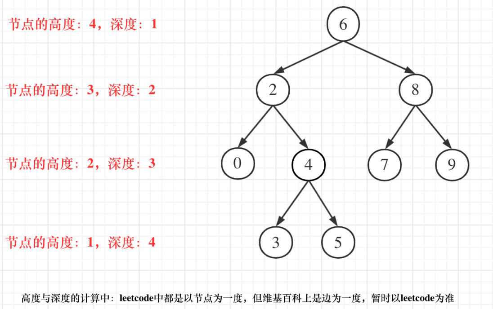

关于根节点的深度究竟是1 还是 0，不同的地方有不一样的标准，leetcode的题目中都是以节点为一度，即根节点深度是1。但维基百科上定义用边为一度，即根节点的深度是0，我们暂时以leetcode为准（毕竟要在这上面刷题）。

因为求深度可以从上到下去查 所以需要前序遍历（中左右），而高度只能从下到上去查，所以只能后序遍历（左右中）

## [104. 二叉树的最大深度](https://leetcode.cn/problems/maximum-depth-of-binary-tree/)

给定一个二叉树 `root` ，返回其最大深度。二叉树的 **最大深度** 是指从根节点到最远叶子节点的最长路径上的节点数。

本题可以使用前序（中左右），也可以使用后序遍历（左右中），使用前序求的就是深度，使用后序求的是高度。

- 二叉树节点的深度：指从根节点到该节点的最长简单路径边的条数或者节点数（取决于深度从0开始还是从1开始）
- 二叉树节点的高度：指从该节点到叶子节点的最长简单路径边的条数或者节点数（取决于高度从0开始还是从1开始）

**而根节点的高度就是二叉树的最大深度**，所以本题中我们通过后序求的根节点高度来求的二叉树最大深度。

```c++
class Solution
{
public:
    int maxDepth(TreeNode *root)
    {
        if (root == nullptr)
        {
            return 0;
        }
        int leftDepth = maxDepth(root->left);
        int rightDepth = maxDepth(root->right);

        return max(leftDepth, rightDepth) + 1;
    }
};
```

## 285.二叉搜索树中的中序后继

给定一棵二叉搜索树（BST）和其中的一个节点 `p`，找到该节点在中序遍历序列中的**后继节点**（即比 `p.val`大的最小节点）。如果 `p`是最后一个节点，则返回 `nullptr`。

**输入**:

```
root = [5, 3, 6, 2, 4, null, null, 1], p = 4
```

**中序遍历**: `[1, 2, 3, 4, 5, 6]`

**输出**: 节点 `5`（值为 5 的节点）

```c++
class Solution {
public:
    TreeNode* inorderSuccessor(TreeNode* root, TreeNode* p) {
        TreeNode* candidate = nullptr;
        while (root) {
            if (root->val > p->val) {
                candidate = root;  // 当前节点可能是后继
                root = root->left; // 尝试找更小的候选
            } else {
                root = root->right; // 向右寻找更大的值
            }
        }
        return candidate;
    }
};
```

# 回溯算法

## [77. 组合](https://leetcode.cn/problems/combinations/)

给定两个整数 `n` 和 `k`，返回范围 `[1, n]` 中所有可能的 `k` 个数的组合。

你可以按 **任何顺序** 返回答案。

**示例 1：**

```
输入：n = 4, k = 2
输出：
[
  [2,4],
  [3,4],
  [2,3],
  [1,2],
  [1,3],
  [1,4],
]
```

**示例 2：**

```
输入：n = 1, k = 1
输出：[[1]]
```

**提示：**

- `1 <= n <= 20`
- `1 <= k <= n`

```c++
class Solution
{
private:
    vector<vector<int>> result; // 存放符合条件结果的集合
    vector<int> path;           // 用来存放符合条件结果

    void dfs(int n, int k, int startIdx)
    {
        if (path.size() == k)
        {
            result.emplace_back(path);
            return;
        }
        for (int i = startIdx; i <= n - (k - path.size()) + 1; i++)
        {
            path.emplace_back(i); // 处理节点
            dfs(n, k, i + 1);     // 递归
            path.pop_back();      // 回溯，撤销处理的节点
        }
    }

public:
    vector<vector<int>> combine(int n, int k)
    {
        dfs(n, k, 1);

        return result;
    }
};
```

## [216. 组合总和 III](https://leetcode.cn/problems/combination-sum-iii/)

找出所有相加之和为 `n` 的 `k` 个数的组合，且满足下列条件：

- 只使用数字1到9
- 每个数字 **最多使用一次** 

返回 *所有可能的有效组合的列表* 。该列表不能包含相同的组合两次，组合可以以任何顺序返回。

**示例 1:**

```
输入: k = 3, n = 7
输出: [[1,2,4]]
解释:
1 + 2 + 4 = 7
没有其他符合的组合了。
```

**示例 2:**

```
输入: k = 3, n = 9
输出: [[1,2,6], [1,3,5], [2,3,4]]
解释:
1 + 2 + 6 = 9
1 + 3 + 5 = 9
2 + 3 + 4 = 9
没有其他符合的组合了。
```

**示例 3:**

```
输入: k = 4, n = 1
输出: []
解释: 不存在有效的组合。
在[1,9]范围内使用4个不同的数字，我们可以得到的最小和是1+2+3+4 = 10，因为10 > 1，没有有效的组合。
```

**提示:**

- `2 <= k <= 9`
- `1 <= n <= 60`

```c++
class Solution
{
private:
    vector<vector<int>> result; // 存放结果集
    vector<int> path;           // 符合条件的结果

    void dfs(int k, int n, int sum, int startIdx)
    {
        // 剪枝
        if (sum > n)
            return;

        if (k == path.size() && sum == n)
        {
            result.emplace_back(path);
            return;
        }

        for (int i = startIdx; i <= 9 - (k - path.size()) + 1; i++) // 剪枝
        {
            path.push_back(i);
            sum += i;

            dfs(k, n, sum, i + 1); // 注意i+1调整startIndex

            sum -= i;
            path.pop_back();
        }
    }

public:
    vector<vector<int>> combinationSum3(int k, int n)
    {
        dfs(k, n, 0, 1);

        return result;
    }
};
```

## [17. 电话号码的字母组合](https://leetcode.cn/problems/letter-combinations-of-a-phone-number/)

给定一个仅包含数字 `2-9` 的字符串，返回所有它能表示的字母组合。答案可以按 **任意顺序** 返回。

给出数字到字母的映射如下（与电话按键相同）。注意 1 不对应任何字母。


 

**示例 1：**

```
输入：digits = "23"
输出：["ad","ae","af","bd","be","bf","cd","ce","cf"]
```

**示例 2：**

```
输入：digits = ""
输出：[]
```

**示例 3：**

```
输入：digits = "2"
输出：["a","b","c"]
```

**提示：**

- `0 <= digits.length <= 4`
- `digits[i]` 是范围 `['2', '9']` 的一个数字。

**暴力**

```c++
#include <vector>
#include <string>
using namespace std;

class Solution {
public:
    vector<string> letterCombinations(string digits) {
        if (digits.empty()) return {};

        // 数字到字母的映射
        vector<string> letterMap = {
            "", "", "abc", "def", "ghi", "jkl", "mno", "pqrs", "tuv", "wxyz"
        };

        // 初始化为第一个数字对应的字母
        vector<string> result;
        string firstLetters = letterMap[digits[0] - '0'];
        for (char c : firstLetters) {
            result.push_back(string(1, c));
        }

        // 逐个处理剩余的数字
        for (int i = 1; i < digits.size(); ++i) {
            vector<string> newResult;
            string letters = letterMap[digits[i] - '0'];

            // 将当前数字的每个字母与已有组合拼接
            for (string s : result) {
                for (char c : letters) {
                    newResult.push_back(s + c);
                }
            }

            result = newResult; // 更新结果
        }

        return result;
    }
};
```

**DFS**

```c++
class Solution
{
private:
    // 数字到字母的映射表，0和1对应空字符串
    vector<string> letterMap = {
        "",     // 0
        "",     // 1
        "abc",  // 2
        "def",  // 3
        "ghi",  // 4
        "jkl",  // 5
        "mno",  // 6
        "pqrs", // 7
        "tuv",  // 8
        "wxyz", // 9
    };

    vector<string> result; // 存储最终所有可能的字母组合
    string s;              // 当前正在构建的字母组合

    // 深度优先搜索（DFS）递归函数
    // digits: 输入的数字字符串
    // startIdx: 当前处理到的数字位置
    void dfs(string digits, int startIdx)
    {
        // 终止条件：已经处理完所有数字
        if (startIdx == digits.size())
        {
            result.emplace_back(s); // 将当前组合加入结果集
            return;
        }

        // 获取当前数字对应的字母字符串
        // 例如：digits[startIdx] = '2' → letters = "abc"
        string letters = letterMap[digits[startIdx] - '0'];

        // 遍历当前数字对应的所有字母
        for (int i = 0; i < letters.size(); i++)
        {
            s.push_back(letters[i]);  // 选择当前字母

            dfs(digits, startIdx + 1); // 递归处理下一个数字

            s.pop_back();             // 回溯，撤销选择
        }
    }

public:
    vector<string> letterCombinations(string digits)
    {
        // 如果输入不为空，则开始DFS
        if (digits.size() != 0)
        {
            dfs(digits, 0);
        }

        return result; // 返回所有可能的字母组合
    }
};
```

## [39. 组合总和](https://leetcode.cn/problems/combination-sum/)

给你一个 **无重复元素** 的整数数组 `candidates` 和一个目标整数 `target` ，找出 `candidates` 中可以使数字和为目标数 `target` 的 所有 **不同组合** ，并以列表形式返回。你可以按 **任意顺序** 返回这些组合。

`candidates` 中的 **同一个** 数字可以 **无限制重复被选取** 。如果至少一个数字的被选数量不同，则两种组合是不同的。 

对于给定的输入，保证和为 `target` 的不同组合数少于 `150` 个。

**示例 1：**

```
输入：candidates = [2,3,6,7], target = 7
输出：[[2,2,3],[7]]
解释：
2 和 3 可以形成一组候选，2 + 2 + 3 = 7 。注意 2 可以使用多次。
7 也是一个候选， 7 = 7 。
仅有这两种组合。
```

**示例 2：**

```
输入: candidates = [2,3,5], target = 8
输出: [[2,2,2,2],[2,3,3],[3,5]]
```

**示例 3：**

```
输入: candidates = [2], target = 1
输出: []
```

**提示：**

- `1 <= candidates.length <= 30`
- `2 <= candidates[i] <= 40`
- `candidates` 的所有元素 **互不相同**
- `1 <= target <= 40`

**方法一**

在DFS时每次都从数组开头（i=0）开始搜索，这会导致生成大量重复组合。比如对于[2,3,6,7]和target=7，它会生成[2,2,3]、[2,3,2]、[3,2,2]等多个本质上相同的组合。

需要先用set对所有结果进行去重，这是一个O(NlogN)的操作，既消耗时间又占用额外空间。

```c++
class Solution
{
private:
    vector<vector<int>> result;
    vector<int> path;

    void dfs(vector<int> &nums, int sum, int target)
    {
        if (sum > target)
        {
            return;
        }

        if (sum == target)
        {
            result.emplace_back(path);
            return;
        }

        for (int i = 0; i < nums.size(); i++)
        {
            sum += nums[i];

            path.push_back(nums[i]);

            dfs(nums, sum, target);

            path.pop_back();
            sum -= nums[i];
        }
    }

public:
    vector<vector<int>> combinationSum(vector<int> &candidates, int target)
    {
        if (candidates.size() != 0)
        {
            dfs(candidates, 0, target);
        }

        for (auto &c : result)
        {
            sort(c.begin(), c.end());
        }

        // unordered_set不支持直接存储 vector<int>，
        // 因为 C++ 的 unordered_set默认需要哈希函数，
        // 而 vector<int>没有默认的哈希函数
        set<vector<int>> s(result.begin(), result.end());
        result = vector<vector<int>>(s.begin(), s.end());

        return result;
    }
};
```

**方法二**

通过startIdx参数，确保每次搜索都从当前位置或之后开始，这样生成的组合都是按原始顺序排列的，自然避免了重复组合。

通过控制搜索顺序，从根本上避免了重复组合的产生，不需要额外的去重操作。

```c++
class Solution
{
private:
    vector<vector<int>> result;
    vector<int> path;

    void dfs(vector<int> &nums, int sum, int target, int startIdx)
    {
        if (sum > target)
        {
            return;
        }

        if (sum == target)
        {
            result.emplace_back(path);
            return;
        }

        for (int i = startIdx; i < nums.size(); i++)
        {
            sum += nums[i];

            path.push_back(nums[i]);

            dfs(nums, sum, target, i); // 不用i+1了，表示可以重复读取当前的数

            path.pop_back();
            sum -= nums[i];
        }
    }

public:
    vector<vector<int>> combinationSum(vector<int> &candidates, int target)
    {
        if (candidates.size() != 0)
        {
            dfs(candidates, 0, target,0);
        }
        return result;
    }
};
```

## [40. 组合总和 II](https://leetcode.cn/problems/combination-sum-ii/)

给定一个候选人编号的集合 `candidates` 和一个目标数 `target` ，找出 `candidates` 中所有可以使数字和为 `target` 的组合。

`candidates` 中的每个数字在每个组合中只能使用 **一次** 。

**注意：**解集不能包含重复的组合。 

**示例 1:**

```
输入: candidates = [10,1,2,7,6,1,5], target = 8,
输出:
[
[1,1,6],
[1,2,5],
[1,7],
[2,6]
]
```

**示例 2:**

```
输入: candidates = [2,5,2,1,2], target = 5,
输出:
[
[1,2,2],
[5]
]
```

**提示:**

- `1 <= candidates.length <= 100`
- `1 <= candidates[i] <= 50`
- `1 <= target <= 30`

```c++
class Solution
{
private:
    vector<vector<int>> result;
    vector<int> path;

    void dfs(vector<int> &nums, int sum, int target, int startIdx, vector<bool> used)
    {
        if (sum > target)
        {
            return;
        }

        if (sum == target)
        {
            result.emplace_back(path);
            return;
        }

        for (int i = startIdx; i < nums.size(); i++)
        {
            // used[i - 1] == true，说明同一树枝candidates[i - 1]使用过
            // used[i - 1] == false，说明同一树层candidates[i - 1]使用过
            // 要对同一树层使用过的元素进行跳过
            if (i > 0 && nums[i] == nums[i - 1] && used[i - 1] == false)
            {
                continue;
            }

            sum += nums[i];
            used[i] = true;
            path.push_back(nums[i]);

            dfs(nums, sum, target, i + 1, used);

            path.pop_back();
            sum -= nums[i];
            used[i] = false;
        }
    }

public:
    vector<vector<int>> combinationSum2(vector<int> &candidates, int target)
    {
        if (candidates.size() != 0)
        {
            vector<bool> used(candidates.size(), false);
            // 首先把给candidates排序，让其相同的元素都挨在一起。
            sort(candidates.begin(), candidates.end());
            dfs(candidates, 0, target, 0, used);
        }
        return result;
    }
};
```

## [131. 分割回文串](https://leetcode.cn/problems/palindrome-partitioning/)

给你一个字符串 `s`，请你将 `s` 分割成一些 子串，使每个子串都是 **回文串** 。返回 `s` 所有可能的分割方案。

**示例 1：**

```
输入：s = "aab"
输出：[["a","a","b"],["aa","b"]]
```

**示例 2：**

```
输入：s = "a"
输出：[["a"]]
```

**提示：**

- `1 <= s.length <= 16`
- `s` 仅由小写英文字母组成

**方法一**

先获取所有子串分割再检查回文

```c++
class Solution
{
private:
    vector<vector<string>> allstr;
    vector<vector<string>> result;
    vector<string> path;

    bool check(string s)
    {
        int start = 0;
        int end = s.size()-1;
        for (int i = start, j = end; i <= j; i++, j--)
        {
            if (s[i] != s[j])
                return false;
        }
        return true;
    }

    void dfs(string s, int startIdx)
    {
        if (startIdx >= s.size())
        {
            allstr.push_back(path);
            return;
        }

        // 尝试所有可能的分割点
        for (int i = startIdx; i < s.size(); i++)
        {
            string str = s.substr(startIdx, i - startIdx + 1);
            path.push_back(str);

            // 递归处理剩余部分
            dfs(s, i + 1);

            // 回溯，移除当前子串，尝试其他分割方式
            path.pop_back();
        }
    }

public:
    vector<vector<string>> partition(string s)
    {
        dfs(s, 0);

        for(auto list:allstr)
        {
            bool flag = true;
            for(auto str:list)
            {
                if(!check(str))
                {
                    flag = false;
                    break;
                }
            }
            if(flag)
            {
                result.push_back(list);
            }
        }
        return result;
    }
};
```

**方法二**

获取的时候就检查回文，如果不是的话就不接着往下了，相当于剪枝

```c++
class Solution
{
private:
    vector<vector<string>> result;
    vector<string> path;

    bool check(string s, int start, int end)
    {
        for (int i = start, j = end; i <= j; i++, j--)
        {
            if (s[i] != s[j])
                return false;
        }
        return true;
    }

    void dfs(string s, int startIdx)
    {
        if (startIdx >= s.size())
        {
            result.push_back(path);
            return;
        }

        // 尝试所有可能的分割点
        for (int i = startIdx; i < s.size(); i++)
        {
            // 如果当前子串是回文
            if (check(s, startIdx, i))
            {
                // 获取当前回文子串
                string str = s.substr(startIdx, i - startIdx + 1);
                path.push_back(str);

                // 递归处理剩余部分
                dfs(s, i + 1);

                // 回溯，移除当前子串，尝试其他分割方式
                path.pop_back();
            }
        }
    }

public:
    vector<vector<string>> partition(string s)
    {
        dfs(s, 0);

        return result;
    }
};
```

## [78. 子集](https://leetcode.cn/problems/subsets/)

**有效 IP 地址** 正好由四个整数（每个整数位于 `0` 到 `255` 之间组成，且不能含有前导 `0`），整数之间用 `'.'` 分隔。

- 例如：`"0.1.2.201"` 和` "192.168.1.1"` 是 **有效** IP 地址，但是 `"0.011.255.245"`、`"192.168.1.312"` 和 `"192.168@1.1"` 是 **无效** IP 地址。

给定一个只包含数字的字符串 `s` ，用以表示一个 IP 地址，返回所有可能的**有效 IP 地址**，这些地址可以通过在 `s` 中插入 `'.'` 来形成。你 **不能** 重新排序或删除 `s` 中的任何数字。你可以按 **任何** 顺序返回答案。

**示例 1：**

```
输入：s = "25525511135"
输出：["255.255.11.135","255.255.111.35"]
```

**示例 2：**

```
输入：s = "0000"
输出：["0.0.0.0"]
```

**示例 3：**

```
输入：s = "101023"
输出：["1.0.10.23","1.0.102.3","10.1.0.23","10.10.2.3","101.0.2.3"]
```

**提示：**

- `1 <= s.length <= 20`
- `s` 仅由数字组成

```c++
class Solution
{
private:
    vector<vector<int>> result;
    vector<int> path;

    void dfs(vector<int> &nums, int startIdx)
    {
        result.push_back(path);
        if (startIdx >= nums.size())
        {
            return;
        }

        for (int i = startIdx; i < nums.size(); i++)
        {
            path.emplace_back(nums[i]);

            dfs(nums, i + 1);

            path.pop_back();
        }
    }

public:
    vector<vector<int>> subsets(vector<int> &nums)
    {
        dfs(nums, 0);

        return result;
    }
};
```

## [90. 子集 II](https://leetcode.cn/problems/subsets-ii/)

给你一个整数数组 `nums` ，其中可能包含重复元素，请你返回该数组所有可能的 子集（幂集）。

解集 **不能** 包含重复的子集。返回的解集中，子集可以按 **任意顺序** 排列。

**示例 1：**

```
输入：nums = [1,2,2]
输出：[[],[1],[1,2],[1,2,2],[2],[2,2]]
```

**示例 2：**

```
输入：nums = [0]
输出：[[],[0]]
```

**提示：**

- `1 <= nums.length <= 10`
- `-10 <= nums[i] <= 10`

这道题目和[78.子集](https://programmercarl.com/0078.子集.html)区别就是集合里有重复元素了，而且求取的子集要去重。

那么关于回溯算法中的去重问题，**在[40.组合总和II](https://programmercarl.com/0040.组合总和II.html)中已经详细讲解过了，和本题是一个套路**。

**剧透一下，后期要讲解的排列问题里去重也是这个套路，所以理解“树层去重”和“树枝去重”非常重要**。

**注意去重需要先对集合排序**

```c++
class Solution
{
private:
    vector<vector<int>> result;
    vector<int> path;

    void dfs(vector<int> &nums, int startIdx, vector<bool> used)
    {
        result.push_back(path);
        if (startIdx >= nums.size())
        {
            return;
        }

        for (int i = startIdx; i < nums.size(); i++)
        {
            // used[i - 1] == true，说明同一树枝candidates[i - 1]使用过
            // used[i - 1] == false，说明同一树层candidates[i - 1]使用过
            // 要对同一树层使用过的元素进行跳过

            if (i > 0 && nums[i] == nums[i - 1] && used[i - 1] == false)
            {
                continue;
            }

            path.emplace_back(nums[i]);
            used[i] = true;

            dfs(nums, i + 1, used);

            path.pop_back();
            used[i] = false;
        }
    }

public:
    vector<vector<int>> subsetsWithDup(vector<int> &nums)
    {
        vector<bool> used(nums.size(), false);
        sort(nums.begin(), nums.end()); // 去重需要排序
        dfs(nums, 0, used);

        return result;
    }
};
```

## [491. 非递减子序列](https://leetcode.cn/problems/non-decreasing-subsequences/)

给你一个整数数组 `nums` ，找出并返回所有该数组中不同的递增子序列，递增子序列中 **至少有两个元素** 。你可以按 **任意顺序** 返回答案。

数组中可能含有重复元素，如出现两个整数相等，也可以视作递增序列的一种特殊情况。

**示例 1：**

```
输入：nums = [4,6,7,7]
输出：[[4,6],[4,6,7],[4,6,7,7],[4,7],[4,7,7],[6,7],[6,7,7],[7,7]]
```

**示例 2：**

```
输入：nums = [4,4,3,2,1]
输出：[[4,4]]
```

**提示：**

- `1 <= nums.length <= 15`
- `-100 <= nums[i] <= 100`

在回溯算法中，**哈希集合（`unordered_set`）通常用于同一层级的去重**，而**排序后比较相邻元素的方法（`if (i > startIdx && nums[i] == nums[i-1])`）适用于全局去重**。

- **哈希集合**适用于**同一层级去重**（如子序列问题）。
- **排序 + 相邻比较**适用于**全局去重**（如子集、组合问题）。

```c++
class Solution
{
private:
    vector<vector<int>> result;
    vector<int> path;

    void dfs(vector<int> &nums, int startIdx)
    {
        if (path.size() >= 2)
        {
            result.push_back(path);
        }

        if (startIdx >= nums.size())
        {
            return;
        }

        // 用于当前层级去重的哈希集合
        // 防止在同一层级选择相同的数字导致重复子序列
        unordered_set<int> used;
        for (int i = startIdx; i < nums.size(); i++)
        {
            // 如果当前数字已经在当前层级使用过，跳过
            if (used.count(nums[i]))
            {
                continue;
            }
            // 如果路径为空（刚开始）或者当前数字≥路径最后一个数字（保持非递减）
            if (path.empty() || path.back() <= nums[i])
            {
                used.insert(nums[i]);
                path.push_back(nums[i]);

                dfs(nums, i + 1);

                path.pop_back();
            }
        }
    }

public:
    vector<vector<int>> findSubsequences(vector<int> &nums)
    {
        dfs(nums, 0);

        return result;
    }
};
```

## [46. 全排列](https://leetcode.cn/problems/permutations/)

给定一个不含重复数字的数组 `nums` ，返回其 *所有可能的全排列* 。你可以 **按任意顺序** 返回答案。

**示例 1：**

```
输入：nums = [1,2,3]
输出：[[1,2,3],[1,3,2],[2,1,3],[2,3,1],[3,1,2],[3,2,1]]
```

**示例 2：**

```
输入：nums = [0,1]
输出：[[0,1],[1,0]]
```

**示例 3：**

```
输入：nums = [1]
输出：[[1]]
```

**提示：**

- `1 <= nums.length <= 6`
- `-10 <= nums[i] <= 10`
- `nums` 中的所有整数 **互不相同**

```c++
class Solution
{
private:
    vector<vector<int>> result;
    vector<int> path;

    void dfs(vector<int> &num, vector<bool> &used)
    {
        if (path.size() == num.size())
        {
            result.push_back(path);
            return;
        }

        for (int i = 0; i < num.size(); i++)
        {
            if (used[i] == true)
            {
                continue;
            }

            path.push_back(num[i]);
            used[i] = true;

            dfs(num, used);

            path.pop_back();
            used[i] = false;
        }
    }

public:
    vector<vector<int>> permute(vector<int> &nums)
    {
        vector<bool> used(nums.size(), false);
        dfs(nums, used);

        return result;
    }
};
```

## [47. 全排列 II](https://leetcode.cn/problems/permutations-ii/)

给定一个可包含重复数字的序列 `nums` ，***按任意顺序*** 返回所有不重复的全排列。

**示例 1：**

```
输入：nums = [1,1,2]
输出：
[[1,1,2],
 [1,2,1],
 [2,1,1]]
```

**示例 2：**

```
输入：nums = [1,2,3]
输出：[[1,2,3],[1,3,2],[2,1,3],[2,3,1],[3,1,2],[3,2,1]]
```

**提示：**

- `1 <= nums.length <= 8`
- `-10 <= nums[i] <= 10`

```c++
class Solution
{
private:
    vector<vector<int>> result;
    vector<int> path;

    void dfs(vector<int> &nums, vector<bool> &used)
    {
        if (path.size() == nums.size())
        {
            result.push_back(path);
            return;
        }

        for (int i = 0; i < nums.size(); i++)
        {
            if (used[i] == true)
            {
                continue;
            }
            // used[i - 1] == true，说明同一树枝nums[i - 1]使用过
            // used[i - 1] == false，说明同一树层nums[i - 1]使用过
            // 如果同一树层nums[i - 1]使用过则直接跳过
            if (i > 0 && nums[i - 1] == nums[i] && used[i-1] == false)
            {
                continue;
            }

            used[i] = true;
            path.push_back(nums[i]);

            dfs(nums, used);

            path.pop_back();
            used[i] = false;
        }
    }

public:
    vector<vector<int>> permuteUnique(vector<int> &nums)
    {
        sort(nums.begin(), nums.end());

        vector<bool> used(nums.size(), false);

        dfs(nums, used);

        return result;
    }
};
```

## [51. N 皇后](https://leetcode.cn/problems/n-queens/)

按照国际象棋的规则，皇后可以攻击与之处在同一行或同一列或同一斜线上的棋子。

**n 皇后问题** 研究的是如何将 `n` 个皇后放置在 `n×n` 的棋盘上，并且使皇后彼此之间不能相互攻击。

给你一个整数 `n` ，返回所有不同的 **n 皇后问题** 的解决方案。

每一种解法包含一个不同的 **n 皇后问题** 的棋子放置方案，该方案中 `'Q'` 和 `'.'` 分别代表了皇后和空位。

**示例 1：**


```
输入：n = 4
输出：[[".Q..","...Q","Q...","..Q."],["..Q.","Q...","...Q",".Q.."]]
解释：如上图所示，4 皇后问题存在两个不同的解法。
```

**示例 2：**

```
输入：n = 1
输出：[["Q"]]
```

**提示：**

- `1 <= n <= 9`

```c++
class Solution
{
private:
    vector<vector<string>> result;

    bool check(vector<string> chessBoard, int row, int col, int n)
    {
        // 同一列,col相等
        // 在单层搜索的过程中，每一层递归，只会选for循环（也就是同一行）里的一个元素，所以不用去重了。
        for (int i = 0; i < n; i++)
        {
            if (chessBoard[i][col] == 'Q')
            {
                return false;
            }
        }

        // 只需要检查上方已放置的皇后（因为是逐行放置，下方还没有皇后）
        // 左上角到当前位置
        for (int i = row - 1, j = col - 1; i >= 0 && j >= 0; i--, j--)
        {
            if (chessBoard[i][j] == 'Q')
            {
                return false;
            }
        }

        // 右上角到当前位置
        for (int i = row - 1, j = col + 1; i >= 0 && j < n; i--, j++)
        {
            if (chessBoard[i][j] == 'Q')
            {
                return false;
            }
        }

        return true;
    }

    void dfs(int row, int n, vector<string> &chessBoard)
    {
        if (row == n)
        {
            result.push_back(chessBoard);
            return;
        }

        for (int col = 0; col < n; col++)
        {
            if (check(chessBoard, row, col, n))
            {
                chessBoard[row][col] = 'Q';

                dfs(row + 1, n, chessBoard);

                chessBoard[row][col] = '.';
            }
        }
    }

public:
    vector<vector<string>> solveNQueens(int n)
    {
        vector<string> chessBoard(n, string(n, '.'));
        dfs(0, n, chessBoard);
        return result;
    }
};
```

## [37. 解数独](https://leetcode.cn/problems/sudoku-solver/)

编写一个程序，通过填充空格来解决数独问题。

数独的解法需 **遵循如下规则**：

1. 数字 `1-9` 在每一行只能出现一次。
2. 数字 `1-9` 在每一列只能出现一次。
3. 数字 `1-9` 在每一个以粗实线分隔的 `3x3` 宫内只能出现一次。（请参考示例图）

数独部分空格内已填入了数字，空白格用 `'.'` 表示。

**示例 1：**


```
输入：board = [["5","3",".",".","7",".",".",".","."],["6",".",".","1","9","5",".",".","."],[".","9","8",".",".",".",".","6","."],["8",".",".",".","6",".",".",".","3"],["4",".",".","8",".","3",".",".","1"],["7",".",".",".","2",".",".",".","6"],[".","6",".",".",".",".","2","8","."],[".",".",".","4","1","9",".",".","5"],[".",".",".",".","8",".",".","7","9"]]
输出：[["5","3","4","6","7","8","9","1","2"],["6","7","2","1","9","5","3","4","8"],["1","9","8","3","4","2","5","6","7"],["8","5","9","7","6","1","4","2","3"],["4","2","6","8","5","3","7","9","1"],["7","1","3","9","2","4","8","5","6"],["9","6","1","5","3","7","2","8","4"],["2","8","7","4","1","9","6","3","5"],["3","4","5","2","8","6","1","7","9"]]
解释：输入的数独如上图所示，唯一有效的解决方案如下所示：
```

**提示：**

- `board.length == 9`
- `board[i].length == 9`
- `board[i][j]` 是一位数字或者 `'.'`
- 题目数据 **保证** 输入数独仅有一个解

```c++
class Solution
{
private:
    bool check(vector<vector<char>> &board, int row, int col, char c)
    {
        // 数字 1-9 在每一行只能出现一次。
        for (int i = 0; i < board.size(); i++)
        {
            if (board[i][col] == c)
            {
                return false;
            }
        }

        // 数字 1-9 在每一列只能出现一次。
        for (int j = 0; j < board[0].size(); j++)
        {
            if (board[row][j] == c)
            {
                return false;
            }
        }

        // 数字 1-9 在每一个以粗实线分隔的 3x3 宫内只能出现一次。
        int startRow = row - row % 3;
        int startCol = col - col % 3;
        for (int i = startRow; i < startRow + 3; i++)
        {
            for (int j = startCol; j < startCol + 3; j++)
            {
                if (board[i][j] == c)
                {
                    return false;
                }
            }
        }

        return true;
    }

    bool dfs(vector<vector<char>> &board)
    {
        for (int i = 0; i < board.size(); i++)
        {
            for (int j = 0; j < board[0].size(); j++)
            {
                if (board[i][j] != '.')
                {
                    continue;
                }
                // 尝试填入1-9
                for (char c = '1'; c <= '9'; c++)
                {
                    if (check(board, i, j, c))
                    {
                        board[i][j] = c;

                        // 递归继续填充，如果找到解则返回true
                        if (dfs(board))
                            return true;

                        board[i][j] = '.';
                    }
                }
                // 如果1-9都无法填入，说明此路不通，返回false
                return false;
            }
        }
        // 遍历完没有返回false，说明找到了合适棋盘位置了
        return true;
    }

public:
    void solveSudoku(vector<vector<char>> &board)
    {
        dfs(board);
    }
};
```

## [22. 括号生成](https://leetcode.cn/problems/generate-parentheses/)

数字 `n` 代表生成括号的对数，请你设计一个函数，用于能够生成所有可能的并且 **有效的** 括号组合。

**示例 1：**

```
输入：n = 3
输出：["((()))","(()())","(())()","()(())","()()()"]
```

**示例 2：**

```
输入：n = 1
输出：["()"]
```

**提示：**

- `1 <= n <= 8`

代码通过两个条件控制括号添加，从根本上保证了 “成对性”：

1. **左括号的添加条件**：`if (left < n)`
   - 最多只能添加 `n` 个左括号（因为需要 `n` 对括号）。
   - 例如 `n=3` 时，左括号最多添加 3 个，避免左括号过多导致无法配对。
2. **右括号的添加条件**：`if (right < left)`
   - 右括号的数量**永远不能超过左括号**（否则会出现 `)(` 这种无效组合）。
   - 例如：已有 2 个左括号时，最多只能添加 2 个右括号，确保每个右括号都能找到对应的左括号。

```c++
class Solution
{
private:
    vector<string> result;
    string path;

    /**
     * @param left  已使用的左括号数量
     * @param right 已使用的右括号数量
     * @param n     需要生成的括号总对数
     */
    void dfs(int left, int right, int n)
    {
        // 终止条件：当前括号字符串长度达到2n（n对括号共2n个字符）
        if (path.size() == 2 * n)
        {
            result.push_back(path);
            return;
        }

        // 左括号数量小于n时，可以继续添加左括号
        // 保证左括号不会超过需要的总数量
        if (left < n)
        {
            path.push_back('(');     // 添加左括号
            dfs(left + 1, right, n); // 递归：左括号数量+1
            path.pop_back();         // 回溯：移除最后添加的左括号，尝试其他可能性
        }

        // 右括号数量小于左括号数量时，可以添加右括号
        // 保证不会出现右括号单独存在的情况（如")("），确保有效性
        if (right < left)
        {
            path.push_back(')');     // 添加右括号
            dfs(left, right + 1, n); // 递归：右括号数量+1
            path.pop_back();         // 回溯：移除最后添加的右括号，尝试其他可能性
        }
    }

public:
    vector<string> generateParenthesis(int n)
    {
        dfs(0, 0, n);
        return result;
    }
};
```

## [79. 单词搜索](https://leetcode.cn/problems/word-search/)

给定一个 `m x n` 二维字符网格 `board` 和一个字符串单词 `word` 。如果 `word` 存在于网格中，返回 `true` ；否则，返回 `false` 。

单词必须按照字母顺序，通过相邻的单元格内的字母构成，其中“相邻”单元格是那些水平相邻或垂直相邻的单元格。同一个单元格内的字母不允许被重复使用。

**示例 1：**


```
输入：board = [["A","B","C","E"],["S","F","C","S"],["A","D","E","E"]], word = "ABCCED"
输出：true
```

**示例 2：**


```
输入：board = [["A","B","C","E"],["S","F","C","S"],["A","D","E","E"]], word = "SEE"
输出：true
```

**示例 3：**


```
输入：board = [["A","B","C","E"],["S","F","C","S"],["A","D","E","E"]], word = "ABCB"
输出：false
```

**提示：**

- `m == board.length`
- `n = board[i].length`
- `1 <= m, n <= 6`
- `1 <= word.length <= 15`
- `board` 和 `word` 仅由大小写英文字母组成

**进阶：**你可以使用搜索剪枝的技术来优化解决方案，使其在 `board` 更大的情况下可以更快解决问题？

```c++
class Solution
{
private:
    // 四个方向：上、右、下、左
    vector<pair<int, int>> directions = {{-1, 0}, {0, 1}, {1, 0}, {0, -1}};

    bool dfs(vector<vector<char>> &board, string word, int index, int row, int col, vector<vector<bool>> &visited)
    {
        // 终止条件：所有字符都匹配成功
        if (index == word.size() - 1)
        {
            return true;
        }

        // 标记当前单元格为已访问
        visited[row][col] = true;

        // 尝试向四个方向移动
        for (auto dir : directions)
        {
            int newRow = row + dir.first;
            int newCol = col + dir.second;
            // 行号、列号、新位置是否未被访问过、新位置的字符是否匹配单词的下一个字母
            if (newRow >= 0 && newRow < board.size() && newCol >= 0 && newCol < board[0].size() && visited[newRow][newCol] == false && board[newRow][newCol] == word[index + 1])
            {
                if (dfs(board, word, index + 1, newRow, newCol, visited))
                {
                    return true;
                }
            }
        }

        // 回溯：如果四个方向都搜索失败，撤销当前单元格的访问标记
        visited[row][col] = false;

        // 四个方向都搜索失败
        return false;
    }

public:
    bool exist(vector<vector<char>> &board, string word)
    {
        int m = board.size();
        int n = board[0].size();

        // 初始化访问标记矩阵
        vector<vector<bool>> visited(m, vector<bool>(n, false));

        // 从网格的每个位置开始尝试搜索
        for (int i = 0; i < m; ++i)
        {
            for (int j = 0; j < n; ++j)
            {
                if (board[i][j] == word[0])
                {
                    // 找到匹配的第一个字符，开始回溯搜索（从index=0开始）
                    if (dfs(board, word, 0, i, j, visited))
                    {
                        return true;
                    }
                }
            }
        }

        // 所有位置都搜索过，未找到匹配的单词
        return false;
    }
};
```


# 贪心算法

## [455. 分发饼干](https://leetcode.cn/problems/assign-cookies/)

是一位很棒的家长，想要给你的孩子们一些小饼干。但是，每个孩子最多只能给一块饼干。

对每个孩子 `i`，都有一个胃口值 `g[i]`，这是能让孩子们满足胃口的饼干的最小尺寸；并且每块饼干 `j`，都有一个尺寸 `s[j]` 。如果 `s[j] >= g[i]`，我们可以将这个饼干 `j` 分配给孩子 `i` ，这个孩子会得到满足。你的目标是满足尽可能多的孩子，并输出这个最大数值。

**示例 1:**

```
输入: g = [1,2,3], s = [1,1]
输出: 1
解释: 
你有三个孩子和两块小饼干，3 个孩子的胃口值分别是：1,2,3。
虽然你有两块小饼干，由于他们的尺寸都是 1，你只能让胃口值是 1 的孩子满足。
所以你应该输出 1。
```

**示例 2:**

```
输入: g = [1,2], s = [1,2,3]
输出: 2
解释: 
你有两个孩子和三块小饼干，2 个孩子的胃口值分别是 1,2。
你拥有的饼干数量和尺寸都足以让所有孩子满足。
所以你应该输出 2。
```

**提示：**

- `1 <= g.length <= 3 * 104`
- `0 <= s.length <= 3 * 104`
- `1 <= g[i], s[j] <= 231 - 1`

 为了满足更多的小孩，就不要造成饼干尺寸的浪费。

大尺寸的饼干既可以满足胃口大的孩子也可以满足胃口小的孩子，那么就应该优先满足胃口大的。

**这里的局部最优就是大饼干喂给胃口大的，充分利用饼干尺寸喂饱一个，全局最优就是喂饱尽可能多的小孩**。

可以尝试使用贪心策略，先将饼干数组和小孩数组排序。

然后从后向前遍历小孩数组，用大饼干优先满足胃口大的，并统计满足小孩数量。

```c++
class Solution
{
public:
    int findContentChildren(vector<int> &g, vector<int> &s)
    {
        sort(g.begin(), g.end()); // 胃口
        sort(s.begin(), s.end()); // 饼干

        int i = 0, j = 0;
        int res = 0;
        while (i < g.size() && j < s.size())
        {
            if (g[i] <= s[j])
            {
                i++;
                j++;
                res++;
            }
            else
            {
                j++;
            }
        }
        return res;
    }
};
```

## [376. 摆动序列](https://leetcode.cn/problems/wiggle-subsequence/)

如果连续数字之间的差严格地在正数和负数之间交替，则数字序列称为 **摆动序列 。**第一个差（如果存在的话）可能是正数或负数。仅有一个元素或者含两个不等元素的序列也视作摆动序列。

- 例如， `[1, 7, 4, 9, 2, 5]` 是一个 **摆动序列** ，因为差值 `(6, -3, 5, -7, 3)` 是正负交替出现的。
- 相反，`[1, 4, 7, 2, 5]` 和 `[1, 7, 4, 5, 5]` 不是摆动序列，第一个序列是因为它的前两个差值都是正数，第二个序列是因为它的最后一个差值为零。

**子序列** 可以通过从原始序列中删除一些（也可以不删除）元素来获得，剩下的元素保持其原始顺序。

给你一个整数数组 `nums` ，返回 `nums` 中作为 **摆动序列** 的 **最长子序列的长度** 。

**示例 1：**

```
输入：nums = [1,7,4,9,2,5]
输出：6
解释：整个序列均为摆动序列，各元素之间的差值为 (6, -3, 5, -7, 3) 。
```

**示例 2：**

```
输入：nums = [1,17,5,10,13,15,10,5,16,8]
输出：7
解释：这个序列包含几个长度为 7 摆动序列。
其中一个是 [1, 17, 10, 13, 10, 16, 8] ，各元素之间的差值为 (16, -7, 3, -3, 6, -8) 。
```

**示例 3：**

```
输入：nums = [1,2,3,4,5,6,7,8,9]
输出：2
```

**提示：**

- `1 <= nums.length <= 1000`
- `0 <= nums[i] <= 1000`

```c++
class Solution {
public:
    int wiggleMaxLength(vector<int>& nums) {
        if (nums.size() <= 1) return nums.size();
        int curDiff = 0; // 当前一对差值
        int preDiff = 0; // 前一对差值
        int result = 1;  // 记录峰值个数，序列默认序列最右边有一个峰值
        for (int i = 0; i < nums.size() - 1; i++) {
            curDiff = nums[i + 1] - nums[i];
            // 出现峰值
            if ((preDiff <= 0 && curDiff > 0) || (preDiff >= 0 && curDiff < 0)) {
                result++;
                preDiff = curDiff; // 注意这里，只在摆动变化的时候更新prediff
            }
        }
        return result;
    }
};
```

## [55. 跳跃游戏](https://leetcode.cn/problems/jump-game/)

给你一个非负整数数组 `nums` ，你最初位于数组的 **第一个下标** 。数组中的每个元素代表你在该位置可以跳跃的最大长度。

判断你是否能够到达最后一个下标，如果可以，返回 `true` ；否则，返回 `false` 。

**示例 1：**

```
输入：nums = [2,3,1,1,4]
输出：true
解释：可以先跳 1 步，从下标 0 到达下标 1, 然后再从下标 1 跳 3 步到达最后一个下标。
```

**示例 2：**

```
输入：nums = [3,2,1,0,4]
输出：false
解释：无论怎样，总会到达下标为 3 的位置。但该下标的最大跳跃长度是 0 ， 所以永远不可能到达最后一个下标。
```

**提示：**

- `1 <= nums.length <= 104`
- `0 <= nums[i] <= 105`

**方法一：动态规划**

```c++
class Solution
{
public:
    bool canJump(vector<int> &nums)
    {
        // dp[i]表示能否到达位置i。
        // 初始化dp[0] = true，
        // 然后对于每个位置i，检查之前所有能够到达的位置j，
        // 如果j + nums[j] >= i，则dp[i] = true
        vector<bool> dp(nums.size() + 10, false);
        dp[0] = true;

        for (int i = 1; i < nums.size(); i++)
        {
            for (int j = 0; j < i; j++)
            {
                if (dp[j] && j + nums[j] >= i)
                {
                    dp[i] = true;
                    break;
                }
            }
        }

        return dp[nums.size() - 1];
    }
};
```

**方法二：贪心**

```c++
class Solution
{
public:
    bool canJump(vector<int> &nums)
    {
        int cover = 0; // 当前能够覆盖的最远位置
        if (nums.size() == 1)
            return true;

        for (int i = 0; i <= cover; i++)    // cover每轮都在更新，在覆盖的范围内移动
        {
            cover = max(cover, i + nums[i]);
            if (cover >= nums.size() - 1)
            {
                return true;
            }
        }
        return false;
    }
};
```

## [45. 跳跃游戏 II](https://leetcode.cn/problems/jump-game-ii/)

给定一个长度为 `n` 的 **0 索引**整数数组 `nums`。初始位置为 `nums[0]`。

每个元素 `nums[i]` 表示从索引 `i` 向后跳转的最大长度。换句话说，如果你在索引 `i` 处，你可以跳转到任意 `(i + j)` 处：

- `0 <= j <= nums[i]` 且
- `i + j < n`

返回到达 `n - 1` 的最小跳跃次数。测试用例保证可以到达 `n - 1`。

**示例 1:**

```
输入: nums = [2,3,1,1,4]
输出: 2
解释: 跳到最后一个位置的最小跳跃数是 2。
     从下标为 0 跳到下标为 1 的位置，跳 1 步，然后跳 3 步到达数组的最后一个位置。
```

**示例 2:**

```
输入: nums = [2,3,0,1,4]
输出: 2
```

**提示:**

- `1 <= nums.length <= 104`
- `0 <= nums[i] <= 1000`
- 题目保证可以到达 `n - 1`

**方法一：动态规划**

```c++
class Solution
{
public:
    int jump(vector<int> &nums)
    {
        // dp[i]表示从位置 0跳到位置 i所需的最小跳跃次数。
        // 初始时，dp[0] = 0，因为从起点到起点不需要跳跃。
        vector<int> dp(nums.size()+10,INT_MAX);
        dp[0] = 0;

        for(int i = 1;i<nums.size();i++)
        {
            for(int j = 0;j<i;j++)
            {
                // 可以从j跳到i
                if(j+nums[j] >= i)
                {
                    dp[i] = min(dp[i],dp[j]+1);
                }
            }
        }
        return dp[nums.size()-1];
    }
};
```

**方法二：贪心**

```c++
class Solution {
public:
    int jump(vector<int>& nums) {
        if (nums.size() == 1) return 0;
        int curDistance = 0;    // 当前覆盖最远距离下标
        int ans = 0;            // 记录走的最大步数
        int nextDistance = 0;   // 下一步覆盖最远距离下标
        for (int i = 0; i < nums.size(); i++) {
            nextDistance = max(nums[i] + i, nextDistance);  // 更新下一步覆盖最远距离下标
            if (i == curDistance) {                         // 遇到当前覆盖最远距离下标
                ans++;                                  // 需要走下一步
                curDistance = nextDistance;             // 更新当前覆盖最远距离下标（相当于加油了）
                if (nextDistance >= nums.size() - 1) break;  // 当前覆盖最远距到达集合终点，不用做ans++操作了，直接结束
            }
        }
        return ans;
    }
};
```

## [1005. K 次取反后最大化的数组和](https://leetcode.cn/problems/maximize-sum-of-array-after-k-negations/)

给你一个整数数组 `nums` 和一个整数 `k` ，按以下方法修改该数组：

- 选择某个下标 `i` 并将 `nums[i]` 替换为 `-nums[i]` 。

重复这个过程恰好 `k` 次。可以多次选择同一个下标 `i` 。

以这种方式修改数组后，返回数组 **可能的最大和** 。

**示例 1：**

```
输入：nums = [4,2,3], k = 1
输出：5
解释：选择下标 1 ，nums 变为 [4,-2,3] 。
```

**示例 2：**

```
输入：nums = [3,-1,0,2], k = 3
输出：6
解释：选择下标 (1, 2, 2) ，nums 变为 [3,1,0,2] 。
```

**示例 3：**

```
输入：nums = [2,-3,-1,5,-4], k = 2
输出：13
解释：选择下标 (1, 4) ，nums 变为 [2,3,-1,5,4] 。
```

**提示：**

- `1 <= nums.length <= 104`
- `-100 <= nums[i] <= 100`
- `1 <= k <= 104`

```c++
class Solution
{
public:
    int largestSumAfterKNegations(vector<int> &nums, int k)
    {
        sort(nums.begin(), nums.end());

        // 优先取反最小的负数
        for (int i = 0; i < nums.size() && k > 0; i++)
        {
            if (nums[i] < 0)
            {
                nums[i] = -nums[i];
                k--;
            }
            else
            {
                break; // 都是非负数了
            }
        }

        // 如果还有剩余的k并且k为奇数，取最小的正数
        if (k > 0 && k % 2 == 1)
        {
            sort(nums.begin(), nums.end());
            nums[0] = -nums[0];
        }

        int res = 0;
        for (auto ob : nums)
        {
            res += ob;
        }
        return res;
    }
};
```

## [134. 加油站](https://leetcode.cn/problems/gas-station/)

在一条环路上有 `n` 个加油站，其中第 `i` 个加油站有汽油 `gas[i]` 升。

你有一辆油箱容量无限的的汽车，从第 `i` 个加油站开往第 `i+1` 个加油站需要消耗汽油 `cost[i]` 升。你从其中的一个加油站出发，开始时油箱为空。

给定两个整数数组 `gas` 和 `cost` ，如果你可以按顺序绕环路行驶一周，则返回出发时加油站的编号，否则返回 `-1` 。如果存在解，则 **保证** 它是 **唯一** 的。

**示例 1:**

```
输入: gas = [1,2,3,4,5], cost = [3,4,5,1,2]
输出: 3
解释:
从 3 号加油站(索引为 3 处)出发，可获得 4 升汽油。此时油箱有 = 0 + 4 = 4 升汽油
开往 4 号加油站，此时油箱有 4 - 1 + 5 = 8 升汽油
开往 0 号加油站，此时油箱有 8 - 2 + 1 = 7 升汽油
开往 1 号加油站，此时油箱有 7 - 3 + 2 = 6 升汽油
开往 2 号加油站，此时油箱有 6 - 4 + 3 = 5 升汽油
开往 3 号加油站，你需要消耗 5 升汽油，正好足够你返回到 3 号加油站。
因此，3 可为起始索引。
```

**示例 2:**

```
输入: gas = [2,3,4], cost = [3,4,3]
输出: -1
解释:
你不能从 0 号或 1 号加油站出发，因为没有足够的汽油可以让你行驶到下一个加油站。
我们从 2 号加油站出发，可以获得 4 升汽油。 此时油箱有 = 0 + 4 = 4 升汽油
开往 0 号加油站，此时油箱有 4 - 3 + 2 = 3 升汽油
开往 1 号加油站，此时油箱有 3 - 3 + 3 = 3 升汽油
你无法返回 2 号加油站，因为返程需要消耗 4 升汽油，但是你的油箱只有 3 升汽油。
因此，无论怎样，你都不可能绕环路行驶一周。
```

**提示:**

- `n == gas.length == cost.length`
- `1 <= n <= 105`
- `0 <= gas[i], cost[i] <= 104`
- 输入保证答案唯一。

```c++
class Solution
{
public:
    int canCompleteCircuit(vector<int> &gas, vector<int> &cost)
    {
        int totalGas = 0;  // 总油量
        int totalCost = 0; // 总消耗
        int curGas = 0;    // 当前油量，用于判断从当前起点出发是否能到达下一站
        int start = 0;     // 可能的起始加油站索引

        // 遍历所有加油站
        for (int i = 0; i < gas.size(); i++)
        {
            // 累加总油量和总消耗
            totalGas += gas[i];
            totalCost += cost[i];

            // 计算从当前起点出发到i时的剩余油量
            curGas += gas[i] - cost[i];

            // 如果剩余油量不足以到达下一站
            if (curGas < 0)
            {
                // 将起点设为下一站（i+1）
                start = i + 1;
                // 重置当前油量
                curGas = 0;
            }
        }

        // 如果总油量 >= 总消耗，说明存在解，返回起点
        if (totalGas >= totalCost)
            return start;
        // 否则返回-1表示无解
        else
            return -1;
    }
};
```

## [135. 分发糖果](https://leetcode.cn/problems/candy/)

`n` 个孩子站成一排。给你一个整数数组 `ratings` 表示每个孩子的评分。

你需要按照以下要求，给这些孩子分发糖果：

- 每个孩子至少分配到 `1` 个糖果。
- 相邻两个孩子中，评分更高的那个会获得更多的糖果。

请你给每个孩子分发糖果，计算并返回需要准备的 **最少糖果数目** 。

**示例 1：**

```
输入：ratings = [1,0,2]
输出：5
解释：你可以分别给第一个、第二个、第三个孩子分发 2、1、2 颗糖果。
```

**示例 2：**

```
输入：ratings = [1,2,2]
输出：4
解释：你可以分别给第一个、第二个、第三个孩子分发 1、2、1 颗糖果。
     第三个孩子只得到 1 颗糖果，这满足题面中的两个条件。
```

**提示：**

- `n == ratings.length`
- `1 <= n <= 2 * 104`
- `0 <= ratings[i] <= 2 * 104`

```c++
class Solution
{
    /*
    这个问题需要满足两个条件：
       1.每个孩子至少1个糖果：这是基础条件。
       2.相邻孩子中评分高的糖果更多：需要同时考虑左边和右边的相邻孩子。
   
    为了满足这两个条件，可以分两步处理：
      1.从左到右遍历：确保每个孩子比左边评分高的孩子获得更多糖果。
      2.从右到左遍历：确保每个孩子比右边评分高的孩子获得更多糖果。
    
    最后，对于每个孩子，取两次遍历中的较大值作为其糖果数，这样能同时满足左右两边的条件。
    */
public:
    int candy(vector<int> &ratings)
    {
        int n = ratings.size();
        if (n == 0)
            return 0;

        vector<int> candies(n, 1); // 初始化每个孩子至少1个糖果

        // 从左到右遍历，确保右边比左边高时糖果更多
        for (int i = 1; i < n; ++i)
        {
            if (ratings[i] > ratings[i - 1])
            {
                candies[i] = candies[i - 1] + 1;
            }
        }

        // 从右到左遍历，确保左边比右边高时糖果更多
        for (int i = n - 2; i >= 0; --i)
        {
            if (ratings[i] > ratings[i + 1])
            {
                candies[i] = max(candies[i], candies[i + 1] + 1);
            }
        }

        // 计算总糖果数
        int total = 0;
        for (int num : candies)
        {
            total += num;
        }

        return total;
    }
};
```

## [860. 柠檬水找零](https://leetcode.cn/problems/lemonade-change/)

在柠檬水摊上，每一杯柠檬水的售价为 `5` 美元。顾客排队购买你的产品，（按账单 `bills` 支付的顺序）一次购买一杯。

每位顾客只买一杯柠檬水，然后向你付 `5` 美元、`10` 美元或 `20` 美元。你必须给每个顾客正确找零，也就是说净交易是每位顾客向你支付 `5` 美元。

注意，一开始你手头没有任何零钱。

给你一个整数数组 `bills` ，其中 `bills[i]` 是第 `i` 位顾客付的账。如果你能给每位顾客正确找零，返回 `true` ，否则返回 `false` 。

**示例 1：**

```
输入：bills = [5,5,5,10,20]
输出：true
解释：
前 3 位顾客那里，我们按顺序收取 3 张 5 美元的钞票。
第 4 位顾客那里，我们收取一张 10 美元的钞票，并返还 5 美元。
第 5 位顾客那里，我们找还一张 10 美元的钞票和一张 5 美元的钞票。
由于所有客户都得到了正确的找零，所以我们输出 true。
```

**示例 2：**

```
输入：bills = [5,5,10,10,20]
输出：false
解释：
前 2 位顾客那里，我们按顺序收取 2 张 5 美元的钞票。
对于接下来的 2 位顾客，我们收取一张 10 美元的钞票，然后返还 5 美元。
对于最后一位顾客，我们无法退回 15 美元，因为我们现在只有两张 10 美元的钞票。
由于不是每位顾客都得到了正确的找零，所以答案是 false。
```

**提示：**

- `1 <= bills.length <= 105`
- `bills[i]` 不是 `5` 就是 `10` 或是 `20` 

```c++
class Solution
{
public:
    bool lemonadeChange(vector<int> &bills)
    {
        int n = bills.size();
        int five = 0, ten = 0, twenty = 0;

        for (int i = 0; i < n; i++)
        {
            if (bills[i] == 5)
            {
                five++;
            }
            else if (bills[i] == 10)
            {
                if (five < 1)
                {
                    return false;
                }
                five--;
                ten++;
            }
            else if (bills[i] == 20)
            {
                // 优先消耗10美元，因为5美元的找零用处更大，能多留着就多留着
                if (ten >= 1 && five >= 1)
                {
                    ten--;
                    five--;
                    twenty++;
                }
                else if (five >= 3)
                {
                    five -= 3;
                    twenty++;
                }
                else
                {
                    return false;
                }
            }
        }
        return true;
    }
};
```

## [435. 无重叠区间](https://leetcode.cn/problems/non-overlapping-intervals/)

给定一个区间的集合 `intervals` ，其中 `intervals[i] = [starti, endi]` 。返回 *需要移除区间的最小数量，使剩余区间互不重叠* 。

**注意** 只在一点上接触的区间是 **不重叠的**。例如 `[1, 2]` 和 `[2, 3]` 是不重叠的。

**示例 1:**

```
输入: intervals = [[1,2],[2,3],[3,4],[1,3]]
输出: 1
解释: 移除 [1,3] 后，剩下的区间没有重叠。
```

**示例 2:**

```
输入: intervals = [ [1,2], [1,2], [1,2] ]
输出: 2
解释: 你需要移除两个 [1,2] 来使剩下的区间没有重叠。
```

**示例 3:**

```
输入: intervals = [ [1,2], [2,3] ]
输出: 0
解释: 你不需要移除任何区间，因为它们已经是无重叠的了。
```

**提示:**

- `1 <= intervals.length <= 105`
- `intervals[i].length == 2`
- `-5 * 104 <= starti < endi <= 5 * 104`

为了找到需要移除的最少区间数量，我们可以考虑如何选择最多的不重叠区间。因为如果我们能选择最多的不重叠区间，那么需要移除的区间数量就是总区间数减去这个最大不重叠区间的数量。

这个问题类似于经典的“区间调度问题”或“活动选择问题”，其目标是选择尽可能多的不重叠区间。通常，这类问题可以通过贪心算法来解决。

贪心算法的关键在于如何选择区间以最大化不重叠区间的数量。常见的策略有：

1. **按结束时间排序**：优先选择结束时间最早的区间，这样可以为后面的区间留下更多的空间。
2. **按开始时间排序**：优先选择开始时间最早的区间，但这可能会导致选择较长的区间，从而限制后续的选择。

按结束时间排序可以确保我们每次选择的区间都是当前能选择的最早结束的区间，这样可以为后续的区间留下尽可能多的空间。这种策略可以最大化被选中的区间数量，从而最小化需要移除的区间数量。

```c++
class Solution
{
public:
    static bool cmp(vector<int> &a, vector<int> &b)
    {
        return a[1] < b[1];
    }

    /*
    贪心选择性质：
        每次选择结束时间最早的区间，可以保证剩下的时间尽可能多，
        从而可以选择更多的区间。

    最优子结构：
        在做出选择后，剩下的子问题也是最优的。
        即，在选择了一个区间后，剩下的问题是在不与已选区间重叠的区间中继续选择。
    */

    int eraseOverlapIntervals(vector<vector<int>> &intervals)
    {
        if (intervals.empty())
        {
            return 0;
        }

        // 按结束时间升序排序
        sort(intervals.begin(), intervals.end(), cmp);

        int count = 1;             // 至少可以选择第一个区间
        int end = intervals[0][1]; // 排序后第一个区间右边界
        for (int i = 1; i < intervals.size(); i++)
        {
            if (intervals[i][0] >= end)
            {
                // 当前区间不重叠，选择它
                count++;
                end = intervals[i][1];
            }
        }

        return intervals.size() - count;
    }
};
```


## [763. 划分字母区间](https://leetcode.cn/problems/partition-labels/)

给你一个字符串 `s` 。我们要把这个字符串划分为尽可能多的片段，同一字母最多出现在一个片段中。例如，字符串 `"ababcc"` 能够被分为 `["abab", "cc"]`，但类似 `["aba", "bcc"]` 或 `["ab", "ab", "cc"]` 的划分是非法的。

注意，划分结果需要满足：将所有划分结果按顺序连接，得到的字符串仍然是 `s` 。

返回一个表示每个字符串片段的长度的列表。

**示例 1：**

```
输入：s = "ababcbacadefegdehijhklij"
输出：[9,7,8]
解释：
划分结果为 "ababcbaca"、"defegde"、"hijhklij" 。
每个字母最多出现在一个片段中。
像 "ababcbacadefegde", "hijhklij" 这样的划分是错误的，因为划分的片段数较少。 
```

**示例 2：**

```
输入：s = "eccbbbbdec"
输出：[10]
```

**提示：**

- `1 <= s.length <= 500`
- `s` 仅由小写英文字母组成

**尽可能多的片段**

1. **记录每个字母的最后出现位置**：首先，我们需要遍历字符串，记录每个字母在字符串中最后出现的位置。这样可以帮助我们知道每个字母的“影响范围”最远可以延伸到哪个位置。
2. **遍历字符串并扩展当前片段的边界**：
   - 初始化 `start`和 `end`为 0，表示当前片段的起始和结束位置。
   - 对于当前字符 `s[i]`，查看它的最后出现位置，并更新 `end`为 `max(end, last[s[i]])`。这意味着当前片段的结束位置至少需要覆盖当前字符的最后出现位置。
   - 当 `i == end`时，表示当前片段已经覆盖了所有之前字符的最后出现位置，可以划分一个片段。记录当前片段的长度（`end - start + 1`），然后更新 `start`为 `end + 1`，继续下一个片段的划分。

```c++
class Solution
{
public:
    vector<int> partitionLabels(string s)
    {
        unordered_map<char, int> hash;

        // 记录每个字符的最后出现位置
        int n = s.size();
        for (int i = 0; i < n; i++)
        {
            hash[s[i]] = i;
        }

        vector<int> res;
        int start = 0, end = 0;

        for (int i = 0; i < n; i++)
        {
            // 更新当前片段的结束位置为当前字符的最后出现位置和当前end的较大值
            end = max(end, hash[s[i]]);
            // 当遍历到当前片段的结束位置时，表示可以划分一个片段
            if (i == end)
            {
                res.emplace_back(end - start + 1);
                start = end + 1;
            }
        }

        return res;
    }
};
```


## [56. 合并区间](https://leetcode.cn/problems/merge-intervals/)

以数组 `intervals` 表示若干个区间的集合，其中单个区间为 `intervals[i] = [starti, endi]` 。请你合并所有重叠的区间，并返回 *一个不重叠的区间数组，该数组需恰好覆盖输入中的所有区间* 。

**示例 1：**

```
输入：intervals = [[1,3],[2,6],[8,10],[15,18]]
输出：[[1,6],[8,10],[15,18]]
解释：区间 [1,3] 和 [2,6] 重叠, 将它们合并为 [1,6].
```

**示例 2：**

```
输入：intervals = [[1,4],[4,5]]
输出：[[1,5]]
解释：区间 [1,4] 和 [4,5] 可被视为重叠区间。
```

**提示：**

- `1 <= intervals.length <= 104`
- `intervals[i].length == 2`
- `0 <= starti <= endi <= 104`

要解决这个问题，我们需要将重叠的区间合并成一个更大的区间。关键在于如何判断两个区间是否重叠以及如何合并它们。

1. **排序区间**：首先将所有区间按照起始点进行排序。这样我们可以确保在遍历时，当前区间只需要与前一个合并后的区间进行比较，而不需要与后面的区间比较。
2. **遍历并合并区间**：
   - 从第二个区间开始，依次与结果列表中的最后一个区间进行比较。
   - 如果当前区间的起始点小于或等于结果列表中最后一个区间的结束点，说明它们有重叠，需要合并。合并后的区间的起始点是结果列表中最后一个区间的起始点，结束点是两个区间结束点的较大值。
   - 如果没有重叠，直接将当前区间加入结果列表。

```c++
class Solution
{
public:
    static bool cmp(vector<int> &a, vector<int> &b)
    {
        return a[0] < b[0];
    }

    vector<vector<int>> merge(vector<vector<int>> &intervals)
    {
        vector<vector<int>> res;

        sort(intervals.begin(), intervals.end(), cmp);

        int n = intervals.size();
        int start = intervals[0][0], end = intervals[0][1];

        // 从第二个区间开始遍历
        for (int i = 1; i < n; i++)
        {
            // 如果当前区间和上一个区间有重叠（当前区间的起始点 <= 上一个区间的结束点）
            if (end >= intervals[i][0])
            {
                // 合并区间：结束点取两者较大值
                end = max(end, intervals[i][1]);
            }
            else
            {
                // 如果没有重叠，将上一个合并后的区间加入结果
                res.push_back({start, end});
                // 更新当前区间的起始和结束
                start = intervals[i][0];
                end = intervals[i][1];
            }
        }
        // 将最后一个合并后的区间加入结果
        res.push_back({start, end});

        return res;
    }
};
```


## [738. 单调递增的数字](https://leetcode.cn/problems/monotone-increasing-digits/)

当且仅当每个相邻位数上的数字 `x` 和 `y` 满足 `x <= y` 时，我们称这个整数是**单调递增**的。

给定一个整数 `n` ，返回 *小于或等于 `n` 的最大数字，且数字呈 **单调递增*** 。

**示例 1:**

```
输入: n = 10
输出: 9
```

**示例 2:**

```
输入: n = 1234
输出: 1234
```

**示例 3:**

```
输入: n = 332
输出: 299
```

**提示:**

- `0 <= n <= 109`

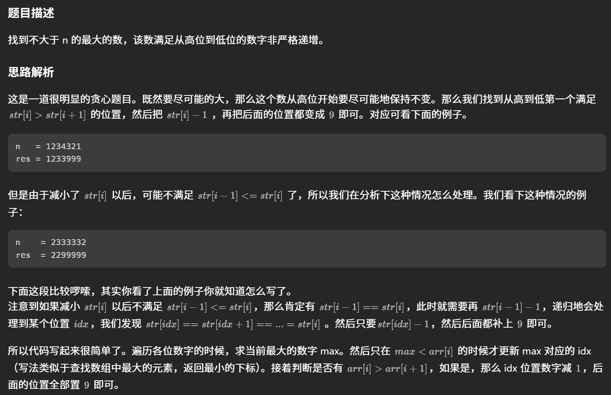

题目要求小于等于N的最大单调递增的整数，那么拿一个两位的数字来举例。

例如：98，一旦出现strNum[i - 1] > strNum[i]的情况（非单调递增），首先想让strNum[i - 1]--，然后strNum[i]给为9，这样这个整数就是89，即小于98的最大的单调递增整数。

这一点如果想清楚了，这道题就好办了。

此时是从前向后遍历还是从后向前遍历呢？

从前向后遍历的话，遇到strNum[i - 1] > strNum[i]的情况，让strNum[i - 1]减一，但此时如果strNum[i - 1]减一了，可能又小于strNum[i - 2]。

这么说有点抽象，举个例子，数字：332，从前向后遍历的话，那么就把变成了329，此时2又小于了第一位的3了，真正的结果应该是299。

那么从后向前遍历，就可以重复利用上次比较得出的结果了，从后向前遍历332的数值变化为：332 -> 329 -> 299

确定了遍历顺序之后，那么此时局部最优就可以推出全局，找不出反例，试试贪心。

```c++
class Solution
{
public:
    int monotoneIncreasingDigits(int n)
    {
        string strNum = to_string(n);

        // flag用来标记赋值9从哪里开始
        // 设置为这个默认值，为了防止第二个for循环在flag没有被赋值的情况下执行
        int flag = strNum.size();

        for (int i = strNum.size() - 1; i > 0; i--)
        {
            if (strNum[i - 1] > strNum[i])
            {
                flag = i;
                strNum[i - 1]--;
            }
        }

        for (int i = flag; i < strNum.size(); i++)
        {
            strNum[i] = '9';
        }

        return stoi(strNum);
    }
};
```


# 动态规划

## [509. 斐波那契数](https://leetcode.cn/problems/fibonacci-number/)

**斐波那契数** （通常用 `F(n)` 表示）形成的序列称为 **斐波那契数列** 。该数列由 `0` 和 `1` 开始，后面的每一项数字都是前面两项数字的和。也就是：

```
F(0) = 0，F(1) = 1
F(n) = F(n - 1) + F(n - 2)，其中 n > 1
```

给定 `n` ，请计算 `F(n)` 。

```c++
class Solution
{
public:
    int fib(int n)
    {
        if (n <= 1) return n;
        vector<int> dp(n + 1);
        dp[0] = 0;
        dp[1] = 1;
        for (int i = 2; i <= n; i++)
        {
            dp[i] = dp[i - 1] + dp[i - 2];
        }
        return dp[n];
    }
};
```

## [70. 爬楼梯](https://leetcode.cn/problems/climbing-stairs/)

假设你正在爬楼梯。需要 `n` 阶你才能到达楼顶。

每次你可以爬 `1` 或 `2` 个台阶。你有多少种不同的方法可以爬到楼顶呢？

**示例 1：**

```
输入：n = 2
输出：2
解释：有两种方法可以爬到楼顶。
1. 1 阶 + 1 阶
2. 2 阶
```

**示例 2：**

```
输入：n = 3
输出：3
解释：有三种方法可以爬到楼顶。
1. 1 阶 + 1 阶 + 1 阶
2. 1 阶 + 2 阶
3. 2 阶 + 1 阶
```

**提示：**

- `1 <= n <= 45`

```c++
class Solution
{
public:
    int climbStairs(int n)
    {
        if (n <= 1)
            return n;
        vector<int> dp(n + 1);
        dp[1] = 1;
        dp[2] = 2;
        for (int i = 3; i <= n; i++)
        {
            dp[i] = dp[i - 1] + dp[i - 2];
        }
        return dp[n];
    }
};
```

## [746. 使用最小花费爬楼梯](https://leetcode.cn/problems/min-cost-climbing-stairs/)

给你一个整数数组 `cost` ，其中 `cost[i]` 是从楼梯第 `i` 个台阶向上爬需要支付的费用。一旦你支付此费用，即可选择向上爬一个或者两个台阶。

你可以选择从下标为 `0` 或下标为 `1` 的台阶开始爬楼梯。

请你计算并返回达到楼梯顶部的最低花费。

**示例 1：**

```
输入：cost = [10,15,20]
输出：15
解释：你将从下标为 1 的台阶开始。
- 支付 15 ，向上爬两个台阶，到达楼梯顶部。
总花费为 15 。
```

**示例 2：**

```
输入：cost = [1,100,1,1,1,100,1,1,100,1]
输出：6
解释：你将从下标为 0 的台阶开始。
- 支付 1 ，向上爬两个台阶，到达下标为 2 的台阶。
- 支付 1 ，向上爬两个台阶，到达下标为 4 的台阶。
- 支付 1 ，向上爬两个台阶，到达下标为 6 的台阶。
- 支付 1 ，向上爬一个台阶，到达下标为 7 的台阶。
- 支付 1 ，向上爬两个台阶，到达下标为 9 的台阶。
- 支付 1 ，向上爬一个台阶，到达楼梯顶部。
总花费为 6 。
```

**提示：**

- `2 <= cost.length <= 1000`
- `0 <= cost[i] <= 999`

```c++
class Solution
{
public:
    int minCostClimbingStairs(vector<int> &cost)
    {

        int n = cost.size();
        vector<int> dp(n + 1);

        dp[0] = 0;
        dp[1] = 0;

        for (int i = 2; i <= n; i++)
        {
            dp[i] = min(dp[i - 1] + cost[i - 1], dp[i - 2] + cost[i - 2]);
        }
        return dp[n];
    }
};
```

## [62. 不同路径](https://leetcode.cn/problems/unique-paths/)

一个机器人位于一个 `m x n` 网格的左上角 （起始点在下图中标记为 “Start” ）。

机器人每次只能向下或者向右移动一步。机器人试图达到网格的右下角（在下图中标记为 “Finish” ）。

问总共有多少条不同的路径？

**示例 1：**


```
输入：m = 3, n = 7
输出：28
```

**示例 2：**

```
输入：m = 3, n = 2
输出：3
解释：
从左上角开始，总共有 3 条路径可以到达右下角。
1. 向右 -> 向下 -> 向下
2. 向下 -> 向下 -> 向右
3. 向下 -> 向右 -> 向下
```

**示例 3：**

```
输入：m = 7, n = 3
输出：28
```

**示例 4：**

```
输入：m = 3, n = 3
输出：6
```

**提示：**

- `1 <= m, n <= 100`
- 题目数据保证答案小于等于 `2 * 109`

```c++
class Solution
{
public:
    int uniquePaths(int m, int n)
    {
        vector<vector<int>> dp(m, vector<int>(n, 0));
        for (int i = 0; i < m; i++)
        {
            dp[i][0] = 1;
        }
        for (int i = 0; i < n; i++)
        {
            dp[0][i] = 1;
        }

        for (int i = 1; i < m; i++)
        {
            for (int j = 1; j < n; j++)
            {
                dp[i][j] = dp[i - 1][j] + dp[i][j - 1];
            }
        }
        return dp[m - 1][n - 1];
    }
};
```

## [63. 不同路径 II](https://leetcode.cn/problems/unique-paths-ii/)

给定一个 `m x n` 的整数数组 `grid`。一个机器人初始位于 **左上角**（即 `grid[0][0]`）。机器人尝试移动到 **右下角**（即 `grid[m - 1][n - 1]`）。机器人每次只能向下或者向右移动一步。

网格中的障碍物和空位置分别用 `1` 和 `0` 来表示。机器人的移动路径中不能包含 **任何** 有障碍物的方格。

返回机器人能够到达右下角的不同路径数量。

测试用例保证答案小于等于 `2 * 109`。

**示例 1：**


```
输入：obstacleGrid = [[0,0,0],[0,1,0],[0,0,0]]
输出：2
解释：3x3 网格的正中间有一个障碍物。
从左上角到右下角一共有 2 条不同的路径：
1. 向右 -> 向右 -> 向下 -> 向下
2. 向下 -> 向下 -> 向右 -> 向右
```

**示例 2：**


```
输入：obstacleGrid = [[0,1],[0,0]]
输出：1
```

**提示：**

- `m == obstacleGrid.length`
- `n == obstacleGrid[i].length`
- `1 <= m, n <= 100`
- `obstacleGrid[i][j]` 为 `0` 或 `1`

```c++
class Solution
{
public:
    int uniquePathsWithObstacles(vector<vector<int>> &obstacleGrid)
    {
        int m = obstacleGrid.size();
        int n = obstacleGrid[0].size();
        if (obstacleGrid[m - 1][n - 1] == 1 || obstacleGrid[0][0] == 1) // 如果在起点或终点出现了障碍，直接返回0
            return 0;
        vector<vector<int>> dp(m, vector<int>(n, 0));

        // 如果第一行或者第一列某个位置有障碍物，那么后面的都不能到达
        // 初始化的部分，很容易忽略了障碍之后应该都是0的情况
        for (int i = 0; i < m; i++)
        {
            if (obstacleGrid[i][0] == 0)
            {
                dp[i][0] = 1;
            }
            else
            {
                break;
            }
        }

        for (int i = 0; i < n; i++)
        {
            if (obstacleGrid[0][i] == 0)
            {
                dp[0][i] = 1;
            }
            else
            {
                break;
            }
        }

        for (int i = 1; i < m; i++)
        {
            for (int j = 1; j < n; j++)
            {
                if (obstacleGrid[i][j] == 0)
                {
                    dp[i][j] = dp[i - 1][j] + dp[i][j - 1];
                }
            }
        }
        return dp[m - 1][n - 1];
    }
};
```

## [64. 最小路径和](https://leetcode.cn/problems/minimum-path-sum/)

给定一个包含非负整数的 `*m* x *n*` 网格 `grid` ，请找出一条从左上角到右下角的路径，使得路径上的数字总和为最小。

**说明：**每次只能向下或者向右移动一步。

**示例 1：**


```
输入：grid = [[1,3,1],[1,5,1],[4,2,1]]
输出：7
解释：因为路径 1→3→1→1→1 的总和最小。
```

**示例 2：**

```
输入：grid = [[1,2,3],[4,5,6]]
输出：12
```

**提示：**

- `m == grid.length`
- `n == grid[i].length`
- `1 <= m, n <= 200`
- `0 <= grid[i][j] <= 200`

```c++
class Solution
{
public:
    int minPathSum(vector<vector<int>> &grid)
    {
        int m = grid.size();    // 行数
        int n = grid[0].size(); // 列数

        // 创建dp数组，存储到每个位置的最小路径和
        vector<vector<int>> dp(m, vector<int>(n, 0));

        // 初始化起点
        dp[0][0] = grid[0][0];

        // 填充第一行（只能从左边过来）
        for (int j = 1; j < n; ++j)
        {
            dp[0][j] = dp[0][j - 1] + grid[0][j];
        }

        // 填充第一列（只能从上面过来）
        for (int i = 1; i < m; ++i)
        {
            dp[i][0] = dp[i - 1][0] + grid[i][0];
        }

        // 填充其余位置
        for (int i = 1; i < m; ++i)
        {
            for (int j = 1; j < n; ++j)
            {
                // 取上面或左边路径的最小值，加上当前格子的值
                dp[i][j] = min(dp[i - 1][j], dp[i][j - 1]) + grid[i][j];
            }
        }

        // 右下角的dp值就是答案
        return dp[m - 1][n - 1];
    }
};
```

## [343. 整数拆分](https://leetcode.cn/problems/integer-break/)

给定一个正整数 `n` ，将其拆分为 `k` 个 **正整数** 的和（ `k >= 2` ），并使这些整数的乘积最大化。

返回 *你可以获得的最大乘积* 。

**示例 1:**

```
输入: n = 2
输出: 1
解释: 2 = 1 + 1, 1 × 1 = 1。
```

**示例 2:**

```
输入: n = 10
输出: 36
解释: 10 = 3 + 3 + 4, 3 × 3 × 4 = 36。
```

**提示:**

- `2 <= n <= 58`

```c++
class Solution
{
public:
    int integerBreak(int n)
    {
        vector<int> dp(n + 10);

        dp[2] = 1;
        // dp[3] = 2;
        for (int i = 3; i <= n; i++)
        {
            for (int j = 1; j <= i - 1; j++)
            {
                int num1 = j;
                int num2 = i - j;
                num1 = max(num1, dp[num1]);
                num2 = max(num2, dp[num2]);
                dp[i] = max(dp[i], num1 * num2);
            }
        }
        return dp[n];
    }
};
```

## [96. 不同的二叉搜索树](https://leetcode.cn/problems/unique-binary-search-trees/)

给你一个整数 `n` ，求恰由 `n` 个节点组成且节点值从 `1` 到 `n` 互不相同的 **二叉搜索树** 有多少种？返回满足题意的二叉搜索树的种数。

**示例 1：**


```
输入：n = 3
输出：5
```

**示例 2：**

```
输入：n = 1
输出：1
```

**提示：**

- `1 <= n <= 19`

思路https://leetcode.cn/problems/unique-binary-search-trees/solutions/6693/hua-jie-suan-fa-96-bu-tong-de-er-cha-sou-suo-shu-b/

难点：f(i)=G(i−1)∗G(n−i)

首先，这个公式翻译一下就是以i为根节点的二叉搜索树的数量等于以i-1的总数的二叉搜索树的数量乘以以n-1的二叉搜索树的数量。

什么意思呢？

意思就是

假设有n==100,i=50，那么就有以50这个数字为根节点的二叉搜索树的数量等于以49为总数的二叉搜索树的数量乘以以50为总数的二叉搜索树的数量。注意，此时50和49和50，三个数字代表的是不同的意义，第一个50是根节点，第二个49是总数，第三个50还是总数。

想象一下，50这个数字的左边，很明显仅能够从1到49这49个数字进行挑选，这很好理解，因为二叉搜索树的左子树的所有值都必须小于根节点，它们继续在50的左子树下面排列组合，得出的最终各种排列的总数就是G(49)。重点在后面，在50这个数字的根节点的右边，很显然只能是51到100，这50个数字进行排列组合，此时很多人不理解，为什么51到100的排列组合的总数等于G(50)，G(50)从字面意义上看，也就是从0到50的排列组合的总数。

其实道理很简单，将51到100这些数字排列组合的总数，是等于从0到50的排列组合的总数的，因为将51替换为1，将52替换为2，以此类推下去，将100替换为50，就很容易理解了，因为本质上就是50个从大到小的不同的数进行二叉树的排列组合，不论是1001到1050，还是从51到100，所排列组合的二叉树数量是一样的。

所以，这也就解释了这个公式为什么是f(50) = G(49) * G(50)，因为在50这个根节点的左边，有1到49这些数字在不断进行排列组合得出总的排列组合数，在50的右边，有51到100这些数字同样的在不断的进行排列组合得出总的排列组合数，自然而然的，50作为根节点时，所能得到的不同组合，就是G(49) * G(50)了。

```c++
class Solution
{
public:
    int numTrees(int n)
    {
        vector<int> dp(n+1);

        dp[0] = 1;

        for(int i = 1;i<=n;i++)
        {
            for(int j = 1;j<=i;j++)
            {
                dp[i] += dp[j-1]*dp[i-j];
            }
        }
        return dp[n];
    }
};
```

## 01背包

给定一组物品，每种物品都有自己的重量和价值。在限定的总重量内，我们如何选择物品，使得物品的总价值最大。这里的“01”表示每种物品只能选择拿（1）或不拿（0），不能分割物品。

### 二维dp

```c++
int main()
{
    int n, m;
    cin >> n >> m;
    vector<int> v(n + 10); // 价值
    vector<int> w(n + 10); // 体积

    for (int i = 1; i <= n; i++)
    {
        cin >> w[i];
    }

    for (int i = 1; i <= n; i++)
    {
        cin >> v[i];
    }

    vector<vector<int>> dp(n + 10, vector<int>(m + 10, 0));

    for (int i = 1; i <= n; i++)
    {
        for (int j = 0; j <= m; j++)
        {
            if (j < w[i]) // 不能放第i件物品
            {
                dp[i][j] = dp[i - 1][j];
            }
            else // 可以放第i件物品
            {
                // 0-1背包：只能选一次，所以是 dp[i-1][j-w[i]] + v[i]
                dp[i][j] = max(dp[i - 1][j], dp[i - 1][j - w[i]] + v[i]);
            }
        }
    }

    cout << dp[n][m] << endl;
}
```

### 一维dp

**倒序遍历背包容量是为了保证物品i只被放入一次！**

```c++
#include <bits/stdc++.h>
using namespace std;

int main()
{
    int n, bagweight; // bagweight代表行李箱空间
    cin >> n >> bagweight;

    vector<int> w(n + 10, 0); // 存储每件物品所占空间
    vector<int> v(n + 10, 0); // 存储每件物品价值

    for (int i = 1; i <= n; i++)
    {
        cin >> w[i];
    }

    for (int i = 1; i <= n; i++)
    {
        cin >> v[i];
    }

    // 创建一个动态规划数组dp，初始值为0
    vector<int> dp(bagweight + 10, 0);

    for (int i = 1; i <= n; i++) // 遍历物品
    {
        for (int j = bagweight; j >= w[i]; j--) // 遍历背包容量
        {
            dp[j] = max(dp[j], dp[j - w[i]] + v[i]);
        }
    }

    cout << dp[bagweight] << endl;

    return 0;
}
```

## [416. 分割等和子集](https://leetcode.cn/problems/partition-equal-subset-sum/)

给你一个 **只包含正整数** 的 **非空** 数组 `nums` 。请你判断是否可以将这个数组分割成两个子集，使得两个子集的元素和相等。

**示例 1：**

```
输入：nums = [1,5,11,5]
输出：true
解释：数组可以分割成 [1, 5, 5] 和 [11] 。
```

**示例 2：**

```
输入：nums = [1,2,3,5]
输出：false
解释：数组不能分割成两个元素和相等的子集。
```

**提示：**

- `1 <= nums.length <= 200`
- `1 <= nums[i] <= 100`

```c++
class Solution
{
public:
    bool canPartition(vector<int> &nums)
    {
        // dp[j] 表示在给定的数组元素中，能够凑成的不超过 j 的最大子集和
        vector<int> dp(200010, 0);

        int sum = 0;
        for (auto &ob : nums) sum += ob;

        if (sum % 2 == 1) return false;

        sum /= 2;
        int n = nums.size();
        for (int i = 0; i < n; i++)
        {
            for (int j = sum; j >= nums[i]; j--)
            {
                dp[j] = max(dp[j], dp[j - nums[i]] + nums[i]);
            }
        }

        // dp[j]的数值一定是小于等于j的。
        // 如果dp[j] == j 说明
        // 集合中的子集总和正好可以凑成总和j，理解这一点很重要。
        if (dp[sum] == sum) return true;

        return false;
    }
};
```

## [1049. 最后一块石头的重量 II](https://leetcode.cn/problems/last-stone-weight-ii/)

有一堆石头，用整数数组 `stones` 表示。其中 `stones[i]` 表示第 `i` 块石头的重量。

每一回合，从中选出**任意两块石头**，然后将它们一起粉碎。假设石头的重量分别为 `x` 和 `y`，且 `x <= y`。那么粉碎的可能结果如下：

- 如果 `x == y`，那么两块石头都会被完全粉碎；
- 如果 `x != y`，那么重量为 `x` 的石头将会完全粉碎，而重量为 `y` 的石头新重量为 `y-x`。

最后，**最多只会剩下一块** 石头。返回此石头 **最小的可能重量** 。如果没有石头剩下，就返回 `0`。

**示例 1：**

```
输入：stones = [2,7,4,1,8,1]
输出：1
解释：
组合 2 和 4，得到 2，所以数组转化为 [2,7,1,8,1]，
组合 7 和 8，得到 1，所以数组转化为 [2,1,1,1]，
组合 2 和 1，得到 1，所以数组转化为 [1,1,1]，
组合 1 和 1，得到 0，所以数组转化为 [1]，这就是最优值。
```

**示例 2：**

```
输入：stones = [31,26,33,21,40]
输出：5
```

**提示：**

- `1 <= stones.length <= 30`
- `1 <= stones[i] <= 100`

题目要求通过不断碰撞石头（每次选两块石头 `x` 和 `y`，碰撞后剩下 `|x-y|`），最终使剩下的石头重量最小。这个问题可以转化为：**将石头尽可能平均地分成两堆**，两堆重量之差就是最后剩下的最小重量。

```c++
class Solution
{
public:
    int lastStoneWeightII(vector<int> &stones)
    {
        // dp[j] 表示在给定的石头中，能够选出一部分石头，使得它们的总重量不超过 j，
        // 且这个总重量尽可能大（即不超过 j 的最大子集和）
        vector<int> dp(300010, 0);

        int sum = 0;
        for (auto &ob : stones)
            sum += ob;
        int target = sum / 2;

        for (int i = 0; i < stones.size(); i++)
        {
            for (int j = target; j >= stones[i]; j--)
            {
                dp[j] = max(dp[j], dp[j - stones[i]] + stones[i]);
            }
        }

        return (sum - dp[target]) - dp[target];
    }
};
```

## [494. 目标和](https://leetcode.cn/problems/target-sum/)

给你一个非负整数数组 `nums` 和一个整数 `target` 。

向数组中的每个整数前添加 `'+'` 或 `'-'` ，然后串联起所有整数，可以构造一个 **表达式** ：

- 例如，`nums = [2, 1]` ，可以在 `2` 之前添加 `'+'` ，在 `1` 之前添加 `'-'` ，然后串联起来得到表达式 `"+2-1"` 。

返回可以通过上述方法构造的、运算结果等于 `target` 的不同 **表达式** 的数目。

**示例 1：**

```
输入：nums = [1,1,1,1,1], target = 3
输出：5
解释：一共有 5 种方法让最终目标和为 3 。
-1 + 1 + 1 + 1 + 1 = 3
+1 - 1 + 1 + 1 + 1 = 3
+1 + 1 - 1 + 1 + 1 = 3
+1 + 1 + 1 - 1 + 1 = 3
+1 + 1 + 1 + 1 - 1 = 3
```

**示例 2：**

```
输入：nums = [1], target = 1
输出：1
```

**提示：**

- `1 <= nums.length <= 20`
- `0 <= nums[i] <= 1000`
- `0 <= sum(nums[i]) <= 1000`
- `-1000 <= target <= 1000`

假设加法的总和为x，那么减法对应的总和就是`sum - x`。所以我们要求的是 `x - (sum - x) = target`，`x = (target + sum) / 2`。**此时问题就转化为，用nums装满容量为x的背包，有几种方法**。这里的`x`，就是`bagSize`，也就是我们后面要求的背包容量。

看到`(target + sum) / 2` 应该担心计算的过程中向下取整有没有影响。这么担心就对了，例如sum是5，target是2 的话其实就是无解的，所以：

```c++
if ((target + sum) % 2 == 1) return 0; // 此时没有方案
```

同时如果target 的绝对值已经大于sum，那么也是没有方案的：

```c++
if (abs(target) > sum) return 0; // 此时没有方案
```

因为每个物品（题目中的1）只用一次！

这次和之前遇到的背包问题不一样了，之前都是求容量为j的背包，最多能装多少。

本题则是装满有几种方法。其实这就是一个组合问题了。

```c++
class Solution
{
public:
    int findTargetSumWays二维背包(vector<int> &nums, int target) // 二维背包
    {
        int sum = 0;
        for (auto &num : nums)
        {
            sum += num;
        }
        if (sum < abs(target) || (sum + target) % 2 != 0)
        {
            return 0;
        }
        int m = (sum + target) / 2;
        int n = nums.size();
        vector<vector<int>> dp(n + 1, vector<int>(m + 1, 0));
        // 第一维是物品，第二维是容量。
        // 0个物品，除了容量=0,无论容量是多少，方法都是0种
        // 容量为0，无论物品有多少，方法都只有一种，空集
        for (int i = 0; i <= n; i++) // 初始化容量为0的情况
        {
            dp[i][0] = 1;
        }

        // 这里的i从1~n是nums数组的第一个元素到最后一个元素
        for (int i = 1; i <= n; i++) // 物品
        {
            for (int j = 0; j <= m; j++) // 容量
            {
                // nums[i-1]是当前物品
                if (nums[i - 1] > j)
                {
                    dp[i][j] = dp[i - 1][j];
                }
                else
                {
                    dp[i][j] = dp[i - 1][j] + dp[i - 1][j - nums[i - 1]];
                }
            }
        }
        return dp[n][m];
    }

    int findTargetSumWays一维背包(vector<int> &nums, int target) // 一维背包
    {
        int sum = 0;
        for (auto &num : nums)
        {
            sum += num;
        }
        if (sum < abs(target) || (sum + target) % 2 != 0)
        {
            return 0;
        }
        int m = (sum + target) / 2;
        int n = nums.size();

        // dp[i]代表当前容量为i时方案的种类数
        vector<int> dp(m + 10);
        dp[0] = 1;

        for (int i = 0; i < n; ++i) // 物品
        {
            for (int j = m; j >= nums[i]; j--) // 容量
            {
                // dp[j]：不选nums[i]
                // dp[j - nums[i]]：选nums[i]
                dp[j] = dp[j] + dp[j - nums[i]];
            }
        }
        return dp[m];
    }
};
```

## [474. 一和零](https://leetcode.cn/problems/ones-and-zeroes/)

给你一个二进制字符串数组 `strs` 和两个整数 `m` 和 `n` 。

请你找出并返回 `strs` 的最大子集的长度，该子集中 **最多** 有 `m` 个 `0` 和 `n` 个 `1` 。

如果 `x` 的所有元素也是 `y` 的元素，集合 `x` 是集合 `y` 的 **子集** 。

**示例 1：**

```
输入：strs = ["10", "0001", "111001", "1", "0"], m = 5, n = 3
输出：4
解释：最多有 5 个 0 和 3 个 1 的最大子集是 {"10","0001","1","0"} ，因此答案是 4 。
其他满足题意但较小的子集包括 {"0001","1"} 和 {"10","1","0"} 。{"111001"} 不满足题意，因为它含 4 个 1 ，大于 n 的值 3 。
```

**示例 2：**

```
输入：strs = ["10", "0", "1"], m = 1, n = 1
输出：2
解释：最大的子集是 {"0", "1"} ，所以答案是 2 。
```

**提示：**

- `1 <= strs.length <= 600`
- `1 <= strs[i].length <= 100`
- `strs[i]` 仅由 `'0'` 和 `'1'` 组成
- `1 <= m, n <= 100`

**本题中strs 数组里的元素就是物品，每个物品都是一个！而m 和 n相当于是一个背包，两个维度的背包**。

本题其实是01背包问题！只不过这个背包有两个维度，一个是m 一个是n，而不同长度的字符串就是不同大小的待装物品。

**1.确定dp数组（dp table）以及下标的含义**

`dp[i][j]`：最多有`i`个0和`j`个1的`strs`的最大子集的大小为`dp[i][j]`。

**2.确定递推公式**

`dp[i][j]`可以由前一个`strs`里的字符串推导出来，`strs`里的字符串有`zeroNum`个0，`oneNum`个1。

`dp[i][j]`就可以是 `dp[i- zeroNum][j - oneNum] + 1`。

然后我们在遍历的过程中，取`dp[i][j]`[j]的最大值。

所以递推公式：`dp[i][j] = max(dp[i][j], dp[i - zeroNum][j - oneNum] + 1)`;

此时大家可以回想一下01背包的递推公式：`dp[j] = max(dp[j], dp[j - weight[i]] + value[i])`;

对比一下就会发现，字符串的`zeroNum`和`oneNum`相当于物品的重量`（weight[i]）`，字符串本身的个数相当于物品的价值`（value[i]）`。

**这就是一个典型的01背包！** 只不过物品的重量有了两个维度而已。

**3.dp数组如何初始化**

因为物品价值不会是负数，初始为0，保证递推的时候dp[i][j]不会被初始值覆盖。

**4.确定遍历顺序**

01背包是外层for循环遍历物品，内层for循环遍历背包容量且从后向前遍历！那么本题也是，物品就是strs里的字符串，背包容量就是题目描述中的m和n。

```c++
class Solution
{
public:
    int findMaxForm(vector<string> &strs, int m, int n)
    {
        // m个0,n个1
        // dp[i][j]：最多有i个0和j个1的strs的最大子集的大小为dp[i][j]
        vector<vector<int>> dp(m + 10, vector<int>(n + 10, 0));

        dp[0][0] = 0; // 空集

        // 遍历物品
        for (auto &str : strs)
        {
            int onenum = 0;
            int zeronum = 0;
            for (auto &c : str)
            {
                if (c == '1')
                    onenum++;
                if (c == '0')
                    zeronum++;
            }

            // 遍历背包
            for (int i = m; i >= zeronum; i--) // 0的个数
            {
                for (int j = n; j >= onenum; j--) // 1的个数
                {

                    dp[i][j] = max(dp[i][j], dp[i - zeronum][j - onenum] + 1);
                }
            }
        }
        return dp[m][n];
    }
};
```

## 完全背包

给定N种物品和一个容量为V的背包，每种物品都有无限件可用。第i种物品的体积是w[i]，价值是v[i]。求解将哪些物品装入背包可使这些物品的体积总和不超过背包容量，且价值总和最大。

### 二维dp

```c++
int main()
{
    int n, m;
    cin >> n >> m;
    vector<int> v(n); // 体积
    vector<int> w(n); // 价值

    for (int i = 1; i <= n; i++)
    {
        cin >> w[i] >> v[i];
    }

    // dp[i][j]表示从前 i 种物品中进行选择，总体积小于等于 j 所能获得的最大价值
    // dp[0][i]=0说明无物品可选，那么最大价值为0
    // dp[i][0]=0说明容量为0，不能选物品，最大价值为0
    vector<vector<int>> dp(n + 10, vector<int>(m + 10, 0));

    for(int i = 1;i<=n;i++) //1~n:第一种物品一直到第n种物品
    {
        for(int j = 0;j<=m;j++)//0~m:容积从0到m
        {
            if(j<w[i])
            {
                dp[i][j] = dp[i-1][j];
            }
            else
            {
                dp[i][j] = max(dp[i-1][j],dp[i][j-w[i]]+v[i]);
            }
        }
    }

    cout << dp[n][m] << endl; 

    return 0;
}
```

### 一维dp

```c++
int main()
{
    int n, m;
    cin >> n >> m;
    vector<int> v(n + 10); // 价值
    vector<int> w(n + 10); // 体积

    for (int i = 1; i <= n; i++)
    {
        cin >> w[i] >> v[i];
    }

    vector<int> dp(m + 10, 0);

    for (int i = 1; i <= n; i++)
    {
        for (int j = w[i]; j <= m; j++)
        {
            dp[j] = max(dp[j], dp[j - w[i]] + v[i]);
        }
    }

    cout << dp[m] << endl;
}
```

### 注意点

**为什么遍历顺序不同？**

1. **01背包逆序的原因**：
   - 确保每个物品只被考虑一次
   - 逆序保证计算dp[j]时，dp[j - w[i]]还未被当前物品更新过
   - 防止同一物品被多次选取
2. **完全背包正序的原因**：
   - 允许同一物品被多次选取
   - 正序使得dp[j - w[i]]可能已经包含当前物品
   - 实现了"物品无限次使用"的效果

```c++
// 0-1背包的状态转移方程
dp[i][j] = max(dp[i - 1][j], dp[i - 1][j - w[i]] + v[i])
// 完全背包的状态转移方程
dp[i][j] = max(dp[i - 1][j], dp[i][j - w[i]] + v[i])
```

在0-1背包中，每个物品只能选择一次（选或不选），所以：

1. `dp[i-1][j]` 表示不选第i个物品时的最大价值
2. `dp[i-1][j-w[i]] + v[i]` 表示选择第i个物品时的最大价值（注意是从i-1转移而来）

在完全背包中，每个物品可以选择多次，所以：

1. `dp[i-1][j]` 表示不选第i个物品时的最大价值（和0-1背包一样）
2. `dp[i][j-w[i]] + v[i]` 表示选择第i个物品时的最大价值（关键区别是从i转移而来）

区别：

- 0-1背包中，当我们决定选择当前物品时，我们必须从"前i-1个物品"的状态转移过来（`dp[i-1][j-w[i]]`），因为每个物品只能选一次。
- 完全背包中，当我们决定选择当前物品时，我们可以从"前i个物品"的状态转移过来（`dp[i][j-w[i]]`），因为我们可以重复选择当前物品。

## 排列数和组合数

**组合不强调元素之间的顺序，排列强调元素之间的顺序**。

**组合数**

**问题**：给定一组硬币（可无限使用），求凑成目标金额的组合数（顺序不同视为同一种）。

- **外层循环遍历物品**（`coins`），保证硬币的选择顺序固定，避免重复计算。
- **内层循环遍历金额**（`amount`），计算每个金额的组合数。

```c++
int combinationSum(vector<int>& coins, int amount) {
    vector<int> dp(amount + 1, 0);
    dp[0] = 1; // 金额为0时，有1种方式（不选任何硬币）
    for (int coin : coins) { // 物品在外层循环
        for (int i = coin; i <= amount; i++) {
            dp[i] += dp[i - coin];
        }
    }
    return dp[amount];
}
```

**排列数**

**问题**：给定一组硬币（可无限使用），求凑成目标金额的排列数（顺序不同视为不同）。

```c++
int permutationSum(vector<int>& coins, int amount) {
    vector<int> dp(amount + 1, 0);
    dp[0] = 1; // 金额为0时，有1种方式（不选任何硬币）
    for (int i = 1; i <= amount; i++) { // 金额在外层循环
        for (int coin : coins) { // 物品在内层循环
            if (i >= coin) {
                dp[i] += dp[i - coin];
            }
        }
    }
    return dp[amount];
}
```

- **外层循环遍历金额**（`amount`），内层循环遍历物品（`coins`），允许不同顺序的组合。

**模拟分析（硬币 `[1,2]`，目标金额 `3`）**

`dp[j]` 表示「凑出金额 `j` 的方案数」，初始状态 `dp[0] = 1`（凑 0 元只有 1 种方案：不用任何硬币）。

1.第一种遍历顺序（先物品，再容量）

```cpp
// 先遍历硬币（物品），再遍历金额（容量）
for (int i = 0; i < coins.size(); i++) { 
    for (int j = coins[i]; j <= amount; j++) { 
        dp[j] += dp[j - coins[i]];
    }
}
```

- **第一步：处理硬币 `1`（i=0）**
  遍历金额 `j` 从 `1` 到 `3`：
  - `j=1`：`dp[1] += dp[1-1]` → `dp[1] = dp[1] + dp[0] = 0 + 1 = 1`（方案：`[1]`）
  - `j=2`：`dp[2] += dp[2-1]` → `dp[2] = 0 + dp[1] = 1`（方案：`[1,1]`）
  - `j=3`：`dp[3] += dp[3-1]` → `dp[3] = 0 + dp[2] = 1`（方案：`[1,1,1]`）
- **第二步：处理硬币 `2`（i=1）**
  遍历金额 `j` 从 `2` 到 `3`：
  - `j=2`：`dp[2] += dp[2-2]` → `dp[2] = 1 + dp[0] = 2`（新增方案：`[2]`，此时总方案 `[1,1], [2]`）
  - `j=3`：`dp[3] += dp[3-2]` → `dp[3] = 1 + dp[1] = 2`（新增方案：`[1,2]`，此时总方案 `[1,1,1], [1,2]`）

**结果**：`dp[3] = 2`，只包含 `[1,1,1]` 和 `[1,2]`（`2+1` 未被计数，因为顺序不影响组合）。

2.第二种遍历顺序（先容量，再物品）

```cpp
// 先遍历金额（容量），再遍历硬币（物品）
for (int j = 0; j <= amount; j++) { 
    for (int i = 0; i < coins.size(); i++) { 
        if (j - coins[i] >= 0) dp[j] += dp[j - coins[i]];
    }
}
```

- **第一步：处理金额 `j=0`**
  所有硬币都不满足 `j >= coins[i]`，`dp[0]` 保持为 `1`。
- **第二步：处理金额 `j=1`**
  遍历硬币 `1` 和 `2`：
  - 硬币 `1`：`dp[1] += dp[1-1]` → `dp[1] = 0 + 1 = 1`（方案：`[1]`）
  - 硬币 `2`：`1 < 2` 不满足，无变化。
- **第三步：处理金额 `j=2`**
  遍历硬币 `1` 和 `2`：
  - 硬币 `1`：`dp[2] += dp[2-1]` → `dp[2] = 0 + dp[1] = 1`（方案：`[1,1]`）
  - 硬币 `2`：`dp[2] += dp[2-2]` → `dp[2] = 1 + dp[0] = 2`（新增方案：`[2]`）
- **第四步：处理金额 `j=3`**
  遍历硬币 `1` 和 `2`：
  - 硬币 `1`：`dp[3] += dp[3-1]` → `dp[3] = 0 + dp[2] = 2`（方案：`[1,1,1]`、`[1,2]`）
  - 硬币 `2`：`dp[3] += dp[3-2]` → `dp[3] = 2 + dp[1] = 3`（新增方案：`[2,1]`）

**结果**：`dp[3] = 3`，包含 `[1,1,1]`、`[1,2]`、`[2,1]`（`1+2` 和 `2+1` 被视为两种方案）。

## [518. 零钱兑换 II](https://leetcode.cn/problems/coin-change-ii/)

给你一个整数数组 `coins` 表示不同面额的硬币，另给一个整数 `amount` 表示总金额。

请你计算并返回可以凑成总金额的硬币组合数。如果任何硬币组合都无法凑出总金额，返回 `0` 。

假设每一种面额的硬币有无限个。 

题目数据保证结果符合 32 位带符号整数。

**示例 1：**

```
输入：amount = 5, coins = [1, 2, 5]
输出：4
解释：有四种方式可以凑成总金额：
5=5
5=2+2+1
5=2+1+1+1
5=1+1+1+1+1
```

**示例 2：**

```
输入：amount = 3, coins = [2]
输出：0
解释：只用面额 2 的硬币不能凑成总金额 3 。
```

**示例 3：**

```
输入：amount = 10, coins = [10] 
输出：1
```

**提示：**

- `1 <= coins.length <= 300`
- `1 <= coins[i] <= 5000`
- `coins` 中的所有值 **互不相同**
- `0 <= amount <= 5000`

本题其实与我们讲过 [494. 目标和](https://programmercarl.com/0494.目标和.html)十分类似。[494. 目标和](https://programmercarl.com/0494.目标和.html)求的是装满背包有多少种方法，而本题是求装满背包有多少种组合。这有啥区别？**求装满背包有几种方法其实就是求组合数**。 不过 [494. 目标和](https://programmercarl.com/0494.目标和.html)是 01背包，即每一类物品只有一个。

```c++
class Solution
{
public:
    int change(unsigned int amount, vector<int> &coins)
    {
        int n = coins.size();

        vector<unsigned int> dp(amount + 10, 0);
        dp[0] = 1; // 金额为0时，有1种方式（不选任何硬币）

        // 组合数
        for (int i = 0; i < n; i++)
        {
            for (int j = coins[i]; j <= amount; j++)
            {
                dp[j] += dp[j - coins[i]];
            }
        }

        return dp[amount];
    }
};
```

## [377. 组合总和 Ⅳ](https://leetcode.cn/problems/combination-sum-iv/)

给你一个由 **不同** 整数组成的数组 `nums` ，和一个目标整数 `target` 。请你从 `nums` 中找出并返回总和为 `target` 的元素组合的个数。

题目数据保证答案符合 32 位整数范围。

**示例 1：**

```
输入：nums = [1,2,3], target = 4
输出：7
解释：
所有可能的组合为：
(1, 1, 1, 1)
(1, 1, 2)
(1, 2, 1)
(1, 3)
(2, 1, 1)
(2, 2)
(3, 1)
请注意，顺序不同的序列被视作不同的组合。
```

**示例 2：**

```
输入：nums = [9], target = 3
输出：0
```

**提示：**

- `1 <= nums.length <= 200`
- `1 <= nums[i] <= 1000`
- `nums` 中的所有元素 **互不相同**
- `1 <= target <= 1000`

**进阶：**如果给定的数组中含有负数会发生什么？问题会产生何种变化？如果允许负数出现，需要向题目中添加哪些限制条件？

```c++
class Solution
{
public:
    int combinationSum4(vector<int> &nums, int target)
    {
        vector<int> dp(target + 10, 0);

        dp[0] = 1;
        // 排列数-->先背包，再物品
        for (int i = 0; i <= target; i++)
        {
            for (int j = 0; j < nums.size(); j++)
            {
                if (i < nums[j])
                    continue;
                // 不能这样写if (dp[i] + dp[i - nums[j]] < INT_MAX)，这样小于号左边可能本来就会溢出
                if (dp[i - nums[j]] <= INT_MAX - dp[i])
                {
                    dp[i] += dp[i - nums[j]];
                }
            }
        }

        return dp[target];
    }
};
```

## 57.爬楼梯（第八期模拟笔试）

假设你正在爬楼梯。需要 n 阶你才能到达楼顶。 每次你可以爬至多m (1 <= m < n)个台阶。你有多少种不同的方法可以爬到楼顶呢？ 

注意：给定 n 是一个正整数。

输入共一行，包含两个正整数，分别表示n, m。输出一个整数，表示爬到楼顶的方法数。

```
数据范围：
1 <= m < n <= 32;
当 m = 2，n = 3 时，n = 3 这表示一共有三个台阶，m = 2 代表你每次可以爬一个台阶或者两个台阶。
此时你有三种方法可以爬到楼顶。

1 阶 + 1 阶 + 1 阶段
1 阶 + 2 阶
2 阶 + 1 阶
```

```c++
int main()
{
    int n,m;//n:容量，m:物体
    cin>>n>>m;
    vector<int> dp(n+10,0);
    dp[0] = 1;

    // 排列数：先背包，再物品
    for(int i = 0;i<=n;i++)     // 背包：台阶数
    {
        for(int j = 1;j<=m;j++) //物品：每次爬几个台阶
        {
            if(i<j) continue;
            dp[i] += dp[i-j];
        }
    }

    cout<<dp[n]<<endl;

    return 0;
}
```

## [322. 零钱兑换](https://leetcode.cn/problems/coin-change/)

给你一个整数数组 `coins` ，表示不同面额的硬币；以及一个整数 `amount` ，表示总金额。

计算并返回可以凑成总金额所需的 **最少的硬币个数** 。如果没有任何一种硬币组合能组成总金额，返回 `-1` 。

你可以认为每种硬币的数量是无限的。

**示例 1：**

```
输入：coins = [1, 2, 5], amount = 11
输出：3 
解释：11 = 5 + 5 + 1
```

**示例 2：**

```
输入：coins = [2], amount = 3
输出：-1
```

**示例 3：**

```
输入：coins = [1], amount = 0
输出：0
```

**提示：**

- `1 <= coins.length <= 12`
- `1 <= coins[i] <= 231 - 1`
- `0 <= amount <= 104`

```c++
class Solution
{
public:
    int coinChange(vector<int> &coins, int amount)
    {
        // dp[i]：凑成i金额所需的最少的硬币个数
        // 考虑到递推公式的特性，dp[j]必须初始化为一个最大的数
        // 否则就会在min(dp[j - coins[i]] + 1, dp[j])比较的过程中被初始值覆盖。
        vector<int> dp(amount + 10, INT_MAX);

        dp[0] = 0;

        // 本题是要求最少硬币数量，硬币是组合数还是排列数都无所谓！
        // 所以两个for循环先后顺序怎样都可以！
        for (int i = 0; i < coins.size(); i++)
        {
            for (int j = coins[i]; j <= amount; j++)
            {
                if (dp[j - coins[i]] != INT_MAX)
                {
                    dp[j] = min(dp[j], dp[j - coins[i]] + 1);
                }
            }
        }

        if (dp[amount] == INT_MAX)
            return -1;

        return dp[amount];
    }
};
```

## [279. 完全平方数](https://leetcode.cn/problems/perfect-squares/)

给你一个整数 `n` ，返回 *和为 `n` 的完全平方数的最少数量* 。

**完全平方数** 是一个整数，其值等于另一个整数的平方；换句话说，其值等于一个整数自乘的积。例如，`1`、`4`、`9` 和 `16` 都是完全平方数，而 `3` 和 `11` 不是。

**示例 1：**

```
输入：n = 12
输出：3 
解释：12 = 4 + 4 + 4
```

**示例 2：**

```
输入：n = 13
输出：2
解释：13 = 4 + 9
```

**提示：**

- `1 <= n <= 104`

**题目翻译一下：完全平方数就是物品（可以无限件使用），凑个正整数n就是背包，问凑满这个背包最少有多少物品？**

```c++
class Solution
{
public:
    int numSquares(int n)
    {
        vector<int> nums;
        for(int i = 0;i<=100;i++)
        {
            nums.push_back(i*i);
        }

        // // dp[i]：凑成i所需的最少的完全平方数
        vector<int> dp(n+10,INT_MAX);

        dp[0] = 0;

        // 排列或者组合都行，因为是要找最少数量
        // 从递归公式dp[j] = min(dp[j - i * i] + 1, dp[j]);
        // 中可以看出每次dp[j]都要选最小的，
        // 所以非0下标的dp[j]一定要初始为最大值，
        // 这样dp[j]在递推的时候才不会被初始值覆盖。
        for(int i = 0;i<nums.size();i++)
        {
            for(int j = nums[i];j<=n;j++)
            {
                if(dp[j-nums[i]] != INT_MAX)
                {
                    dp[j] = min(dp[j],dp[j-nums[i]]+1);
                }
            }
        }

        if (dp[n] == INT_MAX)
            return -1;

        return dp[n];
    }
};
```

## [139. 单词拆分](https://leetcode.cn/problems/word-break/)

给你一个字符串 `s` 和一个字符串列表 `wordDict` 作为字典。如果可以利用字典中出现的一个或多个单词拼接出 `s` 则返回 `true`。

**注意：**不要求字典中出现的单词全部都使用，并且字典中的单词可以重复使用。

**示例 1：**

```
输入: s = "leetcode", wordDict = ["leet", "code"]
输出: true
解释: 返回 true 因为 "leetcode" 可以由 "leet" 和 "code" 拼接成。
```

**示例 2：**

```
输入: s = "applepenapple", wordDict = ["apple", "pen"]
输出: true
解释: 返回 true 因为 "applepenapple" 可以由 "apple" "pen" "apple" 拼接成。
     注意，你可以重复使用字典中的单词。
```

**示例 3：**

```
输入: s = "catsandog", wordDict = ["cats", "dog", "sand", "and", "cat"]
输出: false
```

**提示：**

- `1 <= s.length <= 300`
- `1 <= wordDict.length <= 1000`
- `1 <= wordDict[i].length <= 20`
- `s` 和 `wordDict[i]` 仅由小写英文字母组成
- `wordDict` 中的所有字符串 **互不相同**

```c++
class Solution
{
public:
    bool wordBreak(string s, vector<string> &wordDict)
    {
        // 字符串 s 的前 i 个字符（即 s[0..i-1]）能否被 wordDict 中的单词完全拆分
        vector<bool> dp(s.size()+10,false);
        dp[0] = true;

        unordered_set<string> set(wordDict.begin(),wordDict.end());

        for(int i = 1;i<=s.size();i++)  // 遍历背包
        {
            for(int j = 0;j<i;j++)      // 遍历物品
            {
                auto word = s.substr(j,i-j);
                // 如果前 j 个字符可以被拆分，且 j 到 i 的子串在字典中
                if(set.count(word) && dp[j] == true)
                {
                    dp[i] = true;
                }
            }
        }

        return dp[s.size()];
    }
};
```

## [198. 打家劫舍](https://leetcode.cn/problems/house-robber/)

你是一个专业的小偷，计划偷窃沿街的房屋。每间房内都藏有一定的现金，影响你偷窃的唯一制约因素就是相邻的房屋装有相互连通的防盗系统，**如果两间相邻的房屋在同一晚上被小偷闯入，系统会自动报警**。

给定一个代表每个房屋存放金额的非负整数数组，计算你 **不触动警报装置的情况下** ，一夜之内能够偷窃到的最高金额。

**示例 1：**

```
输入：[1,2,3,1]
输出：4
解释：偷窃 1 号房屋 (金额 = 1) ，然后偷窃 3 号房屋 (金额 = 3)。
     偷窃到的最高金额 = 1 + 3 = 4 。
```

**示例 2：**

```
输入：[2,7,9,3,1]
输出：12
解释：偷窃 1 号房屋 (金额 = 2), 偷窃 3 号房屋 (金额 = 9)，接着偷窃 5 号房屋 (金额 = 1)。
     偷窃到的最高金额 = 2 + 9 + 1 = 12 。
```

**提示：**

- `1 <= nums.length <= 100`
- `0 <= nums[i] <= 400`

```c++
class Solution
{
public:
    int rob(vector<int> &nums)
    {
        int n = nums.size();

        if(n == 0) return 0;

        if(n == 1) return nums[0];

        // dp[i]：下标i（包括i）以内的房屋，最多可以偷窃的金额为dp[i]
        vector<int> dp(n+10,0);
        
        dp[0] = nums[0];
        dp[1] = max(nums[0],nums[1]);

        for(int i = 2;i<n;i++)
        {
            dp[i] = max(dp[i-1],dp[i-2]+nums[i]);
        }

        return dp[n-1];
    }
};
```

## [213. 打家劫舍 II](https://leetcode.cn/problems/house-robber-ii/)

你是一个专业的小偷，计划偷窃沿街的房屋，每间房内都藏有一定的现金。这个地方所有的房屋都 **围成一圈** ，这意味着第一个房屋和最后一个房屋是紧挨着的。同时，相邻的房屋装有相互连通的防盗系统，**如果两间相邻的房屋在同一晚上被小偷闯入，系统会自动报警** 。

给定一个代表每个房屋存放金额的非负整数数组，计算你 **在不触动警报装置的情况下** ，今晚能够偷窃到的最高金额。

**示例 1：**

```
输入：nums = [2,3,2]
输出：3
解释：你不能先偷窃 1 号房屋（金额 = 2），然后偷窃 3 号房屋（金额 = 2）, 因为他们是相邻的。
```

**示例 2：**

```
输入：nums = [1,2,3,1]
输出：4
解释：你可以先偷窃 1 号房屋（金额 = 1），然后偷窃 3 号房屋（金额 = 3）。
     偷窃到的最高金额 = 1 + 3 = 4 。
```

**示例 3：**

```
输入：nums = [1,2,3]
输出：3
```

**提示：**

- `1 <= nums.length <= 100`
- `0 <= nums[i] <= 1000`

这道题是经典 "打家劫舍" 问题的变体，新增了房屋围成一圈的条件，意味着第一个和最后一个房屋不能同时被偷窃。

1. 问题可以拆分为两个子问题：
   - 偷窃第 1 到第 n-1 间房屋的最大金额
   - 偷窃第 2 到第 n 间房屋的最大金额
2. 两个子问题都是普通的打家劫舍问题（线性排列）
3. 最终结果是两个子问题的最大值

```c++
class Solution
{
private:
    // 计算从start到end范围内的最大偷窃金额（线性情况）
    int robRange(vector<int> &nums, int start, int end)
    {
        int n = end - start + 1;
        if (n == 0)
            return 0;
        if (n == 1)
            return nums[start];

        // dp[i]表示前i个房屋能偷窃到的最大金额
        vector<int> dp(n, 0);
        dp[0] = nums[start];
        dp[1] = max(nums[start], nums[start + 1]);

        for (int i = 2; i < n; ++i)
        {
            // 对于第下标为i的房屋，有两种选择：偷或不偷
            // 偷：则不能偷第i-1个，加上第i个的金额
            // 不偷：则等于前i-1个的最大金额
            dp[i] = max(dp[i - 1], dp[i - 2] + nums[start + i]);
        }

        return dp[n - 1];
    }

public:
    int rob(vector<int> &nums)
    {
        int n = nums.size();

        if (n == 0)
            return 0;
        if (n == 1)
            return nums[0];

        return max(robRange(nums, 0, n - 2), robRange(nums, 1, n - 1));
    }
};
```

## [337. 打家劫舍 III](https://leetcode.cn/problems/house-robber-iii/)

小偷又发现了一个新的可行窃的地区。这个地区只有一个入口，我们称之为 `root` 。

除了 `root` 之外，每栋房子有且只有一个“父“房子与之相连。一番侦察之后，聪明的小偷意识到“这个地方的所有房屋的排列类似于一棵二叉树”。 如果 **两个直接相连的房子在同一天晚上被打劫** ，房屋将自动报警。

给定二叉树的 `root` 。返回 ***在不触动警报的情况下** ，小偷能够盗取的最高金额* 。

**示例 1:**


```
输入: root = [3,2,3,null,3,null,1]
输出: 7 
解释: 小偷一晚能够盗取的最高金额 3 + 3 + 1 = 7
```

**示例 2:**


```
输入: root = [3,4,5,1,3,null,1]
输出: 9
解释: 小偷一晚能够盗取的最高金额 4 + 5 = 9
```

**提示：**

- 树的节点数在 `[1, 104]` 范围内
- `0 <= Node.val <= 104`

**这道题目算是树形dp的入门题目，因为是在树上进行状态转移。**

1. 对于每个节点，有两种选择：偷或不偷
2. 若偷当前节点，则不能偷其左右子节点
3. 若不偷当前节点，则可以选择偷或不偷其左右子节点（取最大值）
4. 使用后序遍历，从叶子节点向上计算

整个二叉树结构的打家劫舍问题，本质上是要从叶子节点开始逐步向上，一层一层地构建出整棵树每个节点对应的最优解（最大盗窃金额）。后序遍历可以让我们从最底层的叶子节点开始处理，先计算出叶子节点的两种状态（很简单，偷就是节点值，不偷就是 0），然后逐步往上，利用子节点已经计算好的状态去正确地计算出父节点的状态，就像搭积木一样自底向上把整棵树的最优解搭建出来。

```c++
class Solution
{
public:
    int rob(TreeNode *root)
    {
        //  pair<int, int> 分别表示不偷当前节点的最大金额和偷当前节点的最大金额
        auto result = dfs(root);
        return max(result.first, result.second);
    }

private:
    pair<int, int> dfs(TreeNode *node)
    {
        if (node == nullptr)
        {
            return {0, 0};
        }

        // 递归计算左右子树
        auto left = dfs(node->left);
        auto right = dfs(node->right);

        // 不偷当前节点：可以偷或不偷左右子节点，取最大值之和
        int not_rob = max(left.first, left.second) + max(right.first, right.second);

        // 偷当前节点：则不能偷左右子节点，加上当前节点的值
        int rob = node->val + left.first + right.first;

        return {not_rob, rob};
    }
};
```

## [121. 买卖股票的最佳时机](https://leetcode.cn/problems/best-time-to-buy-and-sell-stock/)

给定一个数组 `prices` ，它的第 `i` 个元素 `prices[i]` 表示一支给定股票第 `i` 天的价格。

你只能选择 **某一天** 买入这只股票，并选择在 **未来的某一个不同的日子** 卖出该股票。设计一个算法来计算你所能获取的最大利润。

返回你可以从这笔交易中获取的最大利润。如果你不能获取任何利润，返回 `0` 。

**示例 1：**

```
输入：[7,1,5,3,6,4]
输出：5
解释：在第 2 天（股票价格 = 1）的时候买入，在第 5 天（股票价格 = 6）的时候卖出，最大利润 = 6-1 = 5 。
     注意利润不能是 7-1 = 6, 因为卖出价格需要大于买入价格；同时，你不能在买入前卖出股票。
```

**示例 2：**

```
输入：prices = [7,6,4,3,1]
输出：0
解释：在这种情况下, 没有交易完成, 所以最大利润为 0。
```

**提示：**

- `1 <= prices.length <= 105`
- `0 <= prices[i] <= 104`

**1.贪心**

因为股票就买卖一次，那么贪心的想法很自然就是取最左最小值，取最右最大值，那么得到的差值就是最大利润。

```c++
	int maxProfit(vector<int> &prices)
    {
        int low = INT_MAX;
        int res = 0;
        for(int i = 0;i<prices.size();i++)
        {
            low = min(low,prices[i]);       // 取最左最小价格
            res = max(res,prices[i]-low);   // 直接取最大区间利润
        }
        return res;
    }
```

**2.动态规划**

**状态定义**

- `dp[i][0]`：第i天结束时，**不持有股票**时的最大利润
- `dp[i][1]`：第i天结束时，**持有股票**时的最大利润

**状态转移**

1. **不持有股票** (`dp[i][0]`)：
   - 可能是前一天就不持有 (`dp[i-1][0]`)
   - 也可能是前一天持有，今天卖出 (`dp[i-1][1] + prices[i]`)
   - 取两者较大值
2. **持有股票** (`dp[i][1]`)：
   - 可能是前一天就持有 (`dp[i-1][1]`)
   - 也可能是今天刚买入 (`-prices[i]`)（因为只能买卖一次，所以之前利润为0）
   - 取两者较大值

**初始条件**

- `dp[0][0] = 0`（第0天不持有）
- `dp[0][1] = -prices[0]`（第0天买入）

**最终结果**

最后一天不持有股票时的利润 (`dp[n-1][0]`)

```c++
    int maxProfit(vector<int> &prices)
    {
        int n = prices.size();

        // dp[i][0]：第i天结束时，不持有股票时的最大利润
        // dp[i][1]：第i天结束时，持有股票时的最大利润
        vector<vector<int>> dp(n+10,vector<int>(2));

        // 第0天不持有股票的最大利润是0（没有进行任何交易）
        dp[0][0] = 0;
        // 第0天持有股票的最大利润是-prices[0]（花费prices[0]买入股票）
        dp[0][1] = -prices[0];

        // 从第1天开始计算
        for(int i = 1;i<n;i++)
        {
            // 第i天不持有股票的状态转移：
            // 1. 前一天就不持有股票，今天保持不持有（dp[i-1][0]）
            // 2. 前一天持有股票，今天卖出（dp[i-1][1] + prices[i]）
            // 取两者较大值
            dp[i][0] = max(dp[i-1][0],dp[i-1][1] + prices[i]);
            // 第i天持有股票的状态转移：
            // 1. 前一天就持有股票，今天保持持有（dp[i-1][1]）
            // 2. 前一天不持有股票，今天买入（-prices[i]）
            // 注意：因为只能交易一次，所以买入前的利润总是0
            // 取两者较大值
            dp[i][1] = max(dp[i-1][1],-prices[i]);
        }
        // 最终结果一定是最后一天不持有股票的状态
        // 因为持有股票的状态肯定比不持有时的利润少（至少少一个股票价格）
        return dp[n-1][0];
    }
```

## [122. 买卖股票的最佳时机 II](https://leetcode.cn/problems/best-time-to-buy-and-sell-stock-ii/)

给你一个整数数组 `prices` ，其中 `prices[i]` 表示某支股票第 `i` 天的价格。

在每一天，你可以决定是否购买和/或出售股票。你在任何时候 **最多** 只能持有 **一股** 股票。你也可以先购买，然后在 **同一天** 出售。

返回 *你能获得的 **最大** 利润* 。

**示例 1：**

```
输入：prices = [7,1,5,3,6,4]
输出：7
解释：在第 2 天（股票价格 = 1）的时候买入，在第 3 天（股票价格 = 5）的时候卖出, 这笔交易所能获得利润 = 5 - 1 = 4。
随后，在第 4 天（股票价格 = 3）的时候买入，在第 5 天（股票价格 = 6）的时候卖出, 这笔交易所能获得利润 = 6 - 3 = 3。
最大总利润为 4 + 3 = 7 。
```

**示例 2：**

```
输入：prices = [1,2,3,4,5]
输出：4
解释：在第 1 天（股票价格 = 1）的时候买入，在第 5 天 （股票价格 = 5）的时候卖出, 这笔交易所能获得利润 = 5 - 1 = 4。
最大总利润为 4 。
```

**示例 3：**

```
输入：prices = [7,6,4,3,1]
输出：0
解释：在这种情况下, 交易无法获得正利润，所以不参与交易可以获得最大利润，最大利润为 0。
```

**提示：**

- `1 <= prices.length <= 3 * 104`
- `0 <= prices[i] <= 104`

**1.贪心**

- 遍历价格数组，只要当天价格高于前一天价格（即`prices[i] > prices[i-1]`），就计算这两天的差价并累加到结果中
- 本质上是抓住所有的上涨区间，把整个利润拆分成多个相邻两天的正差价之和
- 例如价格序列`[1,3,5]`，可以看作`(3-1)+(5-3) = 5-1`，与直接在第一天买入第三天卖出结果相同

```c++
class Solution
{
public:
    int maxProfit(vector<int> &prices)
    {
        int res = 0;
        for(int i = 1;i<prices.size();i++)
        {
            // 赚钱就买
            res += max(prices[i]-prices[i-1],0);
        }
        return res;
    }
};
```

**2.动态规划**

1. - `dp[i][0]`：表示第`i`天结束时，不持有股票的最大利润
   - `dp[i][1]`：表示第`i`天结束时，持有股票的最大利润

2. + 对于不持有股票的状态（`dp[i][0]`）：有两种可能来源：前一天就不持有，或者前一天持有今天卖出
     `dp[i][0] = max(dp[i-1][0], dp[i-1][1] + prices[i])`
   + 对于持有股票的状态（`dp[i][1]`）：有两种可能来源：前一天就持有，或者前一天不持有今天买入
     `dp[i][1] = max(dp[i-1][1], dp[i-1][0] - prices[i])`

3. + `dp[0][1] = -prices[0]`：第 0 天持有股票，利润为负的第一天股价（买入成本）

   + `dp[0][0] = 0`：第 0 天不持有股票，利润为 0

```c++
class Solution
{
public:
    int maxProfit(vector<int> &prices)
    {
        int n = prices.size();
        // dp[i][0]：第i天结束时，不持有股票时的最大利润
        // dp[i][1]：第i天结束时，持有股票时的最大利润
        vector<vector<int>> dp(n+10,vector<int>(2,0));

        dp[0][1] = -prices[0];

        for(int i = 1;i<n;i++)
        {
            dp[i][0] = max(dp[i-1][0],dp[i-1][1] + prices[i]);
            dp[i][1] = max(dp[i-1][1],dp[i-1][0] - prices[i]);
        }

        return dp[n-1][0];
    }
};
```

## [123. 买卖股票的最佳时机 III](https://leetcode.cn/problems/best-time-to-buy-and-sell-stock-iii/)

给定一个数组，它的第 `i` 个元素是一支给定的股票在第 `i` 天的价格。

设计一个算法来计算你所能获取的最大利润。你最多可以完成 **两笔** 交易。

**注意：**你不能同时参与多笔交易（你必须在再次购买前出售掉之前的股票）。

**示例 1:**

```
输入：prices = [3,3,5,0,0,3,1,4]
输出：6
解释：在第 4 天（股票价格 = 0）的时候买入，在第 6 天（股票价格 = 3）的时候卖出，这笔交易所能获得利润 = 3-0 = 3 。
     随后，在第 7 天（股票价格 = 1）的时候买入，在第 8 天 （股票价格 = 4）的时候卖出，这笔交易所能获得利润 = 4-1 = 3 。
```

**示例 2：**

```
输入：prices = [1,2,3,4,5]
输出：4
解释：在第 1 天（股票价格 = 1）的时候买入，在第 5 天 （股票价格 = 5）的时候卖出, 这笔交易所能获得利润 = 5-1 = 4 。   
     注意你不能在第 1 天和第 2 天接连购买股票，之后再将它们卖出。   
     因为这样属于同时参与了多笔交易，你必须在再次购买前出售掉之前的股票。
```

**示例 3：**

```
输入：prices = [7,6,4,3,1] 
输出：0 
解释：在这个情况下, 没有交易完成, 所以最大利润为 0。
```

**示例 4：**

```
输入：prices = [1]
输出：0
```

**提示：**

- `1 <= prices.length <= 105`
- `0 <= prices[i] <= 105`

```c++
class Solution
{
public:
    int maxProfit(vector<int> &prices)
    {
        int n = prices.size();
        /*
        // dp[i][j]：第i天状态为j时的最大利润
        // j=0: 未交易
        // j=1: 第一次买入
        // j=2: 第一次卖出
        // j=3: 第二次买入
        // j=4: 第二次卖出
        dp[i][j]中 i表示第i天，j为 [0 - 4] 五个状态，
        dp[i][j]表示第i天状态j所剩最大现金。

        需要注意：dp[i][1]，表示的是第i天，买入股票的状态，
        并不是说一定要第i天买入股票，这是很多同学容易陷入的误区。

        例如 dp[i][1] ，并不是说 第i天一定买入股票，
        有可能 第 i-1天 就买入了，那么 dp[i][1] 延续买入股票的这个状态。
        */
        vector<vector<int>> dp(n + 10, vector<int>(5, 0));

        dp[0][0] = 0;          // 第一天不交易
        dp[0][1] = -prices[0]; // 第一天第一次买入
        dp[0][2] = 0;          // 第一天第一次卖出（买了又买）
        dp[0][3] = -prices[0]; // 第一天第二次买入（相当于当天买入卖出再买入）
        dp[0][4] = 0;          // 第一天第二次卖出（买了有卖，买了有卖）

        for (int i = 1; i < n; i++)
        {
            // 状态0：一直未交易，利润保持0
            dp[i][0] = dp[i - 1][0];

            // 状态1：第一次买入
            // 可以是前一天已经买入，或者今天买入
            dp[i][1] = max(dp[i - 1][1], dp[i - 1][0] - prices[i]);

            // 状态2：第一次卖出
            // 可以是前一天已经卖出，或者今天卖出（前一天必须买入）
            dp[i][2] = max(dp[i - 1][2], dp[i - 1][1] + prices[i]);

            // 状态3：第二次买入
            // 可以是前一天已经买入，或者今天买入（前一天必须卖出）
            dp[i][3] = max(dp[i - 1][3], dp[i - 1][2] - prices[i]);

            // 状态4：第二次卖出
            // 可以是前一天已经卖出，或者今天卖出（前一天必须买入）
            dp[i][4] = max(dp[i - 1][4], dp[i - 1][3] + prices[i]);
        }

        // 最大利润可能出现在一次或两次交易后
        return max(dp[n - 1][2], dp[n - 1][4]);
    }
};
```

## [300. 最长递增子序列](https://leetcode.cn/problems/longest-increasing-subsequence/)

给你一个整数数组 `nums` ，找到其中最长严格递增子序列的长度。

**子序列** 是由数组派生而来的序列，删除（或不删除）数组中的元素而不改变其余元素的顺序。例如，`[3,6,2,7]` 是数组 `[0,3,1,6,2,2,7]` 的子序列。

**示例 1：**

```
输入：nums = [10,9,2,5,3,7,101,18]
输出：4
解释：最长递增子序列是 [2,3,7,101]，因此长度为 4 。
```

**示例 2：**

```
输入：nums = [0,1,0,3,2,3]
输出：4
```

**示例 3：**

```
输入：nums = [7,7,7,7,7,7,7]
输出：1
```

**提示：**

- `1 <= nums.length <= 2500`
- `-104 <= nums[i] <= 104`

**进阶：**

- 你能将算法的时间复杂度降低到 `O(n log(n))` 吗?

- `dp[i]` 表示以 `nums[i]` 结尾的最长递增子序列的长度
- 初始时，每个元素自身都是一个长度为 1 的子序列，因此 `dp` 数组全部初始化为 1
- 对于每个位置 `i`，检查所有之前的位置 `j`（`j < i`）
- 如果 `nums[j] < nums[i]`，说明 `nums[i]` 可以接在 `nums[j]` 后面形成更长的递增子序列
- 因此 `dp[i] = max(dp[i], dp[j] + 1)`，即取当前值与 `dp[j]+1` 中的较大者
- 最长递增子序列不一定以最后一个元素结尾，因此需要遍历整个 `dp` 数组，取最大值作为结果

```c++
class Solution
{
public:
    int lengthOfLIS(vector<int> &nums)
    {
        // dp[i]表示i之前包括i的以nums[i]结尾的最长递增子序列的长度
        vector<int> dp(nums.size() + 10, 1);

        // 位置i的最长升序子序列等于j从0到i-1各个位置的最长升序子序列 + 1 的最大值
        for (int i = 1; i < nums.size(); i++)
        {
            for (int j = 0; j < i; j++)
            {
                if (nums[j] < nums[i])
                {
                    // 注意这里不是要dp[i] 与 dp[j] + 1进行比较，而是我们要取dp[j] + 1的最大值
                    dp[i] = max(dp[i], dp[j] + 1);
                }
            }
        }

        int res = INT_MIN;
        for (int i = 0; i < dp.size(); i++)
            res = max(res, dp[i]);

        return res;
    }
};

```

## [674. 最长连续递增序列](https://leetcode.cn/problems/longest-continuous-increasing-subsequence/)

给定一个未经排序的整数数组，找到最长且 **连续递增的子序列**，并返回该序列的长度。

**连续递增的子序列** 可以由两个下标 `l` 和 `r`（`l < r`）确定，如果对于每个 `l <= i < r`，都有 `nums[i] < nums[i + 1]` ，那么子序列 `[nums[l], nums[l + 1], ..., nums[r - 1], nums[r]]` 就是连续递增子序列。

**示例 1：**

```
输入：nums = [1,3,5,4,7]
输出：3
解释：最长连续递增序列是 [1,3,5], 长度为3。
尽管 [1,3,5,7] 也是升序的子序列, 但它不是连续的，因为 5 和 7 在原数组里被 4 隔开。 
```

**示例 2：**

```
输入：nums = [2,2,2,2,2]
输出：1
解释：最长连续递增序列是 [2], 长度为1。
```

**提示：**

- `1 <= nums.length <= 104`
- `-109 <= nums[i] <= 109`

本题要求子序列**连续**，因此只需需要检查所有之前的元素，只需比较前一个元素即可

- 对于位置 `i` 的元素，它能否延续递增序列，**只需要看前一个元素（`i-1`）** 是否小于它
- 不需要像「最长递增子序列（LIS）」那样检查所有之前的元素（`j < i`），因为非连续的元素无法构成 “连续递增”

例如，对于数组 `[1,3,5,4,7]`：

- 计算 `dp[2]`（对应元素 5）时，只需看 `nums[2] > nums[1]`（5>3），直接用 `dp[1]+1` 即可
- 无需检查 `nums[0]`（1），因为即使 1<5，中间隔了 3，也不能构成连续序列

状态转移

- `dp[i]` 表示以 `nums[i]` 为结尾的最长连续递增子序列的长度
- 初始时，每个元素自身都是一个长度为 1 的连续子序列，因此 `dp` 数组全部初始化为 1
- 对于每个位置 `i`，仅需要与前一个位置 `i-1` 比较
- 如果 `nums[i] > nums[i-1]`，说明当前元素可以延续前一个元素的连续递增序列，因此 `dp[i] = dp[i-1] + 1`
- 如果不满足递增条件，则 `dp[i]` 保持初始值 1（当前元素自身构成一个子序列）
- 遍历整个 `dp` 数组，取最大值即为最长连续递增子序列的长度

```c++
class Solution
{
public:
    int findLengthOfLCIS(vector<int> &nums)
    {
        // dp[i]:nums[0]~nums[i]且包括i为止最长且连续递增的子序列的长度
        vector<int> dp(nums.size(), 1);

        for (int i = 1; i < nums.size(); i++)
        {
            if (nums[i] > nums[i - 1])
            {
                dp[i] = dp[i - 1] + 1;
            }
        }

        int res = INT_MIN;
        for (int i = 0; i < dp.size(); i++)
            res = max(res, dp[i]);

        return res;
    }
};
```

## [718. 最长重复子数组](https://leetcode.cn/problems/maximum-length-of-repeated-subarray/)

给两个整数数组 `nums1` 和 `nums2` ，返回 *两个数组中 **公共的** 、长度最长的子数组的长度* 。

**示例 1：**

```
输入：nums1 = [1,2,3,2,1], nums2 = [3,2,1,4,7]
输出：3
解释：长度最长的公共子数组是 [3,2,1] 。
```

**示例 2：**

```
输入：nums1 = [0,0,0,0,0], nums2 = [0,0,0,0,0]
输出：5
```

**提示：**

- `1 <= nums1.length, nums2.length <= 1000`
- `0 <= nums1[i], nums2[i] <= 100`

- **状态定义**：
  设 `dp[i][j]` 表示 `nums1` 以第 `i` 个元素结尾和 `nums2` 以第 `j` 个元素结尾的公共子数组的最长长度。
- **状态转移方程**：
  当 `nums1[i - 1] == nums2[j - 1]` 时（注意这里索引减 1 是因为 `dp` 数组长度比原数组多 1，方便处理边界情况），说明当前位置的元素可以接上之前的公共子数组，此时 `dp[i][j] = dp[i - 1][j - 1] + 1`；
  而当 `nums1[i - 1]!= nums2[j - 1]` 时，当前位置无法构成连续的公共子数组，所以 `dp[i][j] = 0`。
- **初始化**：
  可以将 `dp` 数组的第一行和第一列初始化为 0，代表边界情况，即子数组长度起始为 0。
- **最终结果**：
  遍历完整个 `dp` 数组后，取其中的最大值就是两个数组中公共的、长度最长的子数组的长度。

```c++
class Solution
{
public:
    /*
        dp[i][j] 表示以 nums1[i-1] 和 nums2[j-1] 结尾的最长子数组	
        直接利用 dp[0][...] = 0 和 dp[...][0] = 0	
        更简洁
    */

    int findLength(vector<int> &nums1, vector<int> &nums2)
    {
        // dp[i][j] 表示以 nums1 的前 i 个元素和 nums2 的前 j 个元素中，
        // 以 nums1[i-1] 和 nums2[j-1] 结尾的最长公共子数组的长度
        vector<vector<int>> dp(nums1.size() + 10, vector<int>(nums2.size() + 10, 0));

        int res = 0;

        for (int i = 1; i <= nums1.size(); i++)
        {
            for (int j = 1; j <= nums2.size(); j++)
            {
                if (nums1[i-1] == nums2[j-1])
                {
                    dp[i][j] = dp[i - 1][j - 1] + 1;
                }
                res = max(res, dp[i][j]);
            }
        }
        return res;
    }
};
```

## [1143. 最长公共子序列](https://leetcode.cn/problems/longest-common-subsequence/)

给定两个字符串 `text1` 和 `text2`，返回这两个字符串的最长 **公共子序列** 的长度。如果不存在 **公共子序列** ，返回 `0` 。

一个字符串的 **子序列** 是指这样一个新的字符串：它是由原字符串在不改变字符的相对顺序的情况下删除某些字符（也可以不删除任何字符）后组成的新字符串。

- 例如，`"ace"` 是 `"abcde"` 的子序列，但 `"aec"` 不是 `"abcde"` 的子序列。

两个字符串的 **公共子序列** 是这两个字符串所共同拥有的子序列。

**示例 1：**

```
输入：text1 = "abcde", text2 = "ace" 
输出：3  
解释：最长公共子序列是 "ace" ，它的长度为 3 。
```

**示例 2：**

```
输入：text1 = "abc", text2 = "abc"
输出：3
解释：最长公共子序列是 "abc" ，它的长度为 3 。
```

**示例 3：**

```
输入：text1 = "abc", text2 = "def"
输出：0
解释：两个字符串没有公共子序列，返回 0 。
```

**提示：**

- `1 <= text1.length, text2.length <= 1000`
- `text1` 和 `text2` 仅由小写英文字符组成。

1. **动态规划状态定义**：
   - `dp[i][j]` 表示 `text1[0..i-1]` 和 `text2[0..j-1]` 的最长公共子序列长度
   - 这种定义方式方便处理边界情况（当 i=0 或 j=0 时，子序列长度为 0）
2. **状态转移方程**：
   - 当 `text1[i-1] == text2[j-1]` 时：
     两个字符相同，说明可以在 `text1[0..i-2]` 和 `text2[0..j-2]` 的最长公共子序列基础上增加 1
     `dp[i][j] = dp[i-1][j-1] + 1`
   - 当 `text1[i-1] != text2[j-1]` 时：
     取以下两种情况的最大值：
     - `dp[i-1][j]`：text1 去掉最后一个字符后的最长公共子序列
     - `dp[i][j-1]`：text2 去掉最后一个字符后的最长公共子序列
       `dp[i][j] = max(dp[i-1][j], dp[i][j-1])`
3. **初始化与结果**：
   - `dp` 数组初始化为 0，符合空字符串的公共子序列长度为 0 的逻辑
   - 遍历过程中实时更新最大值 `res`，最终返回该值

```c++
class Solution
{
public:
    int longestCommonSubsequence(string text1, string text2)
    {

        int n = text1.size();
        int m = text2.size();

        // dp[i][j]:代表text1(0~i-1)和text2(0~j-1)的最长公共子序列的长度
        vector<vector<int>> dp(n+10, vector<int>(m+10, 0));
        int res = 0;
        for (int i = 1; i <= n; i++)
        {
            for (int j = 1; j <= m; j++)
            {
                if (text1[i - 1] == text2[j - 1])
                {
                    dp[i][j] = max(dp[i][j], dp[i - 1][j - 1] + 1);
                }
                else
                {
                    dp[i][j] = max(dp[i][j], max(dp[i - 1][j], dp[i][j - 1]));
                }
                res = max(dp[i][j], res);
            }
        }

        return res;
    }
};
```

## [1035. 不相交的线](https://leetcode.cn/problems/uncrossed-lines/)

在两条独立的水平线上按给定的顺序写下 `nums1` 和 `nums2` 中的整数。

现在，可以绘制一些连接两个数字 `nums1[i]` 和 `nums2[j]` 的直线，这些直线需要同时满足：

-  `nums1[i] == nums2[j]`
- 且绘制的直线不与任何其他连线（非水平线）相交。

请注意，连线即使在端点也不能相交：每个数字只能属于一条连线。

以这种方法绘制线条，并返回可以绘制的最大连线数。

**示例 1：**


```
输入：nums1 = [1,4,2], nums2 = [1,2,4]
输出：2
解释：可以画出两条不交叉的线，如上图所示。 
但无法画出第三条不相交的直线，因为从 nums1[1]=4 到 nums2[2]=4 的直线将与从 nums1[2]=2 到 nums2[1]=2 的直线相交。
```

**示例 2：**

```
输入：nums1 = [2,5,1,2,5], nums2 = [10,5,2,1,5,2]
输出：3
```

**示例 3：**

```
输入：nums1 = [1,3,7,1,7,5], nums2 = [1,9,2,5,1]
输出：2
```

**提示：**

- `1 <= nums1.length, nums2.length <= 500`
- `1 <= nums1[i], nums2[j] <= 2000`

这个问题本质上是「最长公共子序列（LCS）」问题的变种。因为不相交的连线要求元素顺序必须保持一致（不能交叉），这与最长公共子序列的定义完全吻合。

1. 两条线上的数字连线不相交，等价于两个数组中选取的公共元素必须保持相对顺序一致
2. 因此问题转化为求两个数组的最长公共子序列长度

1. **状态定义**：
   - `dp[i][j]` 表示 nums1 的前 i 个元素和 nums2 的前 j 个元素能形成的最大不相交连线数
2. **状态转移方程**：
   - 当 `nums1[i-1] == nums2[j-1]` 时：
     这两个元素可以连成一条线，因此 `dp[i][j] = dp[i-1][j-1] + 1`
   - 当元素不相等时：
     最大连线数为「nums1 前 i-1 个与 nums2 前 j 个」或「nums1 前 i 个与 nums2 前 j-1 个」的最大值，即 `dp[i][j] = max(dp[i-1][j], dp[i][j-1])`

```c++
class Solution
{
public:
    int maxUncrossedLines(vector<int> &nums1, vector<int> &nums2)
    {
        int n = nums1.size();
        int m = nums2.size();

        // dp[i][j]:代表nums1(0~i-1)和nums2(0~j-1)的最长公共子序列的长度
        vector<vector<int>> dp(n+10, vector<int>(m+10, 0));

        int res = 0;
        for(int i =  1;i<=n;i++)
        {
            for(int j = 1;j<=m;j++)
            {
                if(nums1[i-1] == nums2[j-1])
                {
                    dp[i][j] = dp[i-1][j-1] + 1;
                }
                else
                {
                    dp[i][j] = max(dp[i-1][j],dp[i][j-1]);
                }
                res = dp[i][j];
            }
        }

        return res;
    }
};
```

## [53. 最大子数组和](https://leetcode.cn/problems/maximum-subarray/)

给你一个整数数组 `nums` ，请你找出一个具有最大和的连续子数组（子数组最少包含一个元素），返回其最大和。

**子数组**是数组中的一个连续部分。

**示例 1：**

```
输入：nums = [-2,1,-3,4,-1,2,1,-5,4]
输出：6
解释：连续子数组 [4,-1,2,1] 的和最大，为 6 。
```

**示例 2：**

```
输入：nums = [1]
输出：1
```

**示例 3：**

```
输入：nums = [5,4,-1,7,8]
输出：23
```

**提示：**

- `1 <= nums.length <= 105`
- `-104 <= nums[i] <= 104`

**进阶：**如果你已经实现复杂度为 `O(n)` 的解法，尝试使用更为精妙的 **分治法** 求解。

**方法一：动态规划**

1. **动态规划状态定义**：
   - `dp[i]` 表示以 `nums[i]` 结尾的最大连续子数组和
   - 这个定义的核心是「以当前元素结尾」，确保了子数组的连续性
2. **状态转移方程**：
   - 对于每个元素`nums[i]`，有两种选择：
     1. 将其加入前一个子数组：`dp[i-1] + nums[i]`
     2. 从当前元素重新开始一个子数组：`nums[i]`
   - 因此取两者的最大值：`dp[i] = max(nums[i], dp[i-1] + nums[i])`
3. **初始化与结果计算**：
   - 初始时 `dp[i] = nums[i]`，每个元素自身可以作为一个子数组
   - 用 `res` 跟踪整个 `dp` 数组中的最大值，即最大子数组和

```c++
class Solution
{
public:
    int maxSubArray(vector<int> &nums)
    {
        int n = nums.size();
        // dp[i] 表示以 nums[i] 结尾的所有连续子数组中的最大和
        // 换句话说，dp[i] 记录了从数组的某个位置开始到 nums[i] 为止，能够得到的最大子数组和。
        // 这个定义的关键在于“以 nums[i] 结尾”，这样我们可以通过状态转移逐步构建整个数组的最大子数组和。
        vector<int> dp(n + 10, 0);
        for (int i = 0; i < n; i++)
        {
            dp[i] = nums[i];
        }

        int res = dp[0];
        for (int i = 1; i < n; i++)
        {
            // dp[i]只有两个方向可以推出来：
            // 1. dp[i - 1] + nums[i]，即：nums[i]加入当前连续子序列和
            // 2. nums[i]，即：从头开始计算当前连续子序列和一定是取最大的，所以dp[i] = max(dp[i - 1] + nums[i], nums[i]);
            dp[i] = max(nums[i], dp[i-1] + nums[i]);
            res = max(res, dp[i]);
        }

        return res;
    }
};
```

**方法二：贪心**

- 用 `sum` 来实时记录当前正在考虑的连续子数组的和，用 `res` 记录已经找到的最大子数组和。
- 在遍历数组的过程中，对于每个元素`nums[i]`：
  - 当 `sum < 0` 时，说明之前累计的子数组和已经是负数了，继续累加它只会让后续的和更小，所以此时选择抛弃之前的累加结果，让 `sum` 重新从当前元素 `nums[i]` 开始，即 `sum = nums[i]`。
  - 当 `sum >= 0` 时，就把当前元素 `nums[i]` 累加到 `sum` 中，因为当前的累加和还有可能继续增大，即 `sum += nums[i]`。
- 每经过一次累加或者重新赋值操作后，都去更新 `res` 的值，取 `sum` 和 `res` 中的较大者作为新的 `res`，这样 `res` 始终记录着遍历到当前位置时找到的最大子数组和。

```c++
class Solution
{
public:
    int maxSubArray(vector<int> &nums)
    {
        int sum = INT_MIN;
        int res = INT_MIN;
        for(int i = 0;i<nums.size();i++)
        {
            if(sum<0) 
            {
                sum = nums[i];
            }
            else
            {
                sum += nums[i];
            }
            res = max(sum,res);
        }
        return res;
    }
};
```

## [392. 判断子序列](https://leetcode.cn/problems/is-subsequence/)

给定字符串 **s** 和 **t** ，判断 **s** 是否为 **t** 的子序列。

字符串的一个子序列是原始字符串删除一些（也可以不删除）字符而不改变剩余字符相对位置形成的新字符串。（例如，`"ace"`是`"abcde"`的一个子序列，而`"aec"`不是）。

**进阶：**

如果有大量输入的 S，称作 S1, S2, ... , Sk 其中 k >= 10亿，你需要依次检查它们是否为 T 的子序列。在这种情况下，你会怎样改变代码？

**示例 1：**

```
输入：s = "abc", t = "ahbgdc"
输出：true
```

**示例 2：**

```
输入：s = "axc", t = "ahbgdc"
输出：false
```

**提示：**

- `0 <= s.length <= 100`
- `0 <= t.length <= 10^4`
- 两个字符串都只由小写字符组成。

**方法一：双指针**

```c++
bool isSubsequence(string s, string t) {
    int i = 0, j = 0;
    while (i < s.size() && j < t.size()) {
        if (s[i] == t[j]) {
            i++;  // 匹配成功，移动s的指针
        }
        j++;  // 无论是否匹配，都移动t的指针
    }
    return i == s.size();  // 检查s是否完全匹配
}
```

**方法二：动态规划**

判断s是不是t的子序列就行，求s和t的最长子序列长度，然后看一下是不是和s长度相等，如果相等则是。

```c++
class Solution
{
public:
    bool isSubsequence(string s, string t)
    {
        int m = t.size();
        int n = s.size(); // 子

        // dp[i][j]:代表t(0~i-1)和s(0~j-1)的最长公共子序列的长度
        vector<vector<int>> dp(m + 10, vector<int>(n + 10, 0));

        int res = 0;
        // 判断s是不是t的子序列就行，求s和t的最长子序列长度
        // 然后看一下是不是和s长度相等，如果相等则是
        for (int i = 1; i <= m; i++)    //t
        {
            for (int j = 1; j <= n; j++)//s 子
            {
                if(t[i-1] == s[j-1])
                {
                    dp[i][j] = dp[i-1][j-1]+1;
                }
                else
                {
                    dp[i][j] = dp[i-1][j];
                }
                res = max(res,dp[i][j]);
            }
        }
        if(res == n) 
        {
            return true;
        }
        return false;
    }
};
```

## [115. 不同的子序列](https://leetcode.cn/problems/distinct-subsequences/)

给你两个字符串 `s` 和 `t` ，统计并返回在 `s` 的 **子序列** 中 `t` 出现的个数。

测试用例保证结果在 32 位有符号整数范围内。

**示例 1：**

```
输入：s = "rabbbit", t = "rabbit"
输出：3
解释：
如下所示, 有 3 种可以从 s 中得到 "rabbit" 的方案。
rabbbit
rabbbit
rabbbit
```

**示例 2：**

```
输入：s = "babgbag", t = "bag"
输出：5
解释：
如下所示, 有 5 种可以从 s 中得到 "bag" 的方案。 
babgbag
babgbag
babgbag
babgbag
babgbag
```

**提示：**

- `1 <= s.length, t.length <= 1000`
- `s` 和 `t` 由英文字母组成

1. **状态定义**：`dp[i][j]`表示`s[0..i-1]`的子序列中包含`t[0..j-1]`的个数
2. 状态转移：
   - 当`s[i-1] == t[j-1]`时：`dp[i][j] = dp[i-1][j] + dp[i-1][j-1]`
     - `dp[i-1][j]`：不使用`s[i-1]`时的匹配个数
     - `dp[i-1][j-1]`：使用`s[i-1]`匹配`t[j-1]`时的匹配个数
   - 当`s[i-1] != t[j-1]`时：`dp[i][j] = dp[i-1][j]`（只能不使用当前字符）
3. **初始化**：空字符串是任何字符串的子序列，所以`dp[i][0] = 1`

```c++
class Solution
{
public:
    int numDistinct(string s, string t)
    {
        int m = s.size();
        int n = t.size();

        // 如果t比s长，不可能有子序列匹配
        if (n > m)
            return 0;

        // dp[i][j]表示s[0..i-1]的子序列中t[0..j-1]出现的个数
        vector<vector<unsigned long long>> dp(m + 1, vector<unsigned long long>(n + 1, 0));

        // 初始化：空字符串是任何字符串的子序列
        for (int i = 0; i <= m; ++i)
        {
            dp[i][0] = 1;
        }

        for (int i = 1; i <= m; ++i)
        {
            for (int j = 1; j <= n; ++j)
            {
                // 不使用s[i-1]的情况
                dp[i][j] = dp[i - 1][j];

                // 如果当前字符匹配，加上使用s[i-1]的情况
                if (s[i - 1] == t[j - 1])
                {
                    dp[i][j] += dp[i - 1][j - 1];
                }
            }
        }

        return dp[m][n];
    }
};
```

## [647. 回文子串](https://leetcode.cn/problems/palindromic-substrings/)

给你一个字符串 `s` ，请你统计并返回这个字符串中 **回文子串** 的数目。

**回文字符串** 是正着读和倒过来读一样的字符串。

**子字符串** 是字符串中的由连续字符组成的一个序列。

**示例 1：**

```
输入：s = "abc"
输出：3
解释：三个回文子串: "a", "b", "c"
```

**示例 2：**

```
输入：s = "aaa"
输出：6
解释：6个回文子串: "a", "a", "a", "aa", "aa", "aaa"
```

**提示：**

- `1 <= s.length <= 1000`
- `s` 由小写英文字母组成

1. **状态定义**：`dp[i][j]` 表示字符串 `s` 中从索引 `i` 到 `j`（包含 `i` 和 `j`）的子串是否为回文子串
2. **状态转移**：
   - 当`s[i] == s[j]`时，需要根据子串长度判断：
     - 若子串长度为 1（`i == j`），则一定是回文子串
     - 若子串长度为 2（`j == i + 1`），则两个字符相同就是回文子串
     - 若子串长度大于 2，则取决于 `dp[i+1][j-1]` 是否为回文子串
   - 当 `s[i] != s[j]` 时，`dp[i][j]` 直接为 `false`
3. **遍历顺序说明**：
   1. 采用从下到上（`i` 从 `n-1` 到 `0`）、从左到右（`j` 从 `i` 到 `n-1`）的遍历顺序
   2. 这是因为判断 `dp[i][j]` 时可能需要用到 `dp[i+1][j-1]` 的值，确保子问题已经求解

```c++
class Solution
{
public:
    int countSubstrings(string s)
    {
        int n = s.size();
        int count = 0;
        // dp[i][j]表示s[i..j]是否是回文子串
        vector<vector<bool>> dp(n, vector<bool>(n, false));

        // 遍历所有可能的子串长度，从长度1开始
        // 注意遍历顺序：从下到上，从左到右
        for (int i = n - 1; i >= 0; --i)
        {
            for (int j = i; j < n; ++j)
            {
                // 当两个字符相等时
                if (s[i] == s[j])
                {
                    // 长度为1的子串一定是回文
                    if (j == i)
                    {
                        dp[i][j] = true;
                        count++;
                    }
                    // 长度为2且两个字符相等
                    else if (j == i + 1)
                    {
                        dp[i][j] = true;
                        count++;
                    }
                    // 长度大于2，检查内部子串是否为回文
                    else if (dp[i + 1][j - 1])
                    {
                        dp[i][j] = true;
                        count++;
                    }
                }
                // 字符不相等时，默认false，无需处理
            }
        }
        return count;
    }
};
```

## [5. 最长回文子串](https://leetcode.cn/problems/longest-palindromic-substring/)

给你一个字符串 `s`，找到 `s` 中最长的 回文 子串。

**示例 1：**

```
输入：s = "babad"
输出："bab"
解释："aba" 同样是符合题意的答案。
```

**示例 2：**

```
输入：s = "cbbd"
输出："bb"
```

**提示：**

- `1 <= s.length <= 1000`
- `s` 仅由数字和英文字母组成

```c++
class Solution
{
public:
    string longestPalindrome(string s)
    {
        int n = s.size();
        int maxLen = 0;
        string result;
        // dp[i][j]表示s[i..j]是否是回文子串
        vector<vector<bool>> dp(n, vector<bool>(n, false));

        // 遍历所有可能的子串长度，从长度1开始
        // 注意遍历顺序：从下到上，从左到右
        for (int i = n - 1; i >= 0; --i)
        {
            for (int j = i; j < n; ++j)
            {
                // 当两个字符相等时
                if (s[i] == s[j])
                {
                    // 长度为1的子串一定是回文
                    if (j == i)
                    {
                        dp[i][j] = true;

                        if (maxLen < j - i + 1)
                        {
                            maxLen = j - i + 1;
                            result = s.substr(i, j - i + 1);
                        }
                    }
                    // 长度为2且两个字符相等
                    else if (j == i + 1)
                    {
                        dp[i][j] = true;
                        if (maxLen < j - i + 1)
                        {
                            maxLen = j - i + 1;
                            result = s.substr(i, j - i + 1);
                        }
                    }
                    // 长度大于2，检查内部子串是否为回文
                    else if (dp[i + 1][j - 1])
                    {
                        dp[i][j] = true;
                        if (maxLen < j - i + 1)
                        {
                            maxLen = j - i + 1;
                            result = s.substr(i, j - i + 1);
                        }
                    }
                }
                // 字符不相等时，默认false，无需处理
            }
        }
        return result;
    }
};
```

## [152. 乘积最大子数组](https://leetcode.cn/problems/maximum-product-subarray/)

给你一个整数数组 `nums` ，请你找出数组中乘积最大的非空连续 子数组（该子数组中至少包含一个数字），并返回该子数组所对应的乘积。

测试用例的答案是一个 **32-位** 整数。

**示例 1:**

```
输入: nums = [2,3,-2,4]
输出: 6
解释: 子数组 [2,3] 有最大乘积 6。
```

**示例 2:**

```
输入: nums = [-2,0,-1]
输出: 0
解释: 结果不能为 2, 因为 [-2,-1] 不是子数组。
```

**提示:**

- `1 <= nums.length <= 2 * 104`
- `-10 <= nums[i] <= 10`
- `nums` 的任何子数组的乘积都 **保证** 是一个 **32-位** 整数

在常规的求最大子数组和这类问题中，都是基于加法运算，元素累加后大小关系相对比较直观，更大的数累加通常会让和变得更大。但对于乘法来说：

- 当子数组中包含负数时，原本较小的乘积（负数）乘上一个负数后，乘积的大小关系会发生反转。例如，当前子数组乘积是 `-2`，下一个元素是 `-3`，相乘后得到 `6`，原本的 “小乘积” 瞬间变成了一个 “大乘积”。
- 所以不能只单纯地记录当前的最大乘积，还需要考虑负数元素可能带来的这种反转情况，否则就可能错过真正的最大乘积子数组。

如果只关注最大乘积而忽略负数，在构建子数组的过程中就可能做出错误的决策：

- 比如数组 `[-2, 3, -4]`，如果按照求最大子数组和的思路只找 “最大的乘积累积”，一开始遇到 `-2` 就可能放弃它（因为它是负数，让乘积变小了），但实际上继续往后乘，`(-2)×3×(-4)` 会得到一个较大的乘积 `24`。
- 这就说明负数元素会改变后续子数组选择的策略，不能简单地因为当前元素是负数就舍弃包含它的子数组组合，需要综合考虑它与后续元素相乘后可能出现的情况。

1. **状态定义**：
   - `max_dp[i]` 表示以 `nums[i]` 结尾的子数组的最大乘积
   - `min_dp[i]` 表示以 `nums[i]` 结尾的子数组的最小乘积（处理负数情况）
2. **状态转移**：
   - 对于每个元素`nums[i]`，有三种选择：
     1. 自成一个子数组：`nums[i]`
     2. 与之前的最大乘积结合：`max_dp[i-1] * nums[i]`
     3. 与之前的最小乘积结合（可能负负得正）：`min_dp[i-1] * nums[i]`
   - 因此 `max_dp[i] = max(nums[i], max_dp[i-1] * nums[i], min_dp[i-1] * nums[i])`
   - 同理 `min_dp[i] = min(nums[i], max_dp[i-1] * nums[i], min_dp[i-1] * nums[i])`

```c++
class Solution
{
public:
    int maxProduct(vector<int> &nums)
    {
        int n = nums.size();
        if (n == 0)
            return 0;

        // dp_max[i]：以nums[i]结尾的子数组的最大乘积
        // dp_min[i]：以nums[i]结尾的子数组的最小乘积（用于处理负数）
        vector<int> dp_max(n);
        vector<int> dp_min(n);

        // 初始化第一个元素
        dp_max[0] = nums[0];
        dp_min[0] = nums[0];
        int result = nums[0];

        for (int i = 1; i < n; ++i)
        {
            // 计算以nums[i]结尾的最大乘积
            dp_max[i] = max(nums[i], max(dp_max[i - 1] * nums[i], dp_min[i - 1] * nums[i]));
            // 计算以nums[i]结尾的最小乘积
            dp_min[i] = min(nums[i], min(dp_max[i - 1] * nums[i], dp_min[i - 1] * nums[i]));

            // 更新全局最大乘积
            result = max(result, dp_max[i]);
        }

        return result;
    }
};
```

## [118. 杨辉三角](https://leetcode.cn/problems/pascals-triangle/)

给定一个非负整数 *`numRows`，*生成「杨辉三角」的前 *`numRows`* 行。

在「杨辉三角」中，每个数是它左上方和右上方的数的和。


**示例 1:**

```
输入: numRows = 5
输出: [[1],[1,1],[1,2,1],[1,3,3,1],[1,4,6,4,1]]
```

**示例 2:**

```
输入: numRows = 1
输出: [[1]]
```

**提示:**

- `1 <= numRows <= 30`

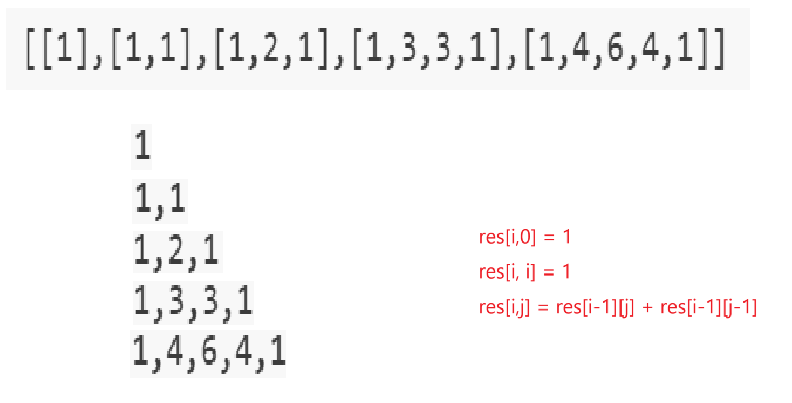

```c++
class Solution
{
public:
    vector<vector<int>> generate(int numRows)
    {
        vector<vector<int>> res(numRows);

        for (int i = 0; i < numRows; i++)
        {
            res[i].resize(i + 1);
            res[i][0] = 1;
            res[i][i] = 1;
            for (int j = 1; j < i; j++)
            {
                res[i][j] = res[i - 1][j] + res[i - 1][j - 1];
            }
        }
        return res;
    }
};
```

## [32. 最长有效括号](https://leetcode.cn/problems/longest-valid-parentheses/)

给你一个只包含 `'('` 和 `')'` 的字符串，找出最长有效（格式正确且连续）括号 子串 的长度。

左右括号匹配，即每个左括号都有对应的右括号将其闭合的字符串是格式正确的，比如 `"(()())"`。

**示例 1：**

```
输入：s = "(()"
输出：2
解释：最长有效括号子串是 "()"
```

**示例 2：**

```
输入：s = ")()())"
输出：4
解释：最长有效括号子串是 "()()"
```

**示例 3：**

```
输入：s = ""
输出：0
```

**提示：**

- `0 <= s.length <= 3 * 104`
- `s[i]` 为 `'('` 或 `')'`

**方法一：暴力**

```c++
class Solution
{
public:
    int longestValidParentheses(string s)
    {
        int maxLen = 0;
        int n = s.size();
        // 枚举所有子串的起始位置i
        for (int i = 0; i < n; ++i)
        {
            // 枚举所有子串的结束位置j，确保子串长度大于等于2
            for (int j = i + 1; j < n; ++j)
            {
                string subStr = s.substr(i, j - i + 1);
                if (isValid(subStr))
                {
                    maxLen = max(maxLen, (int)subStr.size());
                }
            }
        }
        return maxLen;
    }

private:
    bool isValid(string subStr)
    {
        int count = 0;
        for (char c : subStr)
        {
            if (c == '(')
            {
                count++;
            }
            else
            {
                count--;
            }
            if (count < 0)
            {
                return false;
            }
        }
        return count == 0;
    }
};
```

**方法二：避免生成子串**

```c++
class Solution
{
public:
    int longestValidParentheses(string s)
    {
        int maxLen = 0;
        int n = s.size();

        // 枚举所有可能的起始位置
        for (int i = 0; i < n; ++i)
        {
            int balance = 0; // 记录括号平衡度，左括号+1，右括号-1
            // 从i开始向后扩展子串
            for (int j = i; j < n; ++j)
            {
                if (s[j] == '(')
                {
                    balance++;
                }
                else
                {
                    balance--;
                }

                // 平衡度为负，说明右括号过多，后续无需再检查
                if (balance < 0)
                {
                    break;
                }

                // 平衡度为0，说明当前子串有效
                if (balance == 0)
                {
                    int currentLen = j - i + 1;
                    if (currentLen > maxLen)
                    {
                        maxLen = currentLen;
                    }
                }
            }
        }

        return maxLen;
    }
};
```

## 多重背包

```c++
#include<iostream>
#include<vector>
using namespace std;
int main() {
    int bagWeight,n;
    cin >> bagWeight >> n;
    vector<int> weight(n, 0);
    vector<int> value(n, 0);
    vector<int> nums(n, 0);
    for (int i = 0; i < n; i++) cin >> weight[i];
    for (int i = 0; i < n; i++) cin >> value[i];
    for (int i = 0; i < n; i++) cin >> nums[i];

    vector<int> dp(bagWeight + 1, 0);

    for(int i = 0; i < n; i++) { // 遍历物品
        for(int j = bagWeight; j >= weight[i]; j--) { // 遍历背包容量
            // 以上为01背包，然后加一个遍历个数
            for (int k = 1; k <= nums[i] && (j - k * weight[i]) >= 0; k++) { // 遍历个数
                dp[j] = max(dp[j], dp[j - k * weight[i]] + k * value[i]);
            }
        }
    }

    cout << dp[bagWeight] << endl;
}
```


# 单调栈

**通常是一维数组，要寻找任一个元素的右边或者左边第一个比自己大或者小的元素的位置，此时我们就要想到可以用单调栈了**。时间复杂度为O(n)。

1. **单调递增栈**（栈底到栈顶递增）
   - • 用于解决“下一个更小元素”问题。
   - • 入栈时弹出所有比当前元素大的栈顶元素。
2. **单调递减栈**（栈底到栈顶递减）
   - • 用于解决“下一个更大元素”问题。
   - • 入栈时弹出所有比当前元素小的栈顶元素。

## [739. 每日温度](https://leetcode.cn/problems/daily-temperatures/)

给定一个整数数组 `temperatures` ，表示每天的温度，返回一个数组 `answer` ，其中 `answer[i]` 是指对于第 `i` 天，下一个更高温度出现在几天后。如果气温在这之后都不会升高，请在该位置用 `0` 来代替。

**示例 1:**

```
输入: temperatures = [73,74,75,71,69,72,76,73]
输出: [1,1,4,2,1,1,0,0]
```

**示例 2:**

```
输入: temperatures = [30,40,50,60]
输出: [1,1,1,0]
```

**示例 3:**

```
输入: temperatures = [30,60,90]
输出: [1,1,0]
```

**提示：**

- `1 <= temperatures.length <= 105`
- `30 <= temperatures[i] <= 100`

**方法一：暴力**

```c++
class Solution
{
public:
    vector<int> dailyTemperatures(vector<int> &temperatures)
    {
        int n = temperatures.size();
        vector<int> result(n,0);
        
        for(int i = 0;i<n;i++)
        {
            for(int j = i+1;j<n;j++)
            {
                if(temperatures[i]<temperatures[j])
                {
                    result[i] = j-i;
                    break;
                }
            }
        }
        return result;
    }
};
```

**方法二：单调栈**

```c++
class Solution
{
public:
    vector<int> dailyTemperatures单调栈(vector<int> &temperatures)
    {
        int n = temperatures.size();

        stack<int> s;
        vector<int> result(n, 0);
        s.push(0);
        for (int i = 1; i < n; i++)
        {
            if (!s.empty() && temperatures[s.top()] >= temperatures[i])
            {
                s.push(i);
                continue;
            }

            while (!s.empty() && temperatures[s.top()] < temperatures[i])
            {
                int idx = s.top();
                result[idx] = i - idx;
                s.pop();
            }
            s.push(i);
        }
        return result;
    }

    // 单调栈简化代码
    vector<int> dailyTemperatures(vector<int> &temperatures)
    {
        int n = temperatures.size();

        stack<int> s;
        vector<int> result(n, 0);
        s.push(0);
        for (int i = 1; i < n; i++)
        {
            while (!s.empty() && temperatures[s.top()] < temperatures[i])
            {
                int idx = s.top();
                result[idx] = i - idx;
                s.pop();
            }
            s.push(i);
        }
        return result;
    }
};
```

## [496. 下一个更大元素 I](https://leetcode.cn/problems/next-greater-element-i/)

`nums1` 中数字 `x` 的 **下一个更大元素** 是指 `x` 在 `nums2` 中对应位置 **右侧** 的 **第一个** 比 `x` 大的元素。

给你两个 **没有重复元素** 的数组 `nums1` 和 `nums2` ，下标从 **0** 开始计数，其中`nums1` 是 `nums2` 的子集。

对于每个 `0 <= i < nums1.length` ，找出满足 `nums1[i] == nums2[j]` 的下标 `j` ，并且在 `nums2` 确定 `nums2[j]` 的 **下一个更大元素** 。如果不存在下一个更大元素，那么本次查询的答案是 `-1` 。

返回一个长度为 `nums1.length` 的数组 `ans` 作为答案，满足 `ans[i]` 是如上所述的 **下一个更大元素** 。

**示例 1：**

```
输入：nums1 = [4,1,2], nums2 = [1,3,4,2].
输出：[-1,3,-1]
解释：nums1 中每个值的下一个更大元素如下所述：
- 4 ，用加粗斜体标识，nums2 = [1,3,4,2]。不存在下一个更大元素，所以答案是 -1 。
- 1 ，用加粗斜体标识，nums2 = [1,3,4,2]。下一个更大元素是 3 。
- 2 ，用加粗斜体标识，nums2 = [1,3,4,2]。不存在下一个更大元素，所以答案是 -1 。
```

**示例 2：**

```
输入：nums1 = [2,4], nums2 = [1,2,3,4].
输出：[3,-1]
解释：nums1 中每个值的下一个更大元素如下所述：
- 2 ，用加粗斜体标识，nums2 = [1,2,3,4]。下一个更大元素是 3 。
- 4 ，用加粗斜体标识，nums2 = [1,2,3,4]。不存在下一个更大元素，所以答案是 -1 。
```

**提示：**

- `1 <= nums1.length <= nums2.length <= 1000`
- `0 <= nums1[i], nums2[i] <= 104`
- `nums1`和`nums2`中所有整数 **互不相同**
- `nums1` 中的所有整数同样出现在 `nums2` 中

**进阶：**你可以设计一个时间复杂度为 `O(nums1.length + nums2.length)` 的解决方案吗？

1. **预处理 nums2，找到每个元素的下一个更大元素**：
   - 使用栈来高效计算 nums2 中每个元素的下一个更大元素
   - 遍历 nums2，对于每个元素，当栈不为空且当前元素大于栈顶元素时，说明找到了栈顶元素的下一个更大元素，将其记录在 vec 数组中
   - 处理完成后，vec 数组中存储了 nums
   -  每个元素对应的下一个更大元素值（若不存在则为 - 1）
2. **映射到 nums1，获取结果**：
   - 遍历 nums1 中的每个元素，在 nums2 中找到对应的位置
   - 直接从预处理好的 vec 数组中获取该位置的下一个更大元素值
   - 将结果存储在 result 数组中并返回

```c++
class Solution
{
public:
    vector<int> nextGreaterElement(vector<int> &nums1, vector<int> &nums2)
    {
        int n = nums2.size();
        stack<int> s;
        vector<int> vec(n, -1); // 存储nums2中每个元素的下一个更大元素值

        // 处理nums2，找到每个元素的下一个更大元素
        for (int i = 0; i < n; i++)
        {
            // 当栈不为空且当前元素大于栈顶元素时，说明找到了栈顶元素的下一个更大元素
            while (!s.empty() && nums2[s.top()] < nums2[i])
            {
                vec[s.top()] = nums2[i]; 
                s.pop();
            }
            s.push(i);
        }

        // 处理nums1，找到对应nums2中元素的下一个更大元素
        int m = nums1.size();
        vector<int> result(m, -1);
        for (int i = 0; i < m; i++)
        {
            for (int j = 0; j < n; j++)
            {
                if (nums1[i] == nums2[j])
                {
                    result[i] = vec[j];
                    break; // 找到匹配后可以提前退出内层循环
                }
            }
        }

        return result;
    }
};
```

**进阶**

1. 先用单调栈处理 nums2，找到每个元素的下一个更大元素
2. 将 nums2 元素与其下一个更大元素的对应关系存入哈希表
3. 直接通过哈希表查询 nums1 中每个元素的结果

```c++
public:
    vector<int> nextGreaterElement基础(vector<int> &nums1, vector<int> &nums2)
    {
        int n = nums2.size();
        stack<int> s;
        vector<int> vec(n, -1); // 存储nums2中每个元素的下一个更大元素值

        // 处理nums2，找到每个元素的下一个更大元素
        for (int i = 0; i < n; i++)
        {
            // 当栈不为空且当前元素大于栈顶元素时，说明找到了栈顶元素的下一个更大元素
            while (!s.empty() && nums2[s.top()] < nums2[i])
            {
                vec[s.top()] = nums2[i];
                s.pop();
            }
            s.push(i);
        }

        // 处理nums1，找到对应nums2中元素的下一个更大元素
        int m = nums1.size();
        vector<int> result(m, -1);
        for (int i = 0; i < m; i++)
        {
            for (int j = 0; j < n; j++)
            {
                if (nums1[i] == nums2[j])
                {
                    result[i] = vec[j];
                    break; // 找到匹配后可以提前退出内层循环
                }
            }
        }

        return result;
    }

    vector<int> nextGreaterElement(vector<int> &nums1, vector<int> &nums2)
    {
        int n = nums2.size();
        stack<int> s;
        unordered_map<int, int> hash; // 存储元素与其下一个更大元素的映射

        // 处理nums2，找到每个元素的下一个更大元素
        for (int i = 0; i < n; i++)
        {
            // 当栈不为空且当前元素大于栈顶元素时，说明找到了栈顶元素的下一个更大元素
            while (!s.empty() && nums2[s.top()] < nums2[i])
            {
                // 栈顶元素的下一个更大元素是当前元素
                hash[nums2[s.top()]] = nums2[i];
                s.pop();
            }
            s.push(i);
        }

        // 栈中剩余元素没有下一个更大元素，映射值为-1
        while (!s.empty())
        {
            hash[nums2[s.top()]] = -1;
            s.pop();
        }

        // 直接通过哈希表查询nums1中每个元素的结果
        int m = nums1.size();
        vector<int> result(m, -1);
        for (int i = 0; i < m; i++)
        {
            result[i] = hash[nums1[i]];
        }

        return result;
    }
};
```

## [503. 下一个更大元素 II](https://leetcode.cn/problems/next-greater-element-ii/)

给定一个循环数组 `nums` （ `nums[nums.length - 1]` 的下一个元素是 `nums[0]` ），返回 *`nums` 中每个元素的 **下一个更大元素*** 。

数字 `x` 的 **下一个更大的元素** 是按数组遍历顺序，这个数字之后的第一个比它更大的数，这意味着你应该循环地搜索它的下一个更大的数。如果不存在，则输出 `-1` 。

**示例 1:**

```
输入: nums = [1,2,1]
输出: [2,-1,2]
解释: 第一个 1 的下一个更大的数是 2；
数字 2 找不到下一个更大的数； 
第二个 1 的下一个最大的数需要循环搜索，结果也是 2。
```

**示例 2:**

```
输入: nums = [1,2,3,4,3]
输出: [2,3,4,-1,4]
```

**提示:**

- `1 <= nums.length <= 104`
- `-109 <= nums[i] <= 109`

1. 将原数组复制一份拼在后面，模拟循环特性
2. 用单调栈遍历扩展后的数组，记录每个位置的下一个更大元素
3. 截取前半部分结果（原数组长度）作为答案

```c++
class Solution
{
public:
    vector<int> nextGreaterElements(vector<int> &nums)
    {
        int m = nums.size();
        for (int i = 0; i < m; i++)
        {
            nums.push_back(nums[i]);
        }

        int n = nums.size();
        vector<int> result(n, -1);
        stack<int> s;

        for (int i = 0; i < n; i++)
        {
            while (!s.empty() && nums[s.top()] < nums[i])
            {
                result[s.top()] = nums[i];
                s.pop();
            }
            s.push(i);
        }

        result.resize(m);

        return result;
    }
};
```

## [42. 接雨水](https://leetcode.cn/problems/trapping-rain-water/)

给定 `n` 个非负整数表示每个宽度为 `1` 的柱子的高度图，计算按此排列的柱子，下雨之后能接多少雨水。

**示例 1：**


```
输入：height = [0,1,0,2,1,0,1,3,2,1,2,1]
输出：6
解释：上面是由数组 [0,1,0,2,1,0,1,3,2,1,2,1] 表示的高度图，在这种情况下，可以接 6 个单位的雨水（蓝色部分表示雨水）。 
```

**示例 2：**

```
输入：height = [4,2,0,3,2,5]
输出：9
```

**提示：**

- `n == height.length`
- `1 <= n <= 2 * 104`
- `0 <= height[i] <= 105`

**方法一：动态规划（预处理最大值）**

对于数组中的每一个元素（列），计算该列能接多少雨水。具体来说：

1. 对于每个位置`i`，找到它左边最高的柱子`left_max`
2. 找到它右边最高的柱子`right_max`
3. 该位置能接的雨水量为：`min(left_max, right_max) - height[i]`
4. 将所有列的接水量相加就是总接水量

- **视角**：按列计算，关注每一列上方能积多少水
- **核心思想**：对于每个位置i，积水高度 = min(左边最高,右边最高) - 当前高度
- **计算方式**：先预处理每个位置的左右最大值，再统一计算

```c++
class Solution
{
public:
    int trap(vector<int> &height)
    {
        int n = height.size();

        vector<int> leftMax(n, 0);
        vector<int> rightMax(n, 0);

        // 每个柱子左边的最高柱子
        leftMax[0] = height[0];
        for (int i = 1; i < n; i++)
        {
            leftMax[i] = max(leftMax[i - 1], height[i]);
        }

        // 每个柱子右边的最高柱子
        rightMax[n - 1] = height[n - 1];
        for (int i = n - 2; i >= 0; i--)
        {
            rightMax[i] = max(rightMax[i + 1], height[i]);
        }

        // 计算每个位置的积水量
        int result = 0;
        for (int i = 1; i < n - 1; i++)
        {
            result += min(leftMax[i], rightMax[i]) - height[i];
        }

        return result;
    }
};
```

**方法二：单调栈**

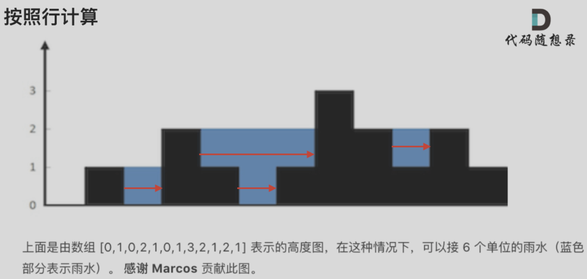

1. **维护一个单调递减的栈**：栈中存储的是柱子的索引，保持栈顶到栈底的柱子高度是递减的
2. **遇到比栈顶高的柱子时计算积水**：这时可以形成一个"凹槽"来接雨水
3. **分层计算积水量**：每次计算当前柱子与栈顶前一个柱子之间形成的凹槽的积水量

- **视角**：按层计算，关注两个柱子之间形成的"水坑"
- **核心思想**：当出现凹形结构时（即当前柱子比前一个高），计算前一个凹槽的积水量
- **计算方式**：边遍历边计算，利用栈保存可能的左边界

```c++
public:
    int trap(vector<int> &height)
    {
        int n = height.size();
        stack<int> st;
        int sum = 0;

        for(int i = 0;i<n;i++)
        {
            while(!st.empty() && height[i] > height[st.top()])
            {
                int botton = st.top();
                st.pop();

                if(st.empty())  // 没有左边界 
                {
                    break;
                }

                    int left = st.top();
                    int width = i - left -1;
                    int h = min(height[left],height[i]) - height[botton];
                    sum += width * h;
            }
            st.push(i);
        }
        return sum;
    }
};
```


## [155. 最小栈](https://leetcode.cn/problems/min-stack/)

设计一个支持 `push` ，`pop` ，`top` 操作，并能在常数时间内检索到最小元素的栈。

实现 `MinStack` 类:

- `MinStack()` 初始化堆栈对象。
- `void push(int val)` 将元素val推入堆栈。
- `void pop()` 删除堆栈顶部的元素。
- `int top()` 获取堆栈顶部的元素。
- `int getMin()` 获取堆栈中的最小元素。

**示例 1:**

```
输入：
["MinStack","push","push","push","getMin","pop","top","getMin"]
[[],[-2],[0],[-3],[],[],[],[]]

输出：
[null,null,null,null,-3,null,0,-2]

解释：
MinStack minStack = new MinStack();
minStack.push(-2);
minStack.push(0);
minStack.push(-3);
minStack.getMin();   --> 返回 -3.
minStack.pop();
minStack.top();      --> 返回 0.
minStack.getMin();   --> 返回 -2.
```

**提示：**

- `-231 <= val <= 231 - 1`
- `pop`、`top` 和 `getMin` 操作总是在 **非空栈** 上调用
- `push`, `pop`, `top`, and `getMin`最多被调用 `3 * 104` 次

1. 使用两个栈实现：一个普通栈（stack）存储所有元素，一个辅助栈（min_stack）专门跟踪最小值
2. 入栈（push）时：
   - 元素同时压入普通栈
   - 辅助栈压入当前元素与辅助栈顶元素的较小值（保证辅助栈顶始终是当前最小值）
3. 出栈（pop）时：两个栈同时弹出栈顶元素，保持状态一致
4. 获取栈顶元素（top）：直接返回普通栈的栈顶
5. 获取最小值（getMin）：直接返回辅助栈的栈顶

- 当调用 `push` 操作时，两个栈会同时增加一个元素（普通栈 push 实际值，辅助栈 push 当前最小值）
- 当执行`pop`操作时，两个栈会同时移除顶部元素
- 始终保持两个栈的长度相同，辅助栈的每个位置都对应着普通栈相同位置及之前所有元素中的最小值

```c++
class MinStack
{
private:
    stack<int> min_stack;
    stack<int> stack;

public:
    MinStack()
    {
    }

    void push(int val)
    {
        stack.push(val);
        if (!min_stack.empty())
        {
            // 压入 min(val, 当前最小值)
            min_stack.push(min(val, min_stack.top()));
        }
        else
        {
            min_stack.push(val);
        }
    }

    void pop()
    {
        stack.pop();
        min_stack.pop();
    }

    int top()
    {
        return stack.top();
    }

    int getMin()
    {
        return min_stack.top();
    }
};
```


## [20. 有效的括号](https://leetcode.cn/problems/valid-parentheses/)

给定一个只包括 `'('`，`')'`，`'{'`，`'}'`，`'['`，`']'` 的字符串 `s` ，判断字符串是否有效。

有效字符串需满足：

1. 左括号必须用相同类型的右括号闭合。
2. 左括号必须以正确的顺序闭合。
3. 每个右括号都有一个对应的相同类型的左括号。

**示例 1：**

**输入：**s = "()"

**输出：**true

**示例 2：**

**输入：**s = "()[]{}"

**输出：**true

**示例 3：**

**输入：**s = "(]"

**输出：**false

**示例 4：**

**输入：**s = "([])"

**输出：**true

**示例 5：**

**输入：**s = "([)]"

**输出：**false

**提示：**

- `1 <= s.length <= 104`
- `s` 仅由括号 `'()[]{}'` 组成

```c++
class Solution
{
public:
    bool isValid(string s)
    {
        stack<char> st;
        int n = s.size();

        for (int i = 0; i < n; i++)
        {
            // 遇到左括号，压入栈中
            if (s[i] == '(' || s[i] == '{' || s[i] == '[')
            {
                st.push(s[i]);
            }
            else
            {
                // 遇到右括号但栈为空，说明没有匹配的左括号
                if (st.empty())
                {
                    return false;
                }

                // 取出栈顶元素
                char left = st.top();
                st.pop();

                // 检查括号是否匹配
                if ((left == '(' && s[i] != ')') ||
                    (left == '{' && s[i] != '}') ||
                    (left == '[' && s[i] != ']'))
                {
                    return false;
                }
            }
        }

        // 最后检查栈是否为空（所有左括号都有匹配的右括号）
        return st.empty();
    }
};
```


## [394. 字符串解码](https://leetcode.cn/problems/decode-string/)

给定一个经过编码的字符串，返回它解码后的字符串。

编码规则为: `k[encoded_string]`，表示其中方括号内部的 `encoded_string` 正好重复 `k` 次。注意 `k` 保证为正整数。

你可以认为输入字符串总是有效的；输入字符串中没有额外的空格，且输入的方括号总是符合格式要求的。

此外，你可以认为原始数据不包含数字，所有的数字只表示重复的次数 `k` ，例如不会出现像 `3a` 或 `2[4]` 的输入。

测试用例保证输出的长度不会超过 `105`。

**示例 1：**

```
输入：s = "3[a]2[bc]"
输出："aaabcbc"
```

**示例 2：**

```
输入：s = "3[a2[c]]"
输出："accaccacc"
```

**示例 3：**

```
输入：s = "2[abc]3[cd]ef"
输出："abcabccdcdcdef"
```

**示例 4：**

```
输入：s = "abc3[cd]xyz"
输出："abccdcdcdxyz"
```

**提示：**

- `1 <= s.length <= 30`
- `s` 由小写英文字母、数字和方括号 `'[]'` 组成
- `s` 保证是一个 **有效** 的输入。
- `s` 中所有整数的取值范围为 `[1, 300]` 

```c++
class Solution
{
public:
    string decodeString(string s)
    {
        stack<int> numStack;    // 存储重复次数的栈
        stack<string> strStack; // 存储字符串的栈
        string str;             // 当前正在构建的字符串
        int num = 0;            // 当前正在解析的数字

        int n = s.size();
        for (int i = 0; i < n; i++)
        {
            if (isdigit(s[i]))
            {
                // 处理多位数字
                num = num * 10 + s[i] - '0';
            }
            else if (s[i] == '[')
            {
                // 将当前字符串和数字压入各自的栈中
                strStack.push(str);
                numStack.push(num);

                // 重置状态，准备处理嵌套的字符串
                num = 0;
                str.clear();
            }
            else if (s[i] == ']')
            {
                // 重复次数k
                int k = numStack.top();
                numStack.pop();
                // 从字符串栈中弹出之前保存的字符串
                string temp = strStack.top();
                strStack.pop();
                // 将当前字符串重复k次并拼接到之前保存的字符串后面
                for (int i = 0; i < k; i++)
                {
                    temp += str;
                }
                // 更新当前字符串为拼接后的结果
                str = temp;
            }
            else
            {
                str += s[i];
            }
        }

        return str;
    }
};

```


# 日期问题

## [1360. 日期之间隔几天](https://leetcode.cn/problems/number-of-days-between-two-dates/)

请你编写一个程序来计算两个日期之间隔了多少天。

日期以字符串形式给出，格式为 `YYYY-MM-DD`，如示例所示。

**示例 1：**

```
输入：date1 = "2019-06-29", date2 = "2019-06-30"
输出：1
```

**示例 2：**

```
输入：date1 = "2020-01-15", date2 = "2019-12-31"
输出：15
```

**提示：**

- 给定的日期是 `1971` 年到 `2100` 年之间的有效日期。

```c++
class Solution
{
private:
    // 判断是否为闰年
    bool isLeap(int year)
    {
        // 闰年规则：
        // 1. 不能被4整除的不是闰年
        if (year % 4 != 0)
        {
            return false;
        }
        // 2. 能被4整除但不能被100整除的是闰年
        else if (year % 100 != 0)
        {
            return true;
        }
        // 3. 能被400整除的是闰年
        else
        {
            return year % 400 == 0;
        }
    }

    // 计算从1971-01-01到给定日期的总天数
    int daysSinceEpoch(string date)
    {
        // 解析日期字符串，提取年、月、日
        int year = stoi(date.substr(0, 4));    // 提取年份
        int month = stoi(date.substr(5, 2));   // 提取月份
        int day = stoi(date.substr(8, 2));     // 提取日期

        int totalDays = 0;
        
        // 计算从1971年到(给定年份-1)的总天数
        for (int y = 1971; y < year; ++y)
        {
            // 闰年加366天，平年加365天
            totalDays += isLeap(y) ? 366 : 365;
        }

        // 各月份的天数表（2月天数会根据闰年调整）
        vector<int> monthDays = {31, 28, 31, 30, 31, 30, 31, 31, 30, 31, 30, 31};
        
        // 如果是闰年，2月改为29天
        if (isLeap(year))
        {
            monthDays[1] = 29;
        }

        // 计算从1月到(给定月份-1)的总天数
        for (int m = 1; m < month; ++m)
        {
            totalDays += monthDays[m - 1];
        }

        // 加上当月的天数
        totalDays += day;

        return totalDays;
    }

public:
    // 计算两个日期之间的天数差
    int daysBetweenDates(string date1, string date2)
    {
        // 计算两个日期各自的总天数，然后取绝对差值
        return abs(daysSinceEpoch(date1) - daysSinceEpoch(date2));
    }
};
```

## [1185. 一周中的第几天](https://leetcode.cn/problems/day-of-the-week/)

给你一个日期，请你设计一个算法来判断它是对应一周中的哪一天。

输入为三个整数：`day`、`month` 和 `year`，分别表示日、月、年。

您返回的结果必须是这几个值中的一个 `{"Sunday", "Monday", "Tuesday", "Wednesday", "Thursday", "Friday", "Saturday"}`。

**示例 1：**

```
输入：day = 31, month = 8, year = 2019
输出："Saturday"
```

**示例 2：**

```
输入：day = 18, month = 7, year = 1999
输出："Sunday"
```

**示例 3：**

```
输入：day = 15, month = 8, year = 1993
输出："Sunday"
```

**提示：**

- 给出的日期一定是在 `1971` 到 `2100` 年之间的有效日期。

**1：基姆拉尔森计算公式**：

- 该公式可以直接根据年、月、日计算出星期几。
- 公式为：`weekday = (day + 2*month + 3*(month+1)/5 + year + year/4 - year/100 + year/400) % 7`
- 注意：1月和2月要当作上一年的13月和14月处理。

```c++
class Solution
{
public:
    string dayOfTheWeek(int day, int month, int year)
    {
        vector<string> weekdays = {"Sunday", "Monday", "Tuesday", "Wednesday", "Thursday", "Friday", "Saturday"};
        if (month < 3)
        {
            month += 12;
            year -= 1;
        }
        int k = year % 100;
        int j = year / 100;
        int h = (day + 13 * (month + 1) / 5 + k + k / 4 + j / 4 + 5 * j) % 7;
        return weekdays[(h + 6) % 7];
    }
};
```

**2：计算总天数法**：

- 计算从基准日期（如1971-01-01，星期五）到给定日期的总天数。
- 对7取模，得到星期几的索引。

```c++
class Solution
{
public:
    string dayOfTheWeek(int day, int month, int year)
    {
        vector<string> weekdays = {"Friday", "Saturday", "Sunday", "Monday", "Tuesday", "Wednesday", "Thursday"};
        int totalDays = 0;

        // 计算从1971年到year-1年的总天数
        for (int y = 1971; y < year; ++y)
        {
            totalDays += isLeap(y) ? 366 : 365;
        }

        // 计算从1月到month-1月的总天数
        for (int m = 1; m < month; ++m)
        {
            totalDays += daysInMonth(m, year);
        }

        // 加上当前月的天数
        totalDays += day - 1;

        // 1971-01-01是星期五，所以总天数对7取模后，0对应星期五，1对应星期六，依此类推
        return weekdays[totalDays % 7];
    }

private:
    bool isLeap(int year)
    {
        if (year % 4 != 0)
        {
            return false;
        }
        else if (year % 100 != 0)
        {
            return true;
        }
        else
        {
            return year % 400 == 0;
        }
    }

    int daysInMonth(int month, int year)
    {
        vector<int> days = {31, 28, 31, 30, 31, 30, 31, 31, 30, 31, 30, 31};
        if (month == 2 && isLeap(year))
        {
            return 29;
        }
        return days[month - 1];
    }
};
```

## **1118. 一个月有多少天**

给定一个年份 `year`和一个月份 `month`，返回该月份的天数。

**注意**：需要考虑闰年对 2 月天数的影响。

**示例**

```
输入：year = 2024, month = 2
输出：29（因为 2024 年是闰年，2 月有 29 天）

输入：year = 2023, month = 4
输出：30（4 月固定 30 天）
```

**代码**

```c++
class Solution
{
public:
    int numberOfDays(int year, int month)
    {
        int days[] = {0, 31, 28, 31, 30, 31, 30, 31, 31, 30, 31, 30, 31};
        if (month == 2)
        {
            return (year % 400 == 0) || (year % 100 != 0 && year % 4 == 0) ? 29 : 28;
        }
        return days[month];
    }
};
```

## 273. 整数转日期（变形）

给定一个起始日期 `startDate`（格式为 `"YYYY-MM-DD"`）和一个整数 `days`，计算从 `startDate`开始，加上 `days`天后的日期，并以 `"YYYY-MM-DD"`格式返回。

**示例：**

```
输入：startDate = "2023-03-15", days = 100
输出："2023-06-23"  # 2023-03-15 + 100天 = 2023-06-23
```

**代码**

```c++
#include <iostream>
#include <string>
using namespace std;

bool leap(int y) {
    return y % 400 == 0 || (y % 100 && y % 4 == 0);
}

int days(int y, int m) {
    if (m == 2) return leap(y) ? 29 : 28;
    if (m == 4 || m == 6 || m == 9 || m == 11) return 30;
    return 31;
}

string addDays(string date, int n) {
    int y, m, d;
    char c;
    istringstream ss(date);
    ss >> y >> c >> m >> c >> d;

    while (n--) {
        if (++d > days(y, m)) {
            d = 1;
            if (++m > 12) {
                m = 1;
                y++;
            }
        }
    }

    char buf[11];
    sprintf(buf, "%04d-%02d-%02d", y, m, d);
    return buf;
}

int main() {
    cout << addDays("2023-03-15", 100) << endl; // 输出：2023-06-23
    return 0;
}
```

## 1229. 安排会议日程

给定两个人的日程表 `slots1`和 `slots2`，以及会议持续时间 `duration`。每个人的日程表是一个时间区间列表，表示他们已有的会议安排（如 `[[10, 12], [14, 15]]`表示 10-12 点和 14-15 点有会议）。要求找到一个时间区间，使得：

1. 两人在该时间段内都没有会议；
2. 时间段长度 ≥ `duration`；
3. 如果有多个可行时间段，返回最早的一个。

**示例：**

```
输入：
slots1 = [[10, 50], [60, 120], [140, 210]]
slots2 = [[0, 15], [60, 70]]
duration = 8
输出：[60, 68]  # 60-68 是两人共同的空闲时间
```

**方法：双指针法**

1. **排序**：将两人的日程表按开始时间排序。
2. **双指针遍历**：
   - 用指针 `i`和 `j`分别遍历 `slots1`和 `slots2`。
   - 对于当前区间 `slots1[i]`和 `slots2[j]`，计算它们的交集：
     - 交集开始时间 `start = max(slots1[i][0], slots2[j][0])`
     - 交集结束时间 `end = min(slots1[i][1], slots2[j][1])`
     - 如果 `end - start >= duration`，则找到解。
   - 移动指针：结束时间较早的指针向后移动（因为它的后续区间可能有更晚的交集）。

```c++
vector<int> minAvailableDuration(vector<vector<int>>& slots1, vector<vector<int>>& slots2, int duration) {
    // 按开始时间排序
    sort(slots1.begin(), slots1.end());
    sort(slots2.begin(), slots2.end());

    int i = 0, j = 0;
    while (i < slots1.size() && j < slots2.size()) {
        // 计算当前区间的交集
        int start = max(slots1[i][0], slots2[j][0]);
        int end = min(slots1[i][1], slots2[j][1]);
        if (end - start >= duration) {
            return {start, start + duration};
        }
        // 移动结束时间较早的指针
        if (slots1[i][1] < slots2[j][1]) {
            i++;
        } else {
            j++;
        }
    }
    return {}; // 无解
}
```

# 矩阵

## [867. 转置矩阵](https://leetcode.cn/problems/transpose-matrix/)

给你一个二维整数数组 `matrix`， 返回 `matrix` 的 **转置矩阵** 。

矩阵的 **转置** 是指将矩阵的主对角线翻转，交换矩阵的行索引与列索引。


**示例 1：**

```
输入：matrix = [[1,2,3],[4,5,6],[7,8,9]]
输出：[[1,4,7],[2,5,8],[3,6,9]]
```

**示例 2：**

```
输入：matrix = [[1,2,3],[4,5,6]]
输出：[[1,4],[2,5],[3,6]]
```

**提示：**

- `m == matrix.length`
- `n == matrix[i].length`
- `1 <= m, n <= 1000`
- `1 <= m * n <= 105`
- `-109 <= matrix[i][j] <= 109`

```c++
class Solution
{
public:
    vector<vector<int>> transpose(vector<vector<int>> &matrix)
    {
        if (matrix.empty())
            return {};

        int rows = matrix.size();
        int cols = matrix[0].size();

        vector<vector<int>> transposed(cols, vector<int>(rows));

        for (int i = 0; i < rows; ++i)
        {
            for (int j = 0; j < cols; ++j)
            {
                transposed[j][i] = matrix[i][j];
            }
        }

        return transposed;
    }
};
```

## [73. 矩阵置零](https://leetcode.cn/problems/set-matrix-zeroes/)

给定一个 `*m* x *n*` 的矩阵，如果一个元素为 **0** ，则将其所在行和列的所有元素都设为 **0** 。请使用 **[原地](http://baike.baidu.com/item/原地算法)** 算法**。**

**示例 1：**


```
输入：matrix = [[1,1,1],[1,0,1],[1,1,1]]
输出：[[1,0,1],[0,0,0],[1,0,1]]
```

**示例 2：**


```
输入：matrix = [[0,1,2,0],[3,4,5,2],[1,3,1,5]]
输出：[[0,0,0,0],[0,4,5,0],[0,3,1,0]]
```

**提示：**

- `m == matrix.length`
- `n == matrix[0].length`
- `1 <= m, n <= 200`
- `-231 <= matrix[i][j] <= 231 - 1`

**进阶：**

- 一个直观的解决方案是使用  `O(*m**n*)` 的额外空间，但这并不是一个好的解决方案。
- 一个简单的改进方案是使用 `O(*m* + *n*)` 的额外空间，但这仍然不是最好的解决方案。
- 你能想出一个仅使用常量空间的解决方案吗？

```c++
class Solution
{
public:
    void setZeroes(vector<vector<int>> &matrix)
    {
        int m = matrix.size();
        if (m == 0)
            return;
        int n = matrix[0].size();

        unordered_set<int> rows, cols;

        // 第一次遍历：记录需要置零的行和列
        for (int i = 0; i < m; ++i)
        {
            for (int j = 0; j < n; ++j)
            {
                if (matrix[i][j] == 0)
                {
                    rows.insert(i);
                    cols.insert(j);
                }
            }
        }

        // 第二次遍历：置零
        for (int i = 0; i < m; ++i)
        {
            for (int j = 0; j < n; ++j)
            {
                if (rows.count(i) || cols.count(j))
                {
                    matrix[i][j] = 0;
                }
            }
        }
    }
};
```

## [59. 螺旋矩阵 II](https://leetcode.cn/problems/spiral-matrix-ii/)

给你一个正整数 `n` ，生成一个包含 `1` 到 `n2` 所有元素，且元素按顺时针顺序螺旋排列的 `n x n` 正方形矩阵 `matrix` 。

**示例 1：**


```
输入：n = 3
输出：[[1,2,3],[8,9,4],[7,6,5]]
```

**示例 2：**

```
输入：n = 1
输出：[[1]]
```

**提示：**

- `1 <= n <= 20`

这道题目可以说在面试中出现频率较高的题目，**本题并不涉及到什么算法，就是模拟过程，但却十分考察对代码的掌控能力。**

模拟顺时针画矩阵的过程:

- 填充上行从左到右
- 填充右列从上到下
- 填充下行从右到左
- 填充左列从下到上

由外向内一圈一圈这么画下去。

```c++
class Solution
{
public:
    vector<vector<int>> generateMatrix(int n)
    {
        vector<vector<int>> matrix(n, vector<int>(n));

        int num = 1;
        int left = 0, right = n - 1;
        int top = 0, button = n - 1;

        while (left <= right && top <= button)
        {
            // 从左到右填充上边
            if (top<=button)
            {
                for (int i = left; i <= right; ++i)
                {
                    matrix[top][i] = num++;
                }
                top++;
            }

            // 从上到下填充右边
            if (left<=right)
            {
                for (int i = top; i <= button; ++i)
                {
                    matrix[i][right] = num++;
                }
                right--;
            }

            // 从右到左填充下边
            if (top<=button)
            {
                for (int i = right; i >= left; --i)
                {
                    matrix[button][i] = num++;
                }
                button--;
            }

            // 从下到上填充左边
            if (left<=right)
            {
                for (int i = button; i >= top; --i)
                {
                    matrix[i][left] = num++;
                }
                left++;
            }
        }
        return matrix;
    }
};
```

- 时间复杂度 $O(n^2)$: 模拟遍历二维矩阵的时间
- 空间复杂度 $O(1)$

## [54. 螺旋矩阵](https://leetcode.cn/problems/spiral-matrix/)

给你一个 `m` 行 `n` 列的矩阵 `matrix` ，请按照 **顺时针螺旋顺序** ，返回矩阵中的所有元素。

**示例 1：**


```
输入：matrix = [[1,2,3],[4,5,6],[7,8,9]]
输出：[1,2,3,6,9,8,7,4,5]
```

**示例 2：**


```
输入：matrix = [[1,2,3,4],[5,6,7,8],[9,10,11,12]]
输出：[1,2,3,4,8,12,11,10,9,5,6,7]
```

**提示：**

- `m == matrix.length`
- `n == matrix[i].length`
- `1 <= m, n <= 10`
- `-100 <= matrix[i][j] <= 100`

和[59. 螺旋矩阵 II](https://leetcode.cn/problems/spiral-matrix-ii/)几乎一样，逆过程。按照上题的过程去读取矩阵里面的数值即可。

```c++
class Solution
{
public:
    vector<int> spiralOrder(vector<vector<int>> &matrix)
    {
        int left = 0, right = matrix[0].size() - 1;
        int top = 0, button = matrix.size() - 1;

        vector<int> result;
        while (left <= right && top <= button)
        {
            if (top <= button)
            {
                for (int i = left; i <= right; ++i)
                {
                    result.emplace_back(matrix[top][i]);
                }
                ++top;
            }

            if (left <= right)
            {
                for (int i = top; i <= button; ++i)
                {
                    result.emplace_back(matrix[i][right]);
                }
                --right;
            }

            if (top <= button)
            {
                for (int i = right; i >= left; --i)
                {
                    result.emplace_back(matrix[button][i]);
                }
                --button;
            }

            if (left <= right)
            {
                for (int i = button; i >= top; --i)
                {
                    result.emplace_back(matrix[i][left]);
                }
                ++left;
            }
        }
        return result;
    }
};
```

## [48. 旋转矩阵](https://leetcode.cn/problems/rotate-image/)

给定一个 *n* × *n* 的二维矩阵 `matrix` 表示一个图像。请你将图像顺时针旋转 90 度。

你必须在**[ 原地](https://baike.baidu.com/item/原地算法)** 旋转图像，这意味着你需要直接修改输入的二维矩阵。**请不要** 使用另一个矩阵来旋转图像。

**示例 1：**


```
输入：matrix = [[1,2,3],[4,5,6],[7,8,9]]
输出：[[7,4,1],[8,5,2],[9,6,3]]
```

**示例 2：**


```
输入：matrix = [[5,1,9,11],[2,4,8,10],[13,3,6,7],[15,14,12,16]]
输出：[[15,13,2,5],[14,3,4,1],[12,6,8,9],[16,7,10,11]]
```

**提示：**

- `n == matrix.length == matrix[i].length`
- `1 <= n <= 20`
- `-1000 <= matrix[i][j] <= 1000`

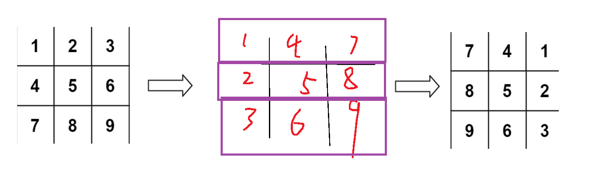

1. **转置矩阵**：通过交换 `matrix[i][j]`和 `matrix[j][i]`来实现矩阵的转置（即沿主对角线翻转）
2. **水平翻转**：将每一行的元素顺序反转

```c++
class Solution
{
public:
    void rotate(vector<vector<int>> &matrix)
    {
        int n = matrix.size();
        for (int i = 0; i < n; i++)
        {
            for (int j = 0; j < i; j++)
            {
                swap(matrix[i][j], matrix[j][i]);
            }
        }

        for (int i = 0; i < n; i++)
        {
            reverse(matrix[i].begin(), matrix[i].end());
        }
    }
};
```

如果是*n* × *m*的矩阵，那么也可以。

```c++
class Solution
{
public:
    vector<vector<int>> rotate(vector<vector<int>> &matrix)
    {
        if (matrix.empty())
            return {};

        int rows = matrix.size();
        int cols = matrix[0].size();

        vector<vector<int>> transposed(cols, vector<int>(rows));

        for (int i = 0; i < rows; ++i)
        {
            for (int j = 0; j < cols; ++j)
            {
                transposed[j][i] = matrix[i][j];
            }
        }

        rows = transposed.size();
        cols = transposed[0].size();
        
        for(int i = 0;i<cols;i++)
        {
            reverse(transposed[i].begin(),transposed[i].end());
        }

        return transposed;
    }
};
```

| 旋转方式       | 实现方法        | 关键步骤                                   |
| :------------- | :-------------- | :----------------------------------------- |
| **顺时针90度** | 转置 + 反转行   | `reverse(transposed[i])`（反转行）         |
| **逆时针90度** | 转置 + 反转列   | `reverse(transposed[j])`（反转列）         |
| **180度**      | 反转行 + 反转列 | `reverse(matrix[i])`+ `reverse(matrix[j])` |

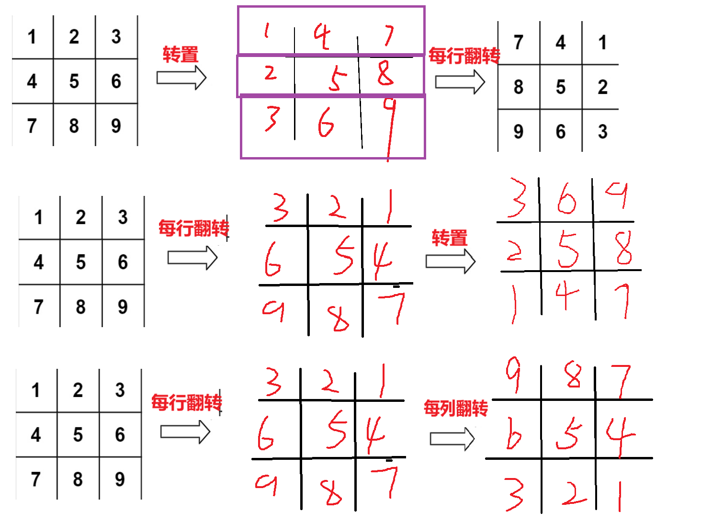

逆时针旋转90度

```c++
class Solution
{
public:
    vector<vector<int>> rotateCounterClockwise(vector<vector<int>> &matrix)
    {
        if (matrix.empty())
            return {};

        int n = matrix.size();
        
        // 第一步：反转每一行
        for (int i = 0; i < n; ++i)
        {
            reverse(matrix[i].begin(), matrix[i].end());
        }
        
        // 第二步：矩阵转置
        for (int i = 0; i < n; ++i)
        {
            for (int j = i + 1; j < n; ++j)
            {
                swap(matrix[i][j], matrix[j][i]);
            }
        }
        
        return matrix;
    }
};
```

顺时针旋转180度

```c++
class Solution
{
public:
    vector<vector<int>> rotate180(vector<vector<int>> &matrix)
    {
        if (matrix.empty())
            return {};

        int rows = matrix.size();    // m行
        int cols = matrix[0].size(); // n列
        
        // 第一步：反转每一行
        for (int i = 0; i < rows; ++i)
        {
            reverse(matrix[i].begin(), matrix[i].end());
        }
        
        // 第二步：反转所有行的顺序
        reverse(matrix.begin(), matrix.end());
        
        return matrix;
    }
};
```


## [74. 搜索二维矩阵](https://leetcode.cn/problems/search-a-2d-matrix/)

给你一个满足下述两条属性的 `m x n` 整数矩阵：

- 每行中的整数从左到右按非严格递增顺序排列。
- 每行的第一个整数大于前一行的最后一个整数。

给你一个整数 `target` ，如果 `target` 在矩阵中，返回 `true` ；否则，返回 `false` 。

**示例 1：**


```
输入：matrix = [[1,3,5,7],[10,11,16,20],[23,30,34,60]], target = 3
输出：true
```

**示例 2：**


```
输入：matrix = [[1,3,5,7],[10,11,16,20],[23,30,34,60]], target = 13
输出：false
```

**提示：**

- `m == matrix.length`
- `n == matrix[i].length`
- `1 <= m, n <= 100`
- `-104 <= matrix[i][j], target <= 104`

1. 如果 `matrix[mid][0] == target`：直接找到目标
2. 如果 `matrix[mid][0] < target`：目标可能在当前行或后面的行
3. 如果 `matrix[mid][0] > target`：目标只可能在前面的行

```c++
class Solution
{
public:
    bool searchMatrix(vector<vector<int>> &matrix, int target)
    {
        int n = matrix.size();
        int m = matrix[0].size();

        // 先确定行(第一列开始找)
        int row = 0;
        int l = 0, r = n - 1;
        while (l <= r)
        {
            int mid = l + r >> 1;

            if (matrix[mid][0] == target)
            {
                return true;
            }
            else if (matrix[mid][0] > target)
            {
                r = mid - 1;
            }
            else if (matrix[mid][0] < target)
            {
                // 记录当前行是可能的候选行
                // 因为 matrix[mid][0] < target，所以目标值可能位于这一行（如果目标大于这行的第一个元素但小于下一行的第一个元素）
                // 或者是后面更大的行
                row = mid;
                // 继续搜索后面的行，看看是否有更合适的行
                // 如果后面没有更合适的行，row会保持为最后一个满足 matrix[row][0] <= target的行
                l = mid + 1;
            }
        }

        // 再确定列(第l行)
        l = 0, r = m - 1;
        while (l <= r)
        {
            int mid = l + r >> 1;
            if (matrix[row][mid] == target)
            {
                return true;
            }
            else if (matrix[row][mid] > target)
            {
                r = mid - 1;
            }
            else if (matrix[row][mid] < target)
            {
                l = mid + 1;
            }
        }
        return false;
    }
};
```

**方法二**

```c++
class Solution
{
public:
    // 从左上角
    bool searchMatrix(vector<vector<int>> &matrix, int target)
    {
        int i = 0, j = matrix[0].size() - 1;
        while (i < matrix.size() && j >= 0)
        {
            if (target > matrix[i][j])
                i++;
            else if (target < matrix[i][j])
                j--;
            else
                return true;
        }
        return false;
    }
};
```

## [240. 搜索二维矩阵 II](https://leetcode.cn/problems/search-a-2d-matrix-ii/)

编写一个高效的算法来搜索 `*m* x *n*` 矩阵 `matrix` 中的一个目标值 `target` 。该矩阵具有以下特性：

- 每行的元素从左到右升序排列。
- 每列的元素从上到下升序排列。

**示例 1：**


```
输入：matrix = [[1,4,7,11,15],[2,5,8,12,19],[3,6,9,16,22],[10,13,14,17,24],[18,21,23,26,30]], target = 5
输出：true
```

**示例 2：**


```
输入：matrix = [[1,4,7,11,15],[2,5,8,12,19],[3,6,9,16,22],[10,13,14,17,24],[18,21,23,26,30]], target = 20
输出：false
```

**提示：**

- `m == matrix.length`
- `n == matrix[i].length`
- `1 <= n, m <= 300`
- `-109 <= matrix[i][j] <= 109`
- 每行的所有元素从左到右升序排列
- 每列的所有元素从上到下升序排列
- `-109 <= target <= 109`

若使用暴力法遍历矩阵 `matrix` ，则时间复杂度为 *O*(*NM*) 。暴力法未利用矩阵 **“从上到下递增、从左到右递增”** 的特点，显然不是最优解法。

如下图所示，我们将矩阵逆时针旋转 45° ，并将其转化为图形式，发现其类似于 二叉搜索树 ，即对于每个元素，其左分支元素更小、右分支元素更大。因此，通过从 “根节点” 开始搜索，遇到比 `target` 大的元素就向左，反之向右，即可找到目标值 `target` 。

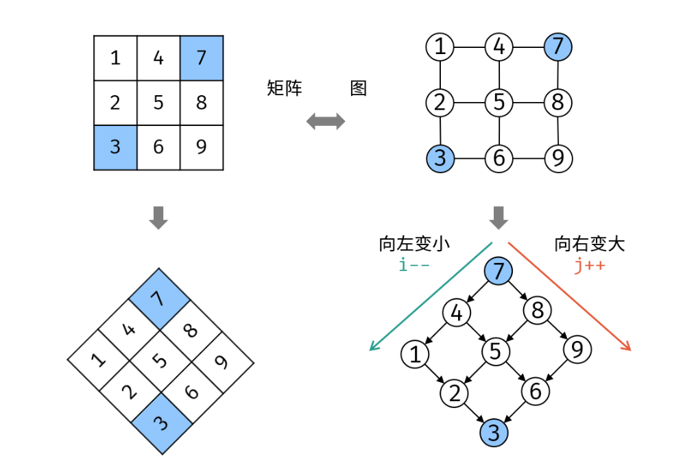

“根节点” 对应的是矩阵的 “左下角” 和 “右上角” 元素，本文称之为 标志数 ，以 matrix 中的 左下角元素 为标志数 flag ，则有:

+ 若 flag > target ，则 target 一定在 flag 所在 行的上方 ，即 flag 所在行可被消去。
+ 若 flag < target ，则 target 一定在 flag 所在 列的右方 ，即 flag 所在列可被消去。

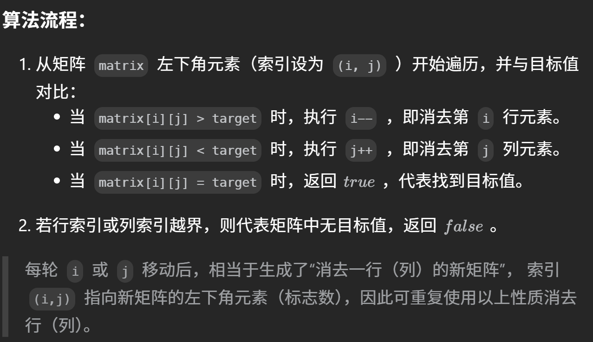

```c++
class Solution
{
public:
    bool searchMatrix(vector<vector<int>> &matrix, int target)
    {
        int i = matrix.size() - 1, j = 0;
        while (i >= 0 && j < matrix[0].size())
        {
            if (matrix[i][j] > target)
                i--;
            else if (matrix[i][j] < target)
                j++;
            else
                return true;
        }
        return false;
    }
};
```

# 排错问题

错排数 *D*(*n*)表示 *n*个元素的排列中，**没有任何一个元素出现在其原始位置**的排列方式的总数。例如：

- *n*=2：`[2, 1]`是唯一的错排，故 *D*(2)=1。
- *n*=3：`[2, 3, 1]`和 `[3, 1, 2]`是错排，故 *D*(3)=2。

**错排数的递推公式**

错排数可以通过以下递推关系计算：

```
D(n)=(n−1)×(D(n−1)+D(n−2))
```

**初始条件**：

```
D(0)=1（空排列算作一种错排）	关键，确保递推正确性
D(1)=0（单个元素无法错排）
```

## 1.将 n封信装入 n个信封，求全部装错的概率

**动态规划实现**

```c++
#include <iostream>
#include <vector>

int derangement(int n) {
    if (n == 0) return 1; // 空排列
    if (n == 1) return 0;
    
    std::vector<int> dp(n + 1);
    dp[0] = 1;
    dp[1] = 0;
    
    for (int i = 2; i <= n; ++i) {
        dp[i] = (i - 1) * (dp[i - 1] + dp[i - 2]);
    }
    
    return dp[n];
}

int main() {
    std::cout << "D(3) = " << derangement(3) << std::endl; // 输出 2
    std::cout << "D(4) = " << derangement(4) << std::endl; // 输出 9
    return 0;
}
```

**数学推导（容斥原理）**

错排数也可以通过容斥原理直接计算：
$$
D(n) = n! \left( 1 - \frac{1}{1!} + \frac{1}{2!} - \cdots + (-1)^n \frac{1}{n!} \right)
$$

```c++
#include <iostream>
#include <cmath>

int factorial(int k) {
    return (k == 0) ? 1 : k * factorial(k - 1);
}

int derangement_math(int n) {
    int sum = 0;
    for (int k = 0; k <= n; ++k) {
        sum += pow(-1, k) / factorial(k);
    }
    return factorial(n) * sum;
}
```

## 2.n个元素的集合，计算恰好有 k个元素不在其原始位置的排列数

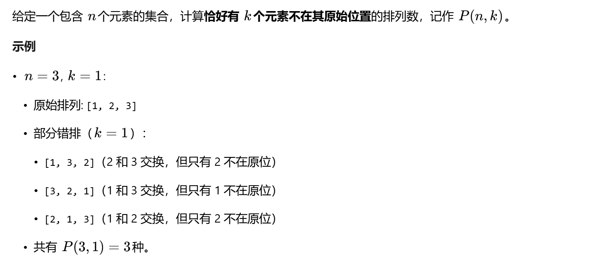

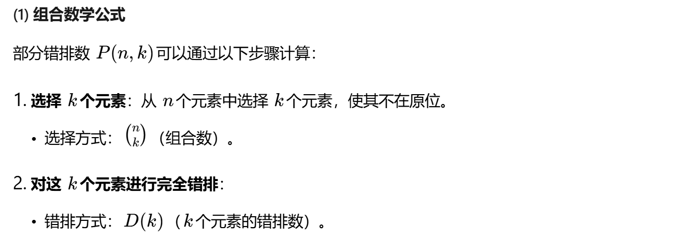

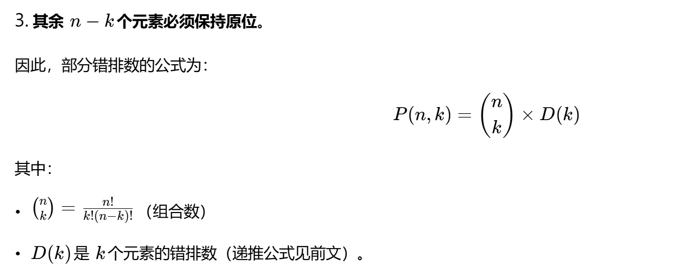


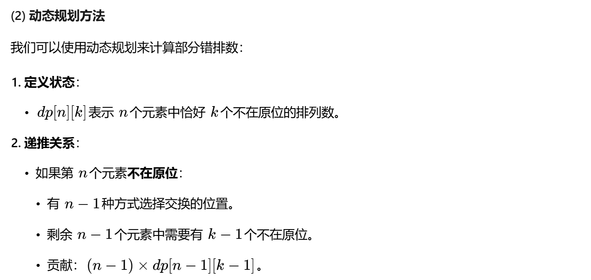

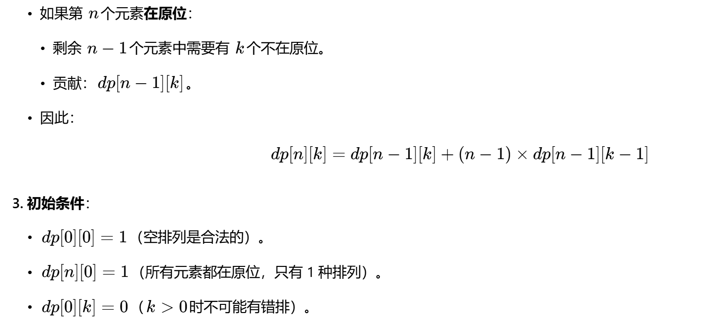

**组合数学方法**

```c++
#include <iostream>
#include <vector>

// 计算组合数
int comb(int n, int k) {
    if (k < 0 || k > n) return 0;
    if (k > n - k) k = n - k; // 利用对称性减少计算量
    
    long long res = 1;
    for (int i = 1; i <= k; ++i) {
        res *= (n - k + i);
        res /= i; // 逐步除以避免中间结果溢出
    }
    return (int)res;
}

// 计算错排数
int derangement(int n) {
    if (n == 0) return 1; // 空排列
    if (n == 1) return 0;
    
    std::vector<int> dp(n + 1);
    dp[0] = 1;
    dp[1] = 0;
    
    for (int i = 2; i <= n; ++i) {
        dp[i] = (i - 1) * (dp[i - 1] + dp[i - 2]);
    }
    
    return dp[n];
}

// 计算部分错排数
int partial_derangement(int n, int k) {
    return comb(n, k) * derangement(k);
}

int main() {
    std::cout << "P(3, 1) = " << partial_derangement(3, 1) << std::endl; // 输出 3
    return 0;
}
```

**动态规划方法**

```c++
#include <iostream>
#include <vector>

int partial_derangement_dp(int n, int k) {
    std::vector<std::vector<int>> dp(n + 1, std::vector<int>(k + 1, 0));
    dp[0][0] = 1;
    for (int i = 1; i <= n; ++i) {
        dp[i][0] = 1; // 所有元素都在原位
        for (int j = 1; j <= k; ++j) {
            dp[i][j] = dp[i-1][j] + (i-1) * dp[i-1][j-1];
        }
    }
    return dp[n][k];
}

int main() {
    std::cout << "P(4, 2) = " << partial_derangement_dp(4, 2) << std::endl; // 输出 6
    return 0;
}
```

# 进制转换

##  1、10 进制转 x 进制代码（x 小于 10 的情况）

```c++
int tenTotwo(int num,int x)
{
	if (num == 0)
	{
		return 0;
	}

	int flag = false;
	if (num < 0)
	{
		flag = true;
		num = -num;
	}

	vector<int> s;
	while (num > 0)
	{
		s.emplace_back(num % x);
		num /= x;
	}

	int res = 0;
	while (!s.empty())
	{
		res *= 10;
		res += s.back();
		s.pop_back();
	}
	
	if (flag)
	{
		res = -res;
	}
	return res;
}
```

## 2、10 进制转 x 进制代码（通用版）

```c++
string tenTox(int num, int x)
{
	if (num == 0)
	{
		return "0";
	}

	bool flag = false;
	if (num < 0)
	{
		flag = true;
		num = -num;
	}

	stack<char> s;
	while (num > 0)
	{
		int w = num % x;
		if (w < 10)
		{
			s.push(w +'0');
		}
		else
		{
			s.push(w - 10 + 'A');
		}
		num /= x;
	}

	string res;
	if (flag)
	{
		res += '-';
	}
	while (!s.empty())
	{
		res += s.top();
		s.pop();
	}
	return res;
}

```

## 3、x 进制转 10 进制（x 为 2 时）

```c++
int twoToTen(string num)
{
	int n = num.size();
	int res = 0;

	for (int i = 0; i < n; i++)
	{
		if (num[i] == '0')
		{
			res = res * 2;
		}
		else
		{
			res = res * 2 + 1;
		}
	}

	return res;
}
```

## 4、x 进制转 10 进制（通用版）

```c++
int xToTen(string num,int x)
{
	int n = num.size();
	int res = 0;

	for (int i = 0; i < n; i++)
	{
		res = res * x;
		if (num[i] >= '0' && num[i] <= '9')
		{
			res += num[i] - '0';
		}
		else
		{
			res += num[i] - 'A' + 10;
		}
	}
	return res;
}
```

## 5、x 进制转 y 进制（通用版）

```c++
string xToy(string num, int x, int y)
{
	if (num == "0")
	{
		return "0";
	}

	bool flag = false;
	if (num[0] == '-')
	{
		flag = true;
		num = num.substr(1);
	}

	//首先将 x 进制数转换为十进制，然后再将十进制数转换为 y 进制
	int n = num.size();
	int res = 0;
	
	// x 进制数转换为十进制
	for (int i = 0; i < n; i++)
	{
		res = res * x;
		if (num[i] >= '0' && num[i] <= '9')
		{
			res += num[i] - '0';
		}
		else
		{
			res += num[i] - 'A' + 10;
		}
	}

	// 十进制数转换为 y 进制
	stack<char> s;
	while (res > 0)
	{
		int w = res % y;
		if (w < 10)
		{
			s.push(w + '0');
		}
		else
		{
			s.push(w - 10 + 'A');
		}
		res /= y;
	}

	string ans;
	if (flag)
	{
		ans += '-';
	}
	while (!s.empty())
	{
		ans += s.top();
		s.pop();
	}

	return ans;
}
```

# 2024真题

## 判断是不是2的幂

```c++
bool isPowerOfTwo(int n) {
    if (n <= 0) return false;
    while (n % 2 == 0) {
        n /= 2;
    }
    return n == 1;
}
```

## 链表，反转区间l到r，l是第m个节点，r是第一个值为val的节点

```c++
class Solution
{
public:
    ListNode *reverse(ListNode *head)
    {
        ListNode *prevNode = nullptr;
        ListNode *curNode = head;
        ListNode *nextTemp = nullptr;
        while (curNode)
        {
            nextTemp = curNode->next; // 保存下一个节点
            curNode->next = prevNode; // 反转指针方向
            prevNode = curNode;
            curNode = nextTemp;
        }
        return prevNode; // 返回新的头节点
    }

    ListNode *reverseBetween(ListNode *head, int m, int val)
    {
        if (!head || !head->next)
            return head;

        // 创建虚拟头节点，简化边界处理
        ListNode *dummy = new ListNode(0);
        dummy->next = head;

        ListNode *curNode = head;
        ListNode *leftpreNode = dummy;
        ListNode *leftNode = head;
        ListNode *rightNode = head;
        ListNode *rightnextNode = head->next;

        // 记录left前面的一个节点
        for (int i = 1; i < m; i++)
        {
            leftpreNode = leftpreNode->next;
        }

        // left节点
        leftNode = leftpreNode->next;

        // right节点
        while(rightNode->val != val)
        {
            rightNode = rightNode->next;
        }

        // 记录right后面的一个节点
        rightnextNode = rightNode->next;

        // 断开链表，准备反转[left, right]区间
        leftpreNode->next = nullptr;
        rightNode->next = nullptr;

        // 反转后，newHead是区间新头，leftNode变成区间尾
        ListNode *newHead = reverse(leftNode);

        // 继续接上头和尾
        leftpreNode->next = newHead;    // 连接反转区间的新头
        leftNode->next = rightnextNode; // 连接反转区间的尾到原right的下一个节点

        ListNode *result = dummy->next;
        delete dummy;
        return result;
    }
};
```

## 二叉树，求比val大的最小数

```c++
class Solution
{
public:
    int findCeiling(TreeNode *root,int val)
    {
        if (!root) return -1;
        int result = INT_MAX; // 初始化为最大值

        queue<TreeNode *> queue;
        queue.push(root);

        while (!queue.empty())
        {
            int size = queue.size();
            for (int i = 0; i < size; ++i)
            {
                auto curNode = queue.front();
                queue.pop();

                if(curNode->val > val)
                {
                    result = min(result,curNode->val);
                }
                
                if(curNode->left) queue.push(curNode->left);
                if(curNode->right) queue.push(curNode->right);
            }
        }
        return result == INT_MAX ? -1 : result; // 无解时返回-1
    }
};
```

# 2022年真题

## 第一题

给定一个整数序列的字符串，求整数的构成数字中含给定数字且重复次数最多的那个整数构成的字符串。

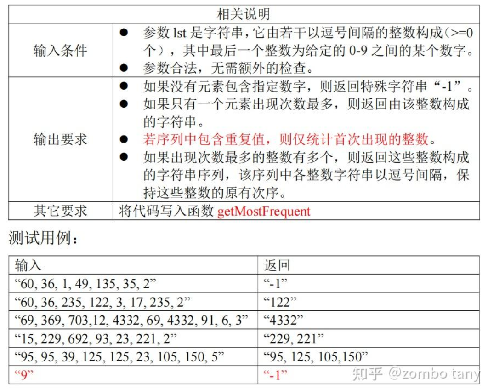

```c++
string getMostFrequent(const string& numStr)
{
	//最终答案
	string resultStr = "";

	//取出最后一个数字
	char n = numStr.back();

	//记录出现的最大次数
	int maxcnt = 0;

	//把每个数取出来，并不重复
	vector<string> str;
	string s;
	for (auto& c : numStr)
	{
		if (c == ',')
		{
			bool flag = false;
			//先判断是否已经存在该数
			for (int i = 0; i < str.size(); i++)
			{
				if (s == str[i]) flag = true;
			}
			if (!flag) str.push_back(s);
			s = "";
			continue;
		}
		if (c != ',' && c != ' ')
		{
			s += c;
		}
	}

	//找最多次数
	for (auto strnum : str)
	{
		int cnt = 0;
		for (auto c : strnum)
		{
			if (c == n) cnt++;
		}
		maxcnt = max(maxcnt, cnt);
	}

	if (maxcnt == 0) return "-1";

	vector<string> res;
	//再去判断
	for (auto strnum : str)
	{
		int cnt = 0;
		for (auto c : strnum)
		{
			if (c == n) cnt++;
		}
		if (cnt == maxcnt)
		{
			res.push_back(strnum);
		}
	}

	for (int i = 0; i < res.size(); i++)
	{
        if(i > 0)
        {
			resultStr += ',';       
		}
        resultStr += res[i];
	}
	resultStr += res[i];

	return resultStr;
}
```

## 第二题

给定一个无序的正整数序列，并且序列中整数个数大于4个。已知该序列如果按照升序排序后是中间缺少一个整数的二阶等差数列，请找出缺少的那个整数。所谓二阶等差数列就是相邻两个整数的差构成的序列为等差数列，例如序列：2，5，10，17，26；其相邻元素的差序列为：3，5，7，9构成等差数列。

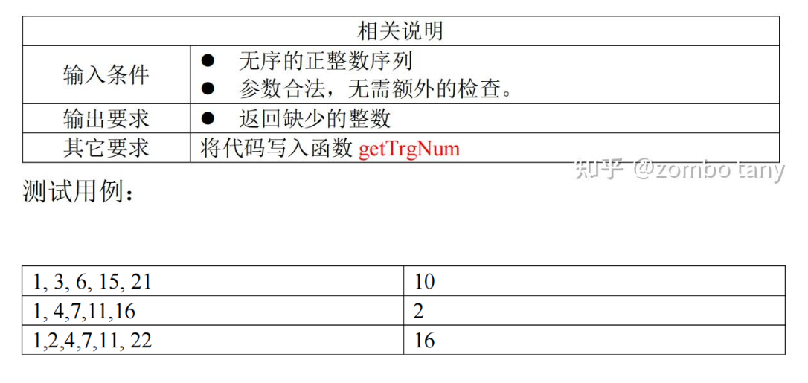

```c++

```

## 第三题

给定一个只包含字母和空格的字符串，字符串是一些由空格分隔的单词，其中单词之间的空格个数大于等于1个，且单词的最大长度不超过12个字母。请返回这些单词中单词权重最大的单词的权重值。其中单词权重定义为单词各字母的ASCII值之和的均值。例如：“am”的ASCII值之和为65+109=174，则“am”的权重为：174/2=87。

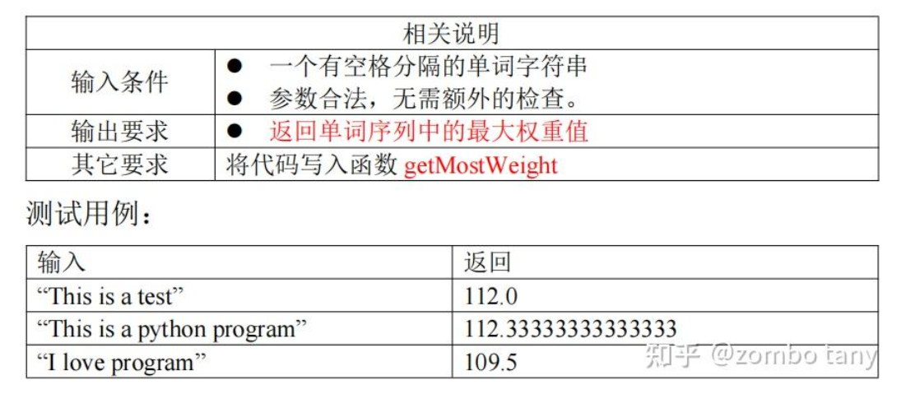

```c++
float getMostWeight(const string& wordStr)
{
	float value = 0;
	vector<string> strlist;
	string str;

	//提取出每个单词
	for (auto c : wordStr)
	{
		if (c == ' ')
		{
			if(!str.empty()) strlist.push_back(str);//防止多个空格
			str = "";
		}
		else
		{
			str += c;
		}
	}

	//最后一个单词
	if (!str.empty())
	{
		strlist.push_back(str);
	}
	
	float maxw = -1;
	for (auto str : strlist)
	{
		float widget = 0;
		int cnt = 0;
		for (auto c : str)
		{
			widget += (int)c;
			cnt++;
		}
		widget /= cnt;
		maxw = max(maxw, widget);
	}

	value = maxw;

	return value;
}
```

## 第四题

鸡兔同笼是否有解？参数heads、feet分别代表鸡兔同笼问题中头和脚的数量，判断是否构成一个有效的鸡兔同笼题目。

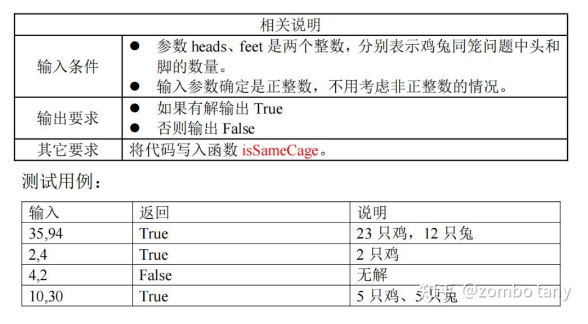

```c++
bool isSameCage(unsigned int heads, unsigned int feet)
{
	bool flag = false;    // 默认无解

	//头比腿多
	if (heads > feet) return false;

	//范围判断
	if (feet < 2 * heads || feet > 4 * heads) return false;

	//假设全是鸡
	int shengyu = feet - heads * 2;
	if (shengyu % 2 == 0) flag = true;

	return  flag;
}
```

## 第五题

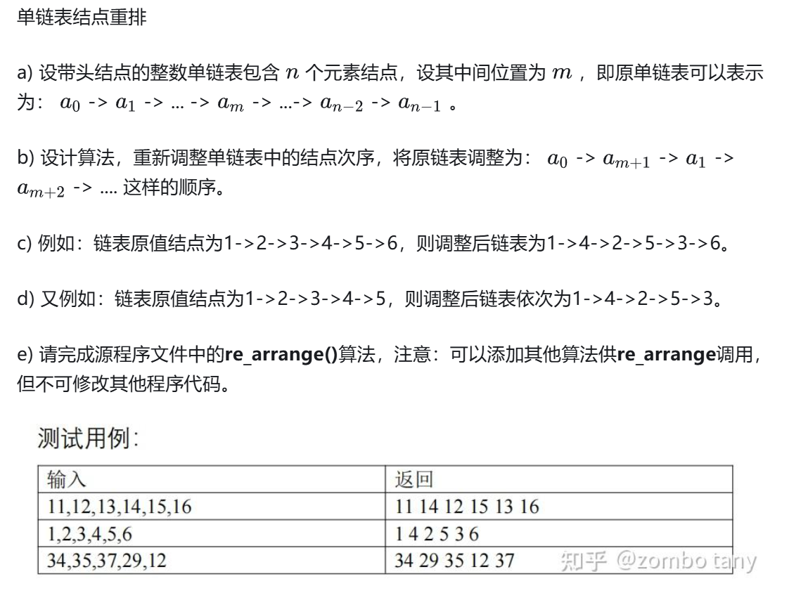

```c++
struct Node
{				// 单链表结点类
	int entry;	// 数据域
	Node *next; // 指针域
	Node(int data)
	{
		entry = data;
		next = NULL;
	}
};
class LinkedList
{ // 单链表类
private:
	Node *head; // 单链表的头指针
public:
	LinkedList(int a[], int n)
	{ // 建立有n个元素的带头结点的单链表
		head = new Node(0);
		Node *r = head, *s = NULL;
		for (int i = 0; i < n; i++)
		{
			s = new Node(0);
			s->entry = a[i];
			r->next = s;
			r = s;
		}
		r->next = NULL;
	}
	~LinkedList()
	{ // 析构函数
		Node *q = NULL, *p = head;
		while (p != NULL)
		{
			q = p;
			p = p->next;
			delete q;
		}
	}
	void traverse()
	{ // 输出带头结点单链表中所有值
		Node *p = head->next;
		while (p != NULL)
		{
			cout << p->entry << " ";
			p = p->next;
		}
		cout << endl;
	}
	//-----------------------------------------------------------
	// 说明：1、编程题5，按要求对链表结点进行重排
	//           2、可以增加成员函数，但不得修改已经存在的成员函数
	// 函数名: re_arrange()
	// 参数：无
	// 返回值：无
	//-----------------------------------------------------------
	void re_arrange() // 按要求对链表结点进行重排
	{
		if (!head->next || !head->next->next)
			return;
		// 找中间节点
		Node *slow = head->next;
		Node *fast = head->next->next;
		while (fast && fast->next)
		{
			slow = slow->next;
			fast = fast->next->next;
		}

		// 分割链表
		Node *l1 = head->next;
		Node *l2 = slow->next;
		slow->next = NULL; // 把链表断开

		// 合并链表
		while (l1 && l2)
		{
			Node *tmp1 = l1->next; // 2
			Node *tmp2 = l2->next; // 5

			l1->next = l2;	 // 1->4
			l2->next = tmp1; // 1->4->2->3
							 // 5->6
			l1 = tmp1; // 2
			l2 = tmp2; // 5
		}
	}
};
```

## 第六题

二叉树给定结点与离它最近的叶子之间的路径长度

a) 设计算法，求二叉树中值为 x 的结点到以它为根的子树上离它最近的叶子之间的路径长度。

b) 二叉树采用二叉链表作为存储结构。测试代码中假设二叉树的结点个数不超过 20，结点值为互不相同的单个字符。源程序文件中已通过带#号的先序序列字符串创建了二叉树的二叉链表，请完成其中的closestleaf()算法。

c) 注意：可以添加其他算法供 closestleaf 调用，但不可修改其他程序代码。

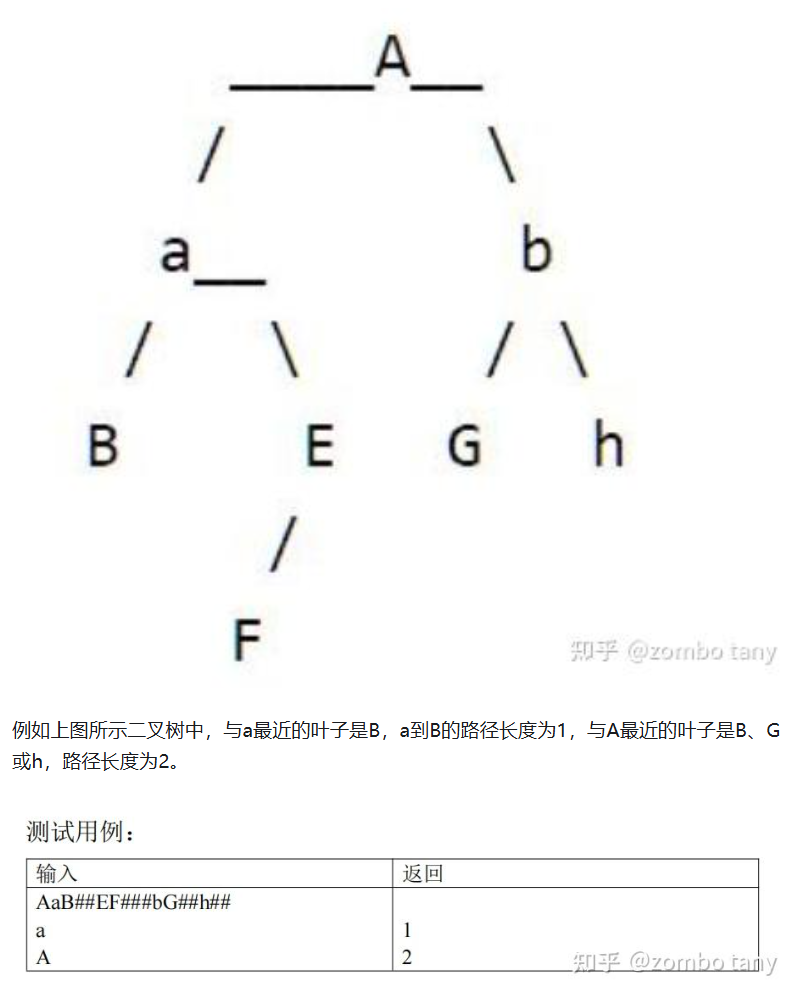

```c++
struct BinaryNode
{
	char data;
	BinaryNode *left, *right;
	BinaryNode(char entry)
	{
		data = entry;
		left = NULL;
		right = NULL;
	}
};
class BinaryTree
{
private:
	BinaryNode *root;

public:
	BinaryTree()
	{ // 构造函数
		root = NULL;
	}

	~BinaryTree()
	{ // 析构函数
		release(root);
	}

	void release(BinaryNode *&bt)
	{ // 是否二叉树的递归成员函数
		if (bt)
		{
			release(bt->left);
			release(bt->right);
			delete bt;
			bt = NULL;
		}
	}

	BinaryNode *recursive_create(string &preorder)
	{ // 根据先序字符串创建二叉树的递归成员函数
		if (preorder.empty())
			return NULL;
		char data = preorder[0];
		preorder.erase(0, 1);
		if (data == '#')
			return NULL;
		else
		{
			BinaryNode *new_root = new BinaryNode(data);
			new_root->left = recursive_create(preorder);
			new_root->right = recursive_create(preorder);
			return new_root;
		}
	}

	void create(string preorder)
	{ // 创建二叉树的成员函数
		root = recursive_create(preorder);
	}

	//-----------------------------------------------------------
	// 说明：编程题6，返回值为x的结点到离它最近的叶子的路径长度
	// 提示：可以增加成员函数，但不得修改已经存在的成员函数
	// 函数名: closestleaf()
	// 参数：char x: 结点的值
	// 返回值：值为x的结点到离它最近的叶子的路径长度
	//-----------------------------------------------------------
	int closestleaf(char x)
	{
		queue<BinaryNode *> q;
		if (root)
			q.push(root);

		BinaryNode *newroot = NULL;
		while (!q.empty())
		{
			int size = q.size();
			for (int i = 0; i < size; i++)
			{
				auto node = q.front();
				q.pop();
				if (node->data == x)
				{
					newroot = node;
					break;
				}
				if (node->left)
					q.push(node->left);
				if (node->right)
					q.push(node->right);
			}
		}
		if (!newroot)
			return 0;
		// cout << newroot->data << endl;
		// 已经找到新根
		queue<BinaryNode *> sq;
		sq.push(newroot);
		int deep = 0;
		while (!sq.empty())
		{
			int size = sq.size();
			for (int i = 0; i < size; i++)
			{
				auto node = sq.front();
				sq.pop();
				if (!node->left && !node->right)
				{
					return deep;
				}
				if (node->left)
					sq.push(node->left);
				if (node->right)
					sq.push(node->right);
			}
			deep++;
		}
		return deep;
	}
};
```

## 第七题

现给一排n栋房子的外墙涂色，共有k种颜色可以使用。为了美观，要求每栋房子和它相邻的房子具有不同的颜色，并且任意连续4栋房子至少包含3种颜色。求一共有多少种涂色方案。 

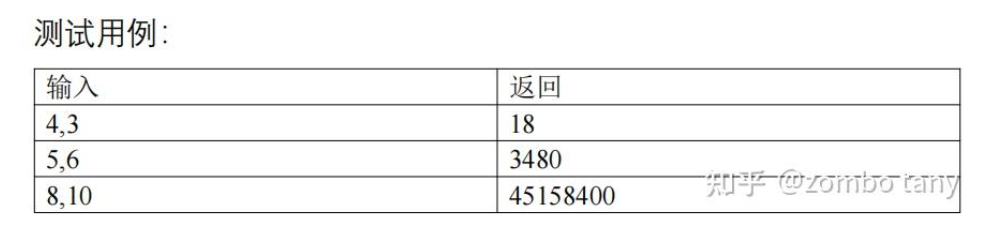

```c++

```

## 第八题

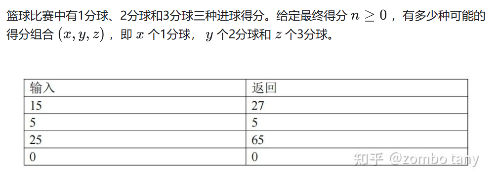

```c++
unsigned long getNumOfBallCombinations(unsigned int scores)
{
	unsigned long count = 0;

	vector<unsigned long> dp(scores + 10, 0);

	vector<int> nums{1, 2, 3};
	dp[0] = 1;
	// 组合数--->先物体，再容量
	for (int i = 0; i < nums.size(); i++)
	{
		for (unsigned int j = nums[i]; j <= scores; j++)
		{
			dp[j] += dp[j - nums[i]];
		}
	}

	count = dp[scores];
	if (scores == 0)
		count = 0;
	return count;
}

```


# 常用函数

## 一、`string` 类的核心成员函数

`string` 类封装了丰富的字符串操作接口，以下是算法题中最常用的函数：

### 1. 基本属性与状态判断

- **`size()` / `length()`**
  功能：返回字符串长度（字符个数）。
  示例：`s.size()` 与 `s.length()` 完全等价，常用于遍历边界或判断长度条件（如 `if (s.size() < 2)`）。
- **`empty()`**
  功能：判断字符串是否为空（长度为 0）。
  示例：`if (s.empty())` 比 `if (s.size() == 0)` 更简洁，常用于处理空字符串边界。

### 2. 元素访问

- **`operator[]`**
  功能：通过索引访问字符（无越界检查）。
  示例：`s[i]` 可直接读写第 `i` 个字符（0-based），适合遍历修改（如 `s[i] = tolower(s[i])`）。
- **`at(i)`**
  功能：通过索引访问字符（有越界检查，越界会抛异常）。
  算法题中较少使用（更关注效率，通常用 `operator[]`）。
- **`front()` / `back()`**
  功能：返回第一个 / 最后一个字符（引用类型，可修改）。
  示例：`s.front() = 'A'` 直接修改首字符；判断首尾字符是否相等（如回文串检查 `s.front() == s.back()`）。

### 3. 拼接与追加

- **`operator+=`**
  功能：拼接字符串或字符。

  ```cpp
  string s = "abc";
  s += "def";   // s 变为 "abcdef"
  s += 'g';     // s 变为 "abcdefg"
  ```

- **`append(...)`**
  功能：追加字符串（支持多种参数，如子串、迭代器范围等）。

  ```cpp
  string s = "abc";
  s.append("def", 2);   // 追加 "def" 的前2个字符，s 变为 "abcde"
  s.append(3, 'x');     // 追加3个 'x'，s 变为 "abcdexxx"
  ```

- **`push_back(c)`**
  功能：在末尾追加单个字符（等价于 `s += c`），效率略高。

### 4. 查找操作（核心高频）

字符串查找是算法题的核心场景（如匹配子串、定位字符），`string` 提供了多个查找函数，返回值均为 `size_t` 类型，未找到时返回 `string::npos`（一个特殊常量，通常定义为 `-1`）。

- **`find(str, pos)`**
  功能：从位置 `pos`（默认 0）开始，查找子串 `str` 第一次出现的位置。如果未找到目标内容，会返回一个特殊的静态常量 `string::npos`。

  ```cpp
  string s = "abcabc";
  size_t pos = s.find("bc");  // pos = 1（首次出现位置）
  if (s.find("xyz") == string::npos) {
      // 未找到 "xyz"
  }
  ```

- **`rfind(str, pos)`**
  功能：从位置 `pos`（默认 `npos`，即末尾）开始，反向查找子串 `str` 最后一次出现的位置。如果未找到目标内容，会返回一个特殊的静态常量 `string::npos`。

  ```cpp
  string s = "abcabc";
  size_t pos = s.rfind("bc");  // pos = 4（最后一次出现位置）
  ```

- **`find_first_of(chars, pos)`**
  功能：从 `pos` 开始，查找 `chars` 中任意字符第一次出现的位置（常用于 “包含任意字符” 场景）。
  示例：判断 `s` 中是否包含数字：

  ```cpp
  if (s.find_first_of("0123456789") != string::npos) {
      // 包含数字
  }
  ```

- **`find_last_of(chars, pos)`**
  功能：从 `pos` 开始反向查找 `chars` 中任意字符最后一次出现的位置。
  示例：找到最后一个元音字母的位置：

  ```cpp
  size_t last_vowel = s.find_last_of("aeiouAEIOU");
  ```

- **`find_first_not_of(chars, pos)`**
  功能：从 `pos` 开始，查找第一个不在 `chars` 中的字符位置（常用于 “过滤特定字符”）。
  示例：找到第一个非字母字符：

  ```cpp
  size_t pos = s.find_first_not_of("abcdefghijklmnopqrstuvwxyzABCDEFGHIJKLMNOPQRSTUVWXYZ");
  ```

### 5. 子串截取

- `substr(pos, len)`

  功能：返回从`pos`开始、长度为`len`的子串（默认到字符串末尾）。

  ```cpp
  string s = "abcdef";
  string sub1 = s.substr(2);    // 从位置2开始到结尾："cdef"
  string sub2 = s.substr(2, 3); // 从位置2开始，长度3："cde"
  ```

  算法题中常用于分割字符串（如按分隔符截取子串）。

### 6. 比较操作

- **`compare(...)`**
  功能：比较当前字符串与目标字符串（支持子串、其他字符串等），返回：

  - 正数：当前字符串更大；
  - 0：相等；
  - 负数：当前字符串更小。

  ```cpp
  "abc".compare("abd") < 0;  // true（'c' < 'd'）
  ```

- **关系运算符**（`==, !=, <, >, <=, >=`）
  功能：直接比较字符串（按字典序），比 `compare` 更简洁。
  示例：判断两个字符串是否相等 `if (s1 == s2)`，排序字符串数组时会自动使用字典序。

### 7. 插入与删除

- **`insert(pos, str)`**
  功能：在 `pos` 位置插入字符串 `str`（支持多种参数：字符、迭代器范围等）。

  ```cpp
  string s = "abc";
  s.insert(1, "xy");  // 在位置1插入 "xy"，s 变为 "axybc"
  ```

- **`erase(pos, len)`**
  功能：从 `pos` 开始删除 `len` 个字符（`len` 默认到结尾）；或删除迭代器范围 `[first, last)` 的字符。

  ```cpp
  string s = "abcdef";
  s.erase(2, 2);      // 从位置2删除2个字符，s 变为 "abef"
  s.erase(s.begin()+1, s.end()-1);  // 删除 [1, end-1)，s 变为 "af"
  ```

### 8. 清空与重置

- **`clear()`**
  功能：清空字符串（长度变为 0，不释放容量）。
  示例：处理临时字符串后重置 `s.clear()`。
- **`resize(n, c)`**
  功能：调整字符串长度为 `n`（短则截断，长则用字符 `c` 填充，默认 `\0`）。
  示例：`s.resize(5, 'x')` 确保字符串长度为 5，不足则补 'x'。

## 二、`<algorithm>`常用算法

### 排序相关算法

#### 1. `sort()`

- 对容器进行排序（默认升序）

```C++
vector<int> v = {4, 2, 5, 3, 1};
sort(v.begin(), v.end()); // 1, 2, 3, 4, 5
```

#### 2. `stable_sort()`

- 稳定排序，保持相等元素的相对顺序

```C++
vector<pair<int, int>> v = {{1, 2}, {2, 3}, {1, 1}};
stable_sort(v.begin(), v.end()); // {{1, 2}, {1, 1}, {2, 3}}
```

#### 3. `nth_element()`

- 将第n小的元素放在第n位置，左边都小于等于它，右边都大于等于它

```C++
vector<int> v = {5, 3, 1, 4, 2};
nth_element(v.begin(), v.begin()+2, v.end()); // 第三个元素是3
```

### 查找算法

#### 5. `binary_search()`

- 二分查找（容器必须已排序）

```C++
vector<int> v = {1, 2, 3, 4, 5};
bool found = binary_search(v.begin(), v.end(), 3); // true
```

#### 6. `lower_bound()`

- 返回第一个不小于给定值的迭代器

```C++
vector<int> v = {1, 2, 4, 4, 5};
auto it = lower_bound(v.begin(), v.end(), 3); // 指向第一个4
```

+ 查找元素是否存在

```C++
vector<int> v = {1, 2, 4, 4, 5};
auto it = lower_bound(v.begin(), v.end(), 3);
if (it != v.end() && *it == 3) {
    // 找到3
} else {
    // 未找到
}
```

+  查找插入位置

在需要维护有序数组并插入新元素时：

```C++
vector<int> v = {1, 3, 5, 7};
int new_val = 4;
auto pos = lower_bound(v.begin(), v.end(), new_val);
v.insert(pos, new_val); // v变为{1,3,4,5,7}
```

+ 统计元素出现次数

结合 `upper_bound()`统计元素出现次数：

```C++
vector<int> v = {1, 2, 2, 2, 3};
auto left = lower_bound(v.begin(), v.end(), 2);
auto right = upper_bound(v.begin(), v.end(), 2);
int count = right - left; // 3
```

#### 7. `upper_bound()`

- 返回第一个大于给定值的迭代器

```C++
vector<int> v = {1, 2, 4, 4, 5};
auto it = upper_bound(v.begin(), v.end(), 4); // 指向5
```

#### 8. `equal_range()`

- 返回等于给定值的范围（返回一对迭代器）

```C++
vector<int> v = {1, 2, 4, 4, 5};
auto p = equal_range(v.begin(), v.end(), 4); // [第一个4, 5)
```

### 修改序列的操作

#### 9. `reverse()`

- 反转序列

```C++
vector<int> v = {1, 2, 3, 4, 5};
reverse(v.begin(), v.end()); // 5,4,3,2,1
```

#### 10. `rotate()`

- 旋转序列

```C++
vector<int> v = {1, 2, 3, 4, 5};
rotate(v.begin(), v.begin()+2, v.end()); // 3,4,5,1,2
```

#### 11. `unique()`

- 去除相邻重复元素（通常先排序）

```C++
vector<int> v = {1, 1, 2, 2, 3, 3};
auto it = unique(v.begin(), v.end()); // 1,2,3,?,?,?
v.erase(it, v.end()); // 通常配合erase使用
```

### 数值操作

### 14. `min_element()`, `max_element()`

- 查找最小/最大元素

```C++
vector<int> v = {3, 1, 4, 1, 5};
auto min_it = min_element(v.begin(), v.end()); // 指向第一个1
auto max_it = max_element(v.begin(), v.end()); // 指向5
```

### 15. `accumulate()`

- •累加（在`<numeric>`中）

```C++
vector<int> v = {1, 2, 3, 4, 5};
int sum = accumulate(v.begin(), v.end(), 0); // 15
```

### 16. `count()`, `count_if()`

- 计数

```C++
vector<int> v = {1, 2, 3, 4, 5};
int cnt = count(v.begin(), v.end(), 3); // 1
cnt = count_if(v.begin(), v.end(), [](int x){return x%2==0;}); // 2
```

### 其他实用算法

#### 17. `fill()`

- 填充值

```C++
vector<int> v(5);
fill(v.begin(), v.end(), 7); // 7,7,7,7,7
```

#### 18. `copy()`

- 复制

```C++
vector<int> v1 = {1, 2, 3, 4, 5};
vector<int> v2(5);
copy(v1.begin(), v1.end(), v2.begin());
```

#### 19. `find()`, `find_if()`

- 查找元素

```C++
vector<int> v = {1, 2, 3, 4, 5};
auto it = find(v.begin(), v.end(), 3); // 指向3
it = find_if(v.begin(), v.end(), [](int x){return x>3;}); // 指向4
```

## 三、`<algorithm>` 头文件中适用于 `string` 的算法

`string` 本质是字符容器，支持迭代器（`begin()`, `end()`, `rbegin()`, `rend()` 等），因此 `<algorithm>` 中的通用算法可直接作用于 `string`，以下是高频函数：

### 1. `sort(begin, end, comp)`

功能：对 `[begin, end)` 范围内的字符排序（默认升序，可自定义比较函数）。
算法题场景：判断两个字符串是否为异位词（Anagram）、字符频率排序等。

```cpp
#include <algorithm>
string s = "cab";
sort(s.begin(), s.end());  // s 变为 "abc"（升序）
// 自定义降序
sort(s.begin(), s.end(), greater<char>());  // s 变为 "cba"
```

### 2. `reverse(begin, end)`

功能：反转 `[begin, end)` 范围内的字符。
算法题场景：判断回文串（反转后与原串比较）、反转字符串等。

```cpp
string s = "abc";
reverse(s.begin(), s.end());  // s 变为 "cba"
```

### 3. `find(begin, end, val)`

功能：在 `[begin, end)` 范围内查找字符 `val`，返回迭代器（未找到返回 `end`）。
与 `string::find` 区别：`algorithm::find` 查找单个字符，`string::find` 可查找子串。
示例：查找第一个 'b'：

```cpp
auto it = find(s.begin(), s.end(), 'b');
if (it != s.end()) {
    size_t pos = it - s.begin();  // 转换为索引
}
```

### 4. `count(begin, end, val)`

功能：统计 `[begin, end)` 范围内字符 `val` 出现的次数。
算法题场景：统计特定字符出现次数（如统计元音字母数量）。

```cpp
int cnt = count(s.begin(), s.end(), 'a');  // 统计 'a' 出现次数
```

### 5. `replace(begin, end, old_val, new_val)`

功能：将 `[begin, end)` 范围内所有 `old_val` 替换为 `new_val`（注意：替换单个字符，与 `string::replace` 不同）。
示例：将所有 'a' 替换为 'x'：

```cpp
replace(s.begin(), s.end(), 'a', 'x');
```

### 6. `min_element(begin, end)` / `max_element(begin, end)`

功能：返回 `[begin, end)` 范围内最小 / 最大字符的迭代器。
示例：找到字符串中最大的字符：

```cpp
char max_c = *max_element(s.begin(), s.end());
```

### 7. `for_each(begin, end, func)`

功能：对 `[begin, end)` 范围内每个字符执行 `func` 操作（如转换大小写）。
示例：将所有字符转为大写：

```cpp
for_each(s.begin(), s.end(), [](char &c) { c = toupper(c); });
```


**字符串排序**

https://ac.nowcoder.com/acm/contest/5657/I

```c++
#include <iostream>
#include <string>
#include <vector>
#include <algorithm>
#include <sstream>
using namespace std;

int main()
{
    string line;
    
    while(getline(cin, line))
    {
        vector<string> str;
        stringstream sstream(line);
        string s;
        while(sstream >> s)
        {
            str.push_back(s);
        }
        sort(str.begin(),str.end());
        for(auto& ob:str) cout << ob << " ";
        cout<<endl;
    }
    
    return 0;
}
```


```c++
#include <iostream>
#include <string>
#include <vector>
#include <algorithm>
#include <sstream>
using namespace std;

int main()
{
    string line;

    while (getline(cin, line))// 逐行读取输入
    {
        vector<string> str;
        stringstream sstream(line);// 将字符串转换为 stringstream
        string s;
        while (getline(sstream, s, ','))// 使用 ',' 作为分隔符
        {
            str.push_back(s);
        }
        sort(str.begin(), str.end());
        for (int i = 0; i < str.size() - 1; ++i)
            cout << str[i] << ",";
        cout << str.back() << endl;
    }

    return 0;
}

```


